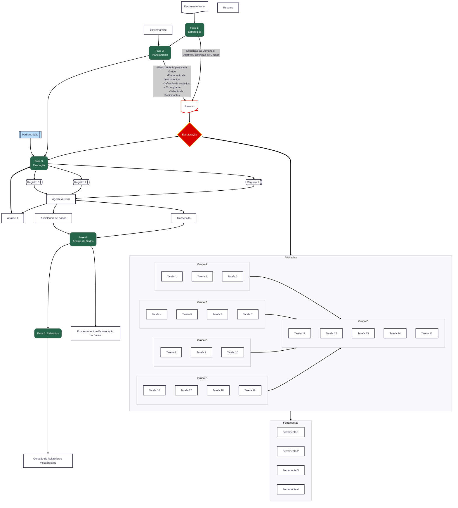

# al-folio

```mermaid
---
config:
      theme: redux
      layout: dagre
---
flowchart TD
 subgraph s1["Grupo A"]
                        s11["Tarefa 1"]
                        s12["Tarefa 2"]
                        s13["Tarefa 3"]
      end
 subgraph s2["Grupo B"]
                        s21["Tarefa 4"]
                        s22["Tarefa 5"]
                        s23["Tarefa 6"]
                        s24["Tarefa 7"]
      end
 subgraph s3["Grupo C"]
                        s31["Tarefa 8"]
                        s32["Tarefa 9"]
                        s33["Tarefa 10"]
      end
 subgraph s4["Grupo D"]
                        s41["Tarefa 11"] & s42["Tarefa 12"] & s43["Tarefa 13"]
                        s44["Tarefa 14"]
                        s45["Tarefa 15"]
      end
 subgraph s5["Grupo E"]
                        s51["Tarefa 16"]
                        s52["Tarefa 17"]
                        s53["Tarefa 18"]
                        s54["Tarefa 19"]
      end
      s1 --> s4
      s2 --> s4
      s3 --> s4
      s5 --> s4
 subgraph sa["Atividades"]
                        s1
                        s2
                        s3
                        s4
                        s5
      end
 subgraph st["Ferramentas"]
                        st1["Ferramenta 1"]
                        st2["Ferramenta 2"]
                        st3["Ferramenta 3"]
                        st4["Ferramenta 4"]
      end
            sa --> st
            A["Documento Inicial"] --> B["Fase 1:
            Estratégica"]
            B --> C["Fase 2:
            Planejamento"]
            B -- "Descrição da Demanda; Objetivos; Definição de Grupos" --> B1["Resumo"]
            B1 --> B2["Estruturação"]
            B2 =======> sa
            B2 <--> D["Fase 3:
            Execução"]
            C --> D
            C -- "-Plano de Ação para cada Grupo
            -Elaboração de Instrumentos
            -Definição de Logística e Cronograma
            -Seleção de Participantes" --> B1
            CA["Benchmarking"] ==> C
            D --> D_Rec["Registro 1"] & D_Form["Registro 2"] & D_Quali_Ind_Rec["Registro 3"]
            D_Rec --> AIA["Agente Auxiliar"]
            AIA --> D_Quali_Monitor["Análise 1"] & D_Transc["Transcrição"] & D_Quant_Form["Assistência de Dados"]
            D_Form --> AIA
            D_Transc --> G_IA["Fase 4:
            Análise de Dados"]
            D_Quant_Form --> G_IA
            D_Quali_Ind_Rec --> AIA
            G_IA --> G1_IA["Processamento e Estruturação de Dados"] & H_IA["Fase 5: Relatórios"]
            H_IA --> H1_IA["Geração de Relatórios e Visualizações"]
            D_Quali_Monitor ==> D
            DA["Padronização"] --> D
            n1["Resumo"]
            A@{ shape: doc}
            B@{ shape: event}
            C@{ shape: event}
            B1@{ shape: tag-doc}
            B2@{ shape: decision}
            D@{ shape: event}
            D_Rec@{ shape: h-cyl}
            D_Form@{ shape: h-cyl}
            D_Quali_Ind_Rec@{ shape: das}
            G_IA@{ shape: event}
            H_IA@{ shape: event}
            DA@{ shape: subproc}
             B:::Pine
             C:::Pine
             D:::Pine
             G_IA:::Pine
             H_IA:::Pine
            classDef Pine stroke-width:1px, stroke-dasharray:none, stroke:#254336, fill:#27654A, color:#FFFFFF
            style B1 stroke:#D50000
            style B2 stroke:#FFD600,fill:#D50000,color:#FFFFFF
            style DA fill:#BBDEFB
```

<!-- ALL-CONTRIBUTORS-LIST:END -->

### All Contributors

