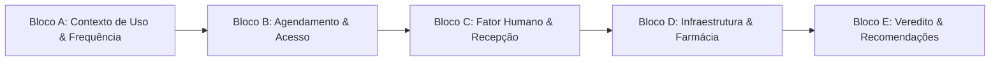
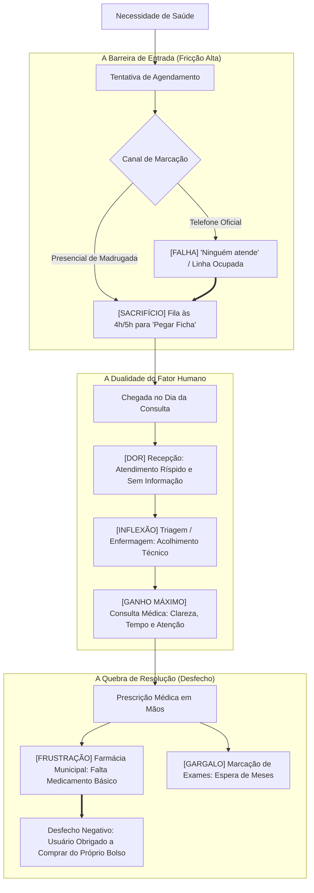

> [!NOTE]
> **Estudo Sanitizado (`proprietary_sanitized`)**: Pesquisa qualitativa de opinião e auditoria de percepção de serviços de saúde pública desenvolvida para a gestão municipal de saúde. Em conformidade com as diretrizes de governança e proteção sob NDA, todas as menções toponímicas e nominais foram descaracterizadas para o arquétipo **"Rede Municipal de Saúde da Região dos Lagos Fluminense"**, preservando a integralidade das evidências empíricas, roteiros semiestruturados e citações dos usuários.

---

## 1. A Dialética do "Hardware" vs. "Software" na Saúde Municipal

Avaliar a eficiência da saúde pública requer distinguir dois planos de entrega: o **ambiente físico tangível** (*hardware*) e os **processos operacionais e logísticos de atendimento** (*software*).

Esta pesquisa qualitativa em profundidade, realizada junto a usuários frequentes da rede municipal de atenção básica e especializada em um polo litorâneo da Região dos Lagos Fluminense, revelou uma contradição administrativa flagrante:

- De um lado, o **triunfo do investimento físico**: unidades básicas reformadas, climatizadas, limpas e visualmente organizadas, o que gerou aprovação imediata e crédito político à gestão;
- De outro, o **colapso da jornada funcional**: a inoperância do canal telefônico de marcação, que reintroduz filas de madrugada na porta dos postos, somada ao desabastecimento crônico de medicamentos básicos na farmácia municipal.

O contraste produz um veredito popular unânime: *"a casca melhorou 100%, mas o recheio ainda falha"*.

---

## 2. Desenho Metodológico e Roteiro de Investigação

A abordagem combinou grupos focais presenciais e entrevistas semiestruturadas em profundidade com usuários representativos de diferentes faixas etárias, bairros periféricos e perfis de morbidade (doentes crônicos, mães com crianças e idosos).

A investigação estruturou-se em cinco blocos de escuta ativa:

### 2.1. O Mapa da Jornada do Paciente

O fluxograma analítico abaixo sintetiza os momentos de dor (*friction points*) e resgate vivenciados pelo usuário ao longo do ciclo de cuidado:

---

## 3. Decomposição Analítica por Dimensões Críticas

### 3.1. Agendamento e Acesso: A Porta de Entrada Quebrada
A primeira etapa da jornada é marcada pela exaustão. O canal telefônico institucional foi rotulado pelos participantes como "uma piada", pois chamadas sucessivas não encontram atendimento.

Sem alternativa remota ou digital funcional, a população é empurrada para a fila física na madrugada:

> *"O agendamento é o nosso calcanhar de Aquiles. A gente simplesmente não consegue pelo telefone. Só presencial, e é uma luta de chegar cinco da manhã no sereno pra rezar e conseguir uma ficha."*
> — *Participante, Grupo Focal de Atenção Básica*

Tal barreira atua como um desincentivo severo ao cuidado preventivo: usuários relatam adiar consultas até que quadros clínicos leves evoluam para urgências hospitalares.

### 3.2. O "Duplo Tempo de Espera"
A percepção temporal do munícipe é punida duplamente:
1. **Espera 1 (Para Agendar):** Semanas ou meses até conseguir a data com um clínico ou especialista;
2. **Espera 2 (No Dia do Atendimento):** Desrespeito ao horário agendado, com atrasos frequentes de duas a três horas na sala de espera sem qualquer aviso prévio.

O efeito cumulativo dessa espera gera um estado de ansiedade e revolta, desgastando o paciente antes mesmo do primeiro contato com a equipe de saúde.

### 3.3. O Fator Humano: A Recepção como Barreira vs. O Consultório como Oásis
Identificou-se uma ruptura de padrão nítida entre o atendimento administrativo e o atendimento clínico:

- **A Recepção (Ponto Crítico de Fricção):** A equipe de guichê é descrita com traços de impaciência, desinteresse ("nem olha na cara") e incapacidade de comunicar atrasos de médicos aos pacientes;
- **A Enfermagem (Ponto de Inflexão):** Ao adentrar a triagem, o usuário encontra escuta ativa, cordialidade e acolhimento técnico que restabelecem a tranquilidade;
- **A Consulta Médica (Ponto de Resgate):** Contrariando estigmas comuns do SUS, os médicos da rede foram fortemente elogiados pelo tempo dedicado ao exame clínico, clareza nas orientações e empatia diagnóstica:

> *"A gente sofre pra conseguir a vaga e a moça da recepção trata a gente com má vontade. Mas lá dentro a doutora foi excelente. Olhou nos olhos, conversou, passou o remédio com calma. O médico salvou o dia."*
> — *Participante, Entrevista em Profundidade*

### 3.4. Infraestrutura vs. Abastecimento: O "Balde de Água Fria"
A melhoria das instalações físicas é a dimensão mais visível e elogiada da rede municipal:
- Prédios pintados e reformados;
- Cadeiras novas e salas climatizadas com ar-condicionado;
- Alto padrão de limpeza e organização predial.

Todavia, esse ganho tangível é neutralizado no momento em que o paciente sai do consultório e dirige-se à farmácia da unidade:

> *"O posto tá um brinco, tudo reformadinho. Mas adianta o quê se a gente chega na farmácia e nunca tem o remédio de pressão que o médico passou? Aí eu tenho que tirar do meu benefício pra comprar. A consulta foi boa, mas não resolveu."*
> — *Participante, Usuário Crônico Hipertenso*

A falha na logística de suprimentos essenciais gera sensação de impotência e alimenta o estigma de "maquiagem institucional", reduzindo a eficácia de tratamentos contínuos.

---

## 4. Matriz de Síntese Qualitativa

A Tabela 1 esquematiza os principais contrastes diagnosticados na percepção dos munícipes:

| Dimensão da Rede | Percepção Dominante | Impacto na Experiência do Paciente | Direcionamento Prioritário |
| :--- | :---: | :--- | :--- |
| **Canais de Marcação** | 🔴 Caótico / Falho | Gera filas na madrugada e desgaste físico | Central telefônica ativa e app com filas virtuais |
| **Recepção e Triagem Inicial** | 🔴 Despreparada / Ríspida | Amplifica a ansiedade e gera sensação de desrespeito | Capacitação em acolhimento e comunicação proativa |
| **Corpo Clínico (Médicos/Enfermeiros)** | 🟢 Altamente Positivo | Fideliza a confiança e resgata o valor do serviço | Valorização profissional e manutenção da equipe |
| **Instalações Prediais** | 🟢 Reformadas / Limpas | Reconhecimento imediato de cuidado da gestão | Manutenção preventiva e zeladoria contínua |
| **Farmácia Básica** | 🔴 Desabastecida | Invalida a consulta e onera o orçamento familiar | Gestão de estoque com previsão de demanda e compras regulares |
| **Exames Especializados** | 🔴 Lento / Fila Oculta | Interrompe diagnósticos e prolonga a morbidade | Credenciamento de rede complementar e laudos digitais |

*Tabela 1: Matriz diagnóstica de fricções e fortalezas da rede de saúde.*

---

## 5. Recomendações Estratégicas e Plano de Ação

Para converter o investimento físico em percepção consolidada de excelência assistencial, a gestão de saúde municipal deve priorizar três intervenções imediatas:

1. **Reestruturação Tecnológica da Porta de Entrada:**
   - Implementar uma central de marcação telefônica profissionalizada com discador inteligente e confirmação via WhatsApp;
   - Acabar com a distribuição física de fichas na madrugada, descentralizando cotas por agentes comunitários de saúde.

2. **Protocolo Humanizado na Recepção:**
   - Instituir treinamento compulsório de atendimento empático e gestão de conflitos para as equipes de balcão;
   - Adotar painéis visuais com previsão estimada de espera e avisos de eventuais atrasos médicos.

3. **Garantia de Estoque Pleno para Medicamentos de Uso Contínuo:**
   - Estabelecer níveis mínimos de segurança (*buffer stock*) para anti-hipertensivos e antidiabéticos;
   - Disponibilizar consulta pública em tempo real do estoque farmacêutico por unidade de saúde.
