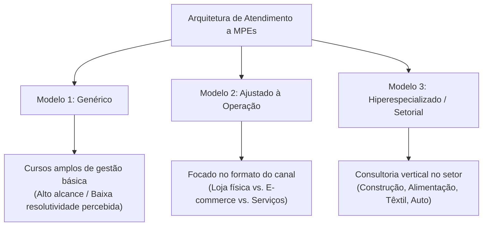
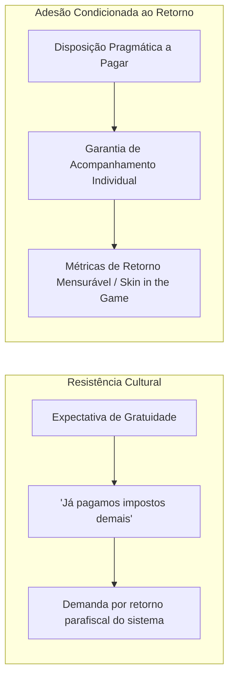

> [!NOTE]
> **Estudo Sanitizado (`proprietary_sanitized`)**: Relatório estratégico de consultoria e inteligência de mercado conduzido para entidade paraestatal de fomento e apoio a micro e pequenas empresas. Em cumprimento estrito aos acordos de confidencialidade (NDA), identidades corporativas, entidades contratantes e nomes de consultores foram integralmente substituídos pelo arquétipo **"Entidade Paraestatal de Fomento a Pequenos Negócios"**, preservando o rigor analítico, as matrizes de diagnóstico e os achados empíricos de competitividade das MPEs.

---

## 1. O Trilema dos Modelos de Atendimento a MPEs

Instituições públicas e paraestatais de apoio ao empreendedorismo operam sob uma tensão estrutural permanente: conciliar **alcance massificado** com **profundidade técnica resolutiva**.

Esta investigação de inteligência estratégica avaliou a percepção de valor, a eficácia operacional e a disposição a pagar (*willingness to pay*) de proprietários de Microempresas (ME) e Empresas de Pequeno Porte (EPP) frente a três modelos distintos de entrega de serviços:

### 1.1. O Diagnóstico Comparativo dos Modelos

1. **Modelo Genérico (Cursos Amplos):** Adequado como porta de entrada para quem está estruturando o negócio do zero. Todavia, empreendedores com mais de dois anos de mercado o avaliam como "conteúdo raso", teórico e desconectado dos problemas urgentes de fluxo de caixa e gestão diária (*"nada, nada e morre na praia"*).
2. **Modelo Ajustado (Por Canal e Operação):** Desponta como a demanda imediata mais sólida. O empresário busca orientação prática sobre como articular suas vendas físicas com canais digitais, como organizar a logística reversa ou como precificar produtos em marketplaces sem sangrar a margem.
3. **Modelo Especializado (Por Cadeia Produtiva):** Representa o mais alto valor percebido. O dono de uma marcenaria, oficina mecânica ou restaurante demanda soluções com quem conhece a fundo os fornecedores de sua matéria-prima, as peculiaridades tributárias do seu segmento e as normas regulatórias locais.

---

## 2. Matriz de Hierarquização de Dores e Fricções

Ao cruzar a frequência das queixas nos grupos focais com a severidade do impacto no fluxo de caixa, consolidou-se a seguinte matriz de priorização de problemas:

| Nível de Prioridade | Gargalo Estrutural | Impacto Operacional e Econômico | Racionalidade Identificada |
| :--- | :--- | :--- | :--- |
| **Prioridade Máxima** *(Alta Frequência / Alto Impacto)* | **Escassez e Rotatividade de Mão de Obra** | Sobrecarga do proprietário, perda de padrão de atendimento e trava no crescimento | Empreendedores relatam carência de comprometimento da nova geração, centralizando compras, vendas e atendimento. |
| **Prioridade Máxima** *(Alta Frequência / Alto Impacto)* | **Pressão Digital e Concorrência de Marketplaces** | Queda abrupta de margem de lucro e canibalização de preços | Pequenos lojistas físicos lutam para se posicionar online frente a gigantes do varejo eletrônico. |
| **Alta Prioridade** *(Média Frequência / Alto Impacto)* | **Acesso a Capital de Giro e Linhas de Crédito** | Inviabilidade de expansão e estrangulamento de liquidez | Dificuldade histórica de obter crédito produtivo com juros compatíveis com o ciclo operacional. |
| **Alta Prioridade** *(Média Frequência / Alto Impacto)* | **Margens de Lucro Comprimidas e Custos Ocultos** | Erosão do lucro líquido mesmo com faturamento elevado | Custos tributários e logísticos obscurecem o retorno real do negócio. |
| **Média Prioridade** *(Média Frequência / Médio Impacto)* | **Conteúdo Raso nas Consultorias Tradicionais** | Ceticismo quanto ao apoio institucional | Percepção de que consultores generalistas sugerem soluções óbvias que o empresário já domina. |

*Tabela 1: Matriz de frequência versus impacto dos desafios empresariais das MPEs.*

---

## 3. A Análise de Fricção Operacional

### 3.1. O Gargalo Crítico da Mão de Obra
A dificuldade de recrutar e reter colaboradores engajados é a dor mais aguda manifestada por donos de negócios consolidados:

> *"A molecada não quer aprender... Não entra na cabeça deles raciocinar rápido para resolver a situação do cliente. Aí quem tem que estar no balcão apagando incêndio sou eu. O dono não consegue sair da operação para pensar no futuro da empresa."*
> — *Proprietário de EPP, Setor de Serviços e Comércio*

Tal dinâmica impõe um ciclo reativo: sem funcionários autônomos, o empreendedor não consegue delegar tarefas básicas, inviabilizando sua dedicação a treinamentos estratégicos.

### 3.2. A Transição Digital e a "Ilusão das Redes Sociais"
O empresário de pequeno porte reconhece a relevância do ambiente digital, mas acumula frustrações com agências de marketing que cobram honorários elevados sem entregar conversão real em vendas. 

A busca por conhecimento prático migrou substancialmente para ferramentas de busca rápida (YouTube e Google), que funcionam como um "manual do mundo" imediato para resolver dúvidas operacionais do dia a dia.

---

## 4. Disposição a Pagar vs. Expectativa de Gratuidade

A investigação aprofundou a viabilidade comercial de consultorias hiperespecializadas remuneradas, revelando uma clivagem cultural significativa:

- **A Barreira da Carga Tributária:** Empresários com margens apertadas reagem com ceticismo à cobrança por serviços de entidades de fomento, argumentando que a contribuição compulsória sobre a folha de pagamento e o faturamento já deveria cobrir a assistência técnica integral;
- **O Fator de Conversão:** A disposição a pagar manifesta-se estritamente quando o serviço abandona o formato expositivo de sala de aula e assume o formato de **mentoria *hands-on***, com diagnóstico no local do negócio, metas de redução de custo ou aumento comprovado de vendas.

---

## 5. Recomendações Estratégicas de Desenho de Serviço (Service Design)

Para preservar sua relevância e elevar o impacto econômico sobre o ecossistema empreendedor, recomenda-se à instituição paraestatal a adoção de quatro eixos de modernização:

1. **Segmentação por Maturidade e Não por Porte Fiscal:**
   - Superar o corte simplista MEI vs. ME vs. EPP. Uma ME com 10 anos de operação possui desafios de governança e sucessão que exigem consultorias radicalmente diferentes de uma ME recém-aberta.

2. **Arquitetura Curricular em Formato "T":**
   - Oferecer uma base horizontal digitalizada e autoinstrucional (microconteúdos sobre finanças e precificação) conectada a verticais profundas e setorizadas conduzidas por especialistas de mercado.

3. **Criação de Redes e Hubs de Cooperação Setorial:**
   - Viabilizar rodadas de negócios e comunidades de prática entre empresários do mesmo nicho para troca de experiências, negociação conjunta com fornecedores e fortalecimento de redes de valor locais.

4. **Mentoria com Métricas de Resultado:**
   - Estruturar programas de acompanhamento de médio prazo (3 a 6 meses) ancorados em indicadores de desempenho operacional (EBITDA, rotatividade de estoque, redução de refugo).
