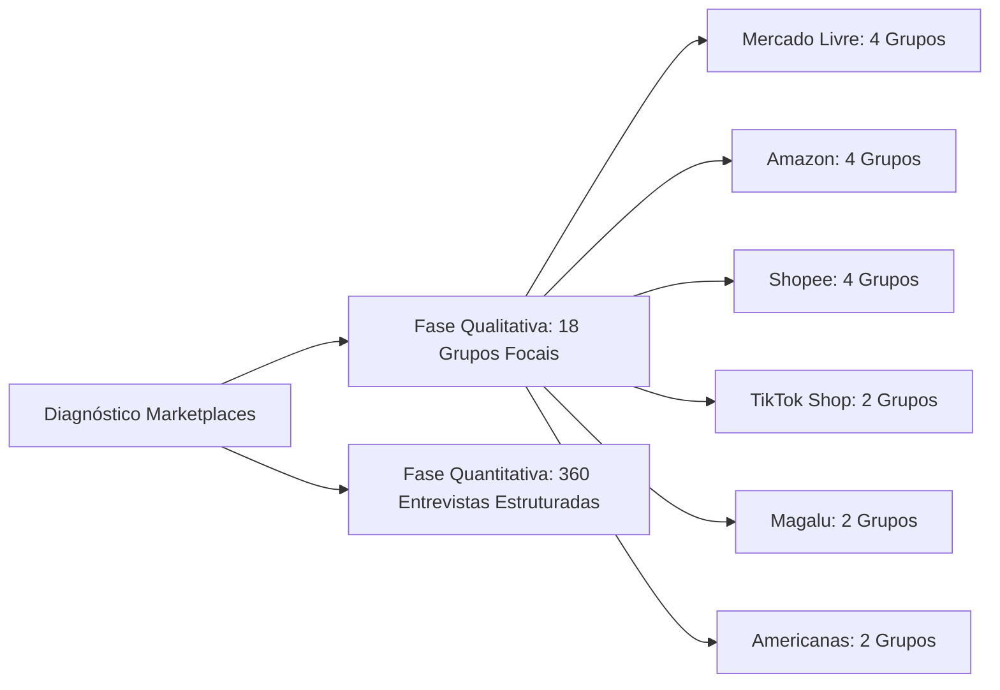
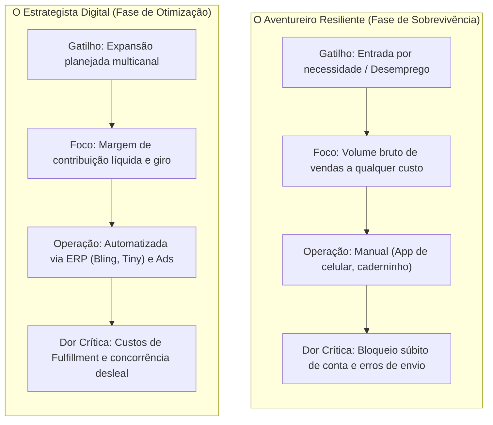
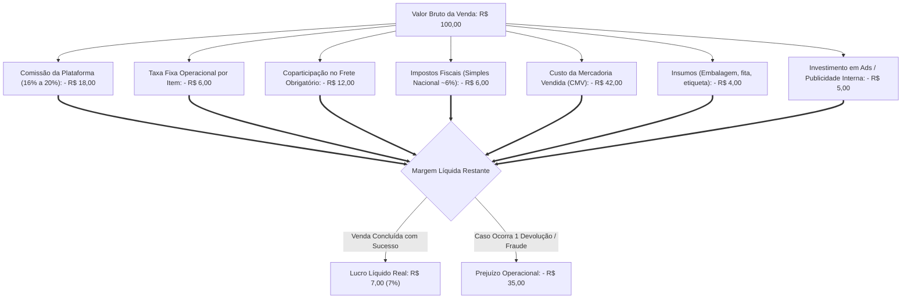

> [!NOTE]
> **Estudo Sanitizado (`proprietary_sanitized`)**: Diagnóstico de pesquisa mista (qualitativa e quantitativa) sobre a dinâmica operacional de sellers em plataformas digitais desenvolvido para entidade paraestatal de fomento aos pequenos negócios. Em estrita observância às regras de sigilo (NDA), identidades de pesquisadores e da entidade contratante foram substituídas pelo arquétipo setorial **"Entidade Paraestatal de Fomento a Pequenos Negócios"**, sendo autorizada a citação nominal das plataformas de mercado analisadas (Mercado Livre, Amazon, Shopee, Magalu).

---

## 1. A Economia Política dos Marketplaces: "Construindo em Terreno Alugado"

A promessa de democratização do comércio eletrônico por meio de grandes plataformas digitais atraiu centenas de milhares de micro e pequenos empresários brasileiros para os marketplaces. A narrativa é sedutora: barreira de entrada quase nula, acesso imediato a milhões de consumidores e infraestrutura logística pronta.

Todavia, a realidade operacional exposta por este diagnóstico revela um cenário de alta fricção e **vulnerabilidade sistêmica**. Vender em marketplace não se resume a cadastrar produtos e despachar caixas; tornou-se uma engrenagem de alta complexidade em que o pequeno vendedor opera sob regras algorítmicas opacas, compressão violenta de margens e constante insegurança jurídica.

O sentimento dominante entre os *sellers* é o de edificar um negócio próspero em terreno alugado, onde o proprietário da terra pode elevar o aluguel, mudar as regras de circulação ou revogar o acesso sem aviso prévio.

---

## 2. Desenho Amostral e Arquitetura da Investigação

A pesquisa combinou metodologias qualitativas e quantitativas para capturar a jornada de vendedores nos principais ecossistemas do varejo digital brasileiro:

O desenho amostral estratificou vendedores por maturidade operacional: **entrantes recentes** (menos de 1 ano de atividade) e **sellers consolidados** (mais de 1 ano, atuando como ME ou EPP).

---

## 3. Arquétipos de Vendedores: Do Amadorismo à Gestão de Dados

Identificaram-se dois perfis comportamentais e estratégicos predominantes no ecossistema:

### 3.1. O Aventureiro Resiliente
Entrou na plataforma impulsionado pela necessidade de gerar renda imediata (especialmente no período pós-pandemia). Opera na intuição: calcula preços baseando-se apenas no valor pago ao fornecedor mais um multiplicador simples, esquecendo-se das taxas fixas, comissões e frete. Quando o volume cresce, colapsa na gestão manual de estoque, acumula atrasos e vê sua reputação afundar.

### 3.2. O Estrategista Digital
Compreende que a plataforma é um canal de tração, não um parceiro filantrópico. Diversifica suas vitrines em múltiplos marketplaces (Mercado Livre, Shopee e Amazon) para não ficar refém de um único algoritmo. Utiliza sistemas de gestão integrada (ERPs) para sincronizar estoque em tempo real e domina ferramentas de publicidade paga interna (*Marketplace Ads*).

---

## 4. A Engenharia da Venda e a "Tirania da Logística"

A logística deixou de ser uma atividade operacional de suporte e converteu-se no **principal critério de ranqueamento algorítmico**. Quem não adere aos programas logísticos da própria plataforma é sistematicamente rebaixado para as últimas páginas de busca.

| Modalidade Logística | Vantagem Estrutural | Fricção e Custo Oculto | Percepção do Vendedor |
| :--- | :--- | :--- | :--- |
| **Fulfillment (Full)** | Multiplicação imediata das vendas e prioridade na *Buybox* | Custos de estocagem de longa permanência e burocracia para descarte de mercadoria parada | *"O céu em vendas e o inferno em custos de armazenagem"* |
| **Envio no Mesmo Dia (Flex)** | Giro rápido de caixa e captura do público metropolitano | Dependência extrema de motoboys e estresse severo com horários de corte (*cut-off*) | Operação de guerra com risco diário de punição por atrasos no trânsito |
| **Envios Próprios / Correios** | Controle direto do pacote e ausência de taxas de galpão | Perda acentuada de visibilidade no algoritmo de busca | Sensação de invisibilidade comercial |

*Tabela 1: Comparativo das modalidades logísticas sob a ótica dos sellers.*

---

## 5. A "Guerra dos Centavos" e o Risco de Quebrar Vendendo

A precificação em marketplaces opera sob uma espiral deflacionária severa. Vendedores relatam a sensação de "pagar para trabalhar" decorrente da proliferação de taxas sobrepostas.

A Figura 1 desconstrói a rentabilidade de um produto anunciado por **R$ 100,00**:

Uma única devolução fraudulenta (como o golpe da devolução com pacote vazio ou item danificado) consome o lucro líquido de cinco a dez vendas perfeitas. Como as plataformas adotam políticas ultraliberais de devolução grátis em favor do comprador, o custo da logística reversa e do prejuízo recai quase invariavelmente sobre o elo mais fraco: o pequeno lojista.

---

## 6. A Ditadura da Reputação e a Insegurança Algorítmica

A reputação (o "termômetro" de cores ou o índice de estrelas) atua como um interruptor imediato de faturamento:

- **A Guilhotina das Cores:** Cair da faixa verde para a amarela ou laranja no Mercado Livre acarreta perda imediata de mais de 70% das visualizações orgânicas de anúncios e perda do subsídio de frete;
- **Submissão Obrigatória:** Para evitar que o cliente abra uma reclamação que degrade sua métrica, vendedores optam por reembolsar compras integralmente, mesmo cientes de má-fé do consumidor;
- **A Barreira do Suporte Automatizado:** Quando uma conta é suspensa preventivamente por decisões algorítmicas, o vendedor depara-se com chatbots que emitem respostas padronizadas, sem acesso a interlocutores humanos ou direito ao contraditório formal.

---

## 7. Recomendações e Diretrizes para o Suporte Institucional

Para resguardar a viabilidade econômica do comércio eletrônico de pequenos negócios, a instituição de apoio deve articular ações em três frentes complementares:

1. **Simuladores de Engenharia Financeira de Marketplace:**
   - Capacitar os microempresários em cálculo de ponto de equilíbrio considerando a matriz real de comissões, frete dinâmico e devoluções estimadas, combatendo a mentalidade ingênua de foco exclusivo em faturamento bruto.

2. **Trilhas de Transição Tecnológica (Automação e ERP):**
   - Oferecer suporte prático para a implantação do primeiro sistema de gestão integrada (ERP/Hub), capacitando a gestão unificada de múltiplos estoques e emissão automática de notas fiscais.

3. **Mediação e Defesa Institucional dos Sellers:**
   - Estabelecer canais de interlocução qualificada com as diretorias de relações institucionais das grandes plataformas para construir regras mais equilibradas de contestação de devoluções e critérios transparentes de suspensão cadastral.
