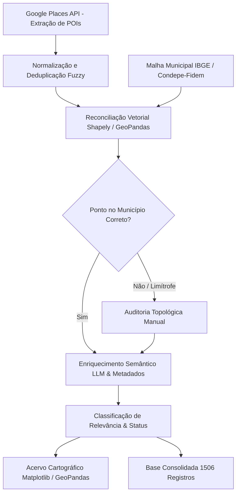

> [!NOTE]
> **Estudo Sanitizado (`proprietary_sanitized`)**: Relatório executivo de inteligência geoespacial e auditoria de inventário turístico desenvolvido em conformidade com o Termo de Referência da EMPETUR (Empresa de Turismo de Pernambuco). Dados cadastrais sensíveis e contatos comerciais privados foram resguardados conforme os protocolos de governança de dados do portfólio.

---

## 1. Contexto e Desafio de Engenharia Geoespacial

O planejamento de políticas públicas de turismo e a atração de investimentos em infraestrutura dependem criticamente da precisão cartográfica e cadastral dos equipamentos receptivos. Em estados com vasta extensão territorial e acentuadas assimetrias intrarregionais, como Pernambuco, os inventários tradicionais frequentemente padecem de três vícios crônicos: obsolescência de registros físicos, divergência de limites municipais em áreas rurais e duplicidades cadastrais causadas por grafias imprecisas.

Para superar tais limitações, este trabalho estruturou e executou as Etapas 1 (Levantamento e Coleta) e 2 (Consolidação e Diagnóstico) do Inventário Turístico de Pernambuco, com foco inicial em 31 municípios do semiárido e sertão pernambucano, abrangendo quatro regiões turísticas estratégicas: Sertão do Araripe, Sertão do Moxotó, Sertão de Itaparica e Sertão do São Francisco.

O objetivo central consistiu em estabelecer uma esteira reproduzível de extração de pontos de interesse (*POIs*), validação topológica contra limites censitários oficiais e classificação analítica de maturidade e relevância econômica para subsidiar as futuras inspeções *in loco*.

---

## 2. Metodologia de Coleta e Pipeline de Reconciliação

A esteira de processamento integrou automação geoespacial via Python, fontes abertas e curadoria técnica supervisionada, conforme o diagrama estrutural abaixo:

### 2.1. Extração Automatizada e Normalização
A coleta inicial operou via Google Places API a partir de centróides e raios de busca otimizados para cobrir núcleos urbanos, distritos rurais e eixos viários dos 31 municípios. O conjunto bruto capturou nomes fantasia, coordenadas (latitude e longitude), categorias primárias e avaliações públicas (*ratings* de usuários).

### 2.2. Reconciliação Topológica e Limites Oficiais
Um dos principais gargalos de inventários turísticos reside na imprecisão de coordenadas informadas por estabelecimentos comerciais, que frequentemente apontam endereços no município vizinho. 

Para sanar tal distorção, cruzaram-se as coordenadas de cada ponto contra as malhas vetoriais poligonais oficiais do IBGE e da Agência Estadual de Planejamento e Pesquisas de Pernambuco (Condepe-Fidem) via bibliotecas `geopandas` e `shapely`. Registros posicionados fora dos polígonos municipais ou em faixas limítrofes foram isolados para retificação manual.

### 2.3. Deduplicação e Enriquecimento Semântico
Aplicaram-se algoritmos de similaridade fonética e distância de Levenshtein para eliminar registros duplicados gerados por variações de grafia. Subsequentemente, modelos de linguagem aplicados à semântica de dados geraram descrições técnicas preliminares e sintetizaram vocações funcionais com base no perfil de cada equipamento.

---

## 3. Análise Quantitativa e Diagnóstico de Qualidade

Ao término do saneamento, o inventário alcançou **1506 registros válidos e georreferenciados**, distribuídos entre equipamentos de hospedagem, gastronomia, artesanato, patrimônio cultural, atrativos naturais e infraestrutura de suporte.

### 3.1. Distribuição por Região Turística

A Tabela 1 sintetiza a distribuição da oferta inventariada nas quatro macrorregiões do interior pernambucano:

| Região Turística | Nº de Atrativos | Proporção (%) |
| :--- | :---: | :---: |
| Sertão do Araripe | 503 | 33,40% |
| Sertão do Moxotó | 361 | 23,97% |
| Sertão do São Francisco | 358 | 23,77% |
| Sertão de Itaparica | 284 | 18,86% |
| **Total Consolidado** | **1506** | **100,00%** |

*Tabela 1: Distribuição dos pontos de interesse por macrorregião turística.*

### 3.2. Estrutura por Categoria de Equipamento

A Tabela 2 apresenta as principais categorias de serviços e atrativos validados:

| Macro-Categoria | Quantidade | Descrição Funcional |
| :--- | :---: | :--- |
| **Serviço Turístico** | 768 | Restaurantes, bares, agências locais, pousadas e entretenimento |
| **Infraestrutura de Apoio** | 239 | Serviços de saúde, terminais rodoviários, bancos e postos de apoio |
| **Atrativo Cultural** | 221 | Centros de artesanato, museus, sítios históricos e patrimônio religioso |
| **Atrativo Natural** | 180 | Serras, mirantes, balneários fluviais, trilhas e ecoparques |
| **Hospedagem Específica** | 23 | Hotéis e resorts classificados de forma autônoma |
| **Outros Nichos Regionais** | 75 | Cooperativas artesanais, produtos regionais e espaços cívicos |

*Tabela 2: Estratificação setorial dos equipamentos validados.*

### 3.3. Avaliação Percebida dos Usuários (Google Rating)

A nota média das avaliações públicas permite estimar a percepção de qualidade atribuída pelos visitantes aos equipamentos locais, revelando um patamar consistente em todas as regiões:

| Região Turística | Média Google Rating (0 a 5) | Desvio Padrão Estimado |
| :--- | :---: | :---: |
| Sertão do Araripe | 4,48 | 0,42 |
| Sertão do Moxotó | 4,46 | 0,45 |
| Sertão de Itaparica | 4,44 | 0,47 |
| Sertão do São Francisco | 4,40 | 0,51 |

*Tabela 3: Percepção de qualidade ponderada por macrorregião.*

A menor nota relativa no Sertão do São Francisco não indica pior serviço, mas sim uma amostra de usuários muito mais expressiva e exigente em Petrolina, polo com fluxo constante de negócios e enoturismo.

### 3.4. Matriz de Relevância e Validação Operacional

Para orientar a logística das equipes de campo na Etapa 3, os equipamentos foram categorizados conforme a prioridade de inspeção física:

| Grau de Relevância | Quantidade | Racional de Classificação |
| :--- | :---: | :--- |
| **Alta Relevância** | 63 | Atrativos-âncora, patrimônio histórico tombado e grandes polos hoteleiros |
| **Média Relevância** | 1272 | Serviços turísticos complementares, alimentação e comércio regional |
| **Baixa Relevância** | 162 | Infraestrutura auxiliar de baixa atratividade turística direta |

Quanto ao status cadastral, **732 equipamentos foram confirmados** com consistência cadastral imediata e **764 foram sinalizados para verificação *in loco*** devido a dados de contato ausentes ou necessidade de confirmação presencial de funcionamento.

---

## 4. Distribuição Espacial e Cartografia Estadual

A visualização geoespacial consolidada evidencia padrões territoriais nítidos de concentração e vazios assistenciais:

*Figura 1: Distribuição espacial consolidada dos 1506 atrativos nos 31 municípios de Pernambuco.*

Três constatações territoriais emergem da análise espacial:
1. **Polo Enoturístico do São Francisco:** Forte adensamento de atrativos de alta relevância ao longo do Rio São Francisco, capitaneado por Petrolina e Lagoa Grande, com integração entre produção vitivinícola, hotelaria de alto padrão e transporte náutico.
2. **Capilaridade Criativa do Araripe:** Distribuição descentralizada com forte presença de cultura popular, artesanato têxtil/couro e patrimônio fóssil (Exu, Araripina, Ouricuri e Bodocó).
3. **Vazios de Dados em Municípios de Menor Porte:** Localidades com menos de 20 registros cadastrados (ex.: Carnaubeira da Penha, Itacuruba e Santa Cruz) indicam tanto fragilidade na presença digital dos estabelecimentos locais quanto necessidade de busca ativa presencial com agentes comunitários.

---

## 5. Recortes Territoriais e Cadernos Municipais

Cada um dos 31 municípios contou com um caderno cartográfico e analítico dedicado. Abaixo destacam-se recortes representativos dos polos regionais:

### 5.1. Petrolina (Sertão do São Francisco)
- **Total de Registros:** 132 equipamentos validados.
- **Vocações:** Enoturismo, navegação fluvial no São Francisco, gastronomia ribeirinha e hotelaria executiva.
- **Equipamentos Âncora:** Totem Orla Petrolina, Passeios de Catamarã e Lancha, Pousadas e Gastronomia Ribeirinha.

*Figura 2: Distribuição geoespacial dos atrativos no município de Petrolina.*

### 5.2. Exu (Sertão do Araripe)
- **Total de Registros:** 65 equipamentos validados.
- **Vocações:** Turismo cultural e memorialístico da música nordestina (Terra de Luiz Gonzaga), patrimônio arquitetônico sertanejo e ecoturismo na Chapada do Araripe.
- **Equipamentos Âncora:** Parque Aza Branca, Fazenda Araripe e Museu do Gonzagão.

*Figura 3: Distribuição geoespacial dos atrativos no município de Exu.*

### 5.3. Arcoverde (Sertão do Moxotó)
- **Total de Registros:** 100 equipamentos validados.
- **Vocações:** Portal do Sertão, polo comercial, gastronomia regional, artesanato em couro e ecoturismo serrano.
- **Equipamentos Âncora:** Serra das Torres, Centro de Gastronomia e Artesanato e Hotel Cruzeiro.

*Figura 4: Distribuição geoespacial dos atrativos no município de Arcoverde.*

### 5.4. Tacaratu (Sertão de Itaparica)
- **Total de Registros:** 55 equipamentos validados.
- **Vocações:** Capital do tear e artesanato têxtil, turismo religioso e turismo de aventura/mirantes.
- **Equipamentos Âncora:** Cooperativa dos Artesãos Têxteis de Tacaratu e Santuário de Nossa Senhora da Saúde.

*Figura 5: Distribuição geoespacial dos atrativos no município de Tacaratu.*

---

## 6. Diretrizes Técnicas para a Etapa 3 (Inspeção In Loco)

A conclusão da Etapa 2 estabelece as condições operacionais para a mobilização das equipes de campo. Recomenda-se a adoção de três prioridades:

1. **Roteirização Focada nos 63 Atrativos de Alta Relevância:** Concentrar os esforços iniciais de vistoria presencial nos equipamentos-âncora, validando horários de funcionamento, tarifas, acessibilidade física e capacidade de recepção.
2. **Saneamento Ativo dos Vazios Cadastrais:** Em municípios com menos de 20 pontos identificados via satélite e web, conduzir entrevistas estruturadas junto a secretarias municipais de turismo e lideranças de associações comerciais.
3. **Padronização do Acervo Fotográfico e Cadastral:** Registrar coordenadas diferenciais via GPS de mão para atualizar a malha estadual e alimentar diretamente a plataforma oficial de dados turísticos de Pernambuco.
