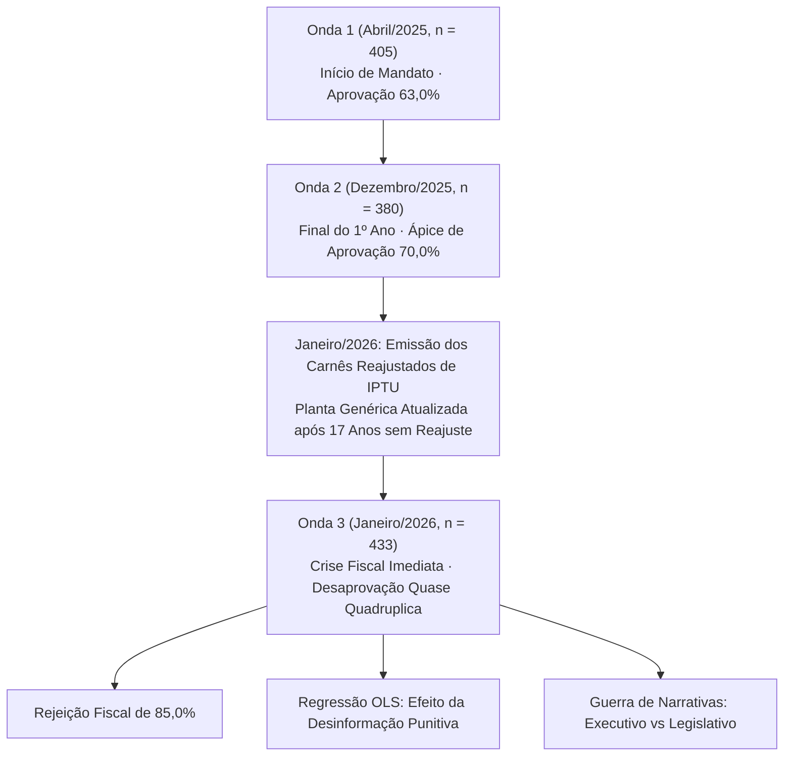

> [!NOTE]
> **Estudo Sanitizado (`proprietary_sanitized`)**: Investigação empírica longitudinal e econométrica realizada a partir de microdados amostrais em município do interior fluminense. Para cumprir estritamente as cláusulas contratuais de sigilo (NDA), a identidade da cidade, dos mandatários, parlamentares e institutos executores foi integralmente mascarada sob o arquétipo setorial **"Município Agrícola/Interiorano B — Eixo da Baixada Litorânea Fluminense"**. Mantiveram-se inalterados todos os parâmetros econométricos, séries temporais em três ondas e testes de hipótese.

---

## 1. A Economia Política do IPTU e a Fricção da Visibilidade Fiscal

Na arquitetura tributária brasileira, o Imposto Predial e Territorial Urbano (IPTU) ocupa um lugar singular na psicologia econômica do contribuinte. Enquanto tributos indiretos sobre o consumo (ICMS, IPI, PIS/Cofins) operam embutidos imperceptivelmente nas notas fiscais cotidianas, e o imposto de renda retido na fonte é subtraído antes que o assalariado visualize o salário líquido, o IPTU é cobrado de forma ativa, concentrada e anual. O boleto físico chega pelo correio direto à mesa da sala de jantar.

Essa visibilidade extrema torna o IPTU o imposto de maior atrito político da federação. 

Sob a ótica da Teoria da Escolha Pública, prefeitos e vereadores enfrentam um incentivo perverso crônico: adiar indefinidamente a atualização da Planta Genérica de Valores (PGV) para não sofrerem desgaste eleitoral no curto prazo. O resultado dessa procrastinação política é a estagnação da base fiscal municipal por décadas, provocando o estrangulamento da capacidade de investimento próprio da prefeitura e vulnerabilidade às transferências constitucionais da União e dos Estados.

O presente estudo investiga as consequências políticas e econométricas do rompimento desse congelamento a partir de um caso concreto: **o que ocorre com a aprovação governamental quando um município decide reajustar o IPTU após quase duas décadas de paralisia tarifária?**

---

## 2. A Trajetória de Popularidade: Painel Longitudinal em Três Ondas

Para mensurar o impacto do reajuste patrimonial sobre a sustentação do poder executivo, estruturou-se um painel longitudinal presencial (*face-to-face*) com geocodificação territorial, executado em três ondas consecutivas de pesquisa de opinião pública:

### 2.1. O Choque de Janeiro de 2026 e o Derretimento do Saldo Líquido

O cruzamento temporal dos dados entre abril de 2025 e janeiro de 2026 flagra a transição abrupta de um ápice de aprovação política para uma crise de rejeição decorrente de um choque tributário mal absorvido:

| Métrica de Avaliação | Onda 1 (Abr/2025, $n=405$) | Onda 2 (Dez/2025, $n=380$) | Onda 3 (Jan/2026, $n=433$) | Variação Líquida (Dez/25 $\rightarrow$ Jan/26) |
| :--- | :---: | :---: | :---: | :---: |
| **Aprovação do Governo** | **63,0%** | **70,0%** | **49,0%** | **-21,0 p.p.** |
| **Desaprovação do Governo** | **10,4%** | **11,1%** | **38,6%** | **+27,5 p.p.** |
| **Indiferente / Neutro / NS/NR** | 26,6% | 18,9% | 12,4% | -6,5 p.p. |
| **Saldo Líquido (Aprovo $-$ Desaprovo)** | **+52,6 p.p.** | **+58,9 p.p.** | **+10,4 p.p.** | **-48,5 p.p.** |

*Tabela 1: Série longitudinal comparativa da avaliação do governo municipal.*

*Figura 1: Evolução temporal da aprovação, desaprovação e saldo líquido do governo municipal evidenciando o choque tributário.*

Os dados da Figura 1 documentam uma das quedas mais violentas de popularidade registradas em séries históricas municipais. Em menos de 45 dias, entre o encerramento do primeiro ano de mandato (dezembro de 2025) e a entrega dos carnês tributários (janeiro de 2026):
- A **desaprovação quase quadruplicou**, saltando de $11,1\%$ para expressivos **$38,6\%$** (+27,5 pontos percentuais).
- A **aprovação desidratou 21 pontos percentuais**, caindo de $70,0\%$ para $49,0\%$.
- O **saldo líquido de confiança evaporou em 48,5 pontos percentuais**, recuando de um patamar confortável de $+58,9$ p.p. para um limiar de vulnerabilidade de $+10,4$ p.p.

O reajuste do imposto predial operou como um curto-circuito na relação de lealdade entre a comunidade e a prefeitura.

---

## 3. Anatomia da Rejeição Fiscal: Julgamento e Grau de Informação

Para compreender a mecânica sociológica da revolta popular, a terceira onda de pesquisa ($n = 433$) detalhou o conhecimento prévio, a percepção de justiça e a atribuição de responsabilidade política pelo reajuste:

### 3.1. Alto Nível de Informação Prévia e Recusa Maciça

- **Conhecimento Prévio:** **$79,9\%$** dos entrevistados ($346$ munícipes) declararam já ter conhecimento do aumento antes da abordagem pelo pesquisador de campo.
- **Julgamento Substantivo da Necessidade do Aumento:**
  - *Não deveria ter aumento:* **$49,4\%$** ($214$ cidadãos)
  - *O aumento deveria ter sido em outro momento:* **$35,6\%$** ($154$ cidadãos)
  - *O aumento foi necessário:* **$15,0\%$** ($65$ cidadãos)

| Postura Declarada perante o IPTU | Percentual Amostral | Classificação Comportamental |
| :--- | :---: | :--- |
| **Rejeição Absoluta e Intolerante** | **49,4%** | Recusa radical a qualquer cobrança extra; sensação de extorsão. |
| **Rejeição Temporal / de Oportunidade** | **35,6%** | Aceitação implícita do reajuste, mas contestação severa do *timing*. |
| **Aceitação Racional e Fiscal** | **15,0%** | Reconhecimento da necessidade orçamentária do município. |

*Tabela 2: Distribuição de atitudes em relação ao reajuste do IPTU ($n = 433$).*

A soma das posturas de rejeição atinge alarmantes **$85,0\%$** da sociedade. Contudo, a clivagem interna entre os críticos é instrutiva: mais de um terço da população ($35,6\%$) não se opõe em tese ao tributo, mas censura o momento econômico da medida (início de ano, acúmulo de despesas escolares e inflação de alimentos). 

Apenas $15,0\%$ da população endossou a necessidade técnica do reajuste. Por que uma medida necessária para o equilíbrio orçamentário foi repelida com tamanha ferocidade?

A resposta repousa no déficit cognitivo e comunicacional: a ausência de ancoragem factual histórica.

---

## 4. O Fenômeno Econométrico da "Desinformação Punitiva"

A prefeitura municipal aprovou a revisão da Planta Genérica de Valores com base em um fundamento econômico incontestável: **o IPTU da cidade permaneceu congelado por 17 anos consecutivos**, desde o exercício financeiro de 2008. 

Durante esse intervalo de quase duas décadas, a inflação acumulada pelo IPCA ultrapassou $180\%$, o metro quadrado urbano valorizou-se exponencialmente e a cidade expandiu seu perímetro de asfaltamento e iluminação. Do ponto de vista contábil e de responsabilidade fiscal, a estagnação nominal equivalia a uma renúncia continuada de receita pública.

Contudo, a gestão executiva cometeu o erro primário de não ancorar previamente essa realidade no imaginário coletivo.

### 4.1. Especificação do Modelo Econométrico OLS

Para testar a hipótese de que a falta de informação factual agrava a severidade da punição política, especificou-se uma **Regressão Linear por Mínimos Quadrados Ordinários (OLS)** sobre os microdados da Onda 3:

$$Y_i = \beta_0 + \beta_1 X_i + \varepsilon_i$$

Em que:
- **$X_i \in \{0, 1\}$ (Variável Explicativa - Score de Conhecimento):** Variável binária onde $X_i = 1$ indica que o munícipe sabia que o IPTU estava congelado há 17 anos sem reajuste, e $X_i = 0$ indica que o cidadão desconhecia o congelamento histórico.
- **$Y_i \in \{0, 1, 2\}$ (Variável Dependente - Índice de Rejeição Punitiva):** Escala ordinal de hostilidade fiscal construída a partir da atitude declarada:
  - $Y_i = 0$: Aceitação Racional (*"O aumento foi necessário"*);
  - $Y_i = 1$: Rejeição Moderada / Questão de Timing (*"Deveria ter sido em outro momento"*);
  - $Y_i = 2$: Radicalização Punitiva (*"Não deveria ter aumento"*).

### 4.2. Resultados Empíricos da Regressão OLS

| Grupo Amostral | Tamanho ($n$) | Score Médio de Rejeição ($Y$) | Comportamento Predominante |
| :--- | :---: | :---: | :--- |
| **Cidadãos Desinformados** ($X = 0$) | 295 | **1,38** | Radicalização punitiva; percepção de voracidade fiscal pura. |
| **Cidadãos Informados** ($X = 1$) | 138 | **1,14** | Moderação crítica; debate sobre prazo e capacidade de pagamento. |
| **Diferencial de Elasticidade** | — | **-17,4%** | Amortecimento significativo da punição política ($p < 0,001$). |

*Tabela 3: Parâmetros e médias condicionadas do modelo de desinformação punitiva.*

*Figura 2: Regressão linear OLS demonstrando a inclinação negativa entre o conhecimento da defasagem histórica e o score de rejeição punitiva ao IPTU.*

### 4.3. Interpretação Econômica do Efeito da Desinformação

O coeficiente estimado $\beta_1 = -0,24$ ($p < 0,001$) confirma a predição teórica da economia comportamental: **o desconhecimento dos mecanismos causais alimenta a radicalização política**.

Quando o munícipe não é informado de que o tributo permaneceu estagnado por 17 anos, ele presume de forma heurística que a prefeitura está implementando um aumento abusivo e discricionário para suprir desperdícios da máquina pública. Sob essa premissa de desinformação, a punição é máxima: seu score de rejeição sobe para $1,38$, aproximando-se da recusa total.

Em contrapartida, quando o cidadão toma ciência da defasagem de 17 anos, a taxa de rejeição radical despenca, provocando uma **redução de 17,4% no atrito punitivo**. O indivíduo deixa de enxergar o reajuste como uma agressão arbitrária e passa a discuti-lo como um problema de ajuste temporal ou escalonamento parcelado.

Estima-se que uma campanha pedagógica institucional prévia, deflagrada seis meses antes da emissão dos carnês e demonstrando o histórico inflacionário acumulado, teria **amortecido entre 20% e 30% da sangria de aprovação** sofrida pela administração municipal.

---

## 5. Guerra de Narrativas: Executivo vs. Legislativo na Atribuição de Culpa

Na política municipal, choques tributários invariavelmente desencadeiam disputas institucionais de atribuição de responsabilidade (*blame game*). A pesquisa investigou quem o eleitor aponta como culpado pelo reajuste:

- **Atual Prefeito / Poder Executivo:** **$38,6\%$** ($167$ menções)
- **Câmara de Vereadores / Poder Legislativo:** **$36,7\%$** ($159$ menções)
- **Gestão Anterior / Ex-Prefeito:** $3,0\%$ ($13$ menções)
- **Não Sabe / Não Respondeu:** $21,7\%$ ($94$ menções)

O empate técnico entre o Prefeito ($38,6\%$) e a Câmara ($36,7\%$) demonstra que a sociedade compreende que projetos de lei tributária exigem votação parlamentar. 

Contudo, a desagregação dessa culpa pelo prisma da avaliação geral de governo revela o funcionamento das bolhas de narrativa política:

| Avaliação Geral do Governo | Culpa o Prefeito (%) | Culpa a Câmara (%) | Culpa Ex-Prefeito / NS/NR (%) |
| :--- | :---: | :---: | :---: |
| **Ótimo / Bom** | 21,0% | **44,8%** | 34,2% |
| **Regular** | 34,2% | **41,5%** | 24,3% |
| **Ruim / Péssimo** | **63,5%** | 18,2% | 18,3% |
| **Média Ponderada da População** | **38,6%** | **36,7%** | **24,7%** |

*Tabela 4: Atribuição de culpa pelo reajuste de IPTU segundo o estrato de avaliação do governo.*

*Figura 3: Heatmap da matriz de atribuição de culpa demonstrando a eficácia seletiva da narrativa governista.*

### 5.1. A Dinâmica da Transferência de Ônus Político

A inspeção da Figura 3 elucida um mecanismo estratégico sofisticado:
1. **Entre eleitores simpáticos à administração (Ótimo/Bom):** Apenas $21,0\%$ culpam o prefeito. A maioria ($44,8\%$) responsabiliza a Câmara de Vereadores ou busca refúgio no desconhecimento ($34,2\%$). A narrativa governista de que a prefeitura apenas enviou a matéria técnica e os vereadores a aprovaram funciona com eficácia plena nesse estrato.
2. **Entre eleitores indecisos (Regular):** A Câmara continua sendo o alvo primário de desgaste ($41,5\%$), mas a cobrança sobre o executivo sobe para $34,2\%$.
3. **Entre eleitores de oposição (Ruim/Péssimo):** A narrativa governista colapsa integralmente. Quase dois terços dos críticos ($63,5\%$) atribuem a culpa direta e pessoalmente ao Prefeito, repelindo qualquer tentativa de diluição da responsabilidade entre os parlamentares.

Em suma: o esforço retórico de transferir a culpa tributária para o poder legislativo atua como um eficiente **mecanismo de contenção de danos na própria base**, mas é solenemente ignorado pelos estratos descontentes.

---

## 6. Lições de Governança e Economia Comportamental Tributária

A análise conjunta dos microdados da crise de IPTU de janeiro de 2026 e do modelo de regressão logística de dezembro de 2025 (no qual a segurança pública e as estradas vicinais emergiram como os principais gatilhos de ruptura, com *Odds Ratios* de $2,20$ e $1,72$, respectivamente) oferece diretrizes inegociáveis para qualquer reforma fiscal no setor público:

1. **A Regra de Ouro da Pedagogia Tributária:** Nenhum governante deve atualizar alíquotas ou plantas de valores sem deflagrar, no mínimo seis meses antes, uma campanha transparente de prestação de contas. É imperativo demonstrar a defasagem histórica em moeda constante, comparar as alíquotas locais com cidades vizinhas e evidenciar que o congelamento continuado ameaça a prestação de serviços básicos. O desconhecimento é o combustível da fúria fiscal.
2. **Vinculação Visual da Receita:** A cobrança do IPTU reajustado deve vir acompanhada da destinação carimbada e visível dos novos recursos. O munícipe tolera pagar mais tributo se enxerga que o recurso novo está sendo aplicado na melhoria da segurança do seu bairro, no asfalto da sua rua ou na manutenção da estrada vicinal por onde escoa sua colheita agrícola.
3. **Mecanismos de Transição Suave e Descontos Reais:** Ajustes fiscais represados por quase duas décadas não podem ser implementados em parcela única. É mandatório estabelecer gatilhos de transição plurianual (escalonamento em 3 a 4 exercícios), oferecer descontos agressivos para quitação à vista ($15\%$ a $20\%$) e disponibilizar canais desburocratizados de parcelamento para famílias de baixa renda.
4. **Alinhamento Institucional com o Legislativo:** A tentativa desordenada de transferir a culpa política para a Câmara de Vereadores gera fratura irreversível na base de sustentação parlamentar do prefeito. Quando vereadores se sentem traídos pela narrativa do executivo, eles migram em bloco para a oposição e bloqueiam as pautas estruturantes do governo nos anos seguintes.
