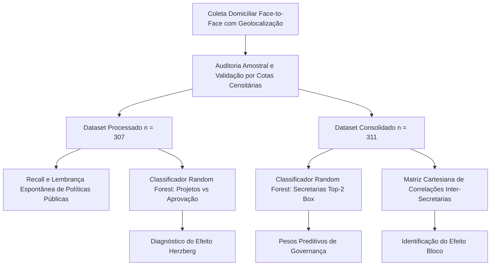

> [!NOTE]
> **Estudo Sanitizado (`proprietary_sanitized`)**: Investigação quantitativa e econométrica conduzida sobre microdados amostrais domiciliares em município litorâneo do Estado do Rio de Janeiro. Para preservar compromissos contratuais de confidencialidade (NDA), todos os agentes políticos, secretários, concorrentes eleitorais, denominação comercial da consultoria e o município foram integralmente descaracterizados sob o arquétipo setorial **"Município Litorâneo A — Polo Petrolífero Fluminense"**. Mantiveram-se inalterados todos os parâmetros estatísticos, distribuições, pesos de modelos e conclusões metodológicas.

---

## 1. O Dilema da Abundância Fiscal e Escolha Pública

Em administrações municipais detentoras de vultosas receitas extraordinárias oriundas de rendas minerais — como *royalties* e participações especiais da exploração de hidrocarbonetos na Bacia de Campos e Santos —, o desafio central de governança não é a escassez aritmética de caixa, mas a eficiência alocativa sob a ótica da Teoria da Escolha Pública. 

A abundância fiduciária cria distorções perceptuais severas no corpo eleitoral. Se o orçamento transborda recursos e a pressão fiscal direta sobre o cidadão é próxima de zero, a régua de exigência comunitária não se ancora no equilíbrio orçamentário; ancora-se na velocidade, visibilidade e impacto tangível das transferências estatais. O eleitor não agradece pelo superávit. Ele cobra entregas imediatas.

A questão analítica central desta investigação consiste em desatar um nó empírico de formulação de políticas públicas: **quais intervenções e secretarias de governo realmente movimentam o ponteiro da aprovação executiva em uma economia com alta liquidez petrolífera?**

Para responder a essa pergunta, combinou-se pesquisa de campo domiciliar presencial (*face-to-face*, $n = 307$ e $n = 311$) com algoritmos supervisionados de aprendizado de máquina (*Random Forest Classifier*) e testes paramétricos de associação linear de Pearson. Os resultados desafiam o senso comum do marketing institucional.

---

## 2. Desenho Amostral e Perfil Socioeconômico

A coleta de dados estruturou-se sobre questionários eletrônicos georreferenciados aplicados entre 23 e 24 de março de 2026, com amostragem probabilística estratificada por cotas proporcionais ao Censo Demográfico do IBGE.

### 2.1. Metadados e Composição Demográfica da Amostra ($n = 307$)

A margem de erro máxima calculada situou-se em $\pm 5,6$ pontos percentuais para um intervalo de confiança bicaudal de 95%. A distribuição sociodemográfica espelha a maturidade e heterogeneidade censitária local:

| Variável Demográfica | Segmento Amostral | Frequência Absoluta | Proporção Relativa (%) |
| :--- | :--- | :---: | :---: |
| **Gênero** | Feminino | 160 | 52,1% |
| | Masculino | 147 | 47,9% |
| **Faixa Etária** | 16 a 24 anos | 34 | 11,1% |
| | 25 a 34 anos | 60 | 19,5% |
| | 35 a 44 anos | 63 | 20,5% |
| | 45 a 59 anos | 83 | 27,0% |
| | 60 anos ou mais | 67 | 21,8% |
| **Escolaridade** | Ensino Médio (Completo / Incompleto) | 169 | 55,0% |
| | Ensino Fundamental | 75 | 24,4% |
| | Ensino Superior (Completo / Incompleto) | 54 | 17,6% |
| | Sem escolaridade / Lê e Escreve | 9 | 2,9% |
| **Renda Familiar** | Até 1 Salário Mínimo | 115 | 37,5% |
| | De 1 a 2 Salários Mínimos | 83 | 27,0% |
| | De 2 a 5 Salários Mínimos | 57 | 18,6% |
| | De 5 a 10 Salários Mínimos | 15 | 4,9% |
| | Acima de 10 Salários Mínimos | 5 | 1,7% |
| | Sem Renda Fixa / Outros / NS/NR | 32 | 10,5% |
| **Religião Declarada** | Evangélica | 115 | 37,5% |
| | Católica | 84 | 27,4% |
| | Sem Religião | 72 | 23,5% |
| | Espírita / Matriz Africana / Outras | 36 | 11,7% |
| **Distribuição Territorial** | 1º Distrito (Região Central / Sede Administrativa) | 142 | 46,3% |
| | 4º Distrito (Vetor Litorâneo Oeste / Eixo Residencial) | 81 | 26,4% |
| | 3º Distrito (Eixo Rodoviário Central) | 43 | 14,0% |
| | 2º Distrito (Vetor Litorâneo Leste / Rural) | 41 | 13,4% |

*Tabela 1: Estrutura amostral por variáveis de controle sociodemográfico e geográfico.*

### 2.2. Avaliação de Governo e Diagnóstico Temporal

A percepção do desempenho governamental reflete um cenário de polarização equilibrada com saldo ligeiramente negativo no recorte temporal:

- **Aprovação Dicotômica:** Desaprovo ($44,0\%$), Aprovo ($38,8\%$), Indecisos/Neutros ($17,3\%$).
- **Avaliação Escalonada:** Regular ($31,3\%$), Bom ($26,1\%$), Péssimo ($18,9\%$), Ruim ($11,1\%$), Ótimo ($9,4\%$), NS/NR ($3,3\%$).
- **Métrica Agregada:** Top-2 Box (Ótimo + Bom) em **$35,5\%$** contra Bottom-2 Box (Ruim + Péssimo) em **$30,0\%$**.
- **Comparação Prospectiva com Mandato Anterior:** Piorou ($38,1\%$), Melhorou ($36,2\%$), Manteve-se igual ($20,2\%$), NS/NR ($5,5\%$).

Tal configuração aponta para um desgaste marginal no início do ciclo corrente. Quando quase quatro em cada dez munícipes apontam piora em relação ao mandato precedente, a administração precisa compreender onde seu capital político está erodindo.

---

## 3. O Paradoxo do Transporte Coletivo e o Efeito Herzberg

O senso comum de gestores e marqueteiros políticos assume como axioma que a política pública de maior visibilidade popular é automaticamente o motor da aprovação governamental. Em municípios que adotam Tarifa Zero integral nos ônibus urbanos, a gratuidade do transporte é invariavelmente tratada como a joia da coroa da propaganda oficial.

Os dados empíricos desmontam categoricamente essa premissa.

### 3.1. Recall Popular de Ações Governamentais

Ao serem indagados sobre quais projetos ou intervenções municipais recordavam de imediato como marca do atual governo, as respostas espontâneas dos eleitores distribuíram-se na seguinte proporção:

| Projeto ou Ação Municipal Indicada | Menções Absolutas | Recall Populacional (%) |
| :--- | :---: | :---: |
| **Transporte Público Gratuito (Tarifa Zero Universal)** | 116 | 37,8% |
| **Moeda Social Municipal (Transferência Local)** | 73 | 23,8% |
| **Investimentos em Turismo, Festas e Eventos** | 57 | 18,6% |
| **Nenhum desses projetos / Rejeição Espontânea** | 54 | 17,6% |
| **Não sabe / Não respondeu** | 32 | 10,4% |
| **Obras Estruturantes e Urbanização da Cidade** | 26 | 8,5% |
| **Programas Sociais Gerais da Prefeitura** | 26 | 8,5% |
| **Renda Básica Municipal de Cidadania** | 24 | 7,8% |

*Tabela 2: Taxas de lembrança espontânea e recall das políticas públicas avaliadas ($n = 307$).*

O Transporte Gratuito com tarifa zero registra o maior índice de lembrança da administração ($37,8\%$), superando a Moeda Social em 14 pontos percentuais e suplantando Obras de Infraestrutura por um fator de quatro para um. 

Contudo, recall não se traduz em conversão política.

### 3.2. A Decomposição via Teoria dos Dois Fatores de Herzberg

Na psicologia comportamental e na economia organizacional, a clássica Teoria dos Dois Fatores de Frederick Herzberg estabelece uma distinção nítida entre:
1. **Fatores Higiênicos (Extrínsecos):** Elementos cuja presença apenas previne a insatisfação, operando como piso básico de expectativa. A sua existência regular não gera entusiasmo ativo nem lealdade duradoura; mas sua eventual deterioração ou corte gera indignação e revolta imediatas.
2. **Fatores Motivacionais (Intrínsecos):** Elementos que promovem satisfação ativa, sentimento de valorização e vínculo afetivo duradouro.

O transporte público gratuito sofreu o processo que denominamos **naturalização do benefício**. 

Após anos de operação contínua, os ônibus com tarifa zero deixaram de ser percebidos como um favor carismático do governante e converteram-se em parte indissociável da paisagem urbana. O cidadão acorda, ingressa no ônibus sem pagar passagem e não sente que deve gratidão ao prefeito por isso; enxerga o ônibus como enxerga a luz do poste ou o ar atmosférico. Tornou-se um **fator higiênico**.

Se o ônibus atrasar, quebrar ou voltar a cobrar tarifa, a desaprovação explodirá em minutos. Enquanto funcionar pontualmente, o retorno marginal em capital eleitoral é modesto.

---

## 4. Modelagem Preditiva via Random Forest: Key Drivers dos Projetos

Para isolar o impacto causal e preditivo de cada política pública na probabilidade de aprovação do governo, estruturou-se um classificador supervisionado de árvores de decisão (*Random Forest Classifier*, com 100 estimadores e profundidade controlada). 

A variável resposta binária foi calibrada como $Target = 1$ para cidadãos que aprovam a gestão executiva e $Target = 0$ para os que desaprovam ou adotam neutralidade. O vetor de características $X$ incorporou as variáveis binárias de recall de cada projeto. Em paralelo, calculou-se a correlação linear de Pearson ($r$) entre a menção ao projeto e o vetor de aprovação.

| Projeto / Variável Explicativa | Importância Relativa (*Feature Importance*) | Correlação de Pearson ($r$) | Vetor de Influência Política |
| :--- | :---: | :---: | :--- |
| **"Nenhum desses" (Desconexão Governamental)** | **23,0%** | **-0,2798** | Principal propulsor de rejeição |
| **Obras Estruturantes e Urbanização** | **15,5%** | **+0,1902** | Trator primário de aprovação |
| **Moeda Social Municipal** | **14,3%** | **+0,1838** | Trator primário de aprovação |
| **Renda Básica Municipal de Cidadania** | **13,7%** | **+0,1917** | Maior coeficiente linear positivo |
| **Programas Sociais Gerais da Prefeitura** | **11,1%** | **+0,1902** | Alinhamento direto com o executivo |
| **Investimentos em Turismo e Eventos** | **9,8%** | **+0,1187** | Impacto moderado na base |
| **Transporte Gratuito (Tarifa Zero)** | **9,3%** | **+0,1108** | Retorno marginal esgotado |
| **Não sabe / Não respondeu** | **3,4%** | **-0,0526** | Desgaste residual de abstenção |

*Tabela 3: Pesos de importância relativa no Random Forest e correlações lineares com aprovação de governo.*

*Figura 1: Comparativo analítico entre a importância preditiva calculada pelo Random Forest (esquerda) e o recall popular com coeficiente linear de Pearson (direita).*

### 4.1. Análise dos Tratores Primários de Capital Político

O contraste visual e econométrico da Figura 1 revela três achados fundamentais:

1. **A Desconexão como Maior Fator de Risco (23,0% de importância):** O eleitor que não identifica nenhuma realização do prefeito exibe o maior coeficiente de correlação negativo da série ($r = -0,2798$). A incapacidade de fixar uma marca administrativa concreta no imaginário popular é a principal porta de entrada da desaprovação.
2. **A Força Tratora da Tangibilidade (Obras: 15,5%):** Embora apenas $8,5\%$ dos entrevistados tenham citado obras espontaneamente, aqueles que as enxergam apresentam uma das maiores correlações positivas com a aprovação ($r = +0,1902$). O asfalto, a drenagem pluvial e a praça urbanizada são tangíveis. O cidadão vê a intervenção física acontecendo na porta da sua casa. Na gestão pública municipal, o concreto ainda produz credibilidade imediata.
3. **A Tríade de Transferência Direta de Renda (Moeda Social + Renda Básica: 28,0%):** A soma da Moeda Social ($14,3\%$) com a Renda Básica ($13,7\%$) totaliza quase um terço do poder discriminativo do algoritmo. O crédito depositado mensalmente no comércio local opera como fator motivacional contínuo: beneficia diretamente a subsistência da família beneficiária e estimula as vendas do comerciante de bairro.
4. **O Retorno Marginal Decrescente da Tarifa Zero (9,3%):** Confirmando a hipótese de Herzberg, a Tarifa Zero despenca para a penúltima posição entre os projetos com impacto positivo, empatando tecnicamente com Turismo e Eventos ($9,8\%$). Seu poder preditivo na aprovação governamental é quase a metade do peso exercido pelas obras estruturantes.

---

## 5. Avaliação Setorial das Secretarias: Pesos Preditivos e o "Efeito Bloco"

Para além dos projetos emblemáticos de marca, a rotina de uma prefeitura depende da prestação contínua de serviços públicos sob a responsabilidade de suas secretarias.

Auditou-se a base consolidada ($n = 311$) através de notas escalonadas de $0$ a $10$ atribuídas a dez pastas de governo, aplicando a imputação de dados ausentes via mediana amostral e calibrando o classificador para prever aprovação Top-2 Box (Ótimo + Bom).

| Área Setorial Avaliada | Importância Relativa (*Feature Importance*) | F1-Score Univariado | Correlação Linear de Pearson ($r$) |
| :--- | :---: | :---: | :---: |
| **Obras e Infraestrutura** | **14,51%** | **0,5361** | **+0,386** |
| **Emprego e Geração de Renda** | **12,12%** | 0,3849 | **+0,332** |
| **Segurança Pública** | **11,48%** | 0,4429 | **+0,318** |
| **Programas Sociais** | **10,00%** | **0,5117** | **+0,335** |
| **Saúde Pública** | **9,66%** | 0,3396 | **+0,244** |
| **Educação** | **9,21%** | 0,4663 | **+0,222** |
| **Limpeza Urbana** | **9,04%** | 0,0585 | **+0,224** |
| **Mobilidade Urbana** | **8,26%** | 0,4901 | **+0,290** |
| **Transporte Público** | **7,96%** | 0,0766 | **+0,259** |
| **Turismo e Eventos** | **7,76%** | 0,4777 | **+0,274** |

*Tabela 4: Pesos preditivos das secretarias municipais na aprovação executiva (Dataset Consolidado, $n = 311$).*

*Figura 2: Importância relativa das secretarias municipais no classificador Random Forest e correlações de Pearson.*

### 5.1. A Liderança de Obras, Emprego e Segurança

A Tabela 4 e a Figura 2 demonstram com nitidez a hierarquia de prioridades da sociedade:
- **Obras e Infraestrutura** desponta no topo ($14,51\%$ de importância e correlação $r = +0,386$).
- **Emprego e Geração de Renda** assume a vice-liderança ($12,12\%$ de importância, $r = +0,332$). Em municípios com fartura de receitas petrolíferas, a população desenvolve expectativa de atração de indústrias e vagas formais qualificadas. A assistência social mitiga a miséria imediata, mas o anseio pela carteira assinada permanece insatisfeito.
- **Segurança Pública** ($11,48\%$) consolida-se como a terceira força, refletindo o temor da interiorização da criminalidade metropolitana em cidades costeiras em expansão acelerada.

### 5.2. A Matriz Cartesiana e o "Efeito Bloco"

A inspeção da matriz bivariada de correlação de Pearson revela que o cidadão não julga as áreas de governo de forma atomizada. Ele opera por clusters conceituais intuitivos:

*Figura 3: Matriz de correlação inter-secretarias evidenciando clusters mentais de avaliação pública.*

Identificam-se três pares de simbiose institucional:
1. **Turismo $\times$ Mobilidade Urbana ($r = +0,651$):** A maior correlação da matriz. Eventos festivos e incentivo ao fluxo de visitantes exigem fluidez de trânsito. Se o turista satura a cidade e congestiona as vias locais, a população penaliza severamente tanto o turismo quanto a mobilidade.
2. **Emprego/Renda $\times$ Turismo ($r = +0,548$):** A economia do turismo e hotelaria é percebida pelo munícipe como a principal geradora de ocupações em serviços para a mão de obra local.
3. **Saúde $\times$ Educação ($r = +0,548$):** O clássico bloco da seguridade humana básica. A aprovação das unidades de saúde caminha de mãos dadas com a satisfação das famílias em relação às escolas e creches municipais.

---

## 6. Capital Político, Transferência de Votos e Endosso Eleitoral

A pesquisa de opinião pública investigou a robustez do capital político herdado pelo grupo governista através do teste de capacidade de transferência de votos detida pela liderança executiva histórica:

- **Potencial de Transferência de Voto Declarado:**
  - *"Votaria em um candidato apoiado pelo ex-prefeito?"*:
    - **Sim:** **$68,1\%$** (209 eleitores)
    - **Não:** $15,0\%$ (46 eleitores)
    - **Não sabe / Não respondeu:** $9,1\%$ (28 eleitores)
    - **Depende do candidato indicado:** $7,8\%$ (24 eleitores)

Tal patamar de endosso direto (quase sete em cada dez eleitores dispostos a votar no indicado da liderança executiva de referência) atesta que a força do projeto político reside na fidelidade à liderança histórica consolidada, superando a popularidade isolada do mandatário em exercício.

No cenário estimulado para a disputa de representação federal, o candidato oficialmente apoiado pela administração alcança **$59,3\%$** das intenções de voto válidas, registrando um índice de rejeição residual de apenas **$3,3\%$**. Em contrapartida, parlamentares da ala histórica tradicional enfrentam desgaste severo, acumulando **$24,4\%$** de rejeição ativa associada a estigmas de polarização partidária.

---

## 7. Recomendações Estratégicas para o Ciclo de Políticas Públicas

A síntese dos achados econométricos e preditivos oferece lições objetivas para o planejamento de governos em polos de recursos minerais:

1. **Gestão do Ciclo de Vida da Gratuidade:** Cessar a ilusão de que campanhas publicitárias focadas na Tarifa Zero reverterão descontentamentos estruturais. O transporte gratuito é um fator higiênico consolidado; a comunicação deve focar a pontualidade, ar-condicionado e expansão de linhas, enquanto a narrativa política de vanguarda migra para novas entregas.
2. **Priorização de Obras Estruturantes Visíveis:** Acelerar intervenções de pavimentação, drenagem e revitalização de bairros periféricos. O concreto e a drenagem produzem mais valor eleitoral por milhão de reais investido do que campanhas institucionais genéricas.
3. **Transição da Transferência de Renda para a Emancipação Produtiva:** Complementar a Moeda Social e a Renda Básica com programas agressivos de qualificação técnica e atração de polos industriais/tecnológicos. A juventude das classes médias e baixas anseia por independência financeira, e a frustração no emprego alimenta a rejeição contra a prefeitura.
4. **Sincronia Operacional entre Mobilidade e Eventos:** Nenhuma grande festividade pública pode ser promovida sem plano integrado de contingência viária. O gargalo no trânsito destrói o valor percebido de qualquer iniciativa turística.
