# RELATÓRIO TÉCNICO DE INVENTÁRIO TURÍSTICO (ETAPAS 1 E 2)
**Data:** 14/01/2026
**Contratante:** EMPETUR - Empresa de Turismo de Pernambuco
**Objeto:** Execução do Inventário Turístico do Estado de Pernambuco

---

## 1. INTRODUÇÃO E METODOLOGIA
O presente relatório técnico tem por finalidade consolidar os resultados das Etapas 1 (Levantamento e Coleta) e 2 (Consolidação e Diagnóstico) do processo de inventariação turística, em conformidade com o Item 5 do Termo de Referência da EMPETUR.

### 1.1. Metodologia de Coleta e Tratamento
A abordagem metodológica adotada consistiu em um processo híbrido e escalável, utilizando tecnologias de Inteligência Geográfica e validação humana:
1.  **Levantamento Automatizado:** Utilização da Google Places API para extração massiva de Pontos de Interesse (POIs) nos 31 municípios-alvo, categorizados preliminarmente em atrativos naturais, culturais, hospedagem e serviços.
2.  **Enriquecimento de Dados:** Cruzamento com bases de dados da EMPETUR (quando disponíveis) e enriquecimento semântico via Large Language Models (LLMs) para geração de descrições e justificativas técnicas preliminares.
3.  **Validação Técnica (Curadoria):** Processo de revisão manual e semi-automatizada para filtro de duplicatas, correção de geolocalização (lat/long) e classificação de relevância turística.
4.  **Mapeamento Cartográfico:** Geração de mapas georreferenciados (geral e municipais) para análise de distribuição espacial.

## 2. ANÁLISE QUANTITATIVA GERAL
Ao final do processo de consolidação e limpeza, o Inventário Turístico totalizou **1506 registros válidos**.

### 2.1. Distribuição por Região Turística
| Região Turística | Nº de Atrativos | % do Total |
| :--- | :---: | :---: |
| Sertão do Araripe | 503 | 33.4% |
| Sertão do Moxotó | 361 | 24.0% |
| Sertão do São Francisco | 358 | 23.8% |
| Sertão de Itaparica | 284 | 18.9% |

### 2.2. Distribuição por Categoria
| Categoria | Nº de Registros |
| :--- | :---: |
| Serviço Turístico | 768 |
| Infraestrutura de Apoio | 239 |
| Atrativo Cultural | 221 |
| Atrativo Natural | 180 |
| Hospedagem | 16 |
| Restaurante | 12 |
| Artesanato | 10 |
| Hotel | 7 |
| Saúde | 5 |
| Serviços de Saúde | 5 |
| Saúde e Bem-Estar | 4 |
| Gastronomia | 2 |
| Atrativo Rural | 2 |
| Espaços Públicos e Lazer | 2 |
| Igrejas e Templos Religiosos | 1 |
| Ponto Turístico | 1 |
| Museus e Patrimônio | 1 |
| Parque/Área de Lazer | 1 |
| Espaço Público | 1 |
| Marco Histórico | 1 |
| Artesanato/Loja de Presentes/Souvenirs | 1 |
| Natureza e Ecoturismo | 1 |
| Assistência Social e Saúde | 1 |
| Saúde/Serviços | 1 |
| Entretenimento e Lazer | 1 |
| Cultural | 1 |
| Centro Cultural/Museu | 1 |
| Serviços Médicos | 1 |
| Parque Urbano/Área de Lazer | 1 |
| Parque Aquático | 1 |
| Artesanato e Produtos Locais | 1 |
| Igreja/Catedral | 1 |
| Atrativo Turístico | 1 |
| Espaços Públicos e Áreas de Lazer | 1 |
| Restaurante/Bar | 1 |
| Empório/Loja de Produtos Regionais | 1 |
| Marco Arquitetônico/Ponto Turístico | 1 |
| Agência de Viagens e Turismo | 1 |

### 2.3. Qualidade Percebida (Google Rating)
A média das avaliações públicas (Google Maps) fornece um indicador quantitativo da percepção dos visitantes.
| Região | Média Nota Google (0-5) |
| :--- | :---: |
| Sertão do Araripe | 4.48 |
| Sertão do Moxotó | 4.46 |
| Sertão de Itaparica | 4.44 |
| Sertão do São Francisco | 4.40 |

## 3. DIAGNÓSTICO DE QUALIDADE E VALIDAÇÃO
A etapa de validação classificou os equipamentos quanto à sua aptidão turística imediata e necessidade de verificação in loco.

### 3.1. Status de Validação
| Status | Quantidade | Descrição Técnica |
| :--- | :---: | :--- |
| Verificar In Loco | 764 | Requer visita técnica para confirmação de infraestrutura. |
| Confirmado | 732 | Requer visita técnica para confirmação de infraestrutura. |
| Erro API | 9 | Requer visita técnica para confirmação de infraestrutura. |
| Descartar | 1 | Requer visita técnica para confirmação de infraestrutura. |

### 3.2. Classificação de Relevância
| Relevância Atribuída | Quantidade |
| :--- | :---: |
| Média | 1272 |
| Baixa | 162 |
| Alta | 63 |

## 4. ANÁLISE DETALHADA POR MUNICÍPIO

### 4.1. Afrânio
**Total de Registros:** 46
**Principais Vocações:** Serviço Turístico, Atrativo Cultural, Infraestrutura de Apoio

**Destaques Selecionados:**
*   **SAL E BRASA** (Serviço Turístico) - Nota: 5.0 | Relevância: Baixa
*   **Estrategia Saúde da Família (Posto de Saúde)** (Infraestrutura de Apoio) - Nota: 5.0 | Relevância: Baixa
*   **Maternidade Maria Coelho Cavalcanti Rodrigues** (Infraestrutura de Apoio) - Nota: 5.0 | Relevância: Baixa

**Mapa de Distribuição Espacial:**
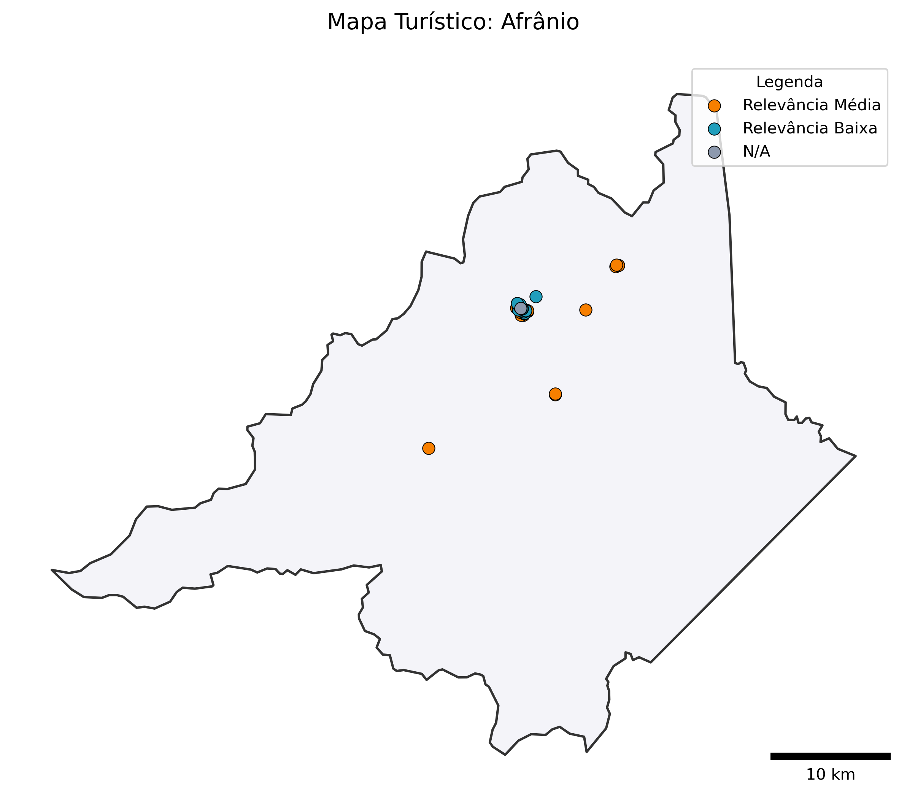
> *Figura: Distribuição geoespacial dos atrativos em Afrânio. Os pontos coloridos indicam a classificação de relevância.*

### 4.2. Araripina
**Total de Registros:** 94
**Principais Vocações:** Serviço Turístico, Infraestrutura de Apoio, Atrativo Natural

**Destaques Selecionados:**
*   **Mirante da Asa Delta** (Atrativo Natural) - Nota: 4.7 | Relevância: Alta
*   **Asa Branca Hotel** (Serviço Turístico) - Nota: 4.7 | Relevância: Alta
*   **Hotel Recanto Vip** (Serviço Turístico) - Nota: 4.5 | Relevância: Alta

**Mapa de Distribuição Espacial:**
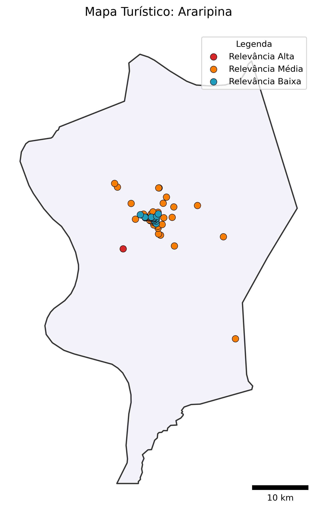
> *Figura: Distribuição geoespacial dos atrativos em Araripina. Os pontos coloridos indicam a classificação de relevância.*

### 4.3. Arcoverde
**Total de Registros:** 100
**Principais Vocações:** Serviço Turístico, Atrativo Cultural, Infraestrutura de Apoio

**Destaques Selecionados:**
*   **Serra Das Torres** (Atrativo Natural) - Nota: 4.8 | Relevância: Alta
*   **Centro de Gastronomia e Artesanato Municipal de Arcoverde** (Atrativo Cultural) - Nota: 4.7 | Relevância: Alta
*   **Hotel Cruzeiro** (Serviço Turístico) - Nota: 4.6 | Relevância: Alta

**Mapa de Distribuição Espacial:**
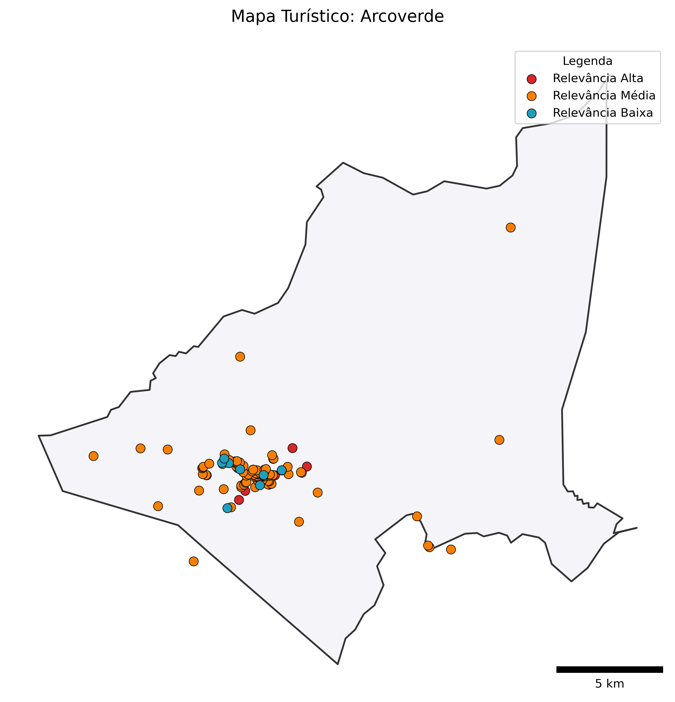
> *Figura: Distribuição geoespacial dos atrativos em Arcoverde. Os pontos coloridos indicam a classificação de relevância.*

### 4.4. Belém de S. Francisco
**Total de Registros:** 37
**Principais Vocações:** Serviço Turístico, Atrativo Cultural, Infraestrutura de Apoio

**Destaques Selecionados:**
*   **Orla do Rio São Francisco** (Atrativo Natural) - Nota: 4.6 | Relevância: Alta
*   **LIVRARIA E PAPELARIA BELÉM** (Infraestrutura de Apoio) - Nota: 4.7 | Relevância: Baixa
*   **FACESF** (Infraestrutura de Apoio) - Nota: 4.1 | Relevância: Baixa

**Mapa de Distribuição Espacial:**
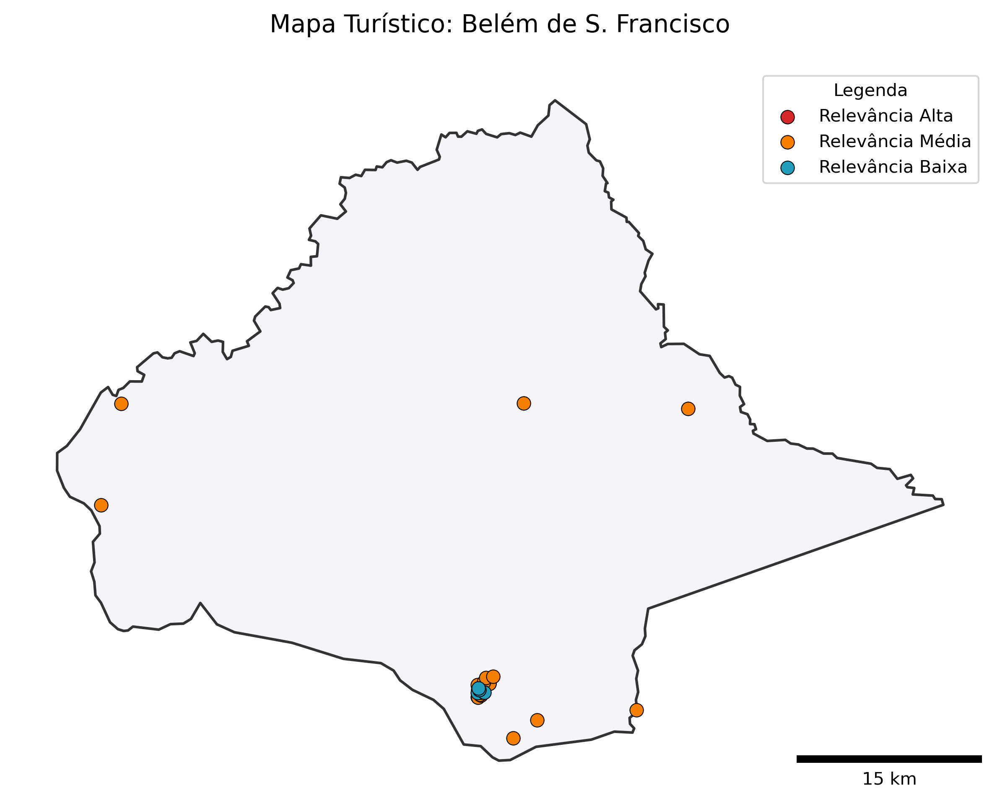
> *Figura: Distribuição geoespacial dos atrativos em Belém de S. Francisco. Os pontos coloridos indicam a classificação de relevância.*

### 4.5. Betânia
**Total de Registros:** 31
**Principais Vocações:** Atrativo Natural, Serviço Turístico, Infraestrutura de Apoio

**Destaques Selecionados:**
*   **Hotel Doce Modestina** (Serviço Turístico) - Nota: 5.0 | Relevância: Alta
*   **Betty pizzaria** (Serviço Turístico) - Nota: 4.3 | Relevância: Baixa
*   **Museu Dalila Ferreira de Souza** (Atrativo Cultural) - Nota: 5.0 | Relevância: Média

**Mapa de Distribuição Espacial:**
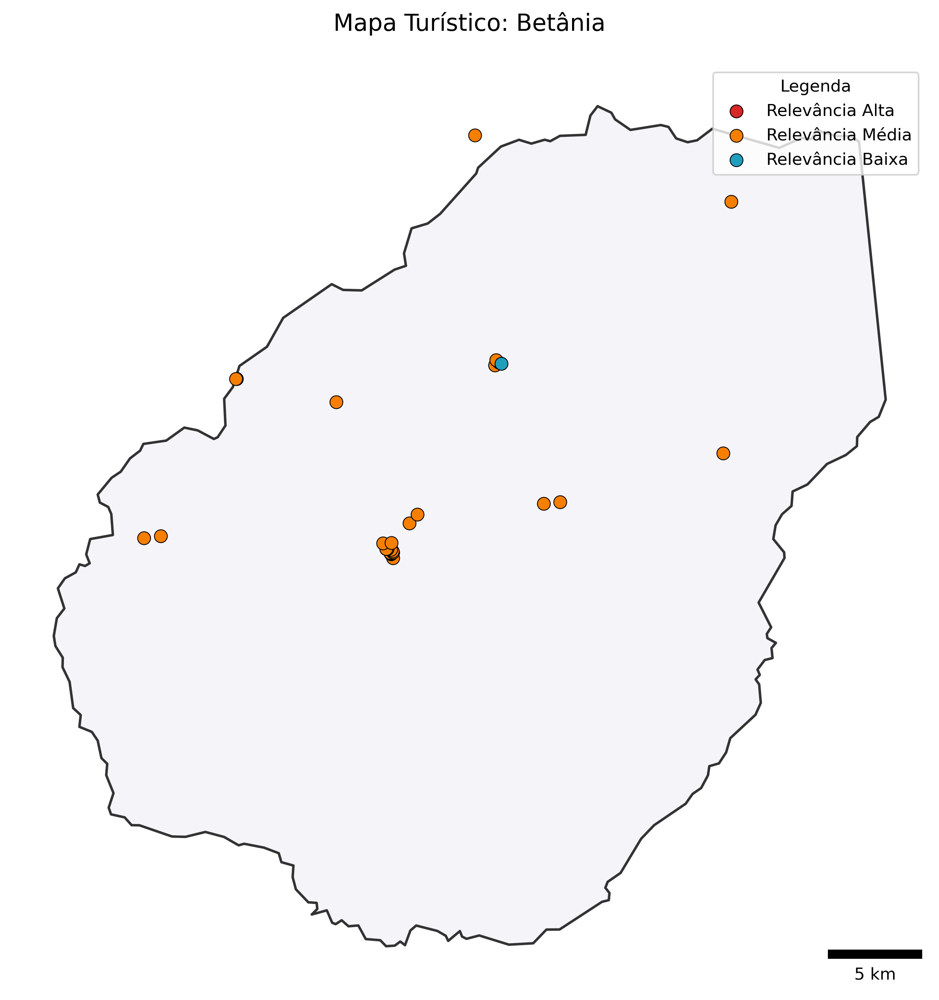
> *Figura: Distribuição geoespacial dos atrativos em Betânia. Os pontos coloridos indicam a classificação de relevância.*

### 4.6. Bodocó
**Total de Registros:** 58
**Principais Vocações:** Serviço Turístico, Infraestrutura de Apoio, Atrativo Cultural

**Destaques Selecionados:**
*   **Studio Treze Personalizados** (Serviço Turístico) - Nota: 5.0 | Relevância: Baixa
*   **A2 Bodocó** (Serviço Turístico) - Nota: 5.0 | Relevância: Baixa
*   **Roberlânia Lima conceito de beleza e bem estar** (Serviço Turístico) - Nota: 5.0 | Relevância: Baixa

**Mapa de Distribuição Espacial:**
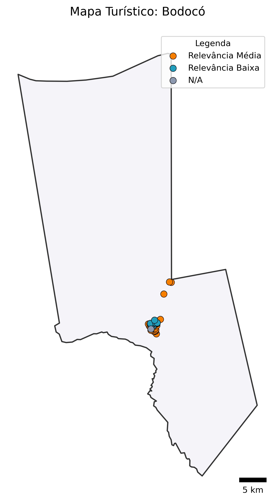
> *Figura: Distribuição geoespacial dos atrativos em Bodocó. Os pontos coloridos indicam a classificação de relevância.*

### 4.7. Cabrobó
**Total de Registros:** 38
**Principais Vocações:** Serviço Turístico, Infraestrutura de Apoio, Atrativo Cultural

**Destaques Selecionados:**
*   **RESTAURANTE E LANCHONETE VALDIVINO** (Serviço Turístico) - Nota: 3.6 | Relevância: Baixa
*   **Helo Soparia** (Serviço Turístico) - Nota: 5.0 | Relevância: Média
*   **cabrobovip** (Serviço Turístico) - Nota: 5.0 | Relevância: Média

**Mapa de Distribuição Espacial:**
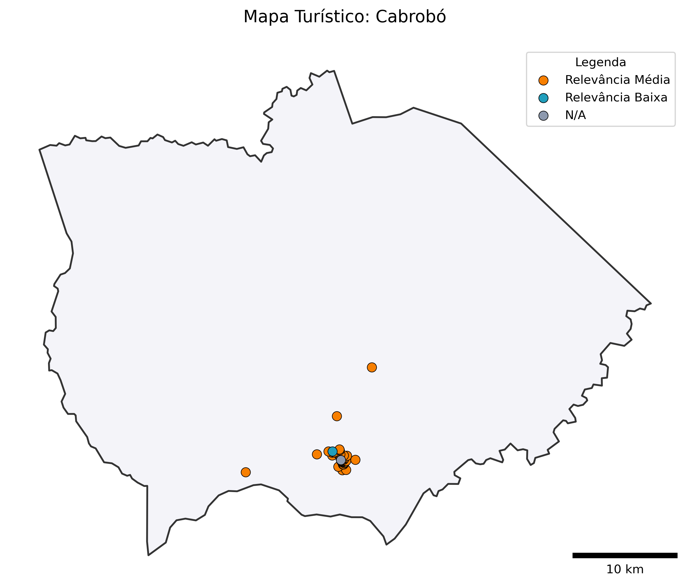
> *Figura: Distribuição geoespacial dos atrativos em Cabrobó. Os pontos coloridos indicam a classificação de relevância.*

### 4.8. Carnaubeira da Penha
**Total de Registros:** 18
**Principais Vocações:** Serviço Turístico, Atrativo Cultural, Atrativo Natural

**Destaques Selecionados:**
*   **O Rei da Pizza** (Serviço Turístico) - Nota: 5.0 | Relevância: Baixa
*   **Lanchonete Ki Sabor** (Serviço Turístico) - Nota: 5.0 | Relevância: Baixa
*   **Praça de vôlei** (Infraestrutura de Apoio) - Nota: 5.0 | Relevância: Baixa

**Mapa de Distribuição Espacial:**
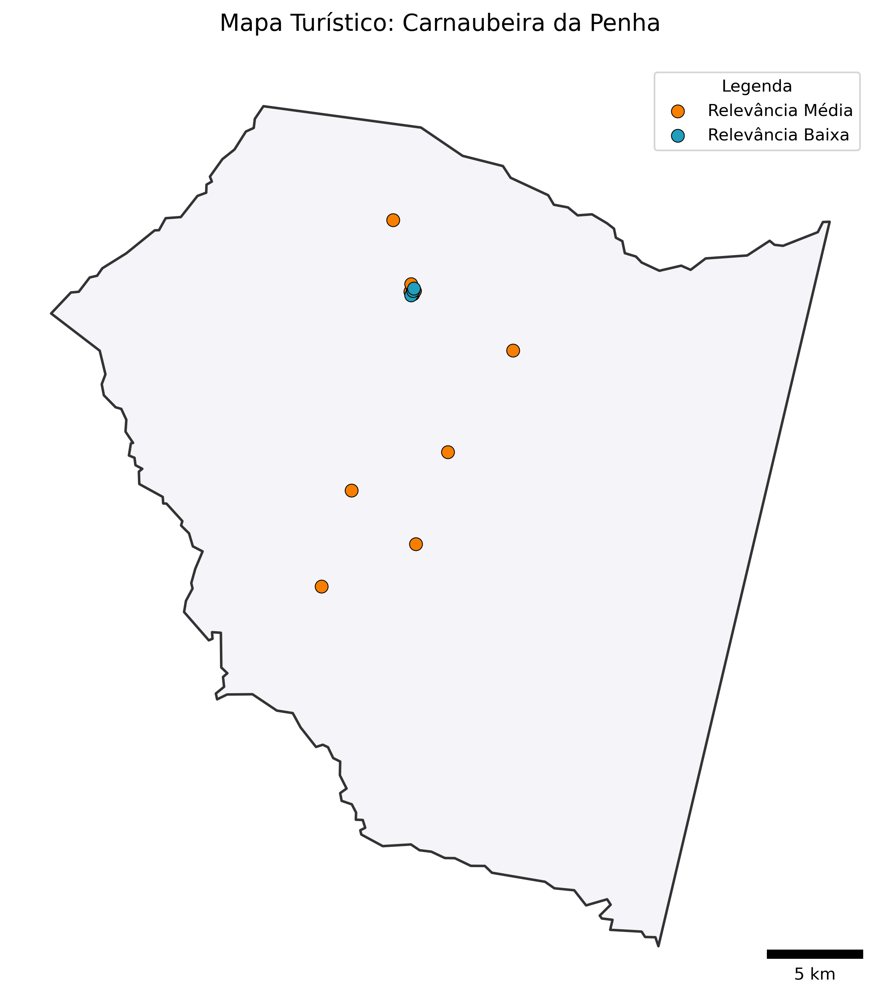
> *Figura: Distribuição geoespacial dos atrativos em Carnaubeira da Penha. Os pontos coloridos indicam a classificação de relevância.*

### 4.9. Custódia
**Total de Registros:** 64
**Principais Vocações:** Serviço Turístico, Infraestrutura de Apoio, Atrativo Natural

**Destaques Selecionados:**
*   **Mundo Fitness** (Infraestrutura de Apoio) - Nota: 5.0 | Relevância: Baixa
*   **Universo da Papelaria** (Infraestrutura de Apoio) - Nota: 5.0 | Relevância: Baixa
*   **Armarinho São Francisco** (Infraestrutura de Apoio) - Nota: 4.7 | Relevância: Baixa

**Mapa de Distribuição Espacial:**
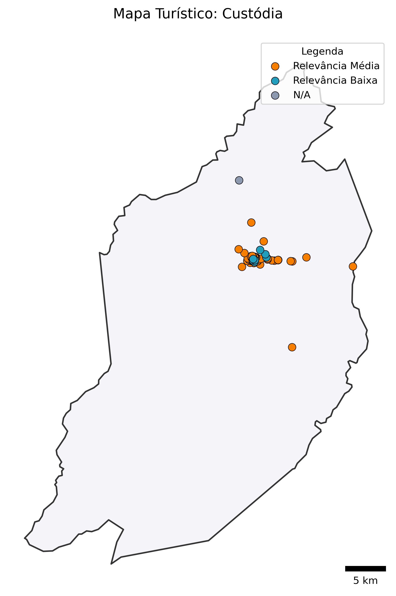
> *Figura: Distribuição geoespacial dos atrativos em Custódia. Os pontos coloridos indicam a classificação de relevância.*

### 4.10. Dormentes
**Total de Registros:** 40
**Principais Vocações:** Serviço Turístico, Atrativo Natural, Atrativo Cultural

**Destaques Selecionados:**
*   **Dindin Gourmet Dormentes** (Serviço Turístico) - Nota: 5.0 | Relevância: Baixa
*   **Ljr Smash Burguer** (Serviço Turístico) - Nota: 5.0 | Relevância: Baixa
*   **Pizzaria Tradição** (Serviço Turístico) - Nota: 3.9 | Relevância: Baixa

**Mapa de Distribuição Espacial:**
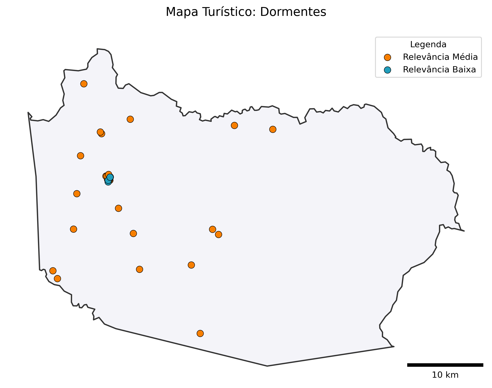
> *Figura: Distribuição geoespacial dos atrativos em Dormentes. Os pontos coloridos indicam a classificação de relevância.*

### 4.11. Exu
**Total de Registros:** 65
**Principais Vocações:** Serviço Turístico, Atrativo Natural, Atrativo Cultural

**Destaques Selecionados:**
*   **Fazenda Araripe** (Atrativo Cultural) - Nota: 4.8 | Relevância: Alta
*   **Parque Aza Branca** (Atrativo Cultural) - Nota: 4.7 | Relevância: Alta
*   **Estátua de Luiz Gonzaga** (Atrativo Cultural) - Nota: 4.6 | Relevância: Alta

**Mapa de Distribuição Espacial:**
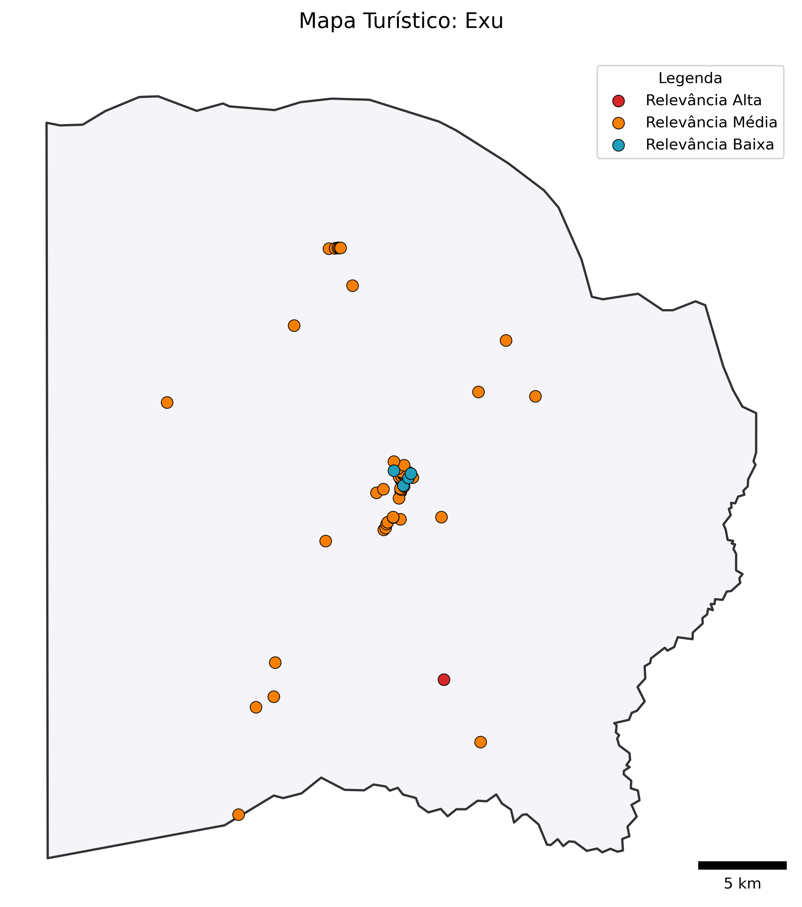
> *Figura: Distribuição geoespacial dos atrativos em Exu. Os pontos coloridos indicam a classificação de relevância.*

### 4.12. Floresta
**Total de Registros:** 64
**Principais Vocações:** Serviço Turístico, Atrativo Cultural, Infraestrutura de Apoio

**Destaques Selecionados:**
*   **Ruinas da casa de Lampião** (Atrativo Cultural) - Nota: 5.0 | Relevância: Alta
*   **Cultural John Boaideiro** (Atrativo Cultural) - Nota: 4.3 | Relevância: Alta
*   **Restaurante Estacao Do Sabor** (Serviço Turístico) - Nota: 4.3 | Relevância: Baixa

**Mapa de Distribuição Espacial:**
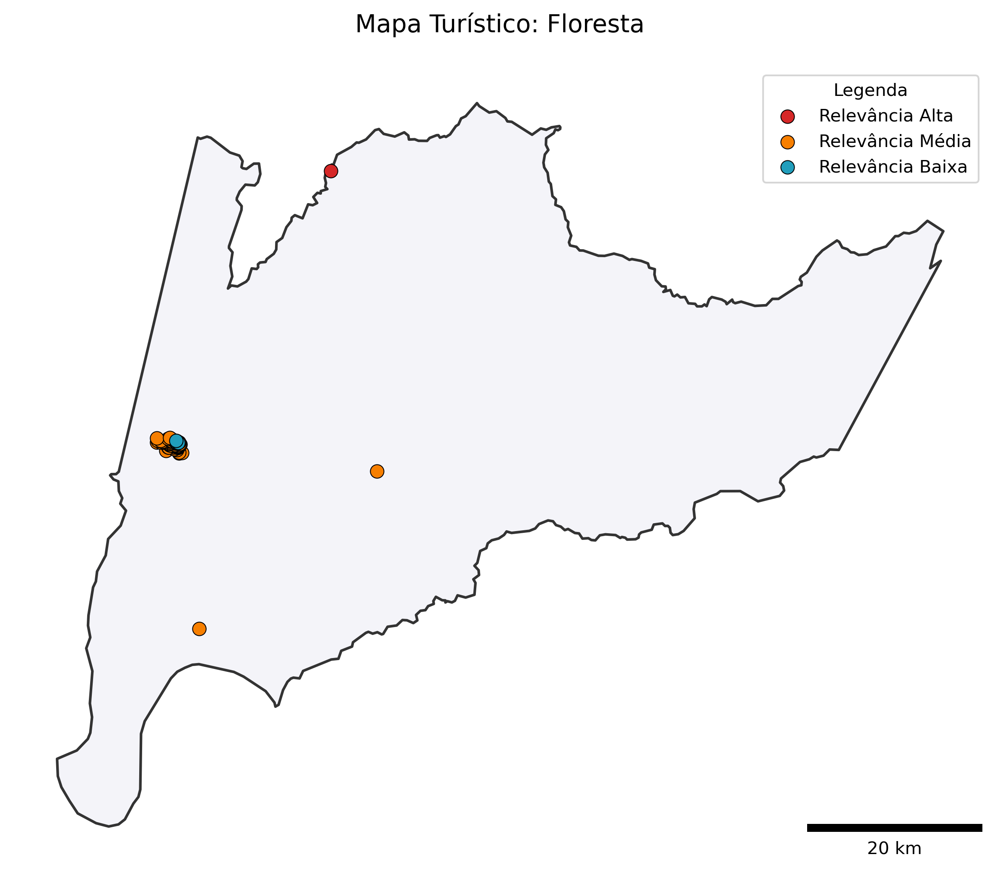
> *Figura: Distribuição geoespacial dos atrativos em Floresta. Os pontos coloridos indicam a classificação de relevância.*

### 4.13. Granito
**Total de Registros:** 31
**Principais Vocações:** Infraestrutura de Apoio, Serviço Turístico, Atrativo Cultural

**Destaques Selecionados:**
*   **Império Gourmet** (Serviço Turístico) - Nota: 5.0 | Relevância: Baixa
*   **ARENA SOCIETY GRANITO** (Serviço Turístico) - Nota: 4.0 | Relevância: Baixa
*   **Câmara Municipal de Granito** (Infraestrutura de Apoio) - Nota: 3.7 | Relevância: Baixa

**Mapa de Distribuição Espacial:**
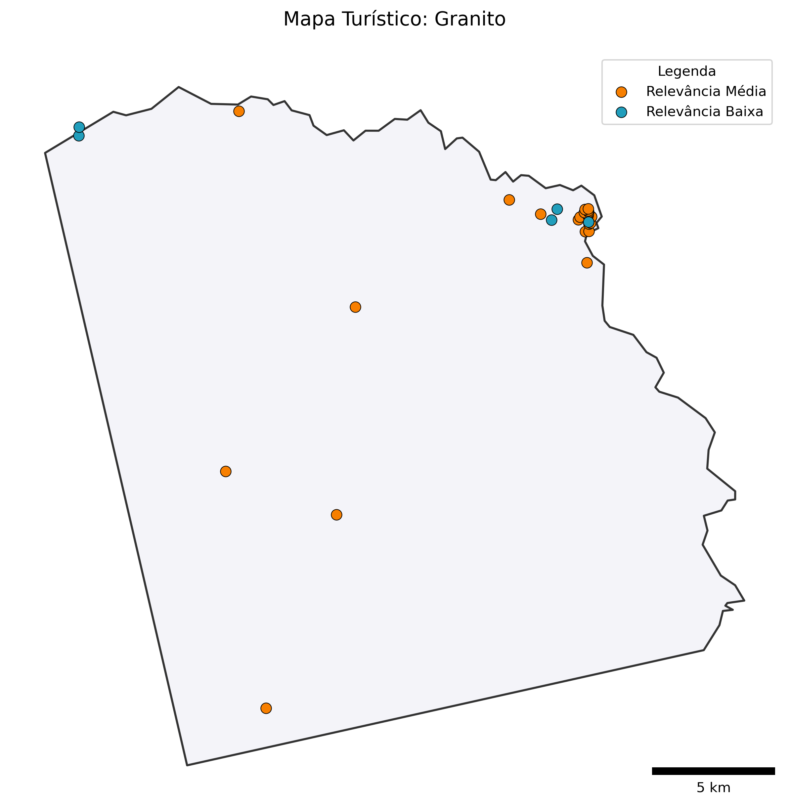
> *Figura: Distribuição geoespacial dos atrativos em Granito. Os pontos coloridos indicam a classificação de relevância.*

### 4.14. Ibimirim
**Total de Registros:** 36
**Principais Vocações:** Serviço Turístico, Infraestrutura de Apoio, Atrativo Cultural

**Destaques Selecionados:**
*   **Ki-Pastel Delivery** (Serviço Turístico) - Nota: 5.0 | Relevância: Baixa
*   **AABB Ibimirim** (Infraestrutura de Apoio) - Nota: 4.2 | Relevância: Baixa
*   **Restaurante e marmitaria dona Jane** (Serviço Turístico) - Nota: 3.5 | Relevância: Baixa

**Mapa de Distribuição Espacial:**
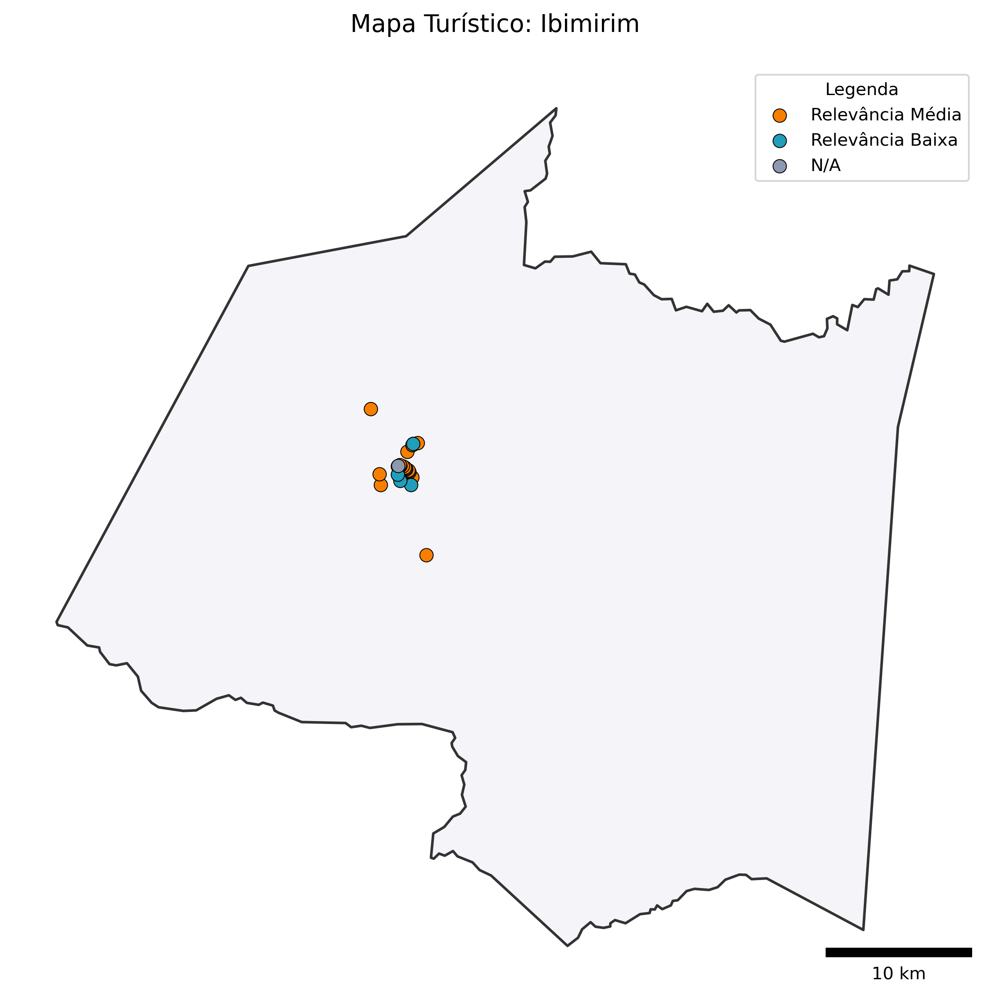
> *Figura: Distribuição geoespacial dos atrativos em Ibimirim. Os pontos coloridos indicam a classificação de relevância.*

### 4.15. Inajá
**Total de Registros:** 45
**Principais Vocações:** Serviço Turístico, Infraestrutura de Apoio, Atrativo Cultural

**Destaques Selecionados:**
*   **MS Estética** (Serviço Turístico) - Nota: 5.0 | Relevância: Baixa
*   **SEX SHOP APIMENTADAS SEX SHOP MODA ÍNTIMA E SENSUAL** (Serviço Turístico) - Nota: 5.0 | Relevância: Baixa
*   **M & A - Sacolas** (Infraestrutura de Apoio) - Nota: 5.0 | Relevância: Baixa

**Mapa de Distribuição Espacial:**
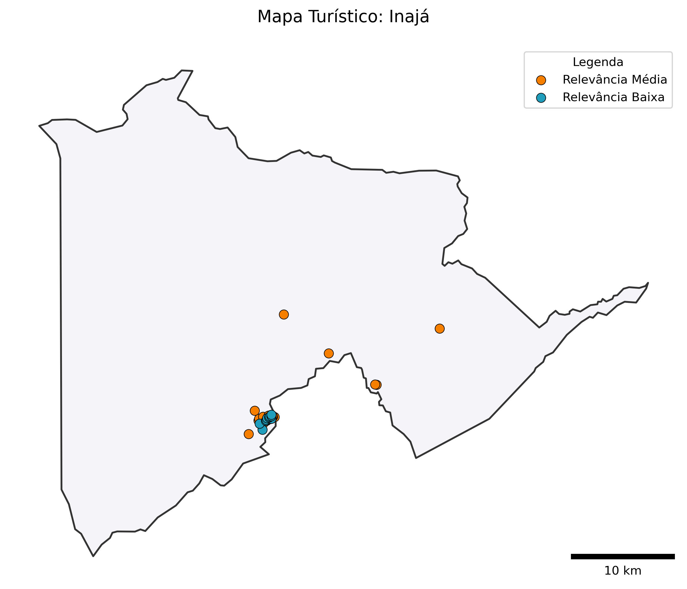
> *Figura: Distribuição geoespacial dos atrativos em Inajá. Os pontos coloridos indicam a classificação de relevância.*

### 4.16. Ipubi
**Total de Registros:** 47
**Principais Vocações:** Serviço Turístico, Infraestrutura de Apoio, Atrativo Cultural

**Destaques Selecionados:**
*   **SUPER AÇAÍ Ipubi PE** (Serviço Turístico) - Nota: 5.0 | Relevância: Baixa
*   **Papel Fest** (Infraestrutura de Apoio) - Nota: 5.0 | Relevância: Baixa
*   **Estádio Municipal O Vilão** (Infraestrutura de Apoio) - Nota: 5.0 | Relevância: Baixa

**Mapa de Distribuição Espacial:**
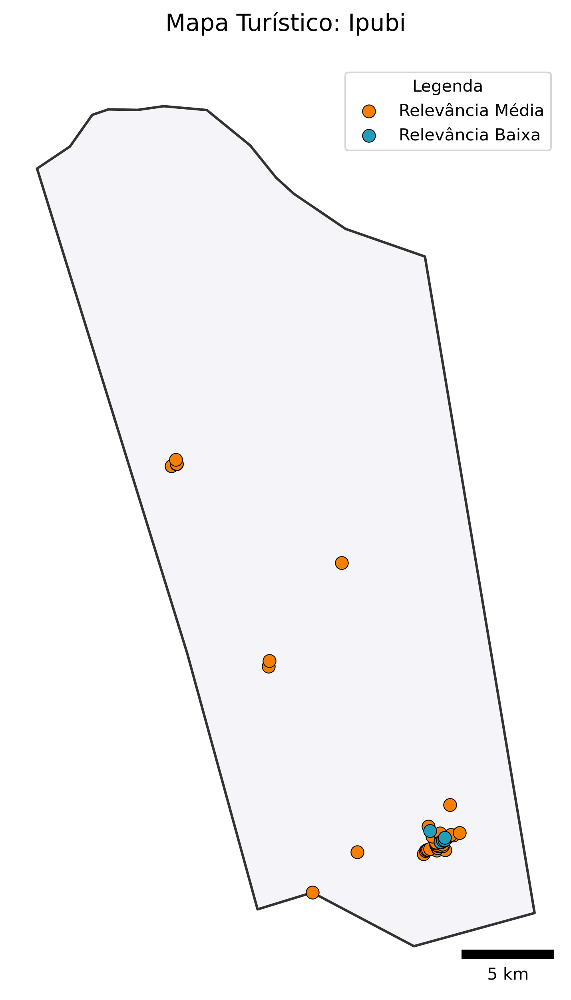
> *Figura: Distribuição geoespacial dos atrativos em Ipubi. Os pontos coloridos indicam a classificação de relevância.*

### 4.17. Itacuruba
**Total de Registros:** 11
**Principais Vocações:** Serviço Turístico, Infraestrutura de Apoio, Atrativo Cultural

**Destaques Selecionados:**
*   **Peu Burguer** (Serviço Turístico) - Nota: 5.0 | Relevância: Baixa
*   **Hambúrguer** (Serviço Turístico) - Nota: 5.0 | Relevância: Baixa
*   **Observatório Nacional de Itacuruba** (Atrativo Cultural) - Nota: 4.9 | Relevância: Média

**Mapa de Distribuição Espacial:**
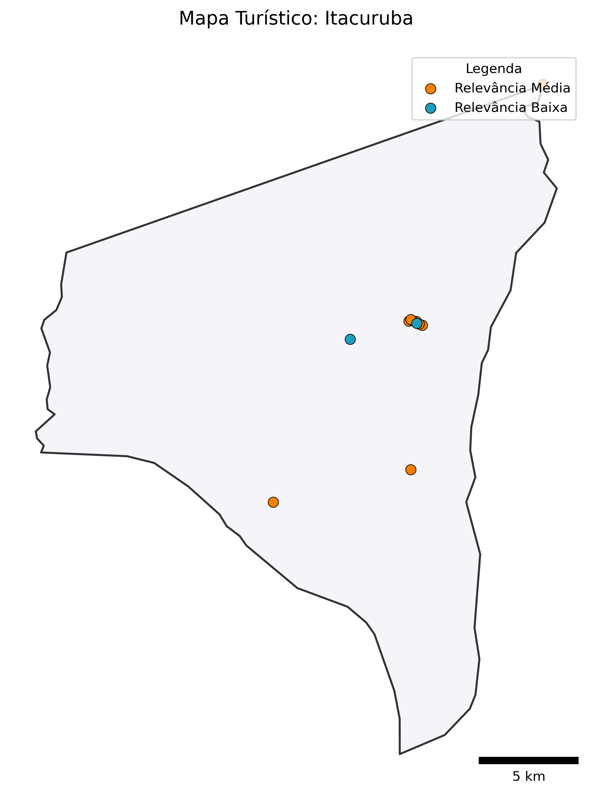
> *Figura: Distribuição geoespacial dos atrativos em Itacuruba. Os pontos coloridos indicam a classificação de relevância.*

### 4.18. Jatobá
**Total de Registros:** 44
**Principais Vocações:** Serviço Turístico, Atrativo Natural, Atrativo Cultural

**Destaques Selecionados:**
*   **Comidas da Dona Lourdes** (Serviço Turístico) - Nota: 5.0 | Relevância: Média
*   **Ponte de volta Pernambuco, Alagoas** (Infraestrutura de Apoio) - Nota: 5.0 | Relevância: Média
*   **Volta do Moxotó** (Atrativo Natural) - Nota: 5.0 | Relevância: Média

**Mapa de Distribuição Espacial:**
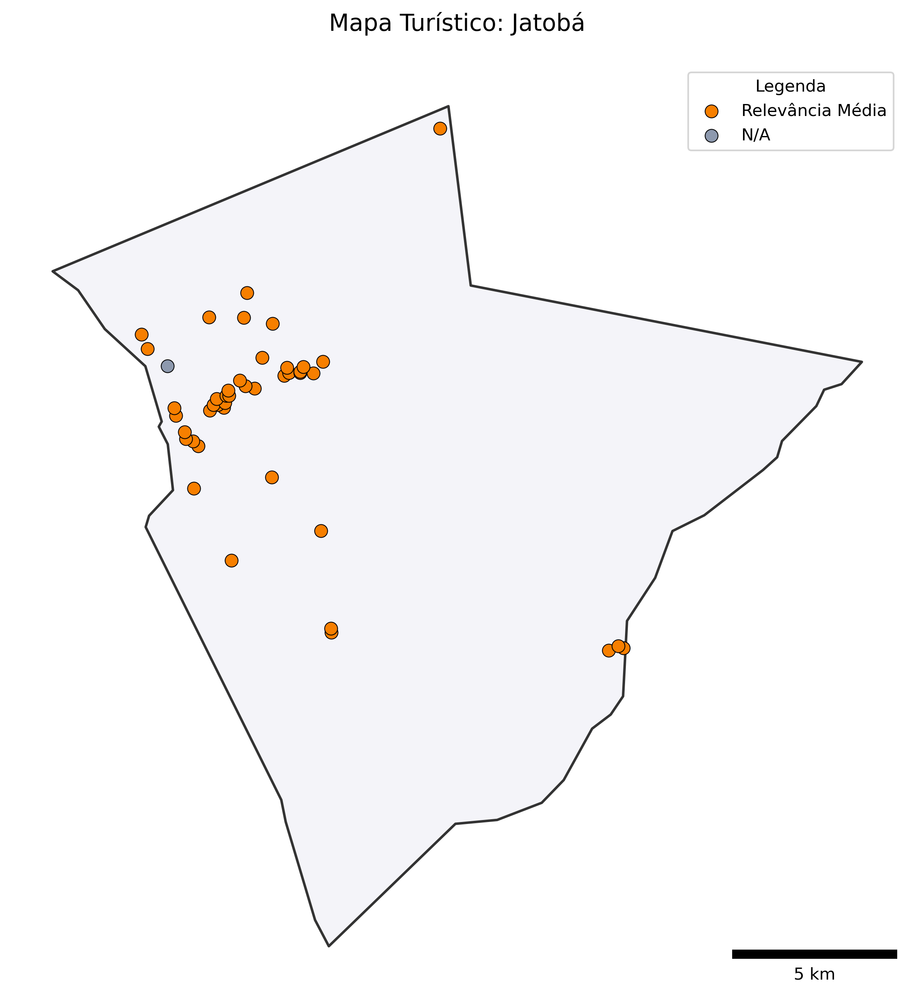
> *Figura: Distribuição geoespacial dos atrativos em Jatobá. Os pontos coloridos indicam a classificação de relevância.*

### 4.19. Lagoa Grande
**Total de Registros:** 24
**Principais Vocações:** Serviço Turístico, Atrativo Cultural, Atrativo Natural

**Destaques Selecionados:**
*   **CHURRASCARIA SABOR DA CASA LAGOA GRANDE** (Serviço Turístico) - Nota: 5.0 | Relevância: Média
*   **Hotel Fazenda Vale dos Reis** (Serviço Turístico) - Nota: 5.0 | Relevância: Média
*   **Monumento da Cidade - Lagoa Grande, Pernambuco** (Atrativo Cultural) - Nota: 5.0 | Relevância: Média

**Mapa de Distribuição Espacial:**
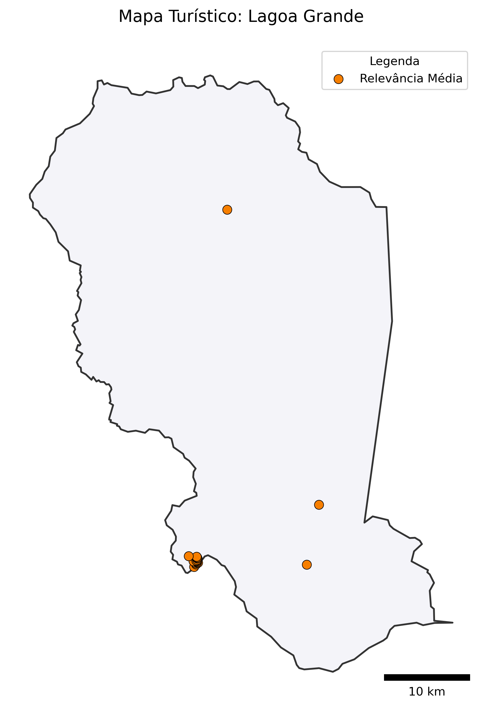
> *Figura: Distribuição geoespacial dos atrativos em Lagoa Grande. Os pontos coloridos indicam a classificação de relevância.*

### 4.20. Manari
**Total de Registros:** 21
**Principais Vocações:** Serviço Turístico, Atrativo Cultural, Infraestrutura de Apoio

**Destaques Selecionados:**
*   **Cartório do Registro Civil e Tabelionato de Manari** (Infraestrutura de Apoio) - Nota: 4.0 | Relevância: Baixa
*   **Tapioca da Dona Ana** (Serviço Turístico) - Nota: 5.0 | Relevância: Média
*   **Biblioteca Pública de Manari** (Atrativo Cultural) - Nota: 5.0 | Relevância: Média

**Mapa de Distribuição Espacial:**
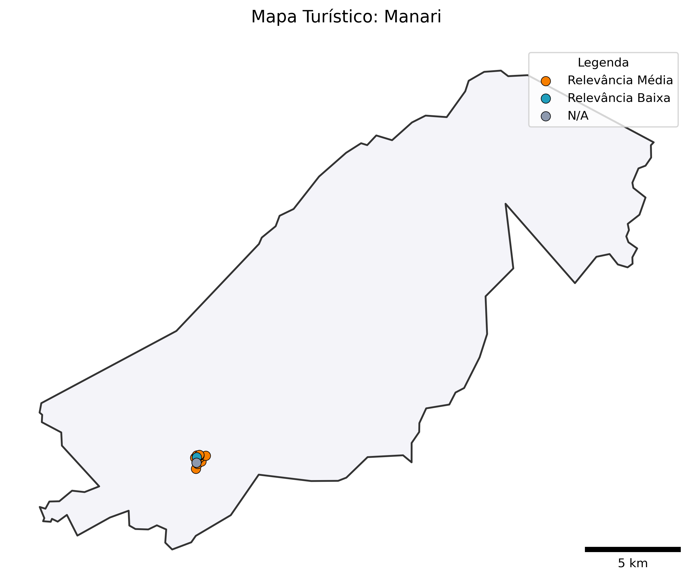
> *Figura: Distribuição geoespacial dos atrativos em Manari. Os pontos coloridos indicam a classificação de relevância.*

### 4.21. Moreilândia
**Total de Registros:** 35
**Principais Vocações:** Serviço Turístico, Infraestrutura de Apoio, Atrativo Cultural

**Destaques Selecionados:**
*   **PIZZARIA _IMPÉRIO 10** (Serviço Turístico) - Nota: 5.0 | Relevância: Baixa
*   **Ginásio Poliesportivo de Moreilândia** (Infraestrutura de Apoio) - Nota: 5.0 | Relevância: Baixa
*   **(((MARMITEX POPULAR)))** (Serviço Turístico) - Nota: nan | Relevância: Baixa

**Mapa de Distribuição Espacial:**
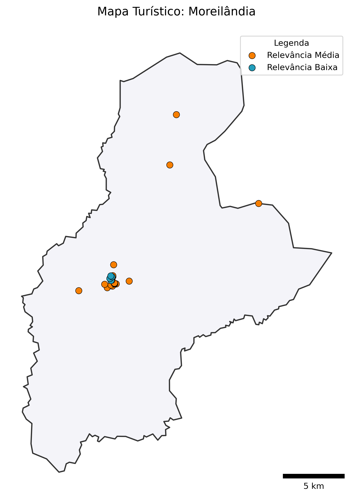
> *Figura: Distribuição geoespacial dos atrativos em Moreilândia. Os pontos coloridos indicam a classificação de relevância.*

### 4.22. Orocó
**Total de Registros:** 36
**Principais Vocações:** Serviço Turístico, Infraestrutura de Apoio, Atrativo Natural

**Destaques Selecionados:**
*   **ACADEMIA AÇÃO E MOVIMENTO** (Infraestrutura de Apoio) - Nota: 5.0 | Relevância: Baixa
*   **Bar do Tibério** (Serviço Turístico) - Nota: 4.3 | Relevância: Baixa
*   **Ceasa umburana** (Infraestrutura de Apoio) - Nota: 4.0 | Relevância: Baixa

**Mapa de Distribuição Espacial:**
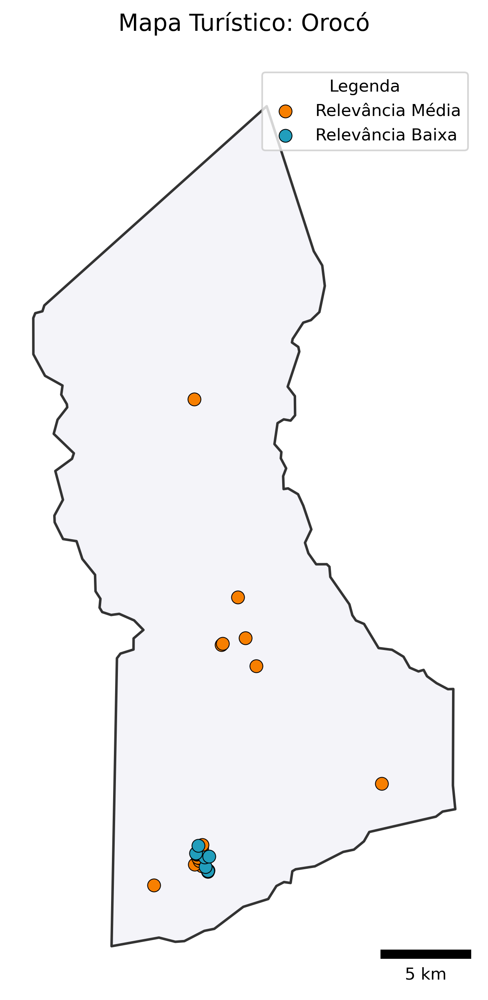
> *Figura: Distribuição geoespacial dos atrativos em Orocó. Os pontos coloridos indicam a classificação de relevância.*

### 4.23. Ouricuri
**Total de Registros:** 78
**Principais Vocações:** Serviço Turístico, Infraestrutura de Apoio, Atrativo Cultural

**Destaques Selecionados:**
*   **Pousada O Coxixo** (Serviço Turístico) - Nota: 4.9 | Relevância: Alta
*   **Estátua Frei Damião Do Araripe** (Atrativo Cultural) - Nota: 4.9 | Relevância: Alta
*   **Policlínica Helena Barreto Alencar** (Infraestrutura de Apoio) - Nota: 5.0 | Relevância: Baixa

**Mapa de Distribuição Espacial:**
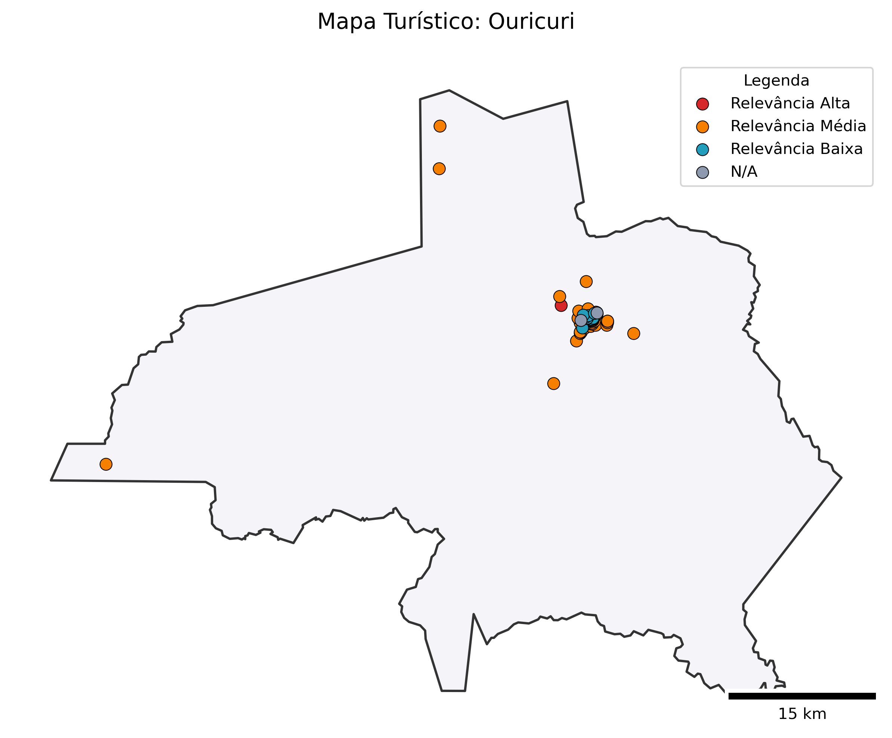
> *Figura: Distribuição geoespacial dos atrativos em Ouricuri. Os pontos coloridos indicam a classificação de relevância.*

### 4.24. Petrolina
**Total de Registros:** 132
**Principais Vocações:** Serviço Turístico, Hospedagem, Atrativo Cultural

**Destaques Selecionados:**
*   **Náutica São Francisco passeio de lancha** (Atrativo Natural) - Nota: 5.0 | Relevância: Alta
*   **Passeio de catamarã Petrolina** (Serviço Turístico) - Nota: 5.0 | Relevância: Alta
*   **Totem Bem Vindo a Petrolina** (Marco Arquitetônico/Ponto Turístico) - Nota: 5.0 | Relevância: Alta

**Mapa de Distribuição Espacial:**
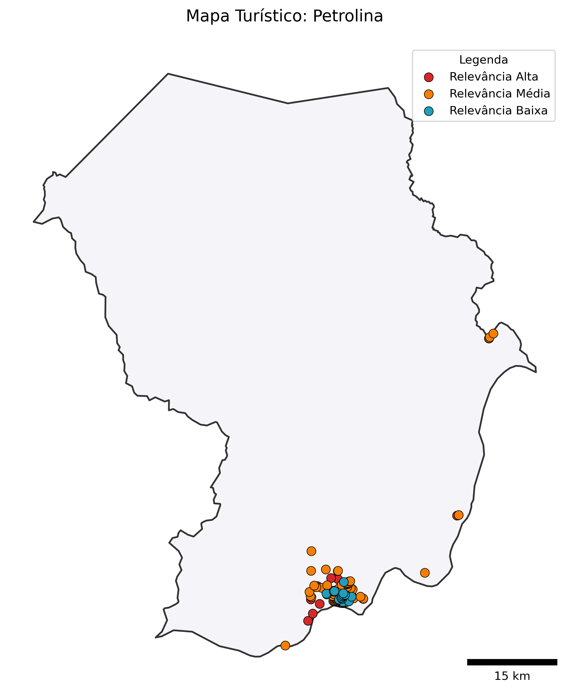
> *Figura: Distribuição geoespacial dos atrativos em Petrolina. Os pontos coloridos indicam a classificação de relevância.*

### 4.25. Petrolândia
**Total de Registros:** 55
**Principais Vocações:** Serviço Turístico, Atrativo Natural, Infraestrutura de Apoio

**Destaques Selecionados:**
*   **Pousada Aconchego da Roça** (Serviço Turístico) - Nota: 5.0 | Relevância: Alta
*   **Igreja Submersa do Sagrado Coração de Jesus** (Atrativo Cultural) - Nota: 4.8 | Relevância: Alta
*   **Rio Hotel - Petrolândia** (Serviço Turístico) - Nota: 4.7 | Relevância: Alta

**Mapa de Distribuição Espacial:**
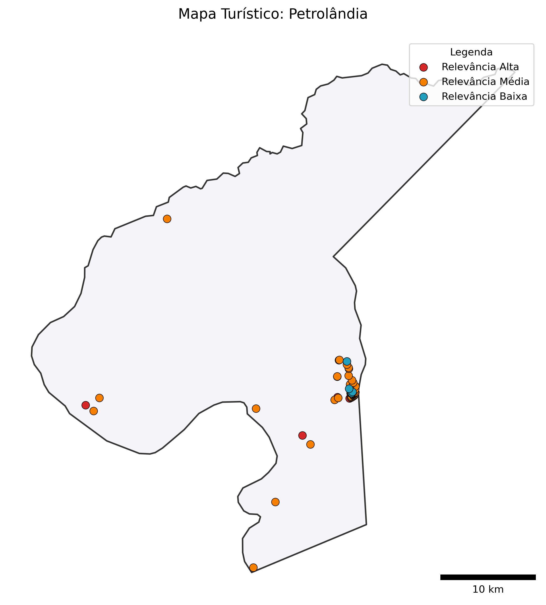
> *Figura: Distribuição geoespacial dos atrativos em Petrolândia. Os pontos coloridos indicam a classificação de relevância.*

### 4.26. Santa Cruz
**Total de Registros:** 7
**Principais Vocações:** Serviço Turístico, Atrativo Natural, Atrativo Cultural

**Destaques Selecionados:**
*   **Parque Dona Izaura** (Atrativo Natural) - Nota: 5.0 | Relevância: Média
*   **Restaurante altas horas** (Serviço Turístico) - Nota: 5.0 | Relevância: Média
*   **CHURRASCARIA BOI NA BRASA** (Serviço Turístico) - Nota: 4.7 | Relevância: Média

**Mapa de Distribuição Espacial:**
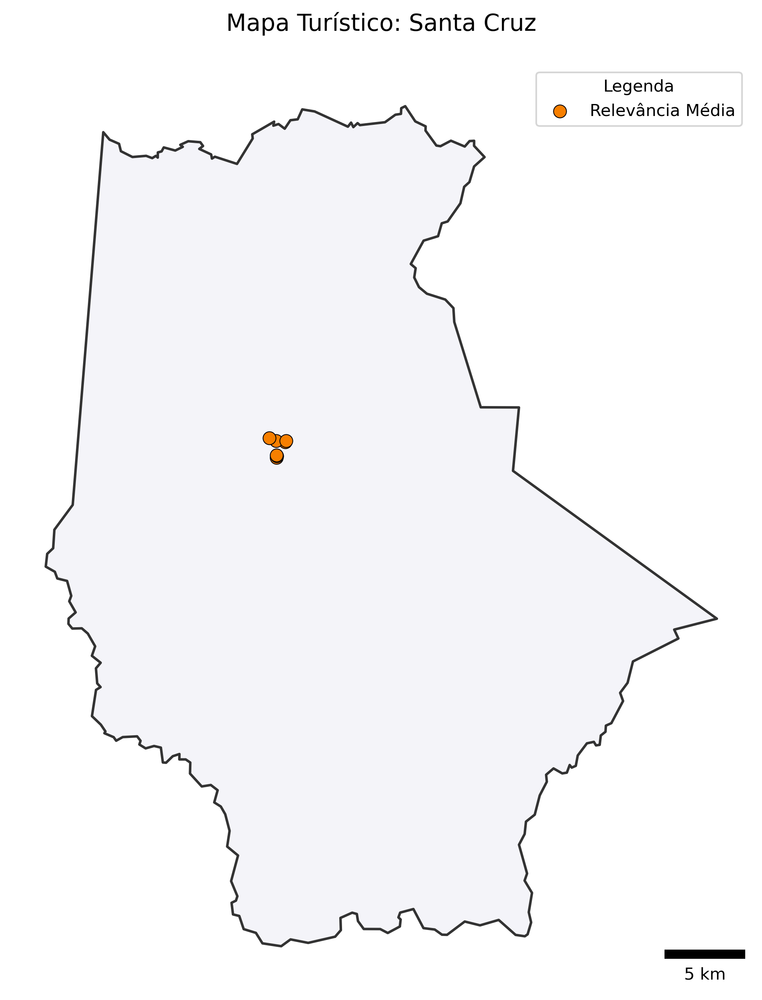
> *Figura: Distribuição geoespacial dos atrativos em Santa Cruz. Os pontos coloridos indicam a classificação de relevância.*

### 4.27. Santa Filomena
**Total de Registros:** 35
**Principais Vocações:** Serviço Turístico, Atrativo Natural, Infraestrutura de Apoio

**Destaques Selecionados:**
*   **Dedim** (Serviço Turístico) - Nota: 5.0 | Relevância: Baixa
*   **Sítio Vovó Maria** (Atrativo Natural) - Nota: 5.0 | Relevância: Média
*   **Barragem De Juscelio** (Atrativo Natural) - Nota: 5.0 | Relevância: Média

**Mapa de Distribuição Espacial:**
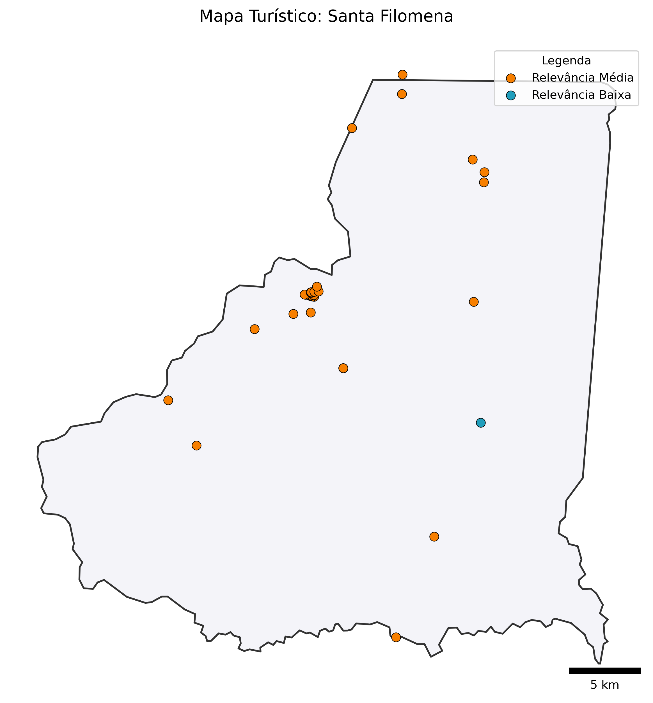
> *Figura: Distribuição geoespacial dos atrativos em Santa Filomena. Os pontos coloridos indicam a classificação de relevância.*

### 4.28. Santa Maria da Boa Vista
**Total de Registros:** 42
**Principais Vocações:** Serviço Turístico, Atrativo Cultural, Atrativo Natural

**Destaques Selecionados:**
*   **Poste Grande - Serenata da Recordação Festa Tradicional** (Atrativo Cultural) - Nota: 4.9 | Relevância: Alta
*   **Orla Municipal** (Atrativo Natural) - Nota: 4.4 | Relevância: Alta
*   **Forno da Praça** (Serviço Turístico) - Nota: 4.3 | Relevância: Baixa

**Mapa de Distribuição Espacial:**
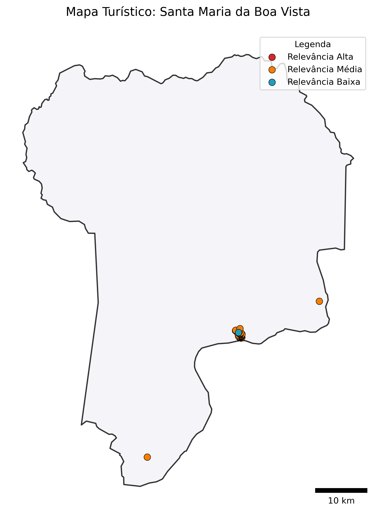
> *Figura: Distribuição geoespacial dos atrativos em Santa Maria da Boa Vista. Os pontos coloridos indicam a classificação de relevância.*

### 4.29. Sertânia
**Total de Registros:** 64
**Principais Vocações:** Serviço Turístico, Atrativo Cultural, Infraestrutura de Apoio

**Destaques Selecionados:**
*   **Ecoparque Oasis Nordestino** (Atrativo Natural) - Nota: 4.8 | Relevância: Alta
*   **Skate parque Sertânia** (Infraestrutura de Apoio) - Nota: 5.0 | Relevância: Baixa
*   **Centro Médico Maria Guedes de Lima** (Infraestrutura de Apoio) - Nota: 5.0 | Relevância: Baixa

**Mapa de Distribuição Espacial:**
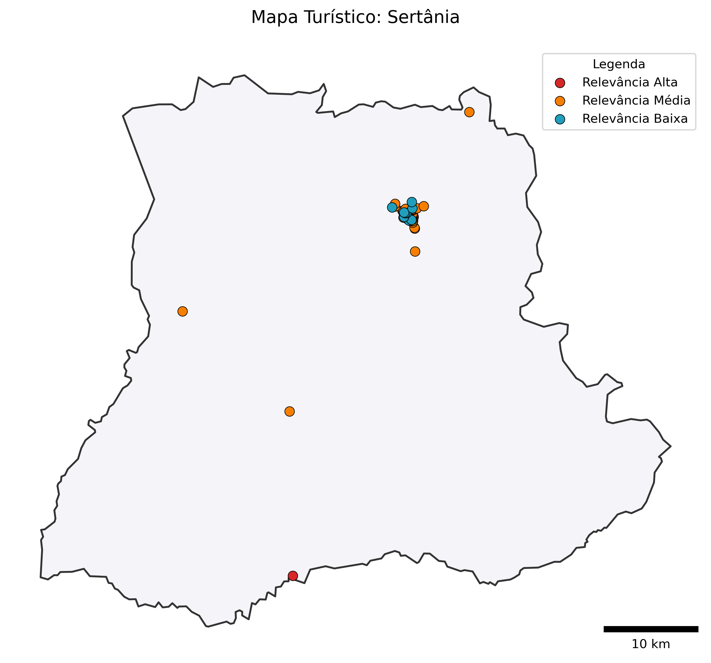
> *Figura: Distribuição geoespacial dos atrativos em Sertânia. Os pontos coloridos indicam a classificação de relevância.*

### 4.30. Tacaratu
**Total de Registros:** 55
**Principais Vocações:** Serviço Turístico, Atrativo Cultural, Atrativo Natural

**Destaques Selecionados:**
*   **Cooperativa dos Artesãos Têxteis de Tacaratu** (Atrativo Cultural) - Nota: 4.8 | Relevância: Alta
*   **MASTER BURGUER** (Serviço Turístico) - Nota: 5.0 | Relevância: Baixa
*   **Centro Tacaratuense de Assistencia Social** (Infraestrutura de Apoio) - Nota: 4.6 | Relevância: Baixa

**Mapa de Distribuição Espacial:**
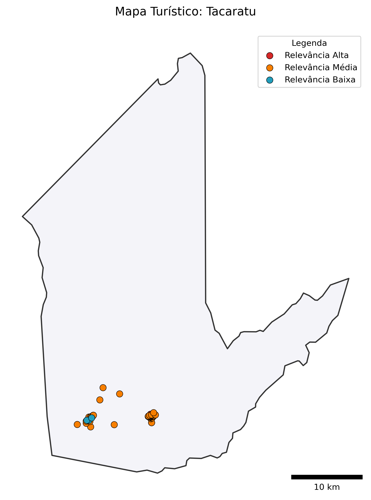
> *Figura: Distribuição geoespacial dos atrativos em Tacaratu. Os pontos coloridos indicam a classificação de relevância.*

### 4.31. Trindade
**Total de Registros:** 53
**Principais Vocações:** Serviço Turístico, Infraestrutura de Apoio, Atrativo Cultural

**Destaques Selecionados:**
*   **Naju Turismo - Agência de Viagens em Trindade** (Serviço Turístico) - Nota: 5.0 | Relevância: Alta
*   **Clínica Supera Saúde** (Infraestrutura de Apoio) - Nota: 5.0 | Relevância: Baixa
*   **Hospital Municipal Maria Veneri** (Infraestrutura de Apoio) - Nota: 5.0 | Relevância: Baixa

**Mapa de Distribuição Espacial:**
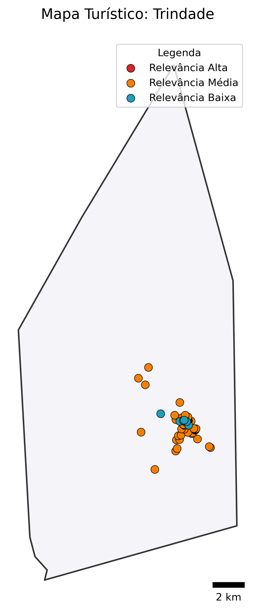
> *Figura: Distribuição geoespacial dos atrativos em Trindade. Os pontos coloridos indicam a classificação de relevância.*

## 5. ANÁLISE DE DISTRIBUIÇÃO GEOGRÁFICA (CONTEXTO ESTADUAL)
A espacialização dos dados permite identificar clusters de desenvolvimento turístico e vazios assistenciais.

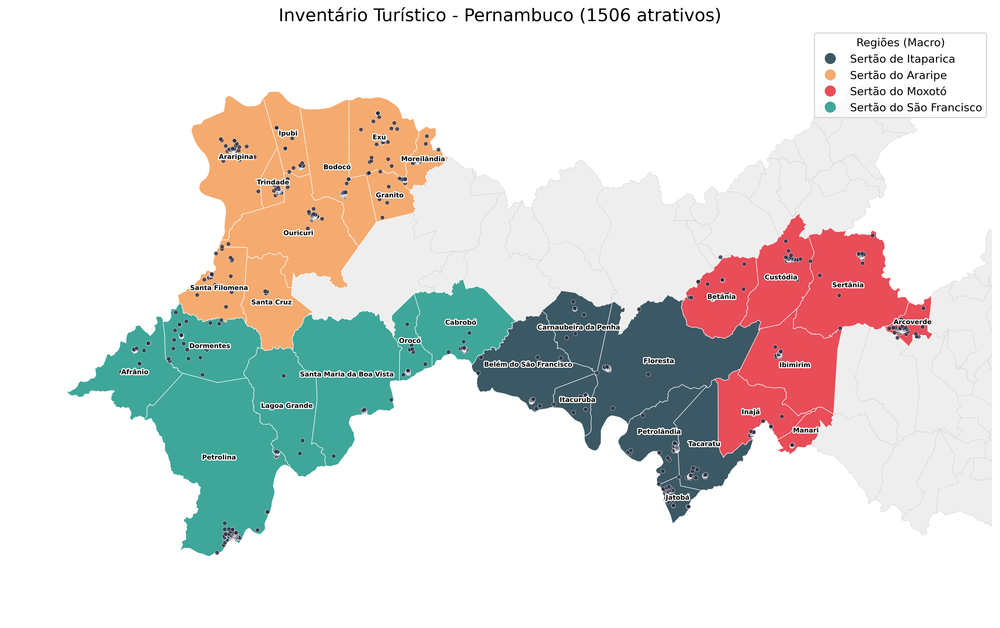

**Parecer Técnico sobre a Distribuição:**
1.  **Adensamento no Vale do São Francisco:** Observa-se uma alta concentração de equipamentos na região de Petrolina e entorno, refletindo a maturidade do Enoturismo e Turismo de Negócios.
2.  **Potencial do Araripe:** A região do Araripe apresenta uma distribuição mais difusa, sugerindo a necessidade de roteirização integrada para fortalecer o destino.
3.  **Vazios de Dados:** Municípios com baixa densidade de pontos validados podem indicar ou uma incipiente oferta turística ou a necessidade de busca ativa mais intensiva na Etapa 3 (Visitas In Loco).

## 6. CONCLUSÃO DA ETAPA 2
A consolidação dos dados da Etapa 2 demonstra que o inventário atingiu um nível de maturidade satisfatório para subsidiar o planejamento das visitas in loco.
Com um total de **1506 atrativos qualificados**, a base de dados (Anexo I - CSV) e o acervo cartográfico (Anexo II - Mapas) cumprem os requisitos de diagnóstico preliminar.

**Encaminhamentos para Etapa 3:**
*   Priorizar a verificação in loco dos 63 atrativos classificados como de 'Alta Relevância'.
*   Sanear as pendências de geolocalização fina identificadas nos mapas municipais (pontos limítrofes).
*   Coletar material fotográfico oficial para enriquecimento final do inventário.