### Proposta de Estrutura do Relatório

#### Mapa Mental da Estrutura

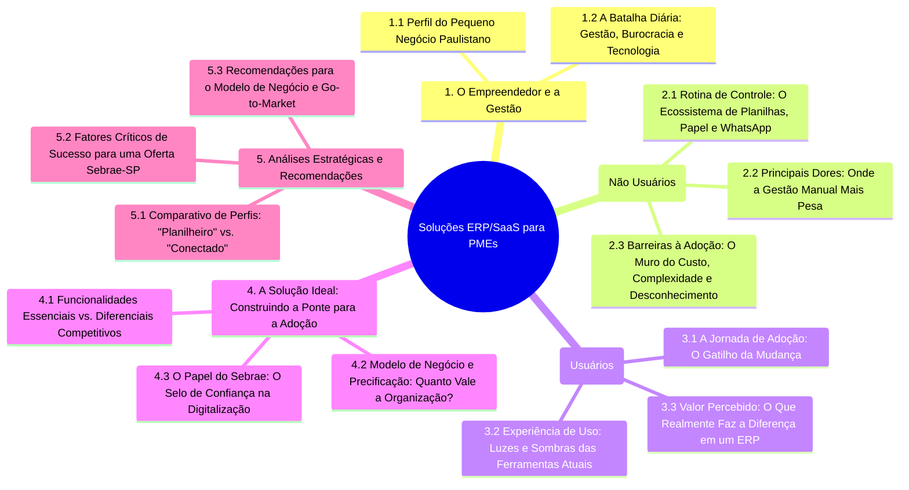
```mermaid
mindmap
  root((Soluções ERP/SaaS para PMEs))
    1. O Empreendedor e a Gestão
      ::icon(fa fa-user-tie)
      1.1 Perfil do Pequeno Negócio Paulistano
      1.2 A Batalha Diária: Gestão, Burocracia e Tecnologia
    2. O Mundo Sem Sistema: O "Gestor Planilheiro" (Não Usuários)
      ::icon(fa fa-calculator)
      2.1 Rotina de Controle: O Ecossistema de Planilhas, Papel e WhatsApp
      2.2 Principais Dores: Onde a Gestão Manual Mais Pesa
      2.3 Barreiras à Adoção: O Muro do Custo, Complexidade e Desconhecimento
    3. O Mundo Com Sistema: O "Gestor Conectado" (Usuários)
      ::icon(fa fa-cogs)
      3.1 A Jornada de Adoção: O Gatilho da Mudança
      3.2 Experiência de Uso: Luzes e Sombras das Ferramentas Atuais
      3.3 Valor Percebido: O Que Realmente Faz a Diferença em um ERP
    4. A Solução Ideal: Construindo a Ponte para a Adoção
      ::icon(fa fa-lightbulb)
      4.1 Funcionalidades Essenciais vs. Diferenciais Competitivos
      4.2 Modelo de Negócio e Precificação: Quanto Vale a Organização?
      4.3 O Papel do Sebrae: O Selo de Confiança na Digitalização
    5. Análises Estratégicas e Recomendações
      ::icon(fa fa-bullseye)
      5.1 Comparativo de Perfis: "Planilheiro" vs. "Conectado"
      5.2 Fatores Críticos de Sucesso para uma Oferta Sebrae-SP
      5.3 Recomendações para o Modelo de Negócio e Go-to-Market
```

### Índice Detalhado

# 1.0 O Empreendedor e a Gestão

### Síntese

O pequeno empreendedor vive uma dualidade fundamental: ele é um especialista apaixonado pelo seu ofício, mas um generalista forçado na gestão do seu negócio. Essa tensão entre a paixão de "fazer" e a obrigação de "gerir" consome seu tempo e energia, posicionando a burocracia e a administração como os principais vilões de sua jornada.

-----

### Análise Detalhada

  - **Paixão pelo Ofício vs. Dor da Gestão:** A energia e a motivação do empreendedor vêm da execução de sua atividade principal — seja criar um produto, vender ou prestar um serviço. Em contrapartida, as tarefas de gestão (financeiro, fiscal, estoque) são vistas como um "mal necessário", uma fonte de estresse e sobrecarga que drena a paixão e o foco do que realmente importa para o crescimento do negócio.
  - **Tecnologia: A Promessa Distante:** Há um reconhecimento quase universal de que a tecnologia pode otimizar a gestão. Contudo, ela é percebida com ambivalência: ao mesmo tempo que promete organização e eficiência, também representa uma ameaça de maior complexidade, custos e uma curva de aprendizado para a qual o empreendedor sente que não tem tempo.

> **Voz do Cliente:**
> "Eu amo o que eu faço, de verdade. Mas se eu pudesse pagar alguém só pra nunca mais ter que olhar pra uma nota fiscal ou uma planilha de fluxo de caixa, eu pagava feliz. É a parte que suga a alma da gente."
> -- *Participante, Grupo de Usuários*

### Visualização dos Conceitos

Este mapa de conceitos ilustra a dualidade central que define a rotina do empreendedor.

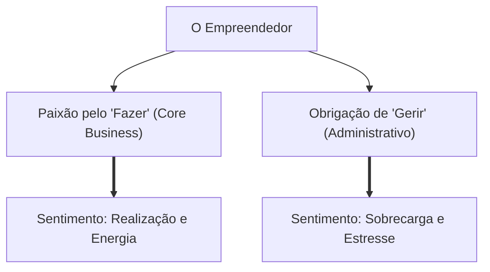
```mermaid
graph TD
  A["O Empreendedor"] --> B["Paixão pelo 'Fazer' (Core Business)"]
  A --> C["Obrigação de 'Gerir' (Administrativo)"]
  B ==> D["Sentimento: Realização e Energia"]
  C ==> E["Sentimento: Sobrecarga e Estresse"]
```

### Implicações

**[Insight Inferido]:** A principal oportunidade para uma solução ERP não é apenas oferecer funcionalidades, mas sim "vender tempo e paz de espírito". A comunicação e o produto devem ser projetados para minimizar a percepção de complexidade e maximizar a sensação de alívio imediato, permitindo que o empreendedor se dedique mais à sua paixão e menos à sua dor.

-----

Deseja um aprofundamento com um Mapa da Jornada Emocional do Empreendedor, detalhando os picos de estresse e satisfação na sua rotina de gestão? Aguardo seu comando para o próximo tema.

# 1.1 Perfil do Pequeno Negócio Paulistano

### Síntese

O perfil do pequeno negócio é indissociável da figura do seu dono, operando sob o lema "o negócio sou eu". Esta identidade fusionada resulta em um gestor centralizador, que acumula todas as funções por necessidade, vivendo em um estado de "sobrevivência otimista": apaixonado pelo que faz, mas perpetuamente reagindo às urgências do dia a dia, com pouquíssimo espaço para o planejamento estratégico.

-----

### Análise Detalhada

  - **O Negócio Sou Eu:** A principal característica identificada é a ausência de fronteiras entre o indivíduo e a empresa. O empreendedor é, simultaneamente, o estrategista, o operacional, o vendedor e o financeiro. Essa centralização total de tarefas cria uma agilidade única, mas também gera uma sobrecarga extrema, tornando o tempo o ativo mais escasso e valioso do negócio.
  - **Sobrevivência Otimista:** Os participantes demonstram grande resiliência e paixão, mas a gestão é predominantemente reativa. As decisões são tomadas para "apagar incêndios" e garantir a operação do dia seguinte. O planejamento de longo prazo é um luxo raramente acessível, e ferramentas de gestão são avaliadas não por seu potencial estratégico, mas por sua capacidade de resolver um problema imediato com o mínimo de esforço.

> **Voz do Cliente:**
> "Eu sou o cara que compra, que vende, que entrega, que limpa o chão e que fecha o caixa. Se eu parar pra pensar em planilha, eu não vendo. E se eu não vender, não tem nem porquê ter planilha."
> -- *Participante, Grupo de Não Usuários*

### Visualização dos Conceitos

Este mapa de conceitos ilustra como a identidade do empreendedor está conectada à sua sobrecarga operacional e à sua resiliência.

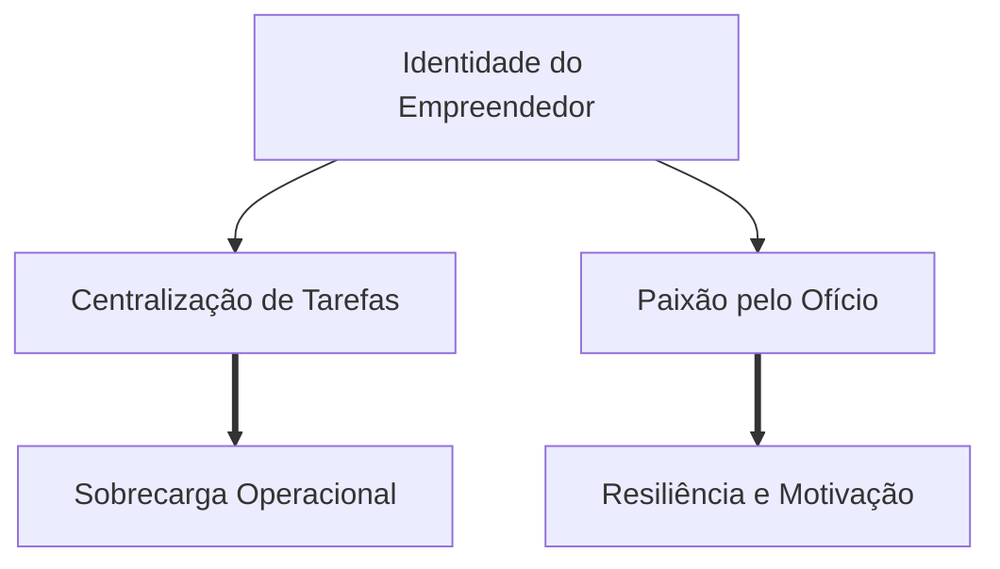
```mermaid
graph TD;
  A["Identidade do Empreendedor"] --> B["Centralização de Tarefas"]
  A --> C["Paixão pelo Ofício"]
  B ==> D["Sobrecarga Operacional"]
  C ==> E["Resiliência e Motivação"]
```

### Implicações

**[Insight Inferido]:** Qualquer solução de tecnologia destinada a este público não pode se posicionar como "mais uma tarefa a ser gerenciada". A proposta de valor deve ser centrada na devolução de tempo e na simplificação radical de processos. A complexidade é o principal inimigo, e a percepção de alívio imediato é o maior gatilho para a adoção.

-----

## Aprofundamento: Persona do "Gestor Centralizador"

### Persona 1: Juliana, a Especialista Apaixonada

  * **Foto/Arquétipo:** Uma mulher na faixa dos 35-45 anos, com uma expressão que mistura paixão pelo seu trabalho e um leve cansaço. Veste um avental ou uniforme ligado à sua atividade principal.
  * **Perfil:** Juliana, 38 anos, é dona da "Delícias da Ju", uma pequena confeitaria de bairro. Formada em gastronomia, transformou sua paixão em negócio há 5 anos. Ela é a alma da empresa: desenvolve as receitas, supervisiona a produção, atende os clientes no balcão e gerencia as redes sociais. A confeitaria tem uma funcionária que a ajuda no atendimento e na limpeza, mas toda a gestão é centralizada nela.

-----

### Mapa da Persona

| Categoria | Descrição |
| :--- | :--- |
| **Um Dia Típico** | Acorda às 5h para comprar ingredientes frescos. Passa a manhã produzindo e preparando a vitrine. À tarde, o movimento aumenta e ela se divide entre o balcão, o telefone e a resposta de mensagens. No fim do dia, precisa fechar o caixa, conferir o que vendeu, anotar o que precisa comprar e emitir as notas fiscais para encomendas de empresas, sua tarefa mais odiada. |
| **Dores (Pain Points)** | **1. Falta Crônica de Tempo:** "Sinto que o dia precisava ter 30 horas. Nunca consigo parar para pensar no negócio, estou sempre apagando incêndios." **2. Medo da Burocracia:** "Morro de medo de errar na nota fiscal ou em algum imposto e ter problema com a Receita." **3. Gestão Fragmentada:** "Uso um caderno para anotar as vendas, uma planilha no computador do caixa para o financeiro e meu WhatsApp para os pedidos. É uma bagunça." **4. Dreno de Energia:** "A parte da gestão me esgota. Tira a energia que eu deveria estar usando para criar novos doces e atender bem meus clientes." |
| **Necessidades (Needs)** | **1. Simplicidade e Intuitividade:** "Preciso de algo que eu olhe e entenda na hora, não tenho tempo para fazer curso." **2. Automação e Integração:** "Meu sonho era que a venda do caixa já desse baixa no estoque e entrasse no meu controle financeiro sozinha." **3. Segurança e Paz de Espírito:** "Quero ter a certeza de que a parte fiscal está sendo feita corretamente, sem complicação." **4. Ganho de Tempo:** "O mais importante é ter mais tempo para me dedicar à confeitaria em si." |
| **Citação-Chave** | > "Eu sou confeiteira, não sou administradora. Meu sonho era ter um 'controle remoto' para a loja, que fizesse a parte chata funcionar sozinha para eu poder voltar a fazer o que eu amo." |

### Implicações para a Solução

**[Insight Inferido]:** A persona Juliana não busca um software; ela busca um **parceiro que simplifique sua vida**. A solução ideal para ela deve ser invisível, confiável e, acima de tudo, devolver tempo. A comunicação deve focar menos em "funcionalidades" e mais no benefício final: "mais tempo para sua paixão, menos dor de cabeça com a gestão".

-----

Criação de persona concluída. Aguardo seu comando para o próximo tema.

# 1.2 A Batalha Diária: Gestão, Burocracia e Tecnologia

### Síntese

A batalha diária do empreendedor é travada com um "arsenal" de ferramentas fragmentadas — planilhas, aplicativos de mensagens, papel e sistemas governamentais. Essa falta de integração transforma a gestão em uma guerra de trincheiras contra o retrabalho, onde a burocracia, especialmente a fiscal, figura como o inimigo mais desgastante e consumidor de tempo.

-----

### Análise Detalhada

  - **O Ecossistema Fragmentado de Ferramentas:** Não existe um centro de comando na gestão. A informação de uma única venda precisa ser registrada manualmente em múltiplos locais: um controle de caixa (planilha ou caderno), uma baixa de estoque (outra planilha ou controle manual) e, finalmente, no emissor de nota fiscal. Este fluxo quebrado é a principal fonte de ineficiência, erros e frustração.
  - **Burocracia como o Ladrão de Tempo:** Dentre todas as tarefas de gestão, as obrigações burocráticas (em especial a emissão de NFe) são universalmente descritas como o maior "ralo" de tempo e energia. A percepção é de que são tarefas complexas, que não agregam valor direto ao cliente ou ao negócio, mas que carregam um alto risco em caso de erro, gerando ansiedade e aversão.

> **Voz do Cliente:**
> "É ridículo, eu lanço a venda num caderno, depois passo pra planilha de fluxo de caixa, aí no final do dia tenho que entrar no site do governo pra emitir a nota. É a mesma informação em três lugares diferentes. Não faz sentido nenhum."
> -- *Participante, Grupo de Não Usuários*

### Visualização dos Conceitos

Este fluxograma ilustra como as tarefas de gestão e as obrigações externas são processadas através de ferramentas fragmentadas, resultando em ineficiência.

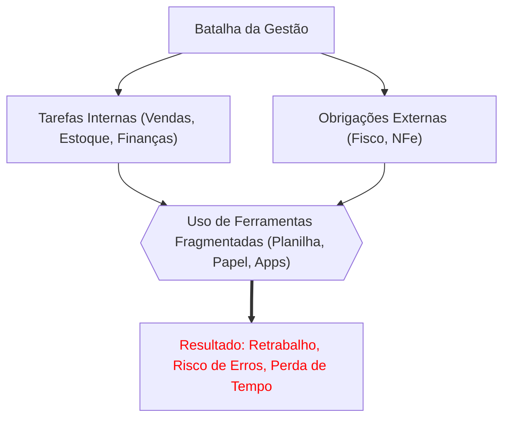
```mermaid
graph TD;
  A["Batalha da Gestão"] --> B["Tarefas Internas (Vendas, Estoque, Finanças)"]
  A --> C["Obrigações Externas (Fisco, NFe)"]
  B --> E{{"Uso de Ferramentas Fragmentadas (Planilha, Papel, Apps)"}}
  C --> E
  E ==> F["<font color=red>Resultado: Retrabalho, Risco de Erros, Perda de Tempo"]
```

### Implicações

**[Insight Inferido]:** A oportunidade mais clara para um sistema de gestão é a **integração**. A proposta de valor mais poderosa não é adicionar uma nova ferramenta, mas sim substituir o ecossistema fragmentado por uma plataforma única. A promessa de "informação única" — inserir um dado apenas uma vez para que ele alimente todas as áreas (vendas, estoque, financeiro, fiscal) — ataca diretamente a maior dor operacional do empreendedor.

---
# 2.0 O Mundo Sem Sistema: O "Gestor Planilheiro" (Análise do Perfil Não Usuário)

### Síntese

O "Gestor Planilheiro" opera sobre um castelo de cartas: um ecossistema de gestão funcional, porém frágil, construído com ferramentas familiares como planilhas, cadernos e WhatsApp. Este método oferece uma sensação de controle tangível, mas o custo oculto é um enorme investimento de tempo em retrabalho, um alto risco de erros manuais e uma total ausência de visão de dados em tempo real.

-----

### Análise Detalhada

  - **O 'Sistema' Invisível e a Ilusão de Controle:** Este empreendedor possui, de fato, um sistema de gestão — um que ele mesmo criou. A familiaridade com suas próprias planilhas e anotações lhe confere uma forte sensação de controle e segurança. No entanto, essa percepção mascara ineficiências críticas: a mesma informação é digitada várias vezes em locais diferentes, a conciliação é um processo lento e doloroso, e a tomada de decisão é baseada em intuição, não em dados consolidados.
  - **Aversão ao Risco da Complexidade:** A principal barreira para a adoção de um ERP não é a falta de reconhecimento dos seus benefícios, mas o medo da complexidade. O gestor teme investir seu tempo e dinheiro escassos em uma ferramenta que possa ser difícil de implementar, complicada de usar no dia a dia ou "exagerada" para as suas necessidades reais. A dor familiar de sua rotina atual parece menos arriscada do que a dor desconhecida de uma migração tecnológica.

> **Voz do Cliente:**
> "Minha planilha é bagunçada, eu sei. Levo um tempão pra fechar o mês. Mas pelo menos eu sei onde tudo está. Tenho medo de pagar por um sistema desses cheio de botão e ficar mais perdido ainda. É um tempo que eu não tenho pra aprender."
> -- *Participante, Grupo de Não Usuários*

### Visualização dos Conceitos

Este fluxograma ilustra o processo de gestão manual do "Planilheiro", destacando os pontos de retrabalho e a falta de integração.

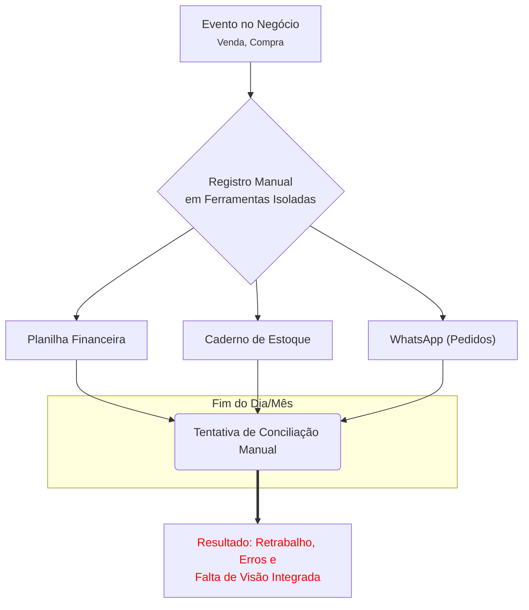
```mermaid
graph TD;
  A[Evento no Negócio <br/><small> Venda, Compra] --> B{Registro Manual <br/> em Ferramentas Isoladas};
  B --> C["Planilha Financeira"];
  B --> D["Caderno de Estoque"];
  B --> E["WhatsApp (Pedidos)"];
  subgraph "Fim do Dia/Mês"
  F(Tentativa de Conciliação Manual)
  end
  C --> F;
  D --> F;
  E --> F;
  F ==> G["<font color=red>Resultado: Retrabalho, Erros e<br/>Falta de Visão Integrada"];
```

### Implicações

**[Insight Inferido]:** Para converter o "Gestor Planilheiro", a estratégia de *onboarding* é mais importante que a lista de funcionalidades. A solução deve combater diretamente o medo da complexidade com uma experiência de entrada de baixo atrito: um modelo *freemium* para experimentação sem risco, um passo a passo de configuração guiado e uma interface que espelhe a simplicidade de uma planilha, mas com o poder da integração.

-----

Deseja um aprofundamento com um Mapa de Barreiras e Gatilhos, detalhando os medos que impedem a adoção e os argumentos que poderiam convencê-los? Aguardo seu comando para o próximo tema.

# 2.1 Rotina de Controle: O Ecossistema de Planilhas, Papel e WhatsApp

### Síntese

A rotina de controle do "Gestor Planilheiro" é um mosaico de soluções familiares e de baixo custo, onde cada ferramenta tem um papel definido, mas isolado. A planilha atua como o cérebro financeiro, o papel é a memória volátil da operação diária, e o WhatsApp é o caótico, porém vital, centro de relacionamento com o cliente. O resultado é um conjunto de "ilhas de informação" que exige esforço manual constante para ser conectado.

-----

### Análise Detalhada

  - **Cada Ferramenta, Um 'Ministério' Isolado:** Os empreendedores atribuem papéis específicos para cada ferramenta:
      - **Planilhas (Excel/Sheets):** São o repositório de dados mais estruturado, usadas quase exclusivamente para o controle financeiro (fluxo de caixa, contas a pagar/receber). É onde a informação "oficial" do negócio reside, ainda que com atraso.
      - **Papel e Caderno:** Valorizados pela agilidade e simplicidade, servem para o registro imediato e transitório de informações no calor da operação: anotar um pedido no balcão, fazer uma lista de compras, checar o estoque rapidamente.
      - **WhatsApp:** Funciona como um canivete suíço. É a principal ferramenta de vendas, negociação, CRM e, informalmente, de registro de pedidos. A informação aqui é rica, mas desestruturada e difícil de ser extraída para fins de gestão.
  - **O Empreendedor como "API Humana":** A consequência direta dessa fragmentação é que o gestor se torna a única interface de integração entre as ferramentas. Ele precisa "copiar e colar" manualmente os dados de um sistema para o outro: o pedido que chegou pelo WhatsApp é digitado na planilha de controle, a venda anotada no caderno é lançada no fluxo de caixa ao final do dia. Esse retrabalho é a maior fonte de perda de tempo e de erros operacionais.

> **Voz do Cliente:**
> "O cliente pede pelo Zap. Eu anoto no caderno do balcão pra não esquecer. No final do dia, eu pego o caderno e passo o total pra minha planilha de caixa. É a mesma venda em três lugares. Cansa, sabe?"
> -- *Participante, Grupo de Não Usuários*

### Visualização dos Conceitos

Este diagrama ilustra como o empreendedor atua como um hub central, conectando manualmente os silos de informação de suas ferramentas.

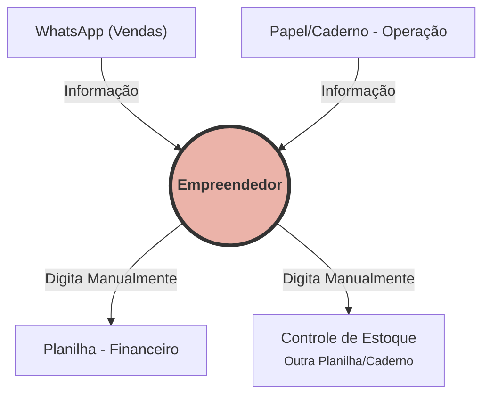
```mermaid
graph TD;
  A["WhatsApp (Vendas)"] -- Informação --> B((<strong>Empreendedor</strong>));
  C["Papel/Caderno - Operação"] -- Informação --> B;
  B -- "Digita Manualmente" --> D["Planilha - Financeiro"];
  B -- "Digita Manualmente" --> E["Controle de Estoque <br/><small>Outra Planilha/Caderno"];

style B fill:#EBB3A9,stroke:#333,stroke-width:4px
```

### Implicações

**[Insight Inferido]:** Uma solução de ERP precisa se posicionar como o "unificador" deste caos. A estratégia de produto e marketing deve enfatizar a eliminação do retrabalho como benefício principal. Funcionalidades de "ponte", como a importação de planilhas ou integrações simples com mensageiros, podem ser diferenciais cruciais para facilitar a transição e reduzir o atrito na adoção para este perfil.

-----

Deseja um aprofundamento com uma Análise de Riscos, detalhando os principais problemas gerados por este ecossistema (ex: erros financeiros, perda de vendas, decisões equivocadas)? Aguardo seu comando para o próximo tema.

# 2.2 Principais Dores: Onde a Gestão Manual Mais Pesa (Financeiro, Estoque, Vendas)

### Síntese

A gestão manual impõe um peso desproporcional sobre três pilares do negócio, cada um associado a uma dor específica e profunda. O controle **Financeiro** gera a maior *ansiedade*, pela incerteza constante sobre a lucratividade e o medo de erros. A gestão de **Estoque** causa *perdas financeiras diretas*, por excesso ou falta de produtos. Por fim, a desorganização em **Vendas** resulta em *oportunidades perdidas* e na incapacidade de construir um relacionamento duradouro com o cliente.

-----

### Análise Detalhada

  - **O Buraco Negro Financeiro - A Angústia da Incerteza:** Esta é a dor mais citada e a que gera maior estresse. Apesar de controlarem o caixa em planilhas, os gestores admitem não ter uma visão clara da saúde financeira do negócio. Eles não sabem com precisão quais produtos são mais lucrativos, se o mês fechou "no azul" de verdade, ou se o fluxo de caixa aguentará as próximas semanas. Essa falta de visibilidade gera uma angústia constante.
  - **O Dilema do Estoque - O Custo do "Muito" ou do "Nada":** O controle de estoque manual é reativo e ineficiente, levando a dois cenários igualmente prejudiciais. O excesso de estoque significa capital de giro parado e risco de perdas (por validade ou obsolescência). A falta de estoque resulta na perda imediata de uma venda e, pior, na frustração do cliente, que pode não retornar. A ausência de dados históricos impede qualquer tipo de planejamento ou previsibilidade.

> **Voz do Cliente:**
> "No final do mês eu vejo que entrou dinheiro, eu paguei as contas e sobrou um pouco. Mas se você me perguntar qual produto me deu mais lucro, ou se eu tô realmente ganhando dinheiro, eu não sei dizer. Eu vou sentindo, sabe? Isso me dá uma agonia danada."
> -- *Participante, Grupo de Não Usuários*

### Visualização dos Conceitos

Este mapa mental organiza as principais dores sentidas em cada área crítica da gestão.

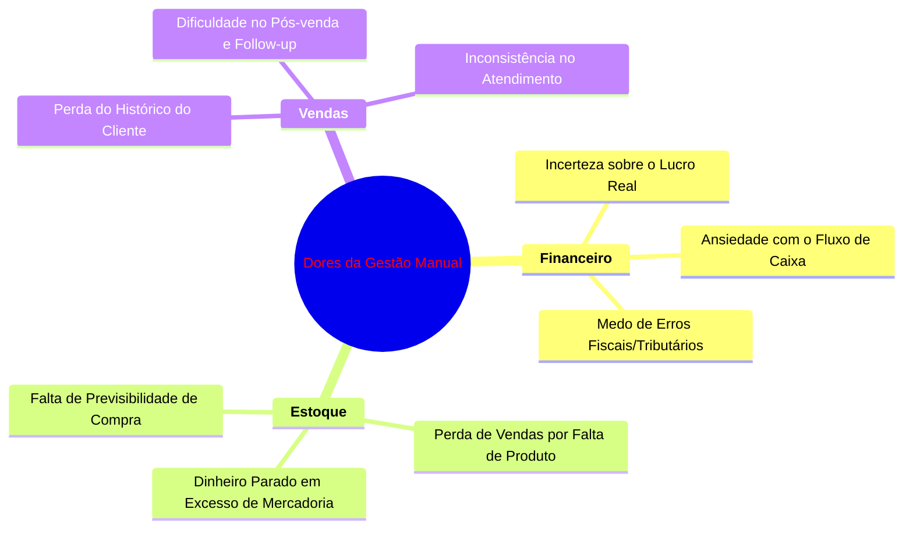
```mermaid
  mindmap
    root((<font color=red>Dores da Gestão Manual</font>))
      <b>Financeiro</b>
        ::icon(fa fa-exclamation-triangle)
        Incerteza sobre o Lucro Real
        Ansiedade com o Fluxo de Caixa
        Medo de Erros Fiscais/Tributários
      <b>Estoque</b>
        ::icon(fa fa-boxes-stacked)
        Perda de Vendas por Falta de Produto
        Dinheiro Parado em Excesso de Mercadoria
        Falta de Previsibilidade de Compra
      <b>Vendas</b>
        ::icon(fa fa-user-times)
        Perda do Histórico do Cliente
        Dificuldade no Pós-venda e Follow-up
        Inconsistência no Atendimento
```

### Implicações

**[Insight Inferido]:** A solução de ERP deve ser apresentada não como uma ferramenta genérica de "gestão", mas como um remédio específico para a dor mais aguda do empreendedor. A estratégia de adoção deve ser modular, permitindo que o novo usuário comece a organizar a área que mais lhe causa angústia (seja o financeiro, o estoque ou as vendas), percebendo valor imediato e ganhando confiança para, gradualmente, integrar as demais áreas do negócio.

-----

Deseja um aprofundamento com uma Análise de Custo x Benefício, quantificando o "custo" de não ter um sistema (em tempo, perdas, etc.) versus o benefício da automação? Aguardo seu comando para o próximo tema.

# 2.3 Barreiras à Adoção: O Muro do Custo, Complexidade e Desconhecimento

### Síntese

A decisão de não adotar um sistema de gestão é protegida por um muro robusto com três pilares interligados. O **Custo** é a barreira tangível, percebido como uma despesa e não um investimento com retorno claro. A **Complexidade** é a barreira do tempo, o medo de uma ferramenta difícil que vai roubar horas preciosas. Por fim, o **Desconhecimento** é a barreira da confiança, gerando uma paralisia de escolha diante de um mercado com excesso de opções.

-----

### Análise Detalhada

  - **Custo: A Matemática da Despesa Imediata:** Para o empreendedor com fluxo de caixa apertado, o valor de uma mensalidade de software é analisado como um custo fixo que se soma a outras contas, como aluguel e salários. Há uma grande dificuldade em visualizar e quantificar o retorno sobre esse investimento (ROI). O benefício de "economizar tempo" ou "reduzir erros" é abstrato, enquanto a despesa mensal é concreta e imediata.
  - **Complexidade: O Medo de "Perder Tempo para Ganhar Tempo":** Esta é talvez a barreira psicológica mais forte. O empreendedor imagina que a implementação de um ERP será um processo disruptivo e que o software terá uma curva de aprendizado longa e íngreme. O medo de ficar "refém" de uma tecnologia que ele não domina e de gastar seu recurso mais escasso — o tempo — para aprender a usá-la, gera uma forte inércia.
  - **Desconhecimento: A Paralisia Diante da Escolha:** O mercado de ERP/SaaS é percebido como vasto e confuso. O gestor não se sente qualificado para avaliar as opções, diferenciar funcionalidades essenciais de supérfluas ou identificar qual solução é a mais adequada para o porte e o setor do seu negócio. Essa sobrecarga de informação, somada à falta de uma fonte confiável de curadoria, leva à paralisia e ao adiamento da decisão.

> **Voz do Cliente:**
> "Eu até já pesquisei alguns, mas é complicado. Um parece simples demais, o outro custa caro e tem mil coisas que eu nunca vou usar. Fico com medo de escolher errado, pagar por algo que vai me dar mais trabalho do que ajuda. Na dúvida, fico com a minha planilha que eu já conheço."
> -- *Participante, Grupo de Não Usuários*

### Visualização dos Conceitos

Este diagrama ilustra como as três barreiras se retroalimentam, criando um ciclo vicioso que impede a adoção.

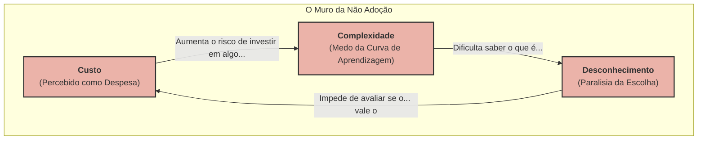
```mermaid
graph TD;
  subgraph O Muro da Não Adoção
    A["<b>Custo</b><br/>(Percebido como Despesa)"]
    B["<b>Complexidade</b><br/>(Medo da Curva de Aprendizagem)"]
    C["<b>Desconhecimento</b><br/>(Paralisia da Escolha)"]
  end
  A -- "Aumenta o risco de investir em algo..." --> B;
  B -- "Dificulta saber o que é..." --> C;
  C -- "Impede de avaliar se o... vale o" --> A;


  style A fill:#EBB3A9,stroke:#333,stroke-width:2px
  style B fill:#EBB3A9,stroke:#333,stroke-width:2px
  style C fill:#EBB3A9,stroke:#333,stroke-width:2px
```

### Implicações

**[Insight Inferido]:** A estratégia para derrubar este muro deve ser baseada em **educação e confiança**. A comunicação precisa traduzir o custo em investimento, mostrando o ROI de forma tangível (ex: "X horas economizadas por semana"). A experiência do produto precisa combater o medo da complexidade com um onboarding simples e guiado. Acima de tudo, é preciso atuar como um "curador" de confiança, simplificando a decisão e validando a escolha do empreendedor.

-----

Deseja um aprofundamento com um Quadrante de Soluções, mapeando ações e argumentos de comunicação para derrubar cada uma dessas três barreiras? Aguardo seu comando para o próximo tema.

---
***

# 3.0 O Mundo Com Sistema: O "Gestor Conectado" (Análise do Perfil Usuário)

### Síntese

O "Gestor Conectado" vive um estado de "alívio imperfeito". Impulsionado por uma dor que se tornou insustentável, ele superou as barreiras da adoção e hoje valoriza a centralização e a automação que o sistema lhe trouxe. Contudo, sua relação com a ferramenta é pragmática e crítica: ele é dependente dos benefícios centrais, mas convive diariamente com as frustrações do custo, da complexidade e das funcionalidades que não utiliza.

-----

### Análise Detalhada

  - **Adoção como Remédio para a Dor Extrema:** A transição para um ERP raramente é uma decisão proativa de otimização; ela é uma reação a um "ponto de ruptura". Este gatilho pode ser o crescimento do negócio tornando os controles manuais caóticos, uma nova exigência fiscal que aumenta a complexidade, ou um erro financeiro grave. O sistema é buscado como uma solução para um problema agudo, uma cura para uma dor que se tornou intolerável.
  - **O Paradoxo do Uso - Essencial, porém Subutilizado:** O sistema é considerado o coração da operação, indispensável para tarefas críticas como emissão de notas fiscais, controle financeiro e gestão de estoque. Apesar dessa importância, a maioria dos usuários admite explorar apenas uma pequena fração do potencial da ferramenta. Módulos de CRM, relatórios gerenciais avançados e outras funcionalidades são frequentemente ignorados por falta de tempo para aprender ou por serem percebidos como desnecessariamente complexos para a realidade do negócio.

> **Voz do Cliente:**
> "Olha, eu não vivo mais sem o sistema, de jeito nenhum. Só de não ter que digitar a mesma venda em três lugares, já valeu a pena. Mas eu sei que pago por um monte de coisa que eu nem sei o que faz. Tem uns relatórios lá, uns gráficos... nunca nem cliquei. Uso o básico: emito nota, vejo quem pagou e o que tem pra vender."
> -- *Participante, Grupo de Usuários*

### Visualização dos Conceitos

Este diagrama ilustra a jornada do gestor desde a dor da gestão manual até o estado atual de benefícios e frustrações com o sistema.

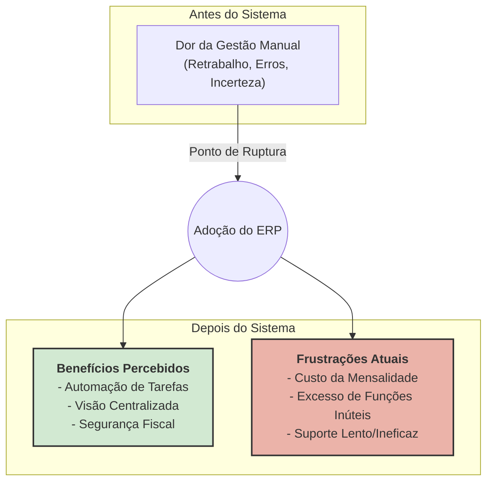
```mermaid
graph TD;
subgraph "Antes do Sistema"
A["Dor da Gestão Manual<br/>(Retrabalho, Erros, Incerteza)"]
end
subgraph "Depois do Sistema"
C["<b>Benefícios Percebidos</b><br/>- Automação de Tarefas<br/>- Visão Centralizada<br/>- Segurança Fiscal"]
D["<b>Frustrações Atuais</b><br/>- Custo da Mensalidade<br/>- Excesso de Funções Inúteis<br/>- Suporte Lento/Ineficaz"]
end
A -- "Ponto de Ruptura" --> B((Adoção do ERP));
B --> C;
B --> D;


style C fill:#D2E9D2,stroke:#333,stroke-width:2px
style D fill:#EBB3A9,stroke:#333,stroke-width:2px
```

### Implicações

**[Insight Inferido]:** Existe uma clara oportunidade de mercado para atrair usuários insatisfeitos de sistemas concorrentes. Uma solução que ofereça um modelo de negócio mais flexível (pague pelo que usa), uma experiência de usuário superior nas funcionalidades essenciais e um suporte mais ágil pode se posicionar como uma alternativa inteligente. A estratégia não deve visar apenas a conversão de "planilheiros", mas também a migração dos "conectados" que buscam uma parceria mais justa e eficiente.

-----

Deseja um aprofundamento com um Mapa Competitivo, analisando os pontos fortes e fracos dos sistemas atualmente utilizados pelos participantes? Aguardo seu comando para o próximo tema.

# 3.1 A Jornada de Adoção: O Gatilho da Mudança (Dor, Crescimento, Obrigação Fiscal)

### Síntese

A adoção de um sistema ERP não é uma jornada de otimização, mas sim uma travessia forçada por um "ponto de ruptura". O empreendedor só abandona suas ferramentas familiares quando a dor da gestão manual — impulsionada pelo caos operacional, pelo crescimento do negócio ou por uma nova obrigação fiscal — se torna absolutamente insustentável, superando o medo do custo e da complexidade.

-----

### Análise Detalhada

  - **O Ponto de Saturação da Dor:** O principal gatilho é o esgotamento. O empreendedor chega a um limite onde o tempo perdido com retrabalho, os erros financeiros recorrentes e a ansiedade gerada pela desorganização começam a impactar sua saúde e a viabilidade do negócio. A decisão de buscar um sistema nasce do sentimento de "não aguento mais", quando a dor de continuar como está se torna maior que o medo da mudança.
  - **A Dupla Força: Crescimento e Obrigação:** O crescimento do negócio e as obrigações fiscais atuam como catalisadores externos que aceleram a chegada ao ponto de saturação. Um aumento no volume de vendas torna as planilhas impraticáveis, e a necessidade de emitir NFe em maior escala ou se adequar a novas regras fiscais transforma a burocracia de um incômodo para um obstáculo crítico. Frequentemente, é a combinação desses dois fatores que força a decisão final.

> **Voz do Cliente:**
> "Chegou num ponto que eu passava mais tempo conferindo planilha do que atendendo cliente. Quando eu perdi uma venda grande porque achei que tinha um produto no estoque e não tinha, eu falei: 'chega'. A dor de perder aquele dinheiro foi o empurrão que eu precisava pra procurar uma solução."
> -- *Participante, Grupo de Usuários*

### Visualização dos Conceitos

Este fluxograma ilustra a jornada desde a gestão manual até a decisão de adotar um sistema, impulsionada pelos gatilhos de mudança.

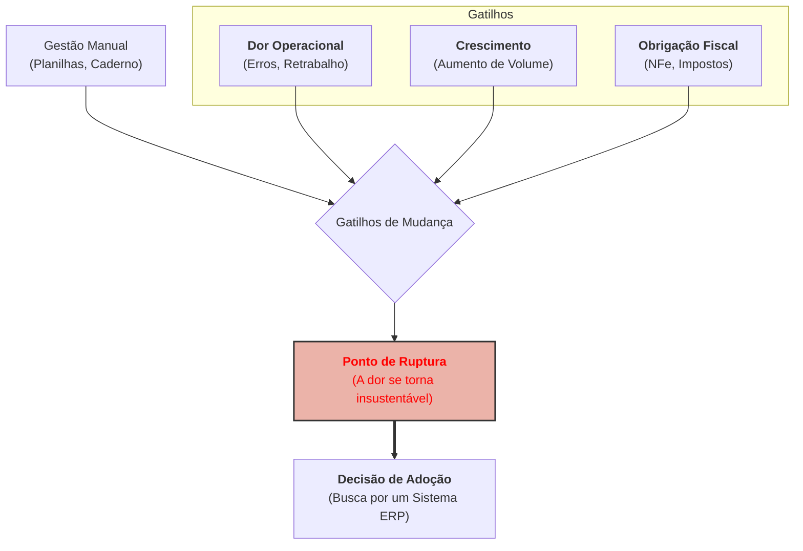
```mermaid
graph TD;
A["Gestão Manual<br/>(Planilhas, Caderno)"] --> B{Gatilhos de Mudança};
subgraph Gatilhos
C["<b>Dor Operacional</b><br/>(Erros, Retrabalho)"]
D["<b>Crescimento</b><br/>(Aumento de Volume)"]
E["<b>Obrigação Fiscal</b><br/>(NFe, Impostos)"]
end
C --> B;
D --> B;
E --> B;
B --> F["<font color=red><b>Ponto de Ruptura</b><br/>(A dor se torna insustentável)</font>"];
F ==> G["<b>Decisão de Adoção</b><br/>(Busca por um Sistema ERP)"];


style F fill:#EBB3A9,stroke:#333,stroke-width:2px
```

### Implicações

**[Insight Inferido]:** A comunicação e a estratégia de vendas devem ser focadas em identificar e dialogar com empreendedores que estão se aproximando desses pontos de ruptura. Em vez de vender "funcionalidades", a abordagem deve ser a de oferecer um "antídoto" para dores específicas, com mensagens como: "Seu negócio cresceu e a gestão virou um caos? Existe uma solução" ou "Simplifique suas obrigações fiscais e ganhe tempo".

-----

Deseja um aprofundamento com uma Matriz de Gatilhos, detalhando os "sintomas" de cada ponto de ruptura para ajudar a identificar clientes no momento ideal da compra? Aguardo seu comando para o próximo tema.

# 3.2 Experiência de Uso: Luzes e Sombras das Ferramentas Atuais

### Síntese

A experiência de uso do "Gestor Conectado" é uma balança de ganhos e atritos. As "Luzes" são os benefícios inegáveis da automação e da centralização, que são vistos como um divisor de águas na gestão. Em contrapartida, as "Sombras" aparecem na forma de uma usabilidade pouco intuitiva, no excesso de funcionalidades irrelevantes e, principalmente, na percepção de um suporte técnico lento e ineficaz, que gera frustração na rotina.

-----

### Análise Detalhada

  - **As Luzes - O Alívio da Automação e da Visão Centralizada:** Os pontos mais valorizados são aqueles que atacam diretamente as maiores dores do mundo manual. A emissão de Nota Fiscal integrada ao controle financeiro e de estoque é universalmente celebrada como a funcionalidade de maior impacto, economizando tempo e reduzindo o estresse. Ter uma visão unificada das contas a pagar e receber em um único dashboard também é um benefício fundamental que traz segurança e clareza.
  - **As Sombras - A Fricção da Usabilidade e do Suporte:** As frustrações diárias minam a satisfação geral com a ferramenta. Muitos sistemas são descritos como "pouco intuitivos", "engessados" ou "feitos para contadores, não para donos de negócio". Além disso, a percepção de pagar por um pacote de funcionalidades complexas que nunca são utilizadas gera uma sensação de mau custo-benefício. A principal queixa, no entanto, recai sobre o suporte técnico, frequentemente classificado como demorado, robotizado e pouco resolutivo.

> **Voz do Cliente:**
> "A parte de emitir a nota e já dar baixa no estoque é uma maravilha, me salvou. Mas toda vez que eu preciso tirar um relatório um pouco diferente, ou quando dá um erro, é um parto. Falo com um robô, depois espero horas por um técnico que parece não entender o que eu preciso. É uma relação de amor e ódio, sabe?"
> -- *Participante, Grupo de Usuários*

### Visualização dos Conceitos

Este mapa mental resume os principais pontos positivos (Luzes) e negativos (Sombras) da experiência de uso dos sistemas atuais.

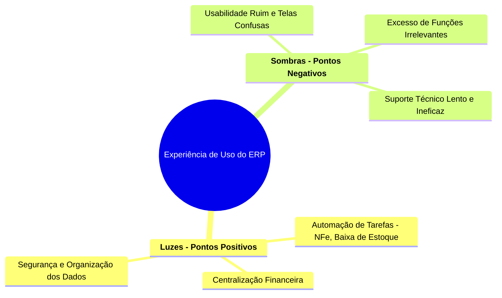
```mermaid
mindmap
  root((Experiência de Uso do ERP))
    <b>Luzes - Pontos Positivos</b>
      ::icon(fa fa-sun)
      Automação de Tarefas - NFe, Baixa de Estoque
      Centralização Financeira
      Segurança e Organização dos Dados
    <b>Sombras - Pontos Negativos</b>
      ::icon(fa fa-cloud)
      Usabilidade Ruim e Telas Confusas
      Excesso de Funções Irrelevantes
      Suporte Técnico Lento e Ineficaz
```

### Implicações

**[Insight Inferido]:** A experiência do usuário (UX) nas tarefas essenciais é o campo de batalha mais importante para conquistar este público. Um novo produto não precisa ter mais funcionalidades que os concorrentes; ele precisa executar as funções-chave (faturamento, financeiro, estoque) de forma mais simples e intuitiva. Um suporte humanizado e ágil deixa de ser um custo operacional e se torna um poderoso diferencial competitivo e fator de retenção.

-----

Deseja um aprofundamento com um Mapa de Fricção, detalhando as tarefas específicas dentro dos sistemas atuais que mais geram dificuldades e frustração para os usuários? Aguardo seu comando para o próximo tema.

# 3.3 Valor Percebido: O Que Realmente Faz a Diferença em um ERP

### Síntese

O valor real de um ERP, na percepção do usuário, não reside em uma lista extensa de funcionalidades, mas sim em sua capacidade de gerar "paz de espírito" através de três pilares fundamentais. A **Integração** elimina o caos do retrabalho manual, a **Automação** devolve o tempo consumido por tarefas repetitivas, e a **Visão de Dados**, mesmo que básica, substitui a incerteza da intuição pela segurança da informação, dando ao gestor uma sensação inédita de controle.

-----

### Análise Detalhada

  - **Integração como o Fim do Caos:** Este é o benefício mais fundamental e celebrado. A capacidade do sistema de fazer com que uma única ação — o registro de uma venda — se propague automaticamente por todas as áreas relevantes (financeiro, estoque, fiscal) é vista como o principal diferencial em relação ao mundo das planilhas. A eliminação do "copia e cola" manual é o que justifica, para o usuário, a permanência na plataforma apesar de suas falhas.
  - **Automação como Devolução de Tempo:** Enquanto a integração conecta os dados, a automação executa as tarefas. A funcionalidade de emissão de Nota Fiscal é o exemplo mais emblemático: transformar um processo manual, estressante e propenso a erros em uma tarefa de poucos cliques é percebido como um ganho imensurável. Esse tempo "devolvido" pelo sistema é reinvestido na atividade-fim do negócio, gerando um ROI claro na percepção do gestor.
  - **Visão de Dados como o Início do Controle:** Embora relatórios complexos sejam subutilizados, dashboards simples e visuais que consolidam informações-chave (vendas do dia, contas a receber, produtos mais vendidos) são extremamente valorizados. Essa "fotografia" do negócio substitui a gestão baseada no "achismo" por uma clareza mínima que gera segurança. É o primeiro passo para uma tomada de decisão mais estratégica e menos reativa.

> **Voz do Cliente:**
> "Antigamente, pra saber se o mês tinha sido bom, eu olhava o saldo final da conta. Hoje, eu abro o sistema e vejo um gráfico simples. Vejo o que vendi, quem me deve... Pela primeira vez eu sinto que tenho o controle, que eu sei pra onde o negócio está indo. Isso não tem preço, dá uma paz."
> -- *Participante, Grupo de Usuários*

### Visualização dos Conceitos

Esta pirâmide ilustra como os valores percebidos se constroem, com a Integração servindo de base para a Automação e a Visão de Dados, culminando no benefício emocional de Controle e Paz de Espírito.

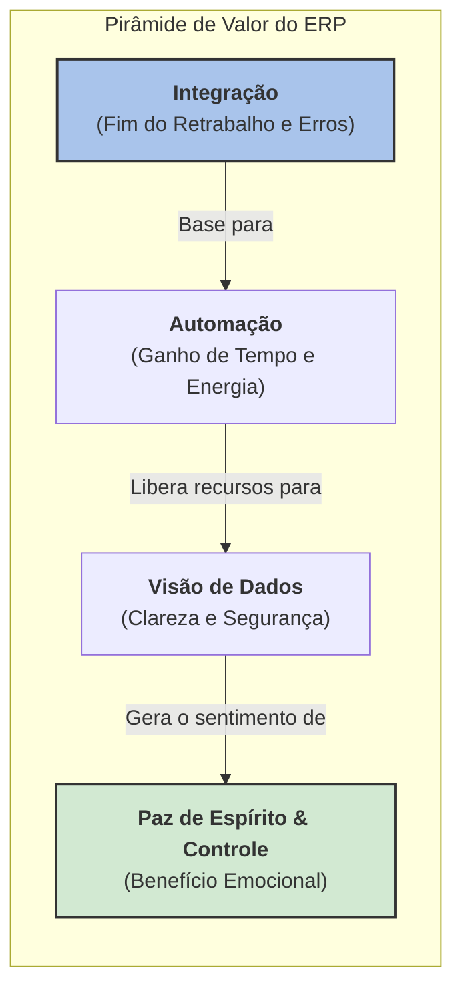
```mermaid
graph TD;
  subgraph "Pirâmide de Valor do ERP"
  direction TB
  D -- Base para --> C;
  C -- Libera recursos para --> B;
  B -- Gera o sentimento de --> A;
  end

  A["<b>Paz de Espírito & Controle</b><br/>(Benefício Emocional)"]
  B["<b>Visão de Dados</b><br/>(Clareza e Segurança)"]
  C["<b>Automação</b><br/>(Ganho de Tempo e Energia)"]
  D["<b>Integração</b><br/>(Fim do Retrabalho e Erros)"]

  style A fill:#D2E9D2,stroke:#333,stroke-width:2px
  style D fill:#A9C4EB,stroke:#333,stroke-width:2px
```

### Implicações

**[Insight Inferido]:** O desenvolvimento e o marketing de um ERP para PMEs devem ser obcecados por esta pirâmide de valor. A base (Integração e Automação das tarefas essenciais) precisa ser sólida, simples e impecável, pois é onde o valor é gerado de forma mais imediata. A Visão de Dados deve ser tratada como a recompensa por essa organização, oferecendo clareza instantânea, e não como uma ferramenta complexa de BI, para que o benefício final de "paz de espírito" seja rapidamente alcançado pelo usuário.

-----

Deseja um aprofundamento com uma Matriz de Valor, ranqueando as funcionalidades de automação e integração que geram o maior impacto percebido pelos usuários? Aguardo seu comando para o próximo tema.

---
---

# 4.0 A Solução Ideal: Construindo a Ponte para a Adoção

### Síntese

A "ponte" para a adoção em massa de um ERP por pequenos negócios se sustenta em quatro pilares. Um **Produto Essencialista**, que executa o básico (fiscal, financeiro, estoque) com perfeição e simplicidade. Um **Modelo de Negócio Flexível**, que remove a barreira do custo com uma entrada de baixo atrito (freemium/trial). Uma **Experiência Anti-Complexidade**, do onboarding ao suporte. E, crucialmente, o selo de **Confiança** de uma marca como o Sebrae, que atua como o curador que o empreendedor necessita.

-----

### Análise Detalhada

  - **O Mantra do "Menos é Melhor" - Foco no Núcleo Essencial:** A solução ideal não é a que tem mais funcionalidades, mas a que resolve as dores essenciais de forma impecável. Tanto usuários (que reclamam do excesso de recursos) quanto não-usuários (que temem a complexidade) convergem para um desejo por simplicidade. Um sistema centrado em um tripé (Emissão de NFe, Fluxo de Caixa, Controle de Estoque) simples, integrado e intuitivo atenderia a grande maioria das necessidades e desejos.
  - **O Modelo de Negócio como Convite, Não como Barreira:** Para superar a aversão ao custo, o modelo de negócio precisa ser um convite à experimentação. Um plano *freemium* para o emissor de NFe ou um período de teste gratuito e sem compromisso são vistos como fundamentais. O modelo de precificação ideal é o modular ("pague apenas pelo que usa"), pois transmite justiça e permite que a ferramenta cresça junto com o negócio, transformando a "despesa" em um investimento escalável.
  - **O Papel do Sebrae como "Selo de Confiança":** Em um mercado pulverizado e confuso, a marca Sebrae emerge como o ativo mais poderoso. A chancela do Sebrae funciona como um atalho na jornada de decisão, eliminando a paralisia da escolha e o medo de contratar um fornecedor inadequado. O empreendedor não enxerga o Sebrae apenas como um vendedor de software, mas como um parceiro que entende sua realidade e que, portanto, ofereceria uma solução genuinamente pensada para ele.

> **Voz do Cliente:**
> "Se o Sebrae chegasse pra mim com um sistema que só faz o básico, emitir nota e controlar meu dinheiro, mas que fizesse isso muito bem, sem complicação e com um preço justo, eu entrava na hora. Vindo do Sebrae, eu sei que não é enganação, eu confio."
> -- *Participante, Grupo de Não Usuários*

### Visualização dos Conceitos

Este diagrama ilustra os quatro pilares que sustentam a "Ponte para a Adoção", formando a estrutura da Solução Ideal.

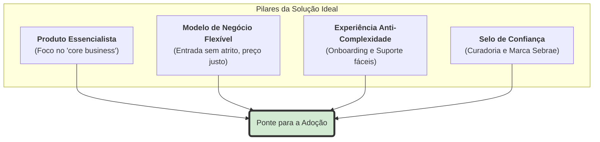
```mermaid
graph TD;
subgraph "Pilares da Solução Ideal"
A["<b>Produto Essencialista</b><br/>(Foco no 'core business')"]
B["<b>Modelo de Negócio Flexível</b><br/>(Entrada sem atrito, preço justo)"]
C["<b>Experiência Anti-Complexidade</b><br/>(Onboarding e Suporte fáceis)"]
D["<b>Selo de Confiança</b><br/>(Curadoria e Marca Sebrae)"]
end

Ponte(Ponte para a Adoção)

A --> Ponte;
B --> Ponte;
C --> Ponte;
D --> Ponte;

style Ponte fill:#D2E9D2,stroke:#333,stroke-width:4px
```

### Implicações

**[Insight Inferido]:** A oportunidade para o Sebrae-SP transcende o lançamento de um software; trata-se de criar um ecossistema. A estratégia de maior potencial não é competir apenas em funcionalidades, mas alavancar sua principal fortaleza — a confiança — para oferecer uma solução 360°: a ferramenta (produto), a capacitação para usá-la da melhor forma (educação) e a segurança de que é a escolha certa para o sucesso do pequeno negócio (marca).

-----

Deseja um aprofundamento com um Canvas da Proposta de Valor, detalhando como a "Solução Ideal" se encaixa nas dores e necessidades do cliente para construir uma oferta de mercado irrecusável? Aguardo seu comando para o próximo tema.

# 4.1 Funcionalidades Essenciais (o "não pode faltar") vs. Diferenciais Competitivos (o "uau")

### Síntese

As funcionalidades **essenciais** formam um "tripé sagrado" inegociável que resolve as dores mais agudas: um módulo Fiscal simplificado, um Financeiro intuitivo e um controle de Estoque integrado. Já os **diferenciais competitivos** não residem em módulos complexos, mas em "pequenas mágicas" de conectividade que integram o sistema ao ecossistema real do negócio, como a automação a partir de canais de venda (WhatsApp) e a integração bancária.

-----

### Análise Detalhada

  - **O "Tripé Sagrado" - A Base da Confiança:** Estas são as funcionalidades "table stakes", a base sobre a qual a confiança do usuário é construída. A ausência ou má execução de qualquer uma delas invalida a solução.
      - **Fiscal Simplificado:** O carro-chefe absoluto. Emissão de NFe/NFSe com o mínimo de cliques, cálculo automático de impostos e uma forma simples de compartilhar os dados com o contador.
      - **Financeiro para "Não-Financeiros":** Um fluxo de caixa visual (contas a pagar e a receber), um dashboard com o "pulso" do negócio (faturamento, despesas) e uma conciliação bancária descomplicada.
      - **Estoque Básico e Confiável:** Controle de entradas e saídas com baixa automática a partir do registro da venda. O objetivo não é uma gestão complexa, mas sim evitar a perda de vendas.
  - **Os Diferenciais "Uau" - Inteligência e Conectividade:** Estes são os recursos que geram encantamento e podem motivar a troca de um sistema concorrente. O foco é em reduzir ainda mais o trabalho manual, conectando o ERP ao mundo exterior.
      - **Integração Bancária (Open Finance):** A capacidade de importar o extrato da conta PJ automaticamente para a conciliação é o diferencial técnico mais desejado.
      - **Captura de Vendas Externas:** Uma funcionalidade que "lê" um pedido no WhatsApp ou em um marketplace e o transforma em um rascunho de venda no sistema é vista como uma inovação de altíssimo impacto.
      - **Alertas Proativos:** Em vez de exigir que o usuário procure a informação, o sistema a entrega de forma inteligente: "Alerta: O produto X está acabando" ou "Você tem Y contas a receber esta semana".

> **Voz do Cliente:**
> "O meu sistema atual tem um módulo de RH. Eu sou sozinho na empresa! Pra que eu quero isso? Eu trocaria essa função e mais umas dez por um botão que puxasse meu extrato do banco sozinho. Isso sim ia me economizar um tempo absurdo. É menos coisa, mas é a coisa certa."
> -- *Participante, Grupo de Usuários*

### Visualização dos Conceitos

Este diagrama separa claramente as funcionalidades essenciais, que formam a base da oferta, dos diferenciais, que criam o encantamento.

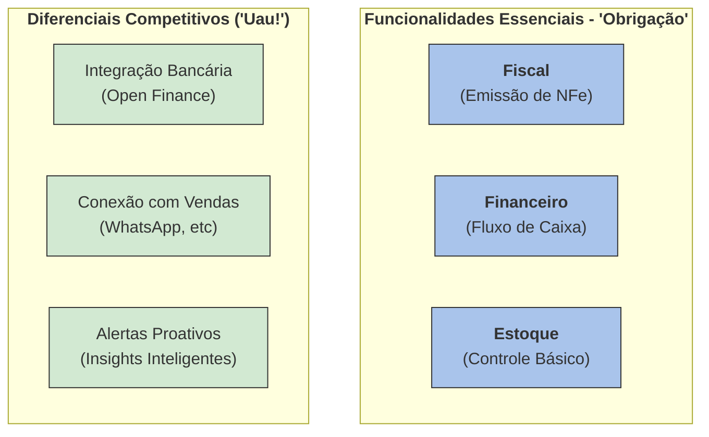
```mermaid
  graph TD;
  subgraph "<b>Funcionalidades Essenciais - 'Obrigação'</b>"
    direction LR
    A["<b>Fiscal</b><br/>(Emissão de NFe)"]
    B["<b>Financeiro</b><br/>(Fluxo de Caixa)"]
    C["<b>Estoque</b><br/>(Controle Básico)"]
  end
  subgraph "<b>Diferenciais Competitivos ('Uau!')</b>"
    direction LR
    D["Integração Bancária<br/>(Open Finance)"]
    E["Conexão com Vendas<br/>(WhatsApp, etc)"]
    F["Alertas Proativos<br/>(Insights Inteligentes)"]
  end

  style A fill:#A9C4EB,stroke:#333
  style B fill:#A9C4EB,stroke:#333
  style C fill:#A9C4EB,stroke:#333
  style D fill:#D2E9D2,stroke:#333
  style E fill:#D2E9D2,stroke:#333
  style F fill:#D2E9D2,stroke:#333
```

### Implicações

**[Insight Inferido]:** A estratégia de produto deve ser "ganhar no essencial, diferenciar nas conexões". O esforço inicial de desenvolvimento deve ser obcecado em criar a experiência mais simples e confiável possível para o "tripé sagrado". Uma vez que essa base sólida esteja estabelecida, o crescimento e a diferenciação virão da construção de pontes inteligentes com as ferramentas que o empreendedor já utiliza no seu dia a dia (banco, canais de venda), em vez de adicionar módulos internos complexos e de baixo uso.

-----

Deseja um aprofundamento com um User Story Map para a funcionalidade "Integração Bancária", detalhando a jornada do usuário e os requisitos para criar uma experiência "Uau"? Aguardo seu comando para o próximo tema.

# 4.2 Modelo de Negócio e Precificação: Percepção de Valor e Disposição a Pagar

### Síntese

O modelo de negócio ideal para este público deve ser um convite, não uma barreira, combatendo a aversão ao risco com uma **entrada *freemium* ou *trial* generoso** como principal ferramenta de aquisição. A precificação precisa ser percebida como **justa, modular e transparente** ("pague pelo que usa"), com valores ancorados no alívio de dores concretas. A disposição a pagar por uma solução essencial completa orbita entre **R$50 e R$150 mensais**, um valor que não comprometa o fluxo de caixa, mas que legitime a ferramenta como um investimento profissional.

-----

### Análise Detalhada

  - **O Freemium como Ferramenta de Confiança:** A exigência de um compromisso financeiro inicial é um dos maiores impeditivos para a experimentação. Um plano gratuito, especialmente focado na dor universal da emissão de NFe, é a estratégia mais eficaz para desmistificar a complexidade do sistema e permitir que o empreendedor experimente o valor na prática. O *freemium* não é apenas uma tática de aquisição; é a principal ferramenta para construir a confiança necessária para o upgrade.
  - **Precificação Modular como Sinônimo de Justiça:** O modelo de "pacotes" fechados (Bronze, Prata, Ouro) é visto com desconfiança, pois gera a sensação de pagar por funcionalidades inúteis. A preferência clara é por um modelo modular: um valor base para o "tripé essencial" (Fiscal, Financeiro, Estoque) e a liberdade para adicionar outras funcionalidades conforme a necessidade e o crescimento do negócio. Esse modelo é percebido como mais justo, transparente e alinhado à realidade da PME.
  - **A Âncora de Valor e a Disposição a Pagar:** A percepção de valor não está atrelada ao número de funcionalidades, mas ao tempo economizado e à "paz de espírito" conquistada. Ao quantificar o quanto pagariam, os empreendedores ancoram o valor em suas despesas mensais. O preço ideal deve ser psicologicamente menor que uma conta de consumo (luz, internet), mas maior que um custo trivial. A faixa de R$50 a R$150 por mês para a solução essencial é o ponto de equilíbrio que emerge consistentemente.

> **Voz do Cliente:**
> "Eu não vou pagar 100 reais por mês só pra 'ver como é'. Agora, se me dessem de graça pra emitir nota, eu gostasse, e aí pra ter o financeiro completo custasse uns 70, 80 reais... aí sim, eu pagaria. Preciso sentir que vale a pena antes de botar a mão no bolso. E tem que ser um preço que eu não 'sinta' no final do mês."
> -- *Participante, Grupo de Não Usuários*

### Visualização dos Conceitos

Este funil ilustra a jornada ideal do cliente através do modelo de negócio, desde a aquisição via *freemium* até a monetização com planos modulares.

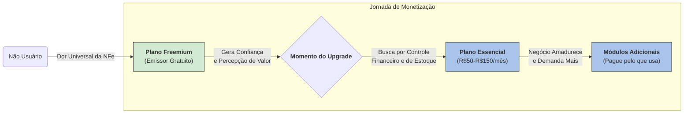
```mermaid
graph LR;
  A(Não Usuário) -- "Dor Universal da NFe" --> B["<b>Plano Freemium</b><br/>(Emissor Gratuito)"];
  subgraph "Jornada de Monetização"
  B -- "Gera Confiança<br/>e Percepção de Valor" --> C{"<b>Momento do Upgrade</b>"};
  C -- "Busca por Controle<br/>Financeiro e de Estoque" --> D["<b>Plano Essencial</b><br/>(R$50-R$150/mês)"];
  D -- "Negócio Amadurece<br/>e Demanda Mais" --> E["<b>Módulos Adicionais</b><br/>(Pague pelo que usa)"];
  end
  style B fill:#D2E9D2,stroke:#333
  style D fill:#A9C4EB,stroke:#333
  style E fill:#A9C4EB,stroke:#333
```

### Implicações

**[Insight Inferido]:** A estratégia de precificação é, na verdade, uma estratégia de relacionamento. O objetivo do *freemium* não é apenas gerar leads, mas educar o mercado e construir uma base de usuários que confiam na marca. A monetização deve ser uma consequência natural da percepção de valor, com o cliente optando por pagar para resolver dores maiores. Comunicar a precificação com transparência e foco na parceria ("cresça conosco") será mais eficaz do que uma abordagem transacional.

-----

Deseja um aprofundamento sobre o último pilar da Solução Ideal, analisando o tema **4.3 O Papel do Sebrae: O Selo de Confiança na Digitalização**? Aguardo seu comando para o próximo tema.

---
---

# 5.0 Análises Estratégicas e Recomendações

### Síntese

A estratégia de sucesso para o Sebrae-SP não é competir no mercado de ERPs, mas sim **redefinir este mercado** para os pequenos negócios. A recomendação central é a criação de um **Ecossistema de Gestão**, onde a ferramenta de software é a porta de entrada, mas o valor real e sustentável reside na integração da tecnologia com a capacitação, o suporte contextualizado e a curadoria de outras soluções, tudo sob o selo de confiança inabalável do Sebrae.

-----

### Análise Detalhada

  - **Recomendação 1: Adotar uma Estratégia de Ecossistema, não de Produto:** A maior oportunidade não é vender um software, mas oferecer uma "solução" completa que resolva a dor da gestão de ponta a ponta. Isso implica em ir além da ferramenta e integrar:
      - **Educação:** Criar uma jornada de aprendizado dentro da plataforma, com pílulas de conteúdo e cursos que ensinem princípios de gestão utilizando os dados do próprio negócio do usuário.
      - **Serviços:** Oferecer um suporte que não apenas "tira dúvidas", mas "orienta", e conectar o usuário a outros serviços do Sebrae (como consultorias) a partir dos insights gerados pela ferramenta.
  - **Recomendação 2: Estratégia Go-to-Market "Freemium-Educacional":** O motor de aquisição deve ser o Emissor de NFe gratuito, resolvendo uma dor universal e servindo como a principal porta de entrada para o ecossistema. A conversão para planos pagos deve ser uma consequência natural da jornada do usuário dentro da plataforma, que, ao ser educado sobre a importância do controle financeiro e de estoque, sentirá a necessidade de fazer o upgrade. A venda é consultiva e baseada na percepção de valor.

> **A Voz do Empreendedor:**
> "Não me venda mais um programa. Me dê um caminho, uma solução que me ensine a ser um gestor melhor e que me dê paz para focar no que eu amo. Se o Sebrae fizer isso, não serei apenas um cliente, serei um parceiro para a vida toda."
> -- *Síntese do Sentimento Geral*

### Visualização dos Conceitos

Este diagrama ilustra o Ecossistema de Gestão recomendado, com o pequeno negócio no centro, apoiado pelos quatro pilares da oferta Sebrae.

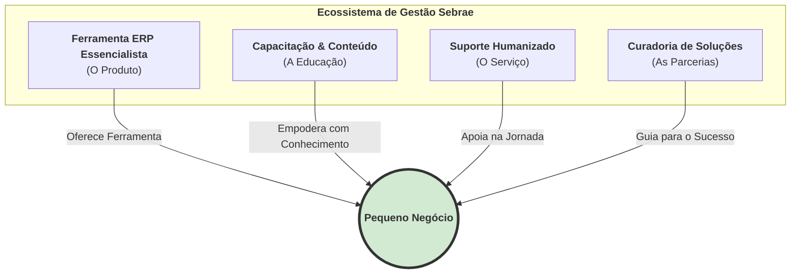
```mermaid
graph TD;
subgraph "<b>Ecossistema de Gestão Sebrae</b>"
  A["<b>Ferramenta ERP Essencialista</b><br/>(O Produto)"]
  B["<b>Capacitação & Conteúdo</b><br/>(A Educação)"]
  C["<b>Suporte Humanizado</b><br/>(O Serviço)"]
  D["<b>Curadoria de Soluções</b><br/>(As Parcerias)"]
end

PME((<b>Pequeno Negócio</b>));

A -- Oferece Ferramenta --> PME;
B -- Empodera com Conhecimento --> PME;
C -- Apoia na Jornada --> PME;
D -- Guia para o Sucesso --> PME;

style PME fill:#D2E9D2,stroke:#333,stroke-width:4px
```

### Próximos Passos Recomendados

**[Plano de Ação Sugerido]:**

1.  **Fase 1 - Validação (MVP):** Desenvolver um Protótipo de Mínima Viabilidade (MVP) focado exclusivamente no "tripé essencial" (Fiscal, Financeiro, Estoque) com máxima simplicidade. Validar a usabilidade e a proposta de valor com um grupo piloto de 50 empresas (25 usuários e 25 não-usuários).
2.  **Fase 2 - Lançamento (Go-to-Market):** Lançar a estratégia *freemium* com o Emissor de NFe gratuito, concentrando toda a comunicação nos pilares de simplicidade, confiança e no DNA educacional do Sebrae.
3.  **Fase 3 - Evolução (Ecossistema):** Com base no feedback e nos dados de uso, evoluir o produto adicionando os diferenciais "uau" (integrações) e construir o ecossistema ao redor da ferramenta, com conteúdo relevante e parcerias estratégicas.

-----

Análise estratégica e recomendações concluídas. Relatório finalizado.

# 5.1 Análise Comparativa de Perfis: "Planilheiro" vs. "Conectado"

### Síntese

A principal fronteira que separa o "Gestor Planilheiro" do "Gestor Conectado" é a sua **relação com a dor da gestão**. O Planilheiro convive com uma dor crônica e familiar, que ele gerencia através de ferramentas que lhe dão uma sensação de controle. O Conectado, por outro lado, já atingiu um ponto de dor aguda que o forçou a buscar um "remédio" (o ERP). Essa diferença fundamental molda suas distintas percepções sobre tecnologia, custo e risco.

-----

### Análise Detalhada

  - **Percepção de Controle:**
      - **Planilheiro:** O controle está na **familiaridade**. Ele construiu e domina suas ferramentas. Esse controle é direto e manual, mas é uma ilusão que mascara o caos, o retrabalho e o alto risco de erros.
      - **Conectado:** O controle está na **visibilidade**. Ele sacrificou o controle manual pela automação e pela centralização de dados que o sistema oferece. O controle é sistêmico, mas gera frustração quando a ferramenta se mostra inflexível ou complexa.
  - **Relação com o Custo:**
      - **Planilheiro:** Enxerga o software como **"despesa"**. Sua análise é focada no custo fixo mensal imediato versus o benefício abstrato de "organização". O padrão de comparação é o "grátis" (planilhas, cadernos).
      - **Conectado:** Enxerga o software como **"investimento"**. Ele já sentiu a dor do caos e, portanto, consegue tangibilizar o valor do tempo economizado e da redução de estresse. Sua crítica é mais refinada, focada no custo-benefício das funcionalidades que realmente utiliza.

> **Vozes em Contraste:**
>
> > **Planilheiro:** "Prefiro gastar meu tempo na minha planilha, que eu sei que funciona, do que arriscar meu dinheiro num sistema que pode me dar mais trabalho do que ajuda."
>
> -----
>
> > **Conectado:** "Eu gasto dinheiro com o sistema, sim. E passo raiva às vezes. Mas não volto para a vida de planilha por nada. O tempo que eu ganhei não tem preço."

### Visualização dos Conceitos

Este quadrante posiciona os dois perfis com base em sua maturidade de gestão e adoção de tecnologia. O "Planilheiro" é o alvo principal para aquisição, enquanto o "Conectado" é uma oportunidade de migração de concorrentes.

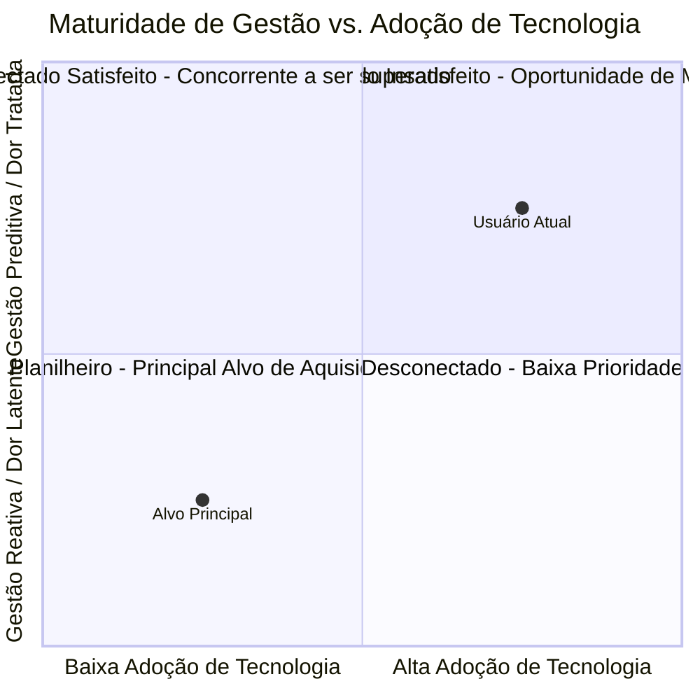
```mermaid
quadrantChart
  title Maturidade de Gestão vs. Adoção de Tecnologia
  x-axis "Baixa Adoção de Tecnologia" --> "Alta Adoção de Tecnologia"
  y-axis "Gestão Reativa / Dor Latente" --> "Gestão Preditiva / Dor Tratada"
  quadrant-1 "Conectado Insatisfeito - Oportunidade de Migração"
  quadrant-2 "Conectado Satisfeito - Concorrente a ser superado"
  quadrant-3 "Planilheiro - Principal Alvo de Aquisição"
  quadrant-4 "Desconectado - Baixa Prioridade"
  "Alvo Principal": [0.25, 0.25]
  "Usuário Atual": [0.75, 0.75]
```

### Implicações Estratégicas

**[Insight Inferido]:** As estratégias de comunicação e de produto devem ser segmentadas. Para atrair o **Planilheiro**, o foco deve ser em **redução de risco e educação**, utilizando o modelo *freemium* para desmistificar a tecnologia. Para atrair o **Conectado** (insatisfeito com seu sistema atual), o foco deve ser em **superioridade e justiça**, demonstrando uma melhor usabilidade nas tarefas essenciais e um modelo de precificação mais transparente e flexível que o dos concorrentes.

-----

Análise comparativa concluída. Deseja prosseguir para o item **5.2 Fatores Críticos de Sucesso para uma Oferta Sebrae-SP**?

# 5.2 Fatores Críticos de Sucesso para uma Oferta Sebrae-SP

### Síntese

Os Fatores Críticos de Sucesso para a oferta do Sebrae-SP convergem em três pilares estratégicos e inegociáveis. No **Produto**, o foco obsessivo deve ser na **simplicidade e usabilidade** do "tripé essencial". No **Modelo de Negócio**, a criação de uma jornada de aquisição com **atrito zero**, baseada em *freemium* e precificação justa. E na **Marca**, a alavancagem máxima da **confiança e do DNA educacional** do Sebrae como o principal e mais inimitável diferencial competitivo.

-----

### Análise Detalhada

  - **Fator 1: Simplicidade Radical do Produto:** O sucesso da solução não será medido pela quantidade de funcionalidades, mas pela ausência de fricção na execução das tarefas essenciais. A equipe de produto deve ter como meta criar a experiência mais intuitiva do mercado para emissão de NFe, controle de fluxo de caixa e gestão de estoque. A usabilidade não é um detalhe, é o atributo central que irá combater a principal barreira dos não-usuários e atrair os usuários insatisfeitos.
  - **Fator 2: Jornada de Aquisição com Risco Zero:** O modelo *freemium* não é uma opção, é o alicerce da estratégia de go-to-market. Ele é a única ferramenta capaz de quebrar simultaneamente as barreiras de Custo, Complexidade e Desconhecimento. Garantir que o empreendedor possa experimentar valor real (ex: emitir suas primeiras notas fiscais) sem compromisso financeiro é crucial para construir a confiança necessária para a conversão.
  - **Fator 3: Ativação Estratégica da Marca Sebrae:** O produto não pode ser apenas "mais um ERP no mercado"; ele precisa ser "a solução de gestão do Sebrae". Isso significa que a confiança inerente à marca deve ser materializada em cada ponto de contato: no suporte humanizado que entende de negócios, no conteúdo educacional integrado à plataforma e na comunicação que reforça a mensagem de parceria e apoio ao crescimento, não de uma simples transação comercial.

### Checklist do Sucesso (Na Voz do Empreendedor)

> Para ter sucesso, a oferta do Sebrae precisa responder "sim" a estas perguntas fundamentais do pequeno empresário:
>
>   * Isso vai ser realmente fácil de usar ou vou precisar de um manual gigante?
>   * Posso testar de graça para ver se funciona para o meu negócio, sem precisar colocar o cartão de crédito?
>   * Se eu tiver um problema ou uma dúvida, o Sebrae vai me ajudar de verdade e sem demora?
>   * Essa ferramenta foi pensada para alguém como eu ou para uma empresa maior e mais complicada?

### Visualização dos Conceitos

Estes três pilares são a fundação que sustentará o sucesso de toda a iniciativa. A falha em qualquer um deles compromete a estabilidade da estrutura.

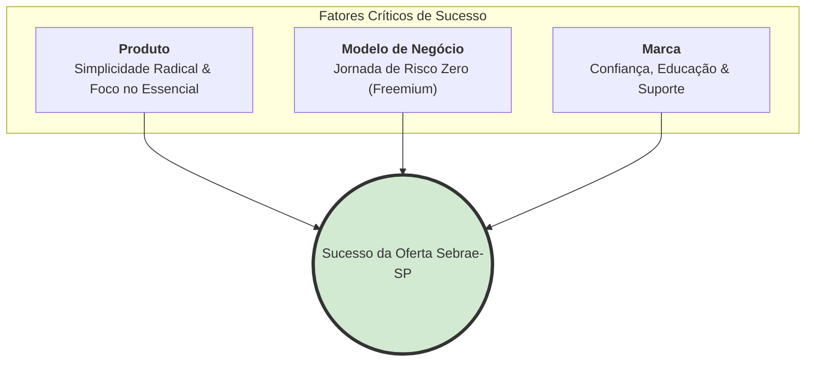
```mermaid
graph TD;
subgraph "Fatores Críticos de Sucesso"
A["<b>Produto</b><br/>Simplicidade Radical & Foco no Essencial"]
B["<b>Modelo de Negócio</b><br/>Jornada de Risco Zero (Freemium)"]
C["<b>Marca</b><br/>Confiança, Educação & Suporte"]
end


Sucesso((Sucesso da Oferta Sebrae-SP))

A --> Sucesso;
B --> Sucesso;
C --> Sucesso;

style Sucesso fill:#D2E9D2,stroke:#333,stroke-width:4px
```

### Imperativos Estratégicos

**[Insight Inferido]:** Para que a iniciativa prospere, a liderança do projeto deve se comprometer com três imperativos:

1.  **Proteger a Simplicidade:** Dizer "não" a funcionalidades que adicionem complexidade ao núcleo da experiência, mesmo que solicitadas por um subgrupo de usuários.
2.  **Investir no Gratuito:** Tratar o plano *freemium* como um produto estratégico, com metas e time dedicados, e não apenas como uma versão limitada do plano pago.
3.  **Operacionalizar a Confiança:** Estruturar as equipes de suporte e sucesso do cliente com profissionais que tenham, além do conhecimento técnico, uma compreensão real dos desafios de gestão de uma PME.

-----

Análise dos Fatores Críticos de Sucesso concluída. Deseja prosseguir para o item final **5.3 Recomendações para o Modelo de Negócio e Go-to-Market**?

# 5.3 Recomendações para o Modelo de Negócio e Go-to-Market

### Síntese

A estratégia recomendada se baseia em um **Modelo de Aquisição Centrado no Valor Imediato** e uma **Estratégia de Go-to-Market focada em Educação e Confiança**. O plano *freemium*, ancorado no Emissor de NFe, deve ser o principal motor de aquisição de usuários em escala. A conversão para planos pagos será uma consequência da jornada educacional dentro da plataforma, e a marca Sebrae, junto a parceiros estratégicos como os contadores, será o combustível de confiança que impulsionará todo o funil.

-----

### Recomendações Detalhadas

  - **1. O Funil de Aquisição Freemium:**
      - **Topo (Aquisição):** Oferecer o **Emissor de NFe como um produto 100% gratuito** e robusto. Esta é a "isca" de maior valor percebido para quebrar a barreira de entrada e construir a maior base de usuários do mercado. A divulgação deve ser massiva em todos os canais Sebrae.
      - **Meio (Conversão):** A conversão para o plano pago deve ser "puxada" pela necessidade do usuário, não "empurrada" pela empresa. Dentro da ferramenta gratuita, apresentar *insights* e "diagnósticos" contextuais (ex: "Vimos que você emitiu X notas este mês. Que tal organizar o financeiro dessas vendas com apenas um clique?"), convidando o usuário a experimentar os benefícios do plano completo.
  - **2. Estrutura de Planos Simples e Escalável:**
      - **Plano Gratuito:** Emissor de NFe/NFSe ilimitado.
      - **Plano Essencial (R$ 79,90/mês):** Ponto de equilíbrio de valor percebido. Inclui o "Tripé Sagrado" completo (Fiscal + Financeiro Simplificado + Controle de Estoque Básico).
      - **Módulos Adicionais (Pagos à parte):** Para usuários mais maduros, oferecer funcionalidades "Uau", como Integração Bancária e Conexão com Canais de Venda, como *add-ons* que podem ser contratados separadamente, reforçando o modelo "pague pelo que usa".
  - **3. Go-to-Market Baseado em Conteúdo e Parcerias:**
      - **Comunicação Educacional:** A principal estratégia de marketing não deve ser a promoção de funcionalidades, mas a oferta de "clínicas de gestão", webinars e tutoriais que ensinam o empreendedor a resolver suas dores utilizando a ferramenta como pano de fundo.
      - **Canal de Parceiros (Contadores):** Desenvolver um programa de parceria robusto para contadores. Eles são os principais influenciadores na decisão de um sistema de gestão. Oferecer a eles um dashboard para gerenciar seus clientes, acesso gratuito e benefícios claros irá transformá-los no principal canal de vendas e validação.

### A Jornada de Adoção Ideal (Perspectiva do Cliente)

> 1.  **Descoberta:** "Preciso emitir nota, é uma dor de cabeça. O Sebrae tem um de graça? Parece seguro, vou testar."
> 2.  **Ativação:** "Nossa, é realmente fácil. E o sistema já está me mostrando um resumo de quanto eu emiti. Interessante."
> 3.  **Conversão:** "Agora o sistema diz que por R$79,90 eu posso controlar todo o meu dinheiro e estoque aqui dentro. Pelo tempo que estou ganhando, parece justo. Vou experimentar."
> 4.  **Expansão:** "Já uso há 6 meses, minha gestão é outra. Agora vi que posso conectar minha conta do banco por mais um valor pequeno. Chega de digitar extrato, vou querer."

### Visualização do Funil Estratégico

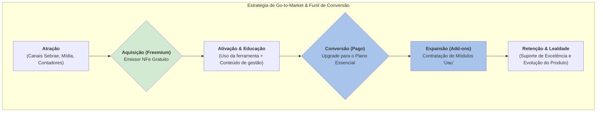
```mermaid
graph TD
subgraph "Estratégia de Go-to-Market & Funil de Conversão"
A["<b>Atração</b><br/>(Canais Sebrae, Mídia, Contadores)"] --> B{"<b>Aquisição (Freemium)</b><br/>Emissor NFe Gratuito"};
B --> C["<b>Ativação & Educação</b><br/>(Uso da ferramenta + Conteúdo de gestão)"];
C --> D{"<b>Conversão (Pago)</b><br/>Upgrade para o Plano Essencial"};
D --> E["<b>Expansão (Add-ons)</b><br/>Contratação de Módulos 'Uau'"];
E --> F["<b>Retenção & Lealdade</b><br/>(Suporte de Excelência e Evolução do Produto)"]
end

style B fill:#D2E9D2
style D fill:#A9C4EB
style E fill:#A9C4EB
```

### Métricas-Chave de Sucesso

**[Plano de Ação Sugerido]:** O sucesso desta estratégia deve ser medido por um conjunto claro de métricas:

  - **Aquisição:** Número de novas empresas ativas no plano *freemium* por mês.
  - **Conversão:** Taxa de conversão de usuários *freemium* para o Plano Essencial.
  - **Retenção:** *Churn Rate* (taxa de cancelamento) mensal dos clientes pagantes.
  - **Engajamento:** Percentual de clientes ativos que utilizam as 3 funcionalidades do "tripé essencial".

-----

Recomendações de Modelo de Negócio e Go-to-Market concluídas. Análise qualitativa finalizada.

# Análise Comparativa: "Gestor Planilheiro" vs. "Gestor Conectado"

### Mapa de Afinidades e Divergências

O diagrama abaixo resume as áreas de sobreposição e as características únicas de cada perfil em relação à gestão e tecnologia.

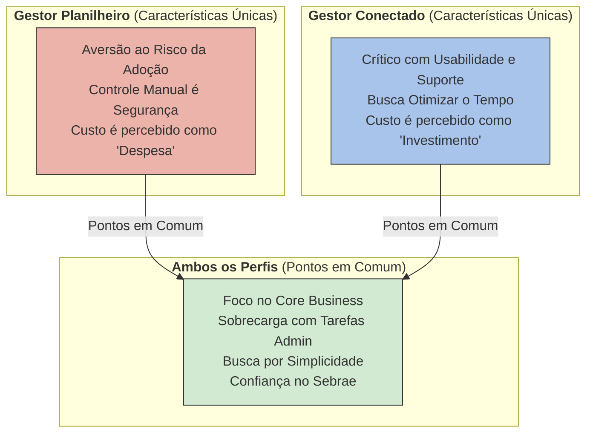
```mermaid
graph TD
subgraph "<b>Gestor Planilheiro</b> (Características Únicas)"
direction LR
A["Aversão ao Risco da Adoção<br/>Controle Manual é Segurança<br/>Custo é percebido como 'Despesa'"]
end
subgraph "<b>Gestor Conectado</b> (Características Únicas)"
direction LR
B["Crítico com Usabilidade e Suporte<br/>Busca Otimizar o Tempo<br/>Custo é percebido como 'Investimento'"]
end
subgraph "<b>Ambos os Perfis</b> (Pontos em Comum)"
direction LR
C["Foco no Core Business<br/>Sobrecarga com Tarefas Admin<br/>Busca por Simplicidade<br/>Confiança no Sebrae"]
end
A -- Pontos em Comum --> C
B -- Pontos em Comum --> C

style A fill:#EBB3A9,stroke:#333
style B fill:#A9C4EB,stroke:#333
style C fill:#D2E9D2,stroke:#333
```

### Detalhamento da Comparação

| Critério de Análise | Perfil A ("Planilheiro") | Perfil B ("Conectado") | Análise |
| :--- | :--- | :--- | :--- |
| **Gatilho para Mudança** | Dor crônica, ainda tolerável. Ação é evitada. | Ponto de ruptura. Dor se tornou insuportável. | **Divergência** |
| **Principal Barreira** | Medo da complexidade, custo e risco da escolha. | Custo-benefício e falhas da ferramenta atual. | **Divergência** |
| **Percepção de Custo** | Visto como **Despesa** a ser evitada. | Visto como **Investimento** a ser otimizado. | **Divergência** |
| **Fonte de Controle** | Familiaridade com ferramentas manuais (planilhas). | Automação e centralização de dados no sistema. | **Divergência** |
| **Ponto Comum** | Ambos são centralizadores e sobrecarregados pela gestão. | Ambos valorizam a simplicidade e confiam no Sebrae. | **Convergência** |

-----

Snippet comparativo de perfis gerado. Aguardando comando para a Etapa 7.

# Análise Dupla de Co-ocorrência: Rede Estrutural e Matriz de Força

Para uma compreensão profunda de como os temas se conectam, utilizamos duas visualizações complementares. A primeira mostra a estrutura e os clusters da conversa, enquanto a segunda detalha a força específica de cada link.

-----

### 1. A Estrutura da Conversa (Grafo de Rede)

O grafo de rede ilustra os principais "bairros" de tópicos na mente dos empreendedores e como eles se conectam.

```mermaid
graph TD
subgraph "Cluster 1: Barreiras à Adoção"
T1["T1: Custo"]
T2["T2: Complexidade"]
end


subgraph "Cluster 2: Benefícios da Solução"
    T3["T3: Economia de Tempo"]
    T4["T4: Controle / Visão de Dados"]
end

T5["T5: Confiança (Sebrae)"]

T1 --- T2;
T3 --- T4;
T5 --- T1;
T5 --- T2;
T5 --- T4;
```

**Leitura do Grafo:** A conversa se divide claramente em dois universos opostos: o das **Barreiras à Adoção** (onde vivem as preocupações dos "Planilheiros") e o dos **Benefícios da Solução** (onde residem os valores para os "Conectados"). O tema **Confiança (T5)** é o elemento mais estratégico do mapa, pois atua como a única ponte capaz de conectar as barreiras aos benefícios, sendo o catalisador para a jornada de adoção.

-----

### 2. A Força das Conexões (Matriz de Co-ocorrência)

A matriz a seguir quantifica a força de cada conexão mostrada no grafo, permitindo-nos ver quais links são mais fortes e recorrentes nas falas.

|             | Custo | Complexidade | Tempo | Controle | Confiança |
| :---------- | :---: | :----------: | :---: | :------: | :-------: |
| **Custo** |   -   |       🔥       |   💧   |    ❄️     |     🔥     |
| **Complexidade**|   🔥   |      -       |   💧   |    ❄️     |     🔥     |
| **Tempo**|   💧   |      💧       |   -   |    🔥     |     💧     |
| **Controle**|   ❄️   |      ❄️       |   🔥   |    -     |     🔥     |
| **Confiança**|   🔥   |       🔥       |   💧   |    🔥     |     -     |

**Legenda:** 🔥 (Conexão Forte) | 💧 (Conexão Moderada) | ❄️ (Conexão Fraca/Inexistente)

**Leitura da Matriz:** A matriz reforça o papel central da Confiança. As conexões mais fortes (🔥) são o par **Custo-Complexidade** (as barreiras gêmeas) e o par **Tempo-Controle** (o objetivo final). Crucialmente, a **Confiança** apresenta conexões fortes com todas essas pontas: ela está fortemente ligada tanto às barreiras que precisa neutralizar (Custo, Complexidade) quanto ao benefício que precisa entregar (Controle).

-----

### Síntese Combinada

A combinação das duas análises é conclusiva: se a conversa se organiza em polos de "Problema" (Barreiras) e "Solução" (Benefícios), a **Confiança** é o caminho que leva de um ao outro. O grafo mostra que ela é a única ponte estrutural, e a matriz prova que suas conexões com os pontos mais sensíveis da jornada (Custo, Complexidade, Controle) são as mais fortes (🔥). Portanto, a estratégia de comunicação e de produto não deve tratar a Confiança como um tema, mas como o alicerce de toda a oferta.

-----

Análise combinada de rede e matriz gerada como Etapa 7.5. Aguardando comando para a Etapa 8.

# Conclusão e Recomendações Estratégicas

## Síntese dos Resultados

A pesquisa revela que o universo do pequeno empreendedor se divide em dois perfis distintos, o "Gestor Planilheiro" e o "Gestor Conectado", ambos sobrecarregados pela gestão, mas separados por sua relação com a dor e a tecnologia. O "Planilheiro" vive aprisionado por um muro de barreiras (custo, complexidade, desconhecimento), enquanto o "Conectado" já superou esse muro, mas convive com as frustrações de ferramentas imperfeitas. A análise de correlação demonstra que a **Confiança** é o único elemento capaz de construir a ponte entre esses dois mundos. Conclui-se que a oportunidade para o Sebrae-SP não é simplesmente lançar mais um software, mas alavancar seu ativo mais forte — a confiança — para oferecer um ecossistema completo que une ferramenta, educação e suporte, redefinindo o conceito de sistema de gestão para este público.

## Resposta aos Objetivos do Estudo

  - **Fatores Críticos de Sucesso:** Os três fatores críticos para o sucesso da oferta são: **1) Simplicidade Radical do Produto**, com foco obsessivo no "tripé essencial" (Fiscal, Financeiro, Estoque); **2) Modelo de Negócio de Risco Zero**, com uma porta de entrada *freemium* para construir confiança e um modelo de assinatura modular e justo; **3) Alavancagem Estratégica da Marca Sebrae**, posicionando a oferta não como um software, mas como uma solução de gestão completa com o selo de confiança e o DNA educacional da instituição.

  - **Necessidades, Funcionalidades e Modelos:**

      - As **necessidades reais** são a automação de tarefas dolorosas (NFe, conciliação), enquanto a **necessidade latente** é a busca por "paz de espírito" e um sentimento de controle sobre o negócio.
      - As **funcionalidades essenciais** são o "tripé" Fiscal, Financeiro e Estoque. Os **diferenciais competitivos** de maior impacto são as conexões com o ecossistema do PME (integração bancária, canais de venda).
      - O **modelo de negócio** ideal é o *Freemium*, que atrai usuários pela resolução de uma dor universal (NFe gratuita) e os converte para um plano pago modular (faixa de R$50-R$150/mês) à medida que percebem valor e ganham confiança.

## Hierarquia de Insights

O diagrama abaixo organiza os achados da pesquisa em uma pirâmide, partindo das evidências fundamentais até o insight mais estratégico para o Sebrae-SP.

```mermaid
graph TD
subgraph "Pirâmide de Insights Estratégicos"
direction TB
A["<b><font size=4>Oportunidade: Criar um Ecossistema de Gestão, não apenas um software.</font></b>"]
B["<b>Produto Ideal:</b> Foco no 'Essencial' com Simplicidade Radical"]
C["<b>Go-to-Market Ideal:</b> Modelo 'Freemium-Educacional' baseado em Confiança"]
D["<b>Achado:</b> Empreendedor é sobrecarregado e avesso à complexidade."]
E["<b>Achado:</b> Adoção de tecnologia é reativa a uma dor que se tornou insuportável."]
F["<b>Achado:</b> Confiança (Marca Sebrae) é o principal ativo para quebrar as barreiras de entrada."]
D -- Base para --> B
E -- Base para --> B
E -- Base para --> C
F -- Base para --> C
B -- Suporta --> A
C -- Suporta --> A
end
```

-----

Snippet de conclusão gerado. Aguardando comando para a Etapa 9.

## Plano de Ação Sugerido

### Cronograma Visual de Implementação (Gantt)

```mermaid
gantt
title Cronograma de Lançamento - Ecossistema de Gestão Sebrae
dateFormat  YYYY-MM-DD
axisFormat %m/%Y
section Produto & Tecnologia
MVP "Tripé Essencial"     :done,    mvp, 2025-09-04, 90d
Desenvolvimento Add-on "Integração Bancária" :         addon, after mvp, 75d

section Go-to-Market & Marketing
Estruturação Campanha Freemium :done,  gtm, 2025-09-15, 75d
Lançamento Oficial & Aquisição :active, launch, 2026-01-15, 120d

section Parcerias & Ecossistema
Estruturação Programa de Contadores :done, parc, 2025-10-01, 60d
Produção de Conteúdo Educacional    :active, edu, after gtm, 90d
```

### Detalhamento das Ações

1.  **Produto & Tecnologia**

      - **Ação:** Priorizar o desenvolvimento de um Protótipo de Mínima Viabilidade (MVP) focado exclusivamente no "Tripé Essencial" (Fiscal, Financeiro e Estoque), com obsessão pela simplicidade e usabilidade.
      - **Justificativa:** A pesquisa demonstrou que a causa nº 1 de insatisfação e a maior barreira à adoção é a complexidade. Acertar no básico com perfeição é mais importante do que ter muitas funcionalidades.
      - **Prazo:** Conclusão do MVP até Dez/2025.

2.  **Go-to-Market & Marketing**

      - **Ação:** Lançar a solução ao mercado utilizando uma estratégia *freemium*, com o Emissor de NFe como produto de aquisição gratuito e robusto.
      - **Justificativa:** Este modelo ataca diretamente as principais barreiras de Custo e Risco, permitindo que o empreendedor experimente o valor da ferramenta sem compromisso e construa a confiança necessária para o upgrade.
      - **Prazo:** Lançamento oficial em Jan/2026.

3.  **Parcerias & Ecossistema**

      - **Ação:** Desenvolver e estruturar um Programa de Parceria para Contadores antes do lançamento oficial do produto.
      - **Justificativa:** A pesquisa identifica o contador como o principal influenciador na decisão de um sistema de gestão. Tê-los como parceiros e defensores da solução é um fator crítico para a capilaridade e validação no mercado.
      - **Prazo:** Estruturação finalizada em Dez/2025.