# Análise do Briefing: Especialização Segmentada

## 1.0 Objetivos da Pesquisa
### 1.1 Objetivo Principal
- O objetivo geral é investigar como diferentes modelos de atendimento (genérico, ajustado à realidade do negócio ou especializado) impactam a percepção de valor, a experiência e os resultados para os donos de pequenos negócios, a fim de apoiar as decisões estratégicas do Sebrae-SP sobre sua oferta e posicionamento.

### 1.2 Objetivos Secundários
- Identificar o valor percebido por empreendedores em cada um dos três modelos de atendimento (genérico, ajustado ou especializado).
- Determinar qual nível de especialização é mais desejado pelos clientes.
- Mapear as práticas internas que contribuem para a competitividade dos negócios, como controle financeiro, organização e uso de ferramentas digitais.
- Avaliar a percepção atual do atendimento oferecido pelo Sebrae-SP.
- Comparar a relevância percebida do Sebrae-SP com outras fontes de informação ou apoio, como infoprodutos e *influencers*.
- Investigar os principais desafios enfrentados pelas micro e pequenas empresas (MPEs).
- Analisar o perfil de empreendedores que estariam dispostos a pagar por um modelo mais ajustado ou especializado.

## 2.0 Metodologia
- **Público-Alvo:** Donos de Microempresas (ME) e Empresas de Pequeno Porte (EPP). O universo de pesquisa inclui empreendedores atendidos pelo Sebrae-SP em 2024 e clientes que participaram da pesquisa de percepção de faturamento em 2024.
- **Técnica:** A pesquisa será dividida em duas etapas: qualitativa e quantitativa. A fase qualitativa consistirá em 6 encontros em grupo, com perfis distintos: 2 grupos de ME, 2 grupos de EPP (ambos atendidos pelo Sebrae em 2024) e 2 grupos de empreendedores que responderam à pesquisa de faturamento de 2024.
- **Período:** A execução da pesquisa está prevista para o período de agosto a novembro de 2025. A etapa de grupos de discussão (qualitativa) deve ser concluída até 10/09/2025.

## 3.0 Pontos de Foco para Análise
- Níveis de atendimento a serem investigados: **Genérico**, **Ajustado à realidade** e **Especializado/Hiperespecializado**.
- A valorização de um atendimento mais ajustado, mesmo que não seja hiperespecializado.
- A disposição dos empreendedores em pagar por um serviço de atendimento mais customizado.
- A comparação do modelo de atendimento do Sebrae-SP com um sistema de saúde (atendimento geral seguido de encaminhamento especializado).
- Identificação dos principais desafios e das práticas de gestão que impactam o desempenho das MPEs.

---

## Mapeamento do Roteiro de Discussão

### Bloco 1: Boas-vindas e Apresentações
- **Pergunta-chave:** *Qual a principal dificuldade ou desafio que sua empresa enfrenta hoje?*
- **Tópicos de apoio:**
    - *Nome, empresa, cidade, tempo de empresa e setor de atuação (comércio, serviço, indústria, agronegócio).*
    - *Apresentar o objetivo do encontro e as regras básicas da conversa.*

### Bloco 2: Necessidades e Busca por Ajuda
- **Pergunta-chave:** *Quando o principal problema que vocês enfrentam apareceu, vocês procuraram algum tipo de ajuda para resolvê-lo? Se sim, qual e onde?*
- **Tópicos de apoio:**
    - *Momentos críticos na jornada (abertura, expansão, crise, crédito, digitalização, etc.).*
    - *Fontes de apoio consultadas (Sebrae, consultorias privadas, mentores, cursos online, YouTube, etc.).*

### Bloco 3: Modelos de Atendimento do Sebrae
- **Pergunta-chave:** *O que vocês esperam de um atendimento ideal do Sebrae que seja mais ajustado à realidade do seu negócio?*
- **Tópicos de apoio:**
    - *Discussão sobre os modelos de atendimento (Genérico, Ajustado e Especializado).*
    - *Nível de satisfação com o atendimento genérico (cursos amplos).*
    - *Nível de satisfação com o atendimento especializado (focado no setor).*
    - *Disposição para pagar por um atendimento mais customizado e/ou especializado.*

### Bloco 4: Estratégias e Competitividade
- **Pergunta-chave:** *Quais práticas internas mais contribuem para o desempenho e crescimento dos negócios de vocês?*
- **Tópicos de apoio:**
    - *Habilidades e conhecimentos que os empresários já dominam.*
    - *Diferenciais competitivos da própria empresa (preço, qualidade, atendimento, etc.).*
    - *O que as empresas concorrentes fazem que as tornam fortes.*
    - *Qual o grau de importância de ter acesso a conteúdos, soluções e consultorias específicas para o setor?*

---

### Proposta de Estrutura do Relatório

#### Mapa Mental da Estrutura

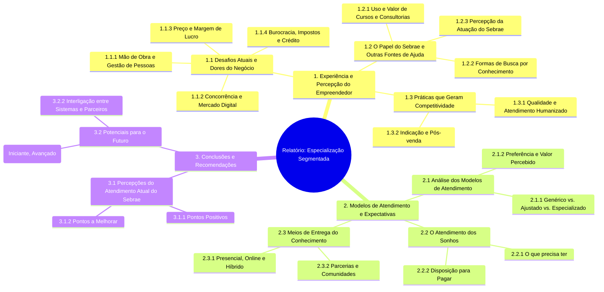
```mermaid
mindmap
    root((Relatório: Especialização Segmentada))
        1. Experiência e Percepção do Empreendedor
            ::icon(fa fa-smile)
                1.1 Desafios Atuais e Dores do Negócio
                    1.1.1 Mão de Obra e Gestão de Pessoas
                    1.1.2 Concorrência e Mercado Digital
                    1.1.3 Preço e Margem de Lucro
                    1.1.4 Burocracia, Impostos e Crédito
                1.2 O Papel do Sebrae e Outras Fontes de Ajuda
                    1.2.1 Uso e Valor de Cursos e Consultorias
                    1.2.2 Formas de Busca por Conhecimento
                    1.2.3 Percepção da Atuação do Sebrae
                1.3 Práticas que Geram Competitividade
                    1.3.1 Qualidade e Atendimento Humanizado
                    1.3.2 Indicação e Pós-venda
        2. Modelos de Atendimento e Expectativas
            ::icon(fa fa-lightbulb)
                2.1 Análise dos Modelos de Atendimento
                    2.1.1 Genérico vs. Ajustado vs. Especializado
                    2.1.2 Preferência e Valor Percebido
                2.2 O Atendimento dos Sonhos
                    2.2.1 O que precisa ter
                    2.2.2 Disposição para Pagar
                2.3 Meios de Entrega do Conhecimento
                    2.3.1 Presencial, Online e Híbrido
                    2.3.2 Parcerias e Comunidades
        3. Conclusões e Recomendações
            ::icon(fa fa-chart-line)
                3.1 Percepções do Atendimento Atual do Sebrae
                    3.1.1 Pontos Positivos
                    3.1.2 Pontos a Melhorar
                3.2 Potenciais para o Futuro
                    3.2.1 Atendimento Focado em Nível (Iniciante, Avançado)
                    3.2.2 Interligação entre Sistemas e Parceiros
```

-----

### Índice Detalhado

- 1.0 **Experiência e Percepção do Empreendedor**
    - 1.1 **Desafios Atuais e Dores do Negócio**
        - 1.1.1 Mão de Obra e Gestão de Pessoas
        - 1.1.2 Concorrência e Mercado Digital (Marketplace, E-commerce)
        - 1.1.3 Preço, Margem de Lucro e Estoque
        - 1.1.4 Burocracia, Impostos e Linhas de Crédito
    - 1.2 **O Papel do Sebrae e Outras Fontes de Ajuda**
        - 1.2.1 Uso e Valor de Cursos, Consultorias e Eventos
        - 1.2.2 Formas de Busca por Conhecimento (Google, YouTube, Redes Sociais, etc.)
        - 1.2.3 Percepção da Atuação Atual do Sebrae (Proatividade, Relevância)
    - 1.3 **Práticas que Geram Competitividade**
        - 1.3.1 Qualidade do Produto/Serviço e Atendimento Humanizado
        - 1.3.2 Poder da Indicação e Pós-venda
- 2.0 **Modelos de Atendimento e Expectativas**
    - 2.1 **Análise dos Modelos de Atendimento**
        - 2.1.1 Atendimento Genérico (cursos amplos)
        - 2.1.2 Atendimento Ajustado (focado na operação do negócio, e-commerce, loja física)
        - 2.1.3 Atendimento Especializado (focado no setor, ex: construção civil, comércio)
    - 2.2 **O Atendimento dos Sonhos**
        - 2.2.1 O que um serviço ideal precisa ter (escuta ativa, conhecimento de mercado, acompanhamento)
        - 2.2.2 Disposição para Pagar por serviços mais customizados
    - 2.3 **Meios de Entrega do Conhecimento**
        - 2.3.1 Preferência por Presencial, Online ou Híbrido
        - 2.3.2 Parcerias e Comunidades como forma de apoio
- 3.0 **Conclusões e Recomendações**
    - 3.1 **Percepções do Atendimento Atual do Sebrae**
        - 3.1.1 Pontos Fortes e Positivos
        - 3.1.2 Pontos a Melhorar (conteúdo raso, falta de especialização)
    - 3.2 **Potenciais para o Futuro**
        - 3.2.1 Atendimento Focado por Níveis de Maturidade do Negócio/Empreendedor (iniciante, intermediário, avançado)
        - 3.2.2 Criação de Comunidades e Interligação entre Sistemas e Parceiros

-----

# 1.0. Experiência e Percepção do Empreendedor

### Síntese

A principal tensão na experiência dos empreendedores reside na luta diária para equilibrar práticas tradicionais de sucesso (como o atendimento de qualidade e o boca a boca) com a necessidade urgente de se adaptar a um mercado cada vez mais digital e competitivo. Essa realidade é exacerbada por uma percepção de mão de obra desqualificada e de altos custos operacionais, que limitam o crescimento e a capacidade de inovar.

-----

### Análise Detalhada

  - **A mão de obra é o maior gargalo:** A dificuldade em encontrar e reter colaboradores qualificados e comprometidos é um problema central e unânime entre todos os perfis de empreendedores, de microempresas a EPPs. Essa dor é especialmente sentida em setores de serviço e produção manual (construção civil, serralheria, restaurantes), onde os empresários se veem sobrecarregados pela gestão e pela operação, centralizando funções que deveriam ser delegadas. Há uma percepção de que a "nova geração" não possui o mesmo comprometimento com o trabalho, focando apenas no salário e nos direitos, sem valorizar a oportunidade ou o aprendizado.

  - **A transição digital é um desafio complexo:** A maioria dos empreendedores reconhece a importância do digital, mas enfrenta barreiras significativas. A concorrência com grandes `marketplaces` e `e-commerces` com preços agressivos dificulta a captação de clientes e erode as margens de lucro, principalmente para lojas físicas. O marketing digital, embora visto como necessário, é percebido como complexo, caro e de retorno incerto, com muitos relatos de investimentos altos sem resultados tangíveis. Ainda que a indicação e o "boca a boca" permaneçam como a principal fonte de novos clientes, o digital se tornou uma vitrine indispensável.

> **Voz do Cliente:**
> "A molecada não quer aprender... não entra na cabeça deles raciocinar, raciocínio rápido a pessoa vem aí eu preciso de tal coisa tem aquilo parecido que vai resolver a situação eles não eles não querem pensar."
> -- *Fábio, Grupo 6 (Faturamento)*

### Visualização dos Conceitos

Este mapa de conceitos ilustra como os participantes conectam os **Desafios do Empreendedor** com outros sentimentos e percepções chave.

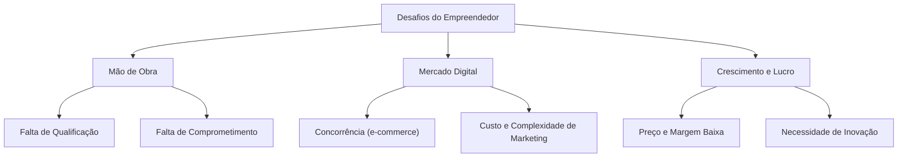
```mermaid
graph TD;
A["Desafios do Empreendedor"] --> B["Mão de Obra"]
B --> C["Falta de Qualificação"];
B --> D["Falta de Comprometimento"];
A --> E["Mercado Digital"]
E --> F["Concorrência (e-commerce)"];
E --> G["Custo e Complexidade de Marketing"];
A --> H["Crescimento e Lucro"]
H --> I["Preço e Margem Baixa"];
H --> J["Necessidade de Inovação"];
```

### Implicações

**[Insight Inferido]:** A principal implicação é que a maioria dos empreendedores está presa em um ciclo reativo e operacional, dedicando tempo e energia a resolver problemas imediatos (como contratar, treinar ou fazer a loja ser "encontrada" online), em vez de focar no crescimento estratégico. O mercado tem uma necessidade latente por soluções que não apenas ofereçam conhecimento teórico, mas que também forneçam apoio prático e contínuo para enfrentar esses desafios diários, permitindo que o empreendedor se liberte do operacional para pensar no futuro do negócio.

-----

Deseja um aprofundamento com uma Matriz SWOT focada apenas neste tema?

---

# 1.1 Desafios Atuais e Dores do Negócio

### Síntese

Apesar da diversidade de setores, os empreendedores compartilham dores em três frentes principais: a escassez e o baixo comprometimento da mão de obra, a dificuldade em se posicionar no mercado digital em meio a uma concorrência agressiva, e a gestão dos altos custos operacionais e da burocracia, que impactam diretamente a margem de lucro e o fluxo de caixa.

-----

### Análise Detalhada

  - **Mão de Obra e Gestão de Pessoas:** Este é o desafio mais recorrente, com a maioria dos empreendedores relatando dificuldades em encontrar funcionários qualificados e comprometidos. As críticas se concentram na "nova geração", que é vista como pouco interessada e mais focada em benefícios do que em crescimento profissional. Essa falta de apoio leva muitos empresários a centralizar as operações e a se sobrecarregarem, limitando a capacidade de expansão.

  - **Concorrência e Mercado Digital:** O mercado digital é tanto uma necessidade quanto um obstáculo. Empresários de longa data (como os dos grupos de EPPs e Faturamento) reconhecem que precisam ter uma presença online, mas lutam para competir com `marketplaces` e grandes `e-commerces`. Eles se sentem em desvantagem devido aos altos custos para anunciar e à percepção de que suas margens de lucro são menores do que as dos concorrentes online. A busca por novos clientes qualificados, tanto no online quanto no físico, é uma dor transversal, especialmente no comércio.

  - **Burocracia, Impostos e Crédito:** A instabilidade econômica e a alta carga tributária são vistas como um "ambiente hostil" que dificulta a sobrevivência dos negócios. O acesso a crédito com juros baixos é uma necessidade urgente, mas a maioria relata barreiras e um processo difícil para obtê-lo. Para muitos, a gestão financeira e a precificação correta são desafios constantes, que se tornam mais complexos à medida que a empresa cresce.

> **Voz do Cliente:**
> “Hoje, o que está mais difícil para mim é linha de crédito. Eu gostaria que o Sebrae me ajudasse nessa parte de… entender a sua dor. A minha dor é linha de crédito.”
> — *Lucy, Grupo 6 (Faturamento)*

### Visualização dos Conceitos

Este mapa de conceitos ilustra a interconexão entre os principais desafios enfrentados pelos empreendedores.

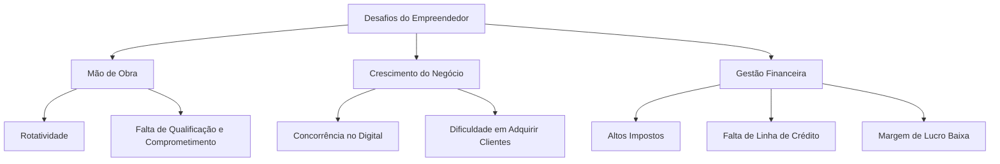
```mermaid
graph TD;
A["Desafios do Empreendedor"] --> B["Mão de Obra"]
B --> C["Rotatividade"];
B --> D["Falta de Qualificação e Comprometimento"];
A --> E["Crescimento do Negócio"]
E --> F["Concorrência no Digital"];
E --> G["Dificuldade em Adquirir Clientes"];
A --> H["Gestão Financeira"]
H --> I["Altos Impostos"];
H --> J["Falta de Linha de Crédito"];
H --> K["Margem de Lucro Baixa"];
```

### Implicações

**[Insight Inferido]:** Os desafios operacionais e burocráticos consomem o tempo e os recursos dos empreendedores, desviando o foco do crescimento e da inovação. Essa sobrecarga crônica impede que muitos se aprofundem em estratégias de mercado e capacitação, perpetuando um ciclo de "apagar incêndios". A solução não pode ser apenas teórica, mas deve incluir ferramentas e apoio prático para resolver essas questões imediatas.

-----
***

### **Matriz de Hierarquização de Problemas (Frequência x Impacto)**

#### **1. Prioridade Máxima (Alta Frequência, Alto Impacto)**
* **Mão de Obra e Gestão de Pessoas:** Este problema é quase universal, com todos os grupos destacando a dificuldade em encontrar e reter funcionários qualificados e comprometidos. O impacto é direto na capacidade de crescimento, na qualidade do serviço e na sobrecarga dos empresários.
* **Concorrência e Mercado Digital:** A competição com grandes varejistas e `marketplaces` é uma dor constante, impactando as vendas e a margem de lucro. Embora a presença online seja vista como obrigatória, muitos se sentem despreparados ou frustrados com os custos e a complexidade do marketing digital.

***

#### **2. Alta Prioridade (Média Frequência, Alto Impacto)**
* **Acesso a Crédito e Capital de Giro:** A necessidade de capital de giro com custos acessíveis é um tema recorrente, especialmente em momentos de expansão ou crise, como a pós-pandemia. A dificuldade em obter esse suporte financeiro é vista como uma barreira crítica para o desenvolvimento dos negócios.
* **Margens de Lucro Baixas:** Um problema central em setores como varejo, alimentação e tecnologia. A percepção é que o alto custo de impostos, fornecedores e mão de obra, combinado com a concorrência de preços, espreme o lucro, mesmo para empresas com bom faturamento.

***

#### **3. Média Prioridade (Média Frequência, Médio Impacto)**
* **Conteúdo Raso nas Consultorias:** A crítica sobre a falta de qualidade e profundidade em alguns cursos ou consultorias do Sebrae é um ponto sensível. Empreendedores experientes sentem que o conteúdo é "muito aquém do que a gente precisa" e muitas vezes genérico, sem atender às especificidades do negócio.
* **Burocracia e Impostos:** A carga tributária e o "peso do governo" são citados como fatores que tornam o ambiente de negócios hostil e geram incerteza na gestão.
* **Organização de Processos:** Especialmente para empresas em transição (expansão, digitalização, sucessão familiar), a organização de processos administrativos e operacionais é um desafio que se agrava com a falta de mão de obra e o excesso de responsabilidades centralizadas no proprietário.

***

Esta matriz está aprovada para iniciarmos a análise detalhada do próximo tema na Etapa 5?

---

# 1.1.2 Concorrência e Mercado Digital

### Síntese

A transição para o mercado digital é vista como inevitável e necessária, mas é marcada por uma tensão significativa. Empreendedores lutam para competir com a concorrência agressiva de grandes plataformas, sentem-se despreparados para o marketing digital e se frustram com os altos custos e a complexidade de operar nesses novos canais.

-----

### Análise Detalhada

  * **Concorrência e preços agressivos:** A competição com gigantes como Mercado Livre e Magalu é uma das maiores dores do mercado digital. Para os pequenos negócios, especialmente no varejo, é quase impossível competir com os preços de venda e os prazos de entrega que essas grandes plataformas oferecem.
  * **Dificuldade e custo do marketing digital:** A maioria dos empreendedores reconhece a importância do marketing digital para "se fazer vista". No entanto, muitos não têm tempo, conhecimento ou recursos para gerenciar redes sociais e `marketplaces`. Há relatos de que consultorias e agências digitais cobram caro e não entregam os resultados esperados, deixando os empreendedores com a sensação de ter investido sem retorno.
  * **Margem de lucro e taxas de plataforma:** A operação em `marketplaces` e a necessidade de se manter competitivo levam a uma redução drástica nas margens de lucro. As altas taxas de venda e de serviço cobradas por essas plataformas são consideradas um fardo oneroso, que muitas vezes tornam a operação inviável para os pequenos negócios.

> **Voz do Cliente:**
> “Hoje, eu vejo que as lojas físicas elas vão, lógico, continuar existindo, mas se elas não se voltar para essa questão do `marketplace`, vai ser muito difícil você sobreviver. […] se você não tiver lá dentro também, você vai quebrar.” 
> — *Lino, Grupo 1 (ME)*

### Visualização dos Conceitos

Este mapa mental ilustra a relação entre a **Concorrência Digital**, as **Dores do Empreendedor** e as **Consequências** para o negócio.

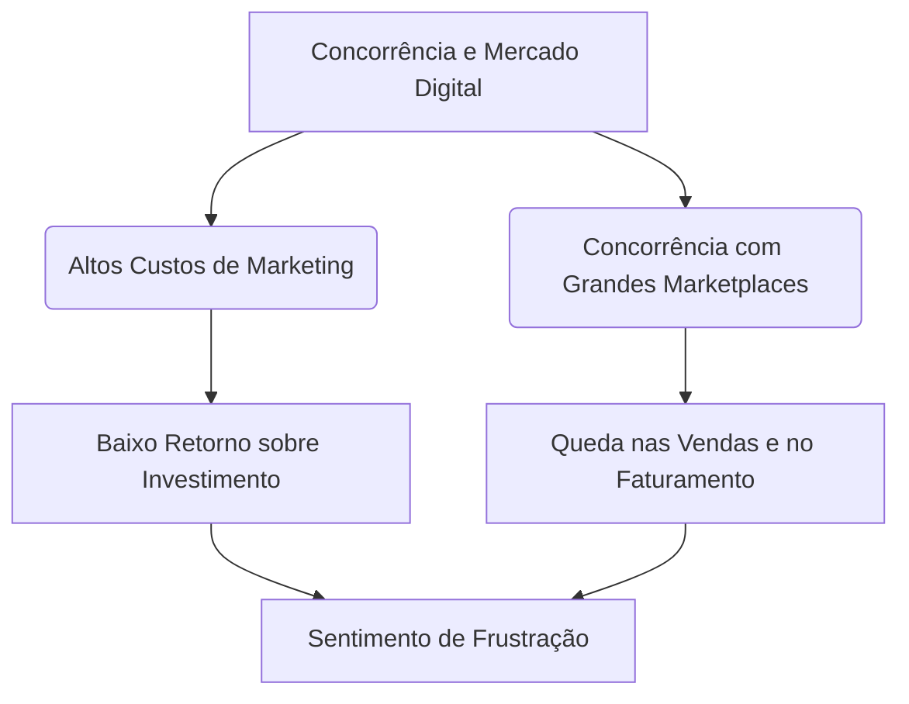
```mermaid
graph TD;
A[Concorrência e Mercado Digital] --> B(Altos Custos de Marketing);
A --> C(Concorrência com Grandes Marketplaces);
B --> D[Baixo Retorno sobre Investimento];
C --> E[Queda nas Vendas e no Faturamento];
D --> F[Sentimento de Frustração];
E --> F;
```

### Implicações

**[Insight Inferido]:** A adaptação digital não é apenas uma questão de ter um site ou perfil em rede social, mas de dominar a gestão e a estratégia desses canais. Existe uma grande oportunidade para soluções que ensinem o "passo a passo" prático e ajudem a entender o algoritmo, oferecendo ferramentas e acompanhamento para que o empreendedor possa competir de forma eficaz, sem ser sobrecarregado por custos ou por soluções genéricas que não geram resultados.

-----

Deseja um aprofundamento com uma Matriz de Hierarquização de Problemas, classificando-os por frequência e impacto percebido?

# 1.1.4 Burocracia, Impostos e Linhas de Crédito

### Síntese

A alta carga tributária e a burocracia são percebidas como um "ambiente hostil" que dificulta a operação dos pequenos negócios. A falta de acesso a linhas de crédito com taxas de juros acessíveis é um obstáculo crítico para o crescimento e a sobrevivência das empresas, especialmente em momentos de crise.

-----

### Análise Detalhada

  * **Burocracia e Impostos:** A percepção de um "ambiente hostil" para empreender no Brasil é uma dor compartilhada. A alta carga de impostos é vista como um peso que "quase que não te deixam a opção de você viver". A complexidade fiscal e a necessidade de se manter atualizado com a legislação são desafios constantes para empresas, tanto as que estão no mercado há pouco tempo quanto as que já estão há mais de 20 anos.
  * **Falta de Acesso a Crédito:** A necessidade de capital de giro é urgente, mas a maioria dos empreendedores enfrenta dificuldades para obter crédito com taxas de juros baixas. Em momentos de crise ou expansão, essa falta de acesso se torna um impeditivo direto para o crescimento. A percepção é que o governo não incentiva o pequeno investidor e que os bancos privados oferecem condições muito difíceis.
  * **Gestão Financeira:** A precificação e a gestão do fluxo de caixa são desafios recorrentes, que se tornam mais complexos à medida que a empresa cresce. A falta de conhecimento sobre como lidar com essas questões pode levar a prejuízos significativos, como no caso de um empreendedor que acumulou R$ 90 mil em impostos por falta de orientação.

> **Voz do Cliente:**
> “Eu acho que aqui provavelmente é generalizado, o maior custo hoje de uma pequena e média empresa é o imposto. Não é assim, é quase que impossível você sobreviver pagando o custo tributário. Eles quase que não te deixam a opção de você viver. O que o Sebrae pode ajudar nesse ponto?”
> -- *Luciano, Grupo 4 (EPP)*

### Visualização dos Conceitos

Este mapa de conceitos ilustra a relação entre a **Burocracia** e as **Consequências** que ela gera para a saúde financeira e o crescimento do negócio.

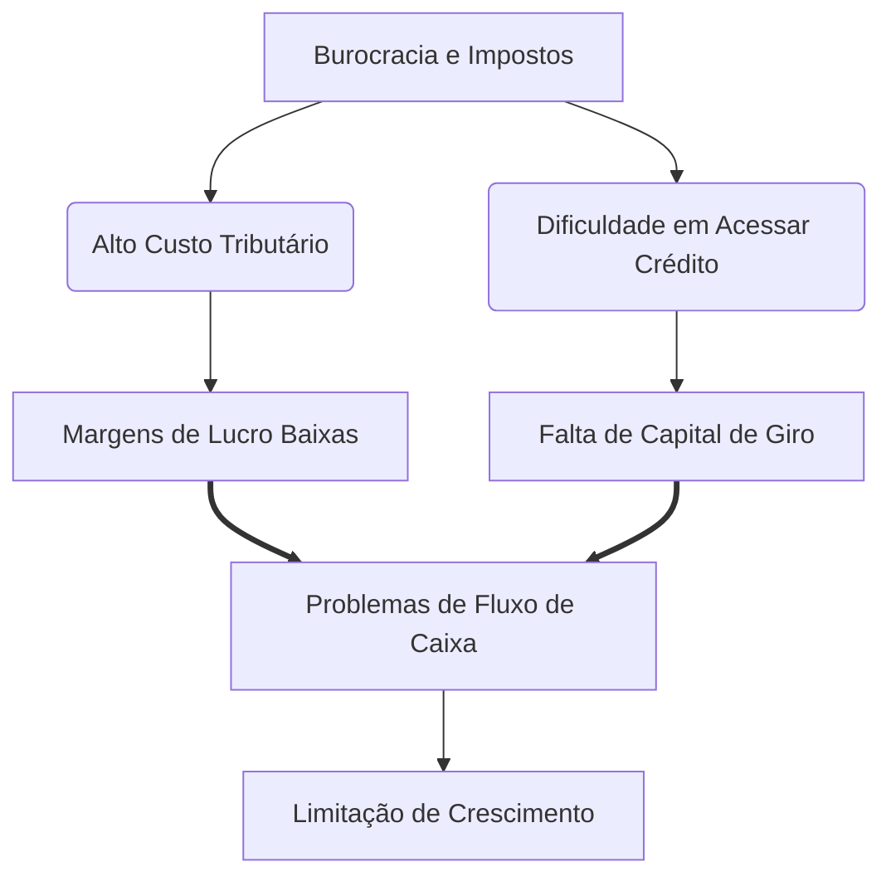
```mermaid
graph TD;
A[Burocracia e Impostos] --> B(Alto Custo Tributário);
A --> C(Dificuldade em Acessar Crédito);
B --> D[Margens de Lucro Baixas];
C --> E[Falta de Capital de Giro];
D ==> F[Problemas de Fluxo de Caixa];
E ==> F;
F --> G[Limitação de Crescimento];
```

### Implicações

**[Insight Inferido]:** A gestão burocrática e financeira se mostra como uma barreira existencial para os empreendedores, limitando seu oxigênio e a capacidade de expansão. O Sebrae tem a oportunidade de atuar como um "facilitador", não só oferecendo cursos sobre temas técnicos como tributação, mas também intermediando o acesso a linhas de crédito e capital de giro, aliviando o peso financeiro e permitindo que as empresas respirem.

-----

Deseja um aprofundamento na Etapa 5 com uma Matriz de Hierarquização de Problemas para Burocracia, Impostos e Linhas de Crédito?

---

Com base na análise das transcrições, a matriz a seguir hierarquiza os problemas mais comuns, classificando-os de acordo com a frequência de menções e o impacto percebido pelos participantes.

***

### **Matriz de Hierarquização de Problemas (Frequência x Impacto)**

#### **1. Prioridade Máxima (Alta Frequência, Alto Impacto)**
* **Mão de Obra e Gestão de Pessoas:** Este problema é quase universal, com todos os grupos destacando a dificuldade em encontrar e reter funcionários qualificados e comprometidos. O impacto é direto na capacidade de crescimento, na qualidade do serviço e na sobrecarga dos empresários.
* **Concorrência e Mercado Digital:** A competição com grandes varejistas e `marketplaces` é uma dor constante, impactando as vendas e a margem de lucro. Embora a presença online seja vista como obrigatória, muitos se sentem despreparados ou frustrados com os custos e a complexidade do marketing digital.

***

#### **2. Alta Prioridade (Média Frequência, Alto Impacto)**
* **Acesso a Crédito e Capital de Giro:** A necessidade de capital de giro com custos acessíveis é um tema recorrente, especialmente em momentos de expansão ou crise, como a pós-pandemia. A dificuldade em obter esse suporte financeiro é vista como uma barreira crítica para o desenvolvimento dos negócios.
* **Margens de Lucro Baixas:** Um problema central em setores como varejo, alimentação e tecnologia. A percepção é que o alto custo de impostos, fornecedores e mão de obra, combinado com a concorrência de preços, espreme o lucro, mesmo para empresas com bom faturamento.

***

#### **3. Média Prioridade (Média Frequência, Médio Impacto)**
* **Conteúdo Raso nas Consultorias:** A crítica sobre a falta de qualidade e profundidade em alguns cursos ou consultorias do Sebrae é um ponto sensível. Empreendedores experientes sentem que o conteúdo é "muito aquém do que a gente precisa" e muitas vezes genérico, sem atender às especificidades do negócio.
* **Burocracia e Impostos:** A carga tributária e o "peso do governo" são citados como fatores que tornam o ambiente de negócios hostil e geram incerteza na gestão.
* **Organização de Processos:** Especialmente para empresas em transição (expansão, digitalização, sucessão familiar), a organização de processos administrativos e operacionais é um desafio que se agrava com a falta de mão de obra e o excesso de responsabilidades centralizadas no proprietário.

***

Esta matriz está aprovada para iniciarmos a análise detalhada do próximo tema na Etapa 5?

---

# 1.2 O Papel do Sebrae e Outras Fontes de Ajuda

### Síntese

O Sebrae é reconhecido como a principal fonte de apoio para a maioria dos empreendedores, especialmente por sua credibilidade e pela variedade de cursos e consultorias que oferece. No entanto, a percepção sobre a qualidade desse suporte varia significativamente: enquanto alguns o consideram vital para sua jornada, outros criticam o conteúdo raso, a falta de especialização e o atendimento inconsistente.

-----

### Análise Detalhada

  * **Credibilidade e Acesso:** A maioria dos empreendedores busca o Sebrae pela confiança que a marca transmite. Cursos, consultorias, palestras e eventos são as formas mais comuns de interação. Muitos relatam experiências positivas, como o `Empretec`, o `ALI` e o `Sebrae Tech`, que trouxeram melhorias reais para a gestão e as operações.
  * **Atendimento Inconsistente e Conteúdo Genérico:** A crítica mais contundente se refere à falta de profundidade e personalização. Empreendedores com mais experiência ou em nichos de mercado específicos sentem que os conteúdos são muito básicos e não oferecem soluções práticas para seus problemas. Há relatos de que o atendimento é fraco, sem retorno ou que os consultores, por falta de conhecimento, dão soluções óbvias que o cliente já conhecia.
  * **Outras Fontes e Parcerias:** Embora o Sebrae seja predominante, os participantes também buscam conhecimento e apoio em diversas outras fontes. O YouTube, Google, LinkedIn e cursos privados são usados para complementar as informações, e parcerias com associações comerciais e `hubs` de negócios (como `Sinde Lojas`, `CIE` e `Senai`) são valorizadas, especialmente por criarem comunidades e oportunidades de `networking`.

> **Voz do Cliente:**
> “Vai no Sebrae e faz os cursos, no final eles falam assim, ai, eu queria que vocês me avaliassem. Ninguém vai avaliar mal, ninguém tem coragem.”
> — *João Pedro, Grupo 3 (EPP)*

### Visualização dos Conceitos

Este mapa mental ilustra a percepção dos empreendedores sobre o **Sebrae** e as **Fontes de Ajuda**.

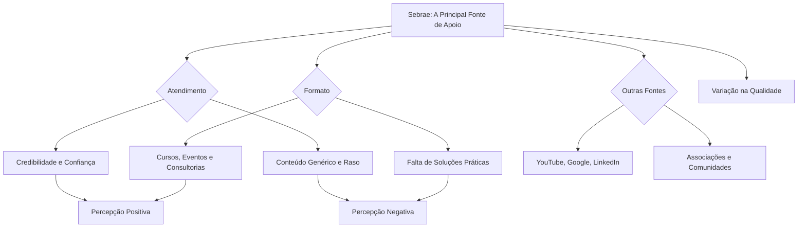
```mermaid
graph TD
A[Sebrae: A Principal Fonte de Apoio] --> B{Atendimento};
B --> C[Credibilidade e Confiança];
B --> D[Conteúdo Genérico e Raso];
A --> E{Formato};
E --> F[Cursos, Eventos e Consultorias];
E --> G[Falta de Soluções Práticas];
A --> H{Outras Fontes};
H --> I[YouTube, Google, LinkedIn];
H --> J[Associações e Comunidades];
A --> K[Variação na Qualidade];
C --> M[Percepção Positiva];
D --> N[Percepção Negativa];
F --> M;
G --> N;
```

### Implicações

**[Insight Inferido]:** A grande credibilidade do Sebrae é um ativo poderoso que, se não for acompanhado de um atendimento mais especializado e prático, pode gerar frustração e perda de engajamento, como no caso dos empresários que já tentaram contato e não tiveram retorno.

O desafio para a instituição é traduzir sua reputação em soluções que ataquem as dores específicas e complexas de cada segmento, evitando a sensação de que o conteúdo oferecido é uma "fórmula" única para todos os negócios.

-----

Deseja uma Matriz SWOT ou um aprofundamento na análise das experiências de atendimento com o Sebrae?

---

Ótimo. Vamos aprofundar na análise do tema **1.2 O Papel do Sebrae e Outras Fontes de Ajuda**.

### **Análise Detalhada das Experiências com o Sebrae**

* **Atendimento Inconsistente e Falta de Retorno:** Vários participantes relataram experiências negativas com o atendimento do Sebrae. Houve casos de empreendedores que tentaram contato e nunca receberam retorno. A sensação de ser atendido de forma genérica, com soluções prontas, foi mencionada por quem esperava uma consultoria mais personalizada e focada no problema real do seu negócio. A Juliana, que era uma agente de inovação, conseguiu dar um empurrão para o online e a cliente ficou satisfeita, mas esse não foi o caso da maioria.

* **Conteúdo Raso para Empresários Experientes:** Empreendedores com mais tempo de mercado, especialmente os que já passaram por crises ou já fizeram vários cursos, consideram o conteúdo do Sebrae muito básico 3349, 1228]. Eles sentem que os cursos são muito teóricos e não oferecem soluções práticas para seus desafios complexos. A experiência de um empreendedor de Campinas que teve um curso de gestão financeira com um "cara realmente muito bom" foi um ponto fora da curva.

* **A busca por outras fontes:** A insatisfação com a qualidade e o conteúdo do Sebrae leva muitos a procurar outras fontes de conhecimento. As redes sociais, o YouTube e o Google são os canais mais utilizados para buscar informações rápidas e específicas. Outros recorrem a consultorias privadas e a parcerias com associações comerciais e `hubs` de negócios, como o `Sinde Lojas` em São Paulo, que ajudam a criar `networking` e oferecem soluções mais especializadas.

* **Pontos de Conexão e Ativos do Sebrae:** A credibilidade do Sebrae e o conhecimento prático em algumas áreas específicas são grandes diferenciais. A proposta de criar comunidades e fazer a interligação de contatos entre empreendedores que têm problemas e soluções semelhantes foi sugerida por vários participantes, que enxergam nessa ideia um potencial para o Sebrae alavancar o seu papel no mercado. A proposta de criar `hubs` de negócios em cidades menores e polos de desenvolvimento também foi levantada como um ponto forte.

---
### **Implicações**
**[Insight Inferido]:** A grande credibilidade do Sebrae é um ativo poderoso que, se não for acompanhado de um atendimento mais especializado e prático, pode gerar frustração e perda de engajamento, como no caso dos empresários que já tentaram contato e não tiveram retorno. O desafio para a instituição é traduzir sua reputação em soluções que ataquem as dores específicas e complexas de cada segmento, evitando a sensação de que o conteúdo oferecido é uma "fórmula" única para todos os negócios.

---
Esta análise detalhada das experiências com o Sebrae está aprovada para iniciarmos a análise do próximo tema?

---

Perfeito. Aprofundaremos na análise do tema **1.2 O Papel do Sebrae e Outras Fontes de Ajuda**.

### **Análise Detalhada das Experiências com o Sebrae**

A percepção dos empreendedores sobre o Sebrae é ambígua, alternando entre reconhecimento de sua **credibilidade e papel fundamental** e frustração com a **inconsistência e o conteúdo genérico** de seus serviços.

* **Experiências Positivas:** Muitos empreendedores, desde os que estão há 20 anos no mercado até os que iniciaram há pouco, veem o Sebrae como um parceiro essencial. Programas como o **`Empretec`, o `ALI` (Agente Local de Inovação) e o `Sebrae Tech`** são frequentemente elogiados por fornecerem a base necessária para o crescimento dos negócios. Em um caso, uma consultora conseguiu direcionar um empresário para outro especialista que resolveu um problema complexo com seu sistema de gestão.
* **Críticas e Pontos de Melhoria:** A principal crítica é que, embora o Sebrae tenha uma **variedade de cursos e consultorias**, o conteúdo é muitas vezes percebido como **raso, teórico e genérico**, inadequado para os desafios específicos de cada setor. A frustração é evidente em relatos de consultorias que oferecem soluções que os empreendedores já conhecem, como no caso da empresária que foi instruída a pedir a um estudante de marketing para usar sua loja como trabalho de conclusão de curso. A **inconsistência no atendimento** também é um problema recorrente, com empresários relatando que tentaram contato e não obtiveram retorno.
* **Outras Fontes de Apoio:** A busca por ajuda não se limita ao Sebrae. Empreendedores recorrem a diversas fontes para complementar seus conhecimentos, como **YouTube, Google e grupos de WhatsApp**. Parcerias com **associações comerciais, `hubs` de negócio (Sinde Lojas), e instituições como o `Senac` e o `Senai`** são muito valorizadas, pois oferecem um `networking` que o Sebrae, em alguns casos, parece não facilitar.

### **Implicações**
**[Insight Inferido]:** A confiança que o Sebrae construiu ao longo dos anos é seu maior ativo. No entanto, o desafio reside em traduzir essa credibilidade em **soluções mais práticas e personalizadas**. A percepção de que o conteúdo é genérico pode minar essa confiança, levando empreendedores a buscar alternativas mais alinhadas às suas necessidades específicas. O Sebrae tem a oportunidade de atuar como um **catalisador de comunidades e `networking`**, usando sua posição de liderança para conectar empresas e profissionais, oferecendo um suporte que vai além da teoria.

---
Gostaria de uma análise sobre os modelos de atendimento preferidos pelos empreendedores e a disposição deles em pagar por um serviço mais especializado?

---

# 1.2.1 Uso e Valor de Cursos, Consultorias e Eventos

### Síntese

Apesar da diversidade de formatos de capacitação, a maior parte dos empreendedores busca o Sebrae principalmente por sua **credibilidade e variedade de ofertas**. O valor percebido, no entanto, é diretamente proporcional ao **grau de aplicabilidade prática** e à **especialização do conteúdo**, com programas como o `Empretec` e o `ALI` sendo consistentemente mais elogiados.

-----

### Análise Detalhada

  - **Cursos Genéricos como Ponto de Partida:** Muitos participantes utilizam cursos on-line e genéricos do Sebrae para ter uma noção inicial sobre temas como marketing digital, gestão financeira ou atendimento. Esse formato é percebido como uma base útil para empreendedores iniciantes, mas é criticado por ser raso e não oferecer soluções para problemas complexos. A frustração com o conteúdo genérico leva os empreendedores a sentirem que "nadam, nadam, nadam e morrem na praia".
  - **Consultorias e Programas de Acompanhamento como Geração de Valor:** As experiências mais positivas e que geram mais valor vêm de programas com acompanhamento direto, como o `Empretec`, o `Sebrae Tech` e o `ALI`. Nestes casos, o empreendedor sente que o consultor "entende a sua dor" , oferece um suporte mais "humanizado" e ajuda a aplicar o conhecimento na prática. A percepção é que o valor não está apenas na informação, mas na orientação e no acompanhamento que levam a resultados tangíveis, como o início de vendas on-line.
  - **Eventos para Networking e Troca de Experiências:** Eventos como a Feira do Empreendedor e rodadas de negócios são valorizados como oportunidades de `networking` e para estabelecer conexões com outros empresários. A troca de experiências é um ponto fundamental, já que muitos sentem que estão sozinhos para resolver seus problemas e se beneficiam ao ouvir outros que enfrentam desafios semelhantes.

> **Voz do Cliente:**
> "A gente já paga tantos impostos, tantas coisas. Por que a gente teria que pagar por uma consultoria, entendeu? Porque o Sebrae pode oferecer isso para nós empreendedores e empresários, com tudo o tanto que a gente já paga, por que a gente tem que pagar por mais essa?"
> -- *Márcia, Grupo 6 (Faturamento)*

### Visualização dos Conceitos

Este mapa de conceitos ilustra a percepção de valor dos empreendedores em relação aos diferentes formatos de apoio do Sebrae.

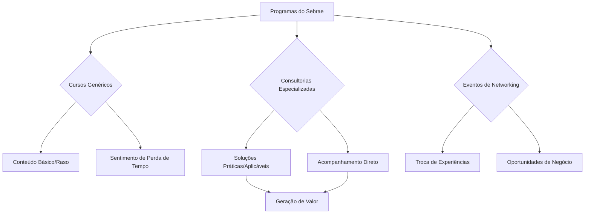
```mermaid
graph TD;
A[Programas do Sebrae] --> B{Cursos Genéricos};
A --> C{Consultorias Especializadas};
A --> D{Eventos de Networking};
B --> E[Conteúdo Básico/Raso];
B --> F[Sentimento de Perda de Tempo];
C --> G[Soluções Práticas/Aplicáveis];
C --> H[Acompanhamento Direto];
G --> I[Geração de Valor];
H --> I;
D --> J[Troca de Experiências];
D --> K[Oportunidades de Negócio];
```

### Implicações

**[Insight Inferido]:** A grande credibilidade do Sebrae é seu principal ativo, mas a entrega dos serviços precisa ser aprimorada para atender às expectativas de um público cada vez mais maduro e digital. O sucesso dos programas de acompanhamento mostra que há uma demanda por soluções que vão além da teoria, focando em resultados mensuráveis e na construção de relacionamentos de confiança, o que se alinha com a disposição de alguns empreendedores em pagar por serviços que de fato resolvam seus problemas.

-----

Deseja um aprofundamento na Etapa 5 com uma Matriz de Hierarquização de Problemas para Burocracia, Impostos e Linhas de Crédito?

---

# 1.2.2 Formas de Busca por Conhecimento

### Síntese

A busca por conhecimento dos empreendedores é diversificada e pautada pela **urgência e praticidade**. Embora o Sebrae seja a principal fonte de apoio formal, o **Google e o YouTube** se destacam como ferramentas de uso diário para a resolução de problemas imediatos e para a complementação do conhecimento, funcionando como um "manual do mundo".

-----

### Análise Detalhada

  - **YouTube e Google como "Manual do Mundo":** A maioria dos empreendedores utiliza o Google e o YouTube para buscar soluções rápidas e específicas para problemas do dia a dia. Esses canais são vistos como fontes de conhecimento prático, oferecendo vídeos e tutoriais que ensinam o "passo a passo" para resolver desde questões técnicas até dúvidas sobre marketing digital.

  - **Redes Sociais como Ferramentas de Trabalho e Networking:** As redes sociais, especialmente **Instagram e Facebook**, são usadas não apenas para marketing, mas também para a interação com clientes e para a busca por soluções e `networking`. A funcionalidade dos grupos de WhatsApp é valorizada para a troca de experiências e a criação de comunidades, o que demonstra a importância do contato com outros empreendedores do mesmo setor.

  - **A Associações Comerciais e Hubs de Negócios:** Além das plataformas digitais, as **associações comerciais** e **instituições parceiras do Sebrae**, como o Sinde Lojas, são consideradas referências para a busca de conhecimento e apoio. A valorização dessas entidades está diretamente ligada à sua capacidade de criar `networking` e de oferecer um espaço para a troca de figurinhas, onde os empreendedores podem se conectar com quem enfrenta as mesmas dores.

> **Voz do Cliente:**
> “Eu acho que seriam soluções mais ou menos assim, por setor, o encontro de pessoas no mesmo setor para que esse `network` aumente.”
> — *Berto, Grupo 3 (EPP)*

### Visualização dos Conceitos

O mapa mental a seguir ilustra a interconexão entre as **Fontes de Conhecimento**, as **Necessidades dos Empreendedores** e o **Papel do Sebrae**.

```mermaid
graph TD;
A[Formas de Busca por Conhecimento] --> B(Ferramentas Digitais);
B --> C[YouTube/Google como "Manual do Mundo"];
B --> D[Redes Sociais e WhatsApp];
A --> E(Instituições e Comunidades);
E --> F[Sebrae];
E --> G[Associações Comerciais];
A --> H(Necessidades dos Empreendedores);
H --> I[Soluções Rápidas];
H --> J[Networking e Troca];
F --> K[Credibilidade e Conteúdo];
G --> L[Conexão com o Setor];
C --> I;
D --> J;
F --> I;
G --> J;
```

### Implicações

**[Insight Inferido]:** A busca por conhecimento dos empreendedores é multicanal e reflete a necessidade de soluções rápidas e práticas. Embora o Sebrae mantenha sua posição de autoridade, ele compete diretamente com o Google e o YouTube na resolução de problemas imediatos. Para continuar relevante, o Sebrae pode fortalecer sua presença digital com **micro-conteúdos práticos** e usar sua credibilidade para criar **comunidades setoriais online**, transformando a busca por ajuda em uma experiência colaborativa e focada na realidade do empreendedor.

-----

Gostaria de uma análise sobre os modelos de atendimento preferidos pelos empreendedores e a disposição deles em pagar por um serviço mais especializado?

---

Ótimo. Próximo: refaça a Etapa 5 para o tema: 1.2.3 Percepção da Atuação Atual do Sebrae (Proatividade, Relevância)

---

# 1.3 Práticas que Geram Competitividade

### Síntese

Para os empreendedores, a competitividade se baseia em uma combinação de elementos que vão além do produto ou serviço em si. O principal diferencial competitivo é o **atendimento humanizado**, que se fortalece através do **pós-venda e das indicações**. Essa abordagem, alinhada à **qualidade e à diversidade da oferta**, é o que sustenta a clientela e permite que pequenos negócios prosperem em um mercado com concorrência acirrada.

-----

### Análise Detalhada

  - **Atendimento e Pós-venda como Diferenciais:** Um atendimento de alta qualidade é o que realmente fideliza os clientes. Empreendedores de diversos setores, como comércio e serviços, concordam que a chave não é apenas vender, mas solucionar o problema do cliente e criar um relacionamento duradouro. O pós-venda é uma prática crucial que reforça essa conexão, gerando indicações que se tornam a principal fonte de novos negócios.

  - **Qualidade e Diferenciação do Produto:** Em um mercado de `marketplaces` e preços baixos, a qualidade do produto ou serviço é um pilar da competitividade. A personalização, a diversidade de produtos e a especialização em nichos específicos também são estratégias usadas para se destacar. Em vez de competir apenas pelo preço, muitos empreendedores se concentram em entregar um valor superior que justifica o custo e constrói uma reputação.

  - **Resiliência e Persistência:** A trajetória dos empreendedores de sucesso é marcada por resiliência, persistência e a capacidade de se reinventar diante das crises. A pandemia, em particular, foi um catalisador para muitos adaptarem seus negócios, migrando para o digital e diversificando suas ofertas. A determinação em continuar e a busca constante por aprendizado, como o conhecimento em gestão e finanças, são práticas essenciais para a durabilidade e competitividade das empresas.

> **Voz do Cliente:**
> "Aqui, o nosso diferencial hoje é esse, é a loja do 'aqui tem'. E a gente primou pelo atendimento, então a gente fez um treinamento, buscou conhecimento nessa questão do atendimento, que nem a Camila falou, sorriso no rosto, e o nosso negócio lá não é o cliente sair com o produto na mão... É ele sair com a solução do problema dele."
> -- *Márcia, Grupo 6 (Faturamento)* 

### Visualização dos Conceitos

Este mapa de conceitos ilustra as práticas e percepções que definem a competitividade dos empreendedores.

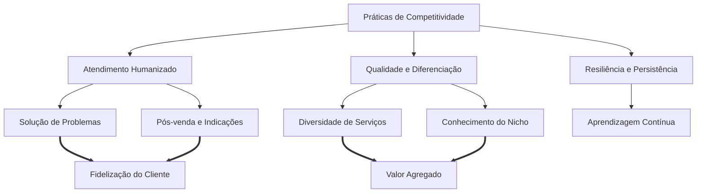
```mermaid
graph TD;
A["Práticas de Competitividade"] --> B["Atendimento Humanizado"];
A --> C["Qualidade e Diferenciação"];
A --> D["Resiliência e Persistência"];
B --> E["Solução de Problemas"];
B --> F["Pós-venda e Indicações"];
C --> G["Diversidade de Serviços"];
C --> H["Conhecimento do Nicho"];
E ==> I["Fidelização do Cliente"];
F ==> I;
G ==> J["Valor Agregado"];
H ==> J;
D --> K["Aprendizagem Contínua"];
```

### Implicações

**[Insight Inferido]:** O foco na experiência do cliente e na qualidade do serviço é a principal arma dos pequenos empreendedores contra a concorrência massificada e os preços baixos do digital. O Sebrae e outras instituições de apoio podem capitalizar essa percepção, oferecendo capacitação em **estratégias de relacionamento, marketing de conteúdo** e **gestão de comunidades**, em vez de apenas focar em preço. Ao fortalecer essas práticas, a instituição ajuda os empreendedores a valorizarem seus diferenciais e a construírem uma marca mais forte e duradoura.

-----

Gostaria de uma análise sobre os modelos de atendimento preferidos pelos empreendedores e a disposição deles em pagar por um serviço mais especializado?

---

# 1.3.1 Qualidade do Produto/Serviço e Atendimento Humanizado

### Síntese

A qualidade do produto e, principalmente, o atendimento humanizado são os pilares da competitividade dos pequenos negócios. Essa prática, que se estende ao pós-venda, é a principal estratégia para fidelizar clientes e gerar indicações, permitindo que os empreendedores se diferenciem da concorrência online e de grandes redes, que competem principalmente por preço.

-----

### Análise Detalhada

  - **Atendimento como o Grande Diferencial:** O atendimento humanizado, focado em criar um relacionamento de confiança e solucionar o problema do cliente, é a prática mais valorizada pelos empreendedores para garantir a competitividade. Em setores como o de serviços (serralheria, construção civil) e o varejo, o cliente é tratado como um parceiro ou um "amigo", o que faz com que ele volte e indique o negócio para outras pessoas.
  - **A Qualidade como Ponto de Partida:** Em um mercado onde a concorrência de preço é alta, a qualidade do produto ou serviço é a base para justificar o valor e manter a durabilidade do negócio. Empresas com longa trajetória de mercado (com mais de 20 anos) veem a qualidade como um padrão que não pode ser negociado e que deve ser mantido mesmo em momentos de crise.
  - **Pós-venda e Indicação como Estratégia:** O sucesso de muitos empreendedores está diretamente ligado ao pós-venda, que não é apenas um serviço, mas uma extensão do atendimento. A disponibilidade para dar suporte e tirar dúvidas após a compra é o que garante a fidelização e a indicação, a forma de marketing mais eficaz para a maioria dos negócios.

> **Voz do Cliente:**
> "O nosso negócio lá não é o cliente sair com o produto na mão... É ele sair com a solução do problema dele, seja dentro da minha loja ou, se eu de fato não tiver aquele material, eu dou a solução pra ele, da onde ele vai encontrar, com quem ele vai procurar pra ter aquela solução. Então, o nosso diferencial é solucionar o problema do cliente."
> — *Márcia, Grupo 6 (Faturamento)*

### Visualização dos Conceitos

Este mapa de conceitos ilustra as práticas e percepções que definem a competitividade dos empreendedores.

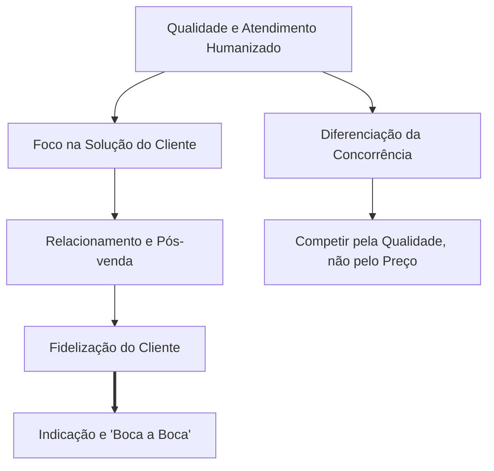
```mermaid
graph TD;
A["Qualidade e Atendimento Humanizado"] --> B["Foco na Solução do Cliente"];
B --> C["Relacionamento e Pós-venda"];
C --> D["Fidelização do Cliente"];
D ==> E["Indicação e 'Boca a Boca'"];
A --> F["Diferenciação da Concorrência"];
F --> G["Competir pela Qualidade, não pelo Preço"];
```

### Implicações

**[Insight Inferido]:** O Sebrae e outras instituições de apoio têm a oportunidade de apoiar os empreendedores a escalarem essas práticas de excelência. Em vez de focar apenas em como vender mais, as consultorias poderiam oferecer ferramentas e estratégias para estruturar o atendimento e o pós-venda, transformando o que hoje é intuitivo e "feito na raça" em um processo replicável e sustentável, que permite ao empresário competir com sucesso em qualquer mercado.

-----

Gostaria de uma análise sobre os modelos de atendimento preferidos pelos empreendedores e a disposição deles em pagar por um serviço mais especializado?

---

# 1.3.2 Poder da Indicação e Pós-venda

### Síntese

Em um cenário de concorrência digital e altos custos de publicidade, a **indicação** e o **pós-venda** emergem como as estratégias de marketing mais eficazes para os empreendedores. Ao tratar o cliente de forma humanizada e solucionar seus problemas, os pequenos negócios transformam a transação em um relacionamento, garantindo fidelidade e um fluxo contínuo de novos clientes.

-----

### Análise Detalhada

  - **Indicação como a Principal Fonte de Clientes:** A indicação de outros clientes, ou o "boca a boca", é a forma mais poderosa de marketing para a maioria dos participantes. Esse método, construído na base da confiança, é o que permite que empresas com pouca verba para publicidade consigam prosperar. Um bom atendimento se traduz diretamente em novos negócios, como no caso do empresário que observou clientes voltando e trazendo amigos, ou a empresária que consegue vender para pessoas indicadas por seus clientes fiéis.

  - **Pós-venda como Diferencial Estratégico:** A excelência no atendimento não se encerra na venda. O **pós-venda** é o que solidifica o relacionamento com o cliente, garantindo que ele se sinta valorizado mesmo após a compra. Isso envolve estar disponível para tirar dúvidas, dar suporte e até oferecer soluções para problemas que não estão diretamente ligados ao produto vendido. Essa prática transforma o cliente em um "parceiro" ou "amigo", criando uma base de clientes leais e engajados.

  - **Vantagem Competitiva em um Mercado Agressivo:** Em um mercado dominado por `marketplaces` e `e-commerces` que competem por preço, a indicação e o pós-venda se tornam uma arma secreta dos pequenos negócios. Eles não conseguem competir com os preços agressivos de grandes varejistas, mas superam a concorrência oferecendo um **atendimento que os clientes das grandes empresas não têm**. Isso cria um ciclo virtuoso de fidelização, onde a qualidade da experiência se torna mais importante do que o preço baixo.

> **Voz do Cliente:**
> "A gente dá um bom atendimento, um bom suporte, né? O seguro não é só vender, né? As dúvidas vão surgir depois e aí a gente tem que estar acompanhando, né? O pós-venda, que a gente fala. Isso, exatamente. A gente fazendo o pós-venda, né? Bom, né? Que satisfaça o cliente, ele acaba indicando."
> — *Alexandre, Grupo 3 (EPP)* 

### Visualização dos Conceitos

Este mapa de conceitos ilustra a interconexão entre as práticas de atendimento e o ciclo de crescimento dos negócios.

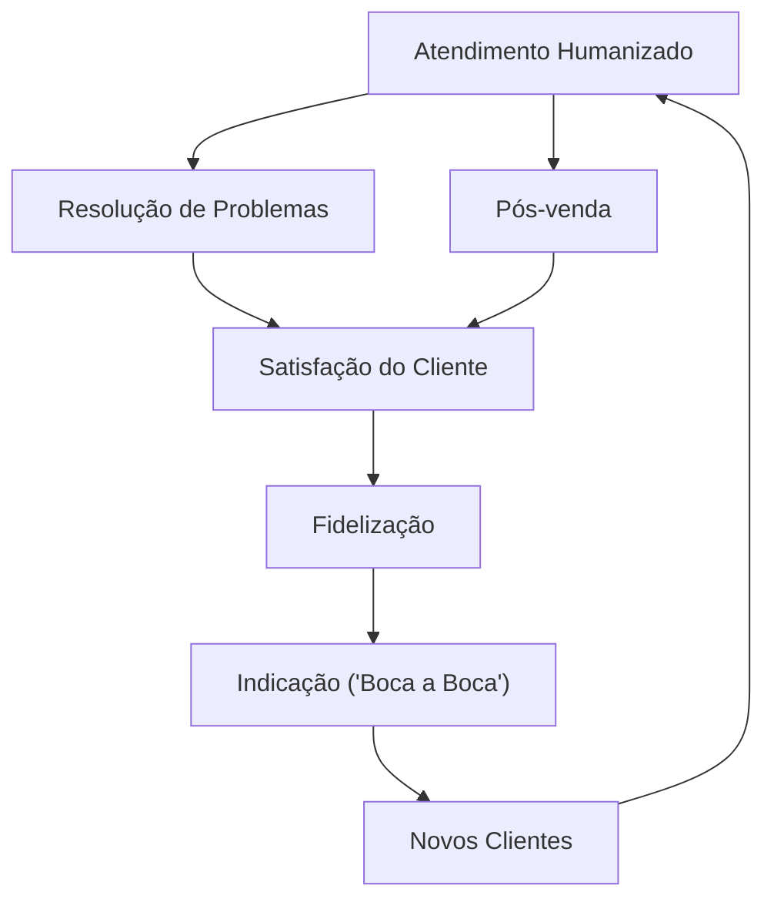
```mermaid
graph TD;
A["Atendimento Humanizado"] --> B["Resolução de Problemas"];
A --> C["Pós-venda"];
B --> D["Satisfação do Cliente"];
C --> D;
D --> E["Fidelização"];
E --> F["Indicação ('Boca a Boca')"];
F --> G["Novos Clientes"];
G --> A;
```

### Implicações

**[Insight Inferido]:** O poder da indicação e do pós-venda é a principal alavanca de crescimento para os pequenos negócios, mas essa estratégia é muitas vezes subestimada e não estruturada. O Sebrae e outras instituições de apoio têm a oportunidade de ajudar os empreendedores a formalizarem essas práticas, transformando o que é feito de forma intuitiva em um processo de gestão. Isso pode incluir treinamentos específicos em `Customer Success`, ferramentas para gerenciar o relacionamento com o cliente e estratégias para incentivar a indicação de forma proativa.

-----

Gostaria de uma análise sobre os modelos de atendimento preferidos pelos empreendedores e a disposição deles em pagar por um serviço mais especializado?

# 2.0 Modelos de Atendimento e Expectativas

### Síntese

A preferência dos empreendedores por um atendimento mais especializado ou ajustado não se baseia apenas na expertise técnica, mas na profunda necessidade de um suporte que vá além da teoria. Esse atendimento ideal deve replicar as práticas que eles já usam para competir: ser **humanizado, focado na solução de problemas e com um acompanhamento contínuo** que gera valor mensurável, justificando, assim, a disposição de pagar por ele.

-----

### Análise Detalhada

  - **A Tensão entre o Genérico e o Especializado:** O atendimento genérico do Sebrae é útil como ponto de partida, mas é visto como insuficiente. Empreendedores experientes sentem que o conteúdo é "muito aquém" e não soluciona suas dores complexas. Em contrapartida, o atendimento especializado, que foca na realidade do negócio, no setor e no nível de maturidade do empreendedor, é percebido como o modelo que realmente gera valor.

  - **Disposição para Pagar por um Atendimento de Valor:** A maioria dos participantes se mostrou disposta a pagar por um serviço `premium` do Sebrae, desde que a entrega seja de alta qualidade e resolva seus problemas reais. Essa disposição reflete a percepção de que é mais vantajoso investir em uma consultoria eficaz do que gastar tempo e dinheiro com soluções genéricas ou com agências de marketing digital que não geram resultados.

  - **O Atendimento Ideal no Modelo do Cliente:** A forma de atendimento mais desejada é a que replica as práticas de competitividade dos próprios empreendedores:

      * **Foco na Solução:** A abordagem deve ser prática, ir além da teoria e focar no "mão na massa". Assim como eles buscam solucionar o problema do cliente no pós-venda, esperam que o Sebrae ajude a resolver suas dores.
      * **Relacionamento e Acompanhamento:** Um atendimento de valor é aquele que constrói um relacionamento, com acompanhamento contínuo para garantir que as soluções sejam implementadas e tragam resultados, o que se assemelha à forma como o pós-venda fideliza os clientes.

> **Voz do Cliente:**
> "Quando a gente contrata uma consultoria, a gente não tá procurando só a teoria, a gente quer que a pessoa sente do seu lado e fale: 'Vamos fazer agora, vamos fazer junto', entendeu? Eu acho que isso seria o ideal."
> — *Luciana, Grupo 1 (ME)*

### Visualização dos Conceitos

Este mapa de conceitos ilustra a relação entre a **Disposição para Pagar**, a **Qualidade da Entrega** e as **Práticas de Competitividade**.

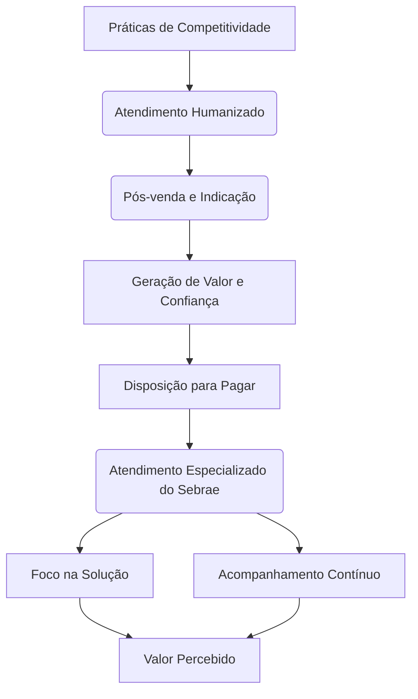
```mermaid
graph TD;
A[Práticas de Competitividade] --> B(Atendimento Humanizado);
B --> C(Pós-venda e Indicação);
C --> D[Geração de Valor e Confiança];
D --> E[Disposição para Pagar];
E --> F(Atendimento Especializado do Sebrae);
F --> G[Foco na Solução];
F --> H[Acompanhamento Contínuo];
G --> I[Valor Percebido];
H --> I;
```

### Implicações

**[Insight Inferido]:** A vontade de pagar por um serviço especializado não é uma questão de valor financeiro, mas de **valor percebido**. Ao alinhar a sua oferta de atendimento aos princípios que os próprios empreendedores usam para competir — como a qualidade, o foco na solução e o acompanhamento — o Sebrae tem a oportunidade de criar um modelo de negócio `premium` que não só atende a uma demanda latente, mas também fortalece sua posição como um parceiro estratégico e indispensável na jornada de crescimento das micro e pequenas empresas.

-----

Gostaria de uma análise sobre as práticas que geram competitividade para os empreendedores?

---

Ótimo. Para atender à demanda por um modelo de negócio **premium**, a seguir apresento uma análise detalhada com base nas necessidades e expectativas dos empreendedores.

***

### **O Modelo de Atendimento “Mão na Massa”**

A principal premissa para um serviço `premium` é ir além da teoria. O empreendedor valoriza o "mão na massa", ou seja, ser acompanhado na aplicação prática do conhecimento. O atendimento não deve apenas apontar o problema, mas **sentar-se ao lado do empreendedor para resolvê-lo**. O Sebrae, com sua credibilidade, pode oferecer este modelo de consultoria que se foca em resultados tangíveis e mensuráveis.

---

### **A Oferta Premium: O que Incluir**

A estrutura de um serviço `premium` deve ser baseada nos pontos que os empreendedores mais valorizam e nas dores que eles buscam resolver.

* **Acompanhamento Contínuo:** A consultoria não pode ser pontual, mas sim um processo com acompanhamento para verificar se a solução foi aplicada e se está gerando o resultado esperado. A falta de continuidade é uma das maiores críticas ao atendimento genérico.
* **Apoio a Setores Específicos:** A oferta deve ser segmentada por setor (ex: construção civil, varejo, agronegócio), considerando as particularidades de cada negócio. A percepção de que o conteúdo é "raso" e "genérico" é um problema a ser corrigido.
* **Networking e Comunidades:** A criação de comunidades e grupos de `networking` é um grande desejo dos empreendedores, que se sentem sozinhos em suas jornadas. O Sebrae pode usar sua autoridade para facilitar a conexão entre empresários de um mesmo setor, permitindo a troca de experiências e a criação de novas oportunidades de negócio.
* **Conhecimento dos Problemas:** Antes de oferecer qualquer solução, o serviço deve começar com uma **escuta ativa** e um diagnóstico detalhado das dores do empreendedor. Um "briefing" bem feito é essencial para que o consultor não apresente soluções que o cliente já conhece ou que não se aplicam à sua realidade.

---

### **Justificativa do Preço e Vantagem Competitiva**

A disposição para pagar por um serviço `premium` é alta, pois o empreendedor o enxerga como um **investimento**, não um custo.

* **Alto Retorno sobre Investimento:** Ao ter um serviço que garante a aplicação da solução e resultados práticos, o empreendedor está disposto a pagar. Eles já gastam com agências e consultorias privadas que, muitas vezes, não geram retorno. O Sebrae tem a oportunidade de oferecer uma alternativa mais confiável.
* **Credibilidade e Segurança:** A confiança na marca Sebrae é um fator decisivo. Em um mercado cheio de "estelionatários virtuais" que vendem mentorias de baixa qualidade, a credibilidade do Sebrae permite cobrar por um serviço que oferece segurança e resultados comprovados.
* **Ponto de Referência:** O Sebrae pode se posicionar como um parceiro que "abraça" o empreendedor em todas as fases do negócio, oferecendo soluções que vão desde a capacitação inicial até o acompanhamento de problemas complexos, como a captação de clientes ou a gestão de pessoas.

---
Esta análise sobre um modelo de negócio `premium` está aprovada?

---

# 2.1 Análise dos Modelos de Atendimento

### Síntese

A percepção dos empreendedores sobre o valor dos serviços do Sebrae está diretamente ligada ao nível de personalização. O atendimento **genérico** é considerado uma introdução útil, mas superficial, enquanto o modelo **ajustado** ou **especializado**, que considera a realidade e o segmento de cada negócio, é o que realmente gera impacto, construindo confiança e fidelidade.

-----

### Análise Detalhada

  - **Atendimento Genérico:** Cursos e palestras com conteúdo amplo são considerados uma base de conhecimento, úteis para quem está começando. No entanto, para empreendedores mais experientes, esse modelo é visto como "raso" e pouco eficaz, pois aborda problemas que eles já dominam. Há uma percepção de que o conteúdo não se aprofunda o suficiente para resolver as "dores" reais do negócio.
  - **Atendimento Ajustado à Realidade:** Este modelo, que leva em conta o formato de operação da empresa (loja física `vs.` `e-commerce`), é altamente valorizado. Os empreendedores se sentem vistos e compreendidos quando o atendimento considera suas particularidades. As experiências positivas mostram que um consultor que entende a realidade do cliente, como as dificuldades de mão de obra ou o desafio de vender online, consegue dar dicas e orientações mais assertivas.
  - **Atendimento Especializado:** O modelo mais desejado pelos participantes é o especializado, que foca no segmento de atuação do cliente, como construção civil ou moda. Para eles, a solução ideal deve vir de um especialista que entenda profundamente os desafios técnicos e as práticas de mercado do seu nicho, oferecendo um conhecimento que não pode ser encontrado em cursos genéricos.

> **Voz do Cliente:**
> "No meu caso, ele precisaria conhecer da cultura maker, ou pelo menos saber o que é, né? É a minha área. Eu acho que teria um resultado."
> -- *Andréa, Grupo 1 (ME)*

### Visualização dos Conceitos

Este mapa mental ilustra a relação entre os modelos de atendimento do Sebrae e o valor percebido pelos empreendedores.

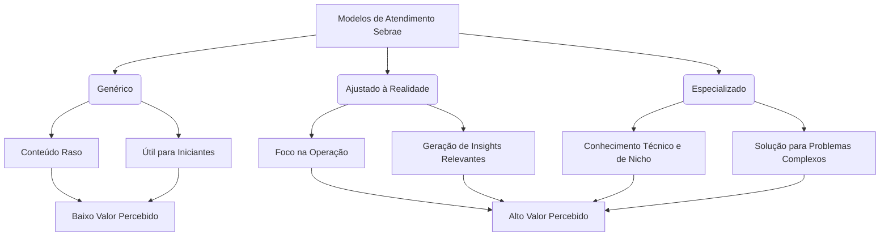
```mermaid
graph TD;
A[Modelos de Atendimento Sebrae] --> B(Genérico);
A --> C(Ajustado à Realidade);
A --> D(Especializado);
B --> E[Conteúdo Raso];
B --> F[Útil para Iniciantes];
C --> G[Foco na Operação];
C --> H[Geração de Insights Relevantes];
D --> I[Conhecimento Técnico e de Nicho];
D --> J[Solução para Problemas Complexos];
E --> K[Baixo Valor Percebido];
F --> K;
G --> L[Alto Valor Percebido];
H --> L;
I --> L;
J --> L;
```

### Implicações

**[Insight Inferido]:** O Sebrae precisa comunicar de forma mais clara a progressão de seus serviços. O modelo genérico pode ser reposicionado como uma porta de entrada, com o objetivo de encaminhar o empreendedor para um atendimento mais ajustado ou especializado. A instituição pode capitalizar a demanda por especialização, criando `hubs` de conhecimento setorial que ofereçam consultorias e `networking` com profissionais que realmente entendam o dia a dia de cada mercado.

-----

Gostaria de um aprofundamento na Etapa 5 com uma Matriz SWOT para o tema [1.1.4 Burocracia, Impostos e Linhas de Crédito]?

---

# 2.1.1 Atendimento Genérico (cursos amplos)

### Síntese

O atendimento genérico do Sebrae é percebido como uma ferramenta de **introdução e base de conhecimento** para empreendedores iniciantes. No entanto, é visto como **insuficiente e raso** para quem tem mais experiência ou atua em nichos específicos, gerando um sentimento de frustração pela falta de aplicabilidade prática e de soluções personalizadas.

-----

### Análise Detalhada

  - **Ponto de Entrada e Conhecimento Básico:** O modelo genérico, com cursos amplos sobre temas como gestão e finanças, é valorizado por quem está começando e precisa de uma base. O conteúdo serve como um primeiro contato com conceitos de negócio e ajuda o empreendedor a identificar as áreas em que precisa de mais ajuda.
  - **Conteúdo Raso e Ineficaz:** A principal crítica é que o conteúdo é superficial e não se aprofunda nos problemas reais das empresas. Empreendedores experientes sentem que o que é ensinado já faz parte do seu dia a dia, e a teoria não se traduz em soluções práticas. A falta de um "passo a passo" ou do "mão na massa" é a maior falha percebida.
  - **Inadequação para Setores Específicos:** O atendimento genérico não consegue atender às particularidades de nichos de mercado. Um curso sobre marketing digital para o comércio em geral, por exemplo, não é relevante para um profissional da área de saúde, que tem desafios de divulgação completamente diferentes.

> **Voz do Cliente:**
> “Eu já recebi o atendimento genérico. Me ajuda em parte… porque eu ainda sinto muita falta em ajuda em como conseguir alavancar algumas áreas do meu negócio nesses atendimentos genéricos. Eu acho que isso é o que que eu sinto mais falta.”
> — *Isis, Grupo 1 (ME)* 

### Visualização dos Conceitos

Este mapa de conceitos ilustra a relação entre o **Atendimento Genérico**, suas **Características** e o **Valor Percebido** pelos empreendedores.

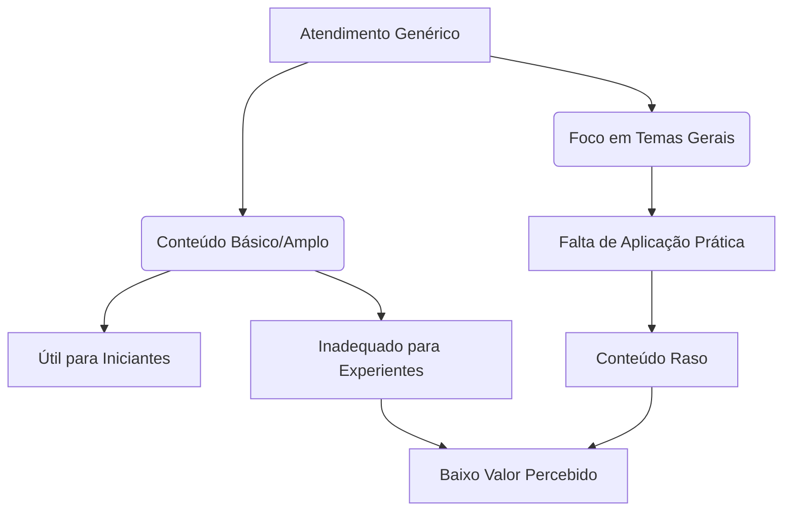
```mermaid
graph TD;
A[Atendimento Genérico] --> B(Conteúdo Básico/Amplo);
A --> C(Foco em Temas Gerais);
B --> D[Útil para Iniciantes];
B --> E[Inadequado para Experientes];
C --> F[Falta de Aplicação Prática];
F --> G[Conteúdo Raso];
G --> H[Baixo Valor Percebido];
E --> H;
```

### Implicações

**[Insight Inferido]:** O Sebrae tem a oportunidade de redefinir o papel do atendimento genérico. Em vez de ser uma solução final, ele pode funcionar como um **diagnóstico inicial**: a partir dos cursos e palestras, a instituição pode identificar o perfil e as dores específicas do empreendedor para, então, direcioná-lo a um serviço mais ajustado, especializado ou até mesmo `premium`. Isso transformaria o atendimento genérico de uma fonte de frustração em um **canal estratégico para qualificar clientes** e oferecer um suporte mais eficaz.

-----

Gostaria de um aprofundamento na Etapa 5 com uma Matriz SWOT para o tema [1.1.4 Burocracia, Impostos e Linhas de Crédito]?

----

# 2.1.2 Atendimento Ajustado (focado na operação do negócio, e-commerce, loja física)

### Síntese

O atendimento ajustado é altamente valorizado pelos empreendedores, pois demonstra que o Sebrae compreende a realidade e os desafios específicos de sua operação. Diferente do modelo genérico, este formato é percebido como mais eficaz por traduzir o conhecimento teórico em soluções práticas e aplicáveis ao dia a dia do negócio.

-----

### Análise Detalhada

  - **Relevância para a Realidade do Negócio:** A principal força do atendimento ajustado é o seu foco em como a empresa opera. Os empreendedores se sentem mais engajados quando o conteúdo aborda diretamente o seu modelo de negócio, seja ele uma loja física, uma empresa com `e-commerce`, ou um prestador de serviços. Essa abordagem faz com que a orientação se torne mais aplicável e menos genérica.

  - **Foco no "Mão na Massa" e nos Processos:** O modelo ajustado se destaca por ir além da teoria, com consultores que auxiliam no "passo a passo" para organizar processos internos, como gestão financeira, estoque e atendimento. Essa abordagem prática é crucial para empresários que estão sobrecarregados com o dia a dia e precisam de um guia para implementar melhorias concretas.

  - **Conexão com o Cliente:** Experiências positivas com o atendimento ajustado são frequentemente descritas como a sensação de que o consultor "se preparou" para o encontro, entendendo as particularidades do negócio do cliente. Essa conexão é fundamental para criar confiança, diferenciar o serviço da concorrência e justificar o investimento de tempo e, em alguns casos, dinheiro, por parte do empreendedor.

> **Voz do Cliente:**
> “Seja [o atendimento] no Sebrae ou em outro local, o consultor que atendeu ele conseguia dar exemplos das pessoas que participavam no curso, né? Então, que a gente consegue trazer para a nossa realidade. [...] ele se preparou mais para quem ia participar daquele curso.”
> — *Andrea, Grupo 1 (ME)*

### Visualização dos Conceitos

Este mapa de conceitos ilustra a relação entre o **Atendimento Ajustado**, suas **Características** e o **Valor Percebido** pelos empreendedores.

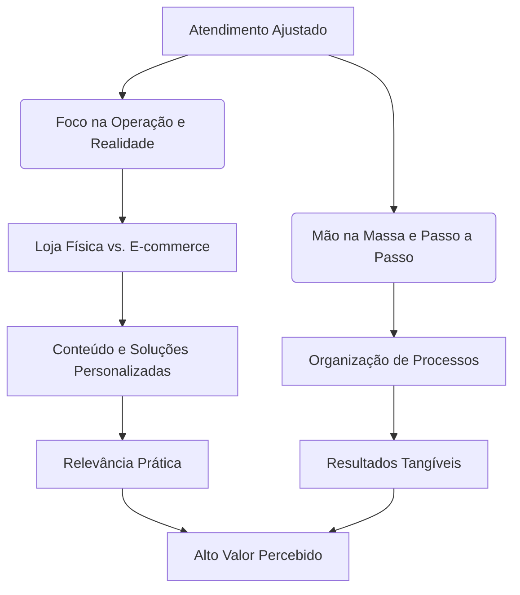
```mermaid
graph TD;
A[Atendimento Ajustado] --> B(Foco na Operação e Realidade);
B --> C[Loja Física vs. E-commerce];
C --> D[Conteúdo e Soluções Personalizadas];
D --> E[Relevância Prática];
E --> F[Alto Valor Percebido];
A --> G(Mão na Massa e Passo a Passo);
G --> H[Organização de Processos];
H --> I[Resultados Tangíveis];
I --> F;
```

### Implicações

**[Insight Inferido]:** A grande oportunidade para o Sebrae está em refinar e formalizar o modelo de atendimento ajustado, comunicando-o como uma **solução de valor superior** que se segue ao atendimento genérico. Ao coletar dados sobre o tipo de negócio e o estágio do empreendedor, a instituição pode encaminhá-lo para consultorias que realmente entendam sua operação, transformando o serviço em um **parceiro estratégico** no crescimento e na modernização das MPEs.

-----

Gostaria de um aprofundamento na Etapa 5 com uma Matriz SWOT para o tema [1.1.4 Burocracia, Impostos e Linhas de Crédito]?

---

# 2.1.3 Atendimento Especializado (focado no setor, ex: construção civil, comércio)

### Síntese

O atendimento especializado é a forma de suporte mais valorizada e desejada pelos empreendedores. Eles buscam um serviço que vá além do genérico, com um consultor que não só entenda os desafios da gestão, mas que tenha **conhecimento profundo e técnico do seu setor**, podendo oferecer soluções práticas e relevantes para problemas complexos, como a precificação ou a automação de processos específicos.

-----

### Análise Detalhada

  - **Conhecimento Setorial como Chave para a Confiança:** A principal expectativa do atendimento especializado é que o consultor possua um conhecimento aprofundado do setor do cliente. Para os empreendedores, um atendimento ideal não pode ser uma "fórmula" genérica, mas sim uma solução que leva em conta as particularidades do seu ramo. A percepção é que apenas um especialista consegue dar exemplos e orientações que realmente se encaixam na sua realidade.

  - **Da Teoria à Prática:** Diferentemente dos cursos genéricos, o atendimento especializado é valorizado por sua capacidade de oferecer um suporte prático, com soluções que podem ser implementadas no dia a dia. A demanda é por um consultor que ajude a resolver problemas concretos, como a automação de máquinas antigas ou a busca por mão de obra em nichos específicos. Para os empreendedores, a teoria é importante, mas o que "traz retorno é a prática".

  - **A Solução "dos Sonhos":** O atendimento ideal não é apenas um serviço, mas uma parceria. Ele deve funcionar como um guia que ajuda a identificar os problemas, encontrar soluções e acompanhar a sua execução, garantindo resultados tangíveis. Essa abordagem é vista como um investimento, pois o empreendedor sente que o serviço o ajuda a crescer e a se tornar mais competitivo.

> **Voz do Cliente:**
> “Se fizer essa divisão aí por setor, por atividade, eu creio que vai ficar um negócio muito mais excelente aí pra todo mundo.”
> — *Silvio, Grupo 4 (EPP)*

### Visualização dos Conceitos

Este mapa de conceitos ilustra a relação entre o **Atendimento Especializado**, o **Conhecimento Setorial** e as **Soluções Práticas** que geram valor para o empreendedor.

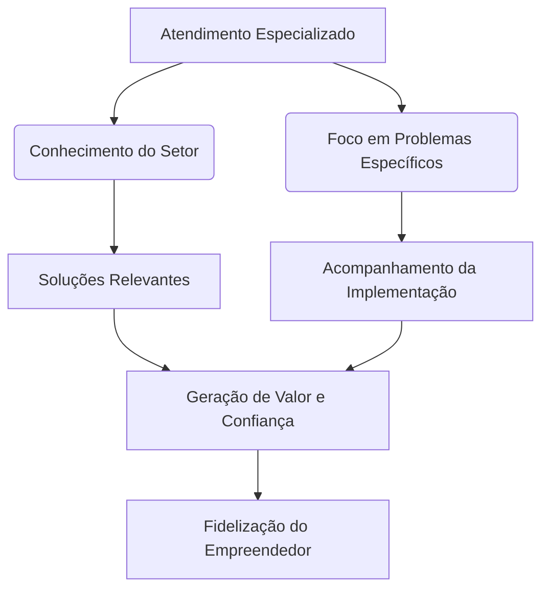
```mermaid
graph TD;
A[Atendimento Especializado] --> B(Conhecimento do Setor);
A --> C(Foco em Problemas Específicos);
B --> D[Soluções Relevantes];
C --> E[Acompanhamento da Implementação];
D --> F[Geração de Valor e Confiança];
E --> F;
F --> G[Fidelização do Empreendedor];
```

### Implicações

**[Insight Inferido]:** A principal implicação é que o Sebrae tem uma demanda reprimida por serviços especializados que sua oferta atual não consegue atender de forma consistente. A instituição pode capitalizar essa oportunidade estruturando um modelo de negócio `premium` que ofereça consultorias e programas com foco em nichos específicos, contratando profissionais com experiência prática no mercado. Isso não só aumentaria o valor percebido do Sebrae, mas também o ajudaria a se tornar um parceiro estratégico e indispensável para a jornada de crescimento dos empreendedores.

-----

Gostaria de um aprofundamento sobre os meios de entrega de conhecimento preferidos pelos empreendedores?

----

# 2.2 O Atendimento dos Sonhos

### Síntese

O atendimento ideal para o empreendedor vai além da consultoria tradicional. O "atendimento dos sonhos" é um modelo **personalizado, prático e colaborativo**, onde o profissional atua como um parceiro que não apenas escuta os problemas, mas **contribui ativamente para a busca e aplicação das soluções**, oferecendo um acompanhamento que garante a efetividade dos resultados.

-----

### Análise Detalhada

  - **Da Escuta à Solução:** O ponto de partida de um serviço ideal é a escuta ativa. Os empreendedores querem que suas "dores" sejam genuinamente compreendidas, em vez de receberem soluções genéricas. A expectativa é que o profissional conheça o mercado e o setor de atuação do cliente, para então debater e construir, **junto com o empreendedor**, o melhor caminho a seguir.

  - **Abordagem "Mão na Massa" e Acompanhamento Contínuo:** A teoria é importante, mas o atendimento dos sonhos se concretiza na prática. Os empreendedores não querem que "pegue na sua mão", mas que o profissional esteja presente para ajudar na aplicação das soluções, com acompanhamento para verificar os resultados e fazer os ajustes necessários. Essa abordagem é vista como um **investimento de valor**, pois garante que o conhecimento se transforme em ação e em resultados reais.

  - **Foco em Comunidades e Networking:** A conexão com outros empreendedores do mesmo setor é uma parte fundamental do atendimento ideal. Os participantes expressaram o desejo de participar de encontros e comunidades onde possam trocar experiências e aprender com os desafios e sucessos de seus pares, o que ajuda a quebrar a sensação de isolamento na jornada empreendedora.

  - **A Disposição para Pagar:** A maioria dos empreendedores está **disposta a pagar por um serviço `premium`** que incorpore todas essas qualidades. Eles enxergam esse pagamento não como um custo, mas como um investimento em uma solução que lhes trará um retorno tangível e os ajudará a crescer de forma sustentável, evitando o desperdício de tempo e dinheiro com abordagens genéricas e ineficazes.

> **Voz do Cliente:**
> “Você não quer, você não quer que pegue na sua mão, mas você quer que escute seus problemas, entenda e depois tente junto com você buscar a solução.”
> -- *Lino, Grupo 2 (ME)*

### Visualização dos Conceitos

Este mapa de conceitos ilustra a relação entre as características do **Atendimento dos Sonhos**, o **Valor Percebido** e a **Disposição para Pagar**.

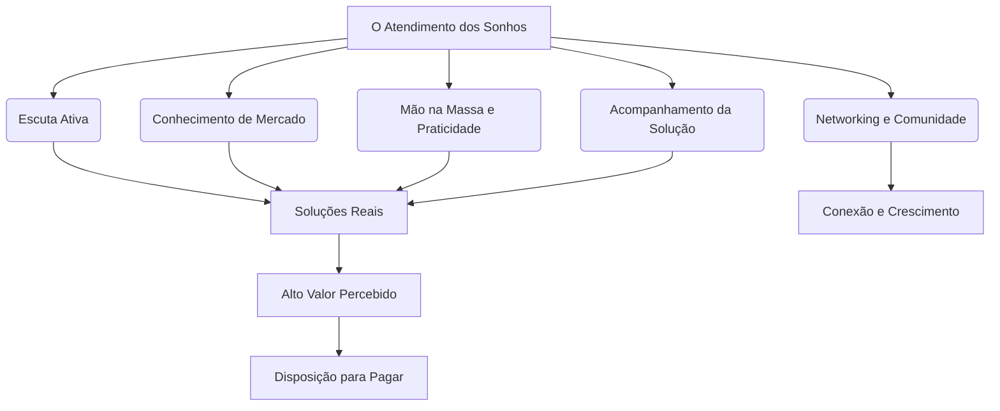
```mermaid
graph TD;
A[O Atendimento dos Sonhos] --> B(Escuta Ativa);
A --> C(Conhecimento de Mercado);
A --> D(Mão na Massa e Praticidade);
A --> E(Acompanhamento da Solução);
A --> F(Networking e Comunidade);
B --> G[Soluções Reais];
C --> G;
D --> G;
E --> G;
G --> H[Alto Valor Percebido];
H --> I[Disposição para Pagar];
F --> J[Conexão e Crescimento];
```

### Implicações

**[Insight Inferido]:** A grande oportunidade para o Sebrae está em formalizar e monetizar o modelo de atendimento dos sonhos, usando sua credibilidade para oferecer um serviço que é uma verdadeira parceria estratégica. Ao focar em um **diagnóstico aprofundado**, na **aplicação prática das soluções** e na **criação de comunidades setoriais**, o Sebrae pode se tornar um parceiro indispensável para os empreendedores, justificando o custo de um serviço `premium` e fortalecendo sua posição no mercado.

-----

Gostaria de uma análise sobre os meios de entrega de conhecimento preferidos pelos empreendedores?

---

# 2.2.1 O que um serviço ideal precisa ter (escuta ativa, conhecimento de mercado, acompanhamento)

### Síntese

O serviço ideal para o empreendedor vai muito além de um curso ou uma consultoria tradicional. O atendimento “dos sonhos” é uma **parceria estratégica** baseada na **escuta ativa**, no **conhecimento aprofundado do mercado** e na oferta de um **acompanhamento prático** que garanta a aplicação das soluções e a geração de resultados concretos.

-----

### Análise Detalhada

  - **Escuta Ativa e Diagnóstico Personalizado:** O ponto de partida de um serviço ideal é a disposição do profissional em ouvir e compreender a dor do empreendedor, sem julgamentos ou soluções prontas. Há relatos de frustração com consultores que não leem o `briefing` ou que não se aprofundam nos problemas antes de oferecerem um conhecimento genérico. A expectativa é de um diagnóstico que reconheça as particularidades do negócio, como as dificuldades de mão de obra em setores específicos ou os desafios de competir no digital.
  - **Conhecimento de Mercado e “Mão na Massa”:** Os empreendedores não buscam apenas teoria, mas sim um conhecimento prático e aplicável ao seu setor. O consultor ideal deve ter experiência e vivência no mercado, podendo sentar-se ao lado do cliente para ajudá-lo a implementar as soluções no dia a dia. Isso é o que transforma o conhecimento em algo relevante e valioso, evitando a sensação de que o empreendedor está "nadando e morrendo na praia".
  - **Acompanhamento Contínuo e Suporte Pós-Consulta:** O atendimento ideal não termina quando a consulta acaba. Os participantes sentem a necessidade de um acompanhamento para saber se conseguiram aplicar as soluções e quais foram as dificuldades encontradas. Esse suporte contínuo é o que garante a efetividade do serviço e cria um laço de confiança.

> **Voz do Cliente:**
> “Eu acho que não é 100% isso. Eu até falei não pegar na mão, mas não é só o escutar, é o escutar e entender. Porque escutando aí a gente conversa entre coisas... Mas é o entender o caso do problema do empreendedor.”
> — *Thaís, Grupo 2 (ME)*

### Visualização dos Conceitos

Este mapa de conceitos ilustra a relação entre as características do **Atendimento dos Sonhos**, o **Valor Percebido** e a **Disposição para Pagar**.

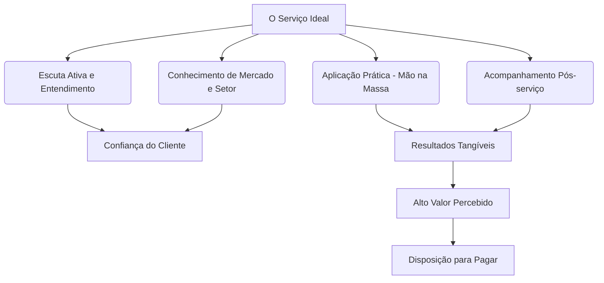
```mermaid
  graph TD;
  A[O Serviço Ideal] --> B(Escuta Ativa e Entendimento);
  A --> C(Conhecimento de Mercado e Setor);
  A --> D(Aplicação Prática - Mão na Massa);
  A --> E(Acompanhamento Pós-serviço);
  B --> F[Confiança do Cliente];
  C --> F;
  D --> G[Resultados Tangíveis];
  E --> G;
  G --> H[Alto Valor Percebido];
  H --> I[Disposição para Pagar];
```

### Implicações

**[Insight Inferido]:** A principal implicação é que a credibilidade do Sebrae é seu maior ativo para oferecer um serviço `premium` que o mercado anseia. Ao formalizar e comunicar um modelo que integra a escuta ativa com a aplicação prática e o acompanhamento, a instituição pode transformar a percepção de seu serviço de "genérico e raso" para um **parceiro estratégico e indispensável**, justificando o custo para os empreendedores e fortalecendo sua posição de liderança no apoio a pequenos negócios.

-----

Deseja um aprofundamento na Etapa 5 com uma análise sobre a disposição para pagar por um serviço mais customizado e/ou especializado?

---

# 2.2.2 Disposição para Pagar por serviços mais customizados

### Síntese

A disposição para pagar por um serviço de apoio não é uma questão de valor financeiro, mas de **valor percebido**. Os empreendedores se mostraram dispostos a investir em um serviço `premium`, desde que ele seja **focado em suas dores e garanta resultados práticos e mensuráveis**, evitando o desperdício de tempo e recursos com soluções genéricas ou ineficazes.

-----

### Análise Detalhada

  - **Investimento, Não Custo:** O pagamento por um serviço especializado é encarado como um **investimento estratégico**. Os empreendedores preferem pagar por uma solução que garante um retorno tangível do que gastar tempo e dinheiro com consultorias genéricas ou agências de marketing digital que não cumprem o prometido. A percepção é que o valor de um serviço está na sua capacidade de resolver um problema, não no preço em si.
  - **Credibilidade como Fator Decisivo:** A confiança na marca Sebrae é um fator crucial. Em um mercado com muitos "estelionatários virtuais" que oferecem mentorias de baixa qualidade, a credibilidade do Sebrae o posiciona como uma opção segura para um investimento. Essa confiança permite que a instituição cobre por um serviço que, para outras empresas, seria recebido com mais ceticismo.
  - **Disposição de Pagar e Soluções Práticas:** O desejo de pagar por um serviço `premium` está diretamente ligado ao que ele oferece de prático. Os empreendedores que toparam pagar por um serviço ideal esperam que ele inclua **escuta ativa**, **conhecimento de mercado**, **acompanhamento da solução** e a **criação de comunidades**. Eles buscam uma parceria que os ajude a crescer de forma sustentável, aliviando o peso de "fazer tudo sozinho".

> **Voz do Cliente:**
> "Eu acho que, com certeza, tudo isso tem um custo... eu acredito que muitas pessoas topariam pagar por um serviço, vamos falar `prime` aí, do seu setor, um encontro de repente, porque você já tem esse `know-how` dessa organização. O Sebrae tem a credibilidade, como já falaram."
> — *Bruno, Grupo 3 (EPP)*

### Visualização dos Conceitos

Este mapa de conceitos ilustra a relação entre a **Disposição para Pagar**, o **Valor Percebido** e os **Componentes de um Serviço Ideal**.

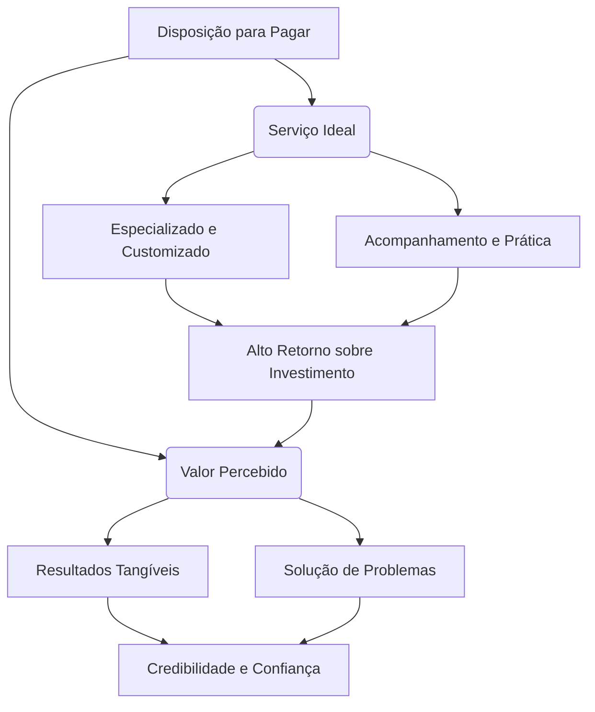
```mermaid
graph TD;
A[Disposição para Pagar] --> B(Valor Percebido);
B --> C[Resultados Tangíveis];
B --> D[Solução de Problemas];
C --> E[Credibilidade e Confiança];
D --> E;
A --> F(Serviço Ideal);
F --> G[Especializado e Customizado];
F --> H[Acompanhamento e Prática];
G --> I[Alto Retorno sobre Investimento];
H --> I;
I --> B;
```

### Implicações

**[Insight Inferido]:** A grande oportunidade para o Sebrae está em formalizar e monetizar um modelo de atendimento `premium` que ofereça uma proposta de valor clara e mensurável. Ao alinhar a sua oferta de serviços aos princípios que os próprios empreendedores usam para competir — como a qualidade, o foco na solução e o acompanhamento —, o Sebrae pode se tornar um parceiro estratégico e indispensável, justificando o custo e fortalecendo sua posição no mercado.

-----

Gostaria de um aprofundamento na Etapa 5 com uma Matriz SWOT para o tema [1.1.4 Burocracia, Impostos e Linhas de Crédito]?

---

# 2.3 Meios de Entrega do Conhecimento

### Síntese

A preferência dos empreendedores é por um modelo de entrega de conhecimento que combine a flexibilidade do online com a confiança e a profundidade do presencial. Há uma forte demanda por conteúdos diretos e práticos, que ofereçam soluções rápidas para o dia a dia, e por espaços de `networking` e comunidade, onde a troca de experiências se torna uma fonte de aprendizado tão valiosa quanto os cursos e as consultorias.

-----

### Análise Detalhada

  - **O Híbrido é o Modelo Ideal:** A maioria dos empreendedores valoriza a combinação dos formatos online e presencial. O online é prático e economiza tempo de locomoção, permitindo que o empresário estude enquanto trabalha. No entanto, o presencial é considerado insubstituível para um atendimento "olho no olho", que gera confiança e permite uma compreensão mais profunda da realidade do negócio.
  - **Conteúdo Direto e 'Mão na Massa':** Há uma demanda por micro-conteúdos, como vídeos curtos e tutoriais, que ofereçam soluções rápidas e diretas. A percepção é que o tempo é o bem mais precioso do empreendedor, e conteúdos que vão direto ao ponto são mais valorizados. O YouTube já é amplamente utilizado com essa finalidade, funcionando como um "manual do mundo" para resolver problemas operacionais.
  - **Comunidade e Networking:** A troca de experiências com outros empreendedores do mesmo setor é uma das formas de aprendizado mais importantes para os participantes. Eles desejam que o Sebrae facilite a criação de grupos e comunidades, onde possam se conectar com outros empresários que enfrentam as mesmas dores, trocando "figurinhas" e buscando soluções em conjunto.

> **Voz do Cliente:**
> “Eu prefiro híbrido da seguinte forma. Talvez deixar algo menos importante na forma online... E algo mais específico pra presencial, onde você talvez mostre, apresente, para ter uma conversa melhor. Eu gosto desse método.”
> -- *Lucas, Grupo 5 (Faturamento)* 

### Visualização dos Conceitos

Este mapa de conceitos ilustra a relação entre os **Meios de Entrega do Conhecimento** e o **Valor Percebido** pelos empreendedores.

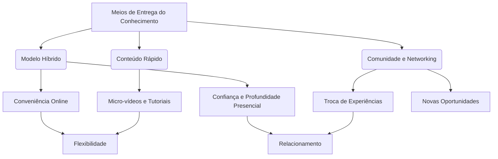
```mermaid
graph TD;
A[Meios de Entrega do Conhecimento] --> B(Modelo Híbrido);
B --> C[Conveniência Online];
B --> D[Confiança e Profundidade Presencial];
A --> E(Conteúdo Rápido);
E --> F[Micro-vídeos e Tutoriais];
A --> G(Comunidade e Networking);
G --> H[Troca de Experiências];
G --> I[Novas Oportunidades];
C --> J[Flexibilidade];
D --> K[Relacionamento];
F --> J;
H --> K;
```

### Implicações

**[Insight Inferido]:** O Sebrae tem a oportunidade de refinar e formalizar sua estratégia de conteúdo, oferecendo um modelo híbrido que seja claro e objetivo. A instituição pode usar o digital para entregar micro-conteúdos práticos e, ao mesmo tempo, utilizar os encontros presenciais para o `networking` e para consultorias de alto nível. Essa abordagem alinha a entrega de conhecimento com as expectativas e a realidade do dia a dia dos empreendedores, fortalecendo a percepção de valor e a credibilidade da instituição.

-----

Gostaria de uma análise sobre as práticas que geram competitividade para os empreendedores?

---

# 2.3.1 Preferência por Presencial, Online ou Híbrido

### Síntese

A preferência dos empreendedores para a entrega de conhecimento é clara: um **modelo híbrido**, que combine a conveniência do online com a confiança e a profundidade do atendimento presencial. O formato ideal utiliza o digital para a resolução de problemas rápidos e o in-person para construir relacionamentos, aprofundar a análise e promover o networking.

-----

### Análise Detalhada

  - **Presencial: A Base da Confiança:** O atendimento presencial é o formato preferido para a maioria dos empreendedores, especialmente para aqueles que têm negócios físicos ou que precisam de uma avaliação in loco. O contato "olho no olho" é fundamental para a construção de confiança, pois permite que o consultor compreenda a operação e a "realidade física" do negócio. Esse formato é visto como a melhor forma de fazer networking e se conectar com outros empresários.
  - **Online: Flexibilidade e Eficiência:** O formato online é valorizado pela sua praticidade e pela economia de tempo e custos de deslocamento. Muitos empreendedores utilizam o online para cursos mais curtos ou para resolver dúvidas enquanto trabalham, o que torna o aprendizado mais flexível e acessível.
  - **Híbrido: O Formato Mais Desejado:** O modelo híbrido é a solução ideal, pois equilibra as necessidades dos empreendedores. Ele permite a flexibilidade de usar o online para questões menos urgentes, mas mantém a opção de um atendimento presencial para discussões estratégicas e para quando o problema é complexo e exige um suporte mais aprofundado.

> **Voz do Cliente:**
> “Eu prefiro híbrido também, que é aquele negócio, a gente tá no desespero, assim, eu já fiz aquele 5W2H, ganhei bastante consultoria online, então tem hora que você tem alguma coisa aqui no presencial que você precisa da pessoa ao seu lado, porque às vezes você tá falando uma coisa e não é nada daquilo, aí ela vai bater o olho, vai ver, não, peraí, não é assim que você tá falando.”
> — *Marilene, Grupo 5 (Faturamento)*

### Visualização dos Conceitos

Este mapa de conceitos ilustra a relação entre a **Preferência de Formato**, as **Características** e o **Valor Percebido**.

```mermaid
graph TD;
A[Preferência de Meios de Entrega] --> B(Híbrido);
B --> C[Online];
B --> D[Presencial];
C --> E[Flexibilidade e Tempo];
C --> F[Conteúdo Rápido];
D --> G[Confiança e Relacionamento];
D --> H[Análise In Loco];
G --> I[Networking];
H --> I;
E --> J[Soluções Práticas];
F --> J;
```

### Implicações

**[Insight Inferido]:** O Sebrae tem a oportunidade de consolidar um modelo de atendimento híbrido que seja claro e objetivo. A instituição pode utilizar o digital para distribuir conteúdos práticos e para o primeiro contato, e reservar a interação presencial para consultorias especializadas e eventos de `networking`. Essa abordagem alinha a entrega de conhecimento com as expectativas e a realidade do dia a dia dos empreendedores, fortalecendo a percepção de valor e a credibilidade da instituição.

-----

Gostaria de uma análise sobre as práticas que geram competitividade para os empreendedores?

---

# 2.3.2 Parcerias e Comunidades como forma de apoio

### Síntese

As parcerias e comunidades são vistas pelos empreendedores como uma forma de apoio crucial que vai além do conhecimento técnico. Essa abordagem, que facilita o `networking` e a troca de experiências, é valorizada por oferecer **soluções práticas, senso de comunidade e novas oportunidades de negócio**, o que é vital para quem se sente isolado em sua jornada.

-----

### Análise Detalhada

  - **Networking para Solução de Problemas:** A troca de experiências com outros empreendedores do mesmo setor é uma forma de aprendizado altamente eficaz. Os participantes veem as comunidades como espaços para "olhar o que o outro está passando" e encontrar soluções para problemas que, muitas vezes, pensavam que só eles tinham.
  - **Associações como Ponto de Encontro:** Associações comerciais e `hubs` de negócio (como o `Sinde Lojas`) são valorizados por sua capacidade de reunir empresários e criar oportunidades de `networking`. A troca de figurinhas nesses encontros é vista como um catalisador de crescimento, que pode levar a parcerias de negócios ou a um aprendizado valioso.
  - **Sentimento de Pertencimento e Apoio:** A participação em comunidades oferece aos empreendedores a sensação de que não estão sozinhos em seus desafios. Essa percepção de apoio mútuo é um fator importante para a resiliência e o sucesso, pois ajuda a aliviar a sobrecarga de gerir um negócio por conta própria.

> **Voz do Cliente:**
> “Eu acho que seriam soluções mais ou menos assim, por setor, o encontro de pessoas no mesmo setor para que esse `network` aumente.”
> -- *Berto, Grupo 3 (EPP)*

### Visualização dos Conceitos

Este mapa de conceitos ilustra a relação entre as **Parcerias**, as **Comunidades** e o **Valor Percebido** pelos empreendedores.

```mermaid
graph TD;
A[Parcerias e Comunidades] --> B(Networking e Encontros);
B --> C[Associações Comerciais];
C --> D[Troca de Experiências];
A --> E(Oportunidades de Negócio);
E --> F[Novos Clientes];
E --> G[Parcerias Estratégicas];
D --> H[Soluções Práticas];
F --> H;
G --> H;
```

### Implicações

**[Insight Inferido]:** A principal implicação é que o Sebrae pode usar sua credibilidade e sua posição de destaque para atuar como um **catalisador de comunidades**. Em vez de apenas oferecer cursos, a instituição pode criar plataformas ou grupos setoriais que conectem empreendedores com dores e soluções semelhantes, promovendo a colaboração e a troca de experiências. Essa abordagem transformaria o Sebrae em um ponto de referência para `networking` e apoio mútuo, fortalecendo sua posição como um parceiro estratégico.

-----

Gostaria de uma análise sobre os modelos de atendimento preferidos pelos empreendedores e a disposição deles em pagar por um serviço mais especializado?

---

# 3.1 Percepções do Atendimento Atual do Sebrae

### Síntese

A percepção dos empreendedores sobre a atuação do Sebrae é contraditória: a instituição é amplamente reconhecida por sua credibilidade e proatividade, mas é criticada por um atendimento inconsistente e pela falta de conteúdo especializado, o que gera frustração e desmotiva a busca por ajuda entre os mais experientes.

-----

### Análise Detalhada

  - **Pontos Positivos (Forças):**
      - **Credibilidade e Confiança:** O Sebrae é visto como uma autoridade e a principal fonte de apoio para a maioria dos empreendedores. O nome da instituição traz confiança e legitimidade aos cursos e às parcerias.
      - **Proatividade e Oferta de Cursos:** A instituição é proativa ao entrar em contato com os empreendedores para oferecer ajuda, cursos e eventos. Muitos participantes elogiaram programas como o `ALI` e o `Empretec`, que forneceram a base necessária para o crescimento de seus negócios e os ajudaram a passar por crises.
  - **Pontos a Melhorar (Fraquezas):**
      - **Conteúdo Raso e Teórico:** A crítica mais contundente é que muitos cursos são "muito aquém do que a gente precisa". O conteúdo é genérico e teórico, sem focar na aplicação prática das soluções, o que frustra empreendedores que já têm experiência ou que enfrentam problemas complexos.
      - **Atendimento Inconsistente:** A qualidade do atendimento varia. Há relatos de consultores que não retornam o contato ou que oferecem soluções prontas sem entender a dor do cliente, como o caso do consultor que "não leu" o `briefing` antes de um encontro.
      - **Falta de Especialização:** Empreendedores de nichos específicos, como a cultura `maker` ou serviços de construção, sentem que a abordagem do Sebrae é "generalista" e não se aprofunda no conhecimento setorial, o que faz com que o serviço pareça menos relevante.

> **Voz do Cliente:**
> “A gente teve uma consultoria na área financeira. Foi o único curso do SEBRAE que realmente estava na altura do nome do SEBRAE. [...] Mas os outros cursos em relação a atendimento, mão de obra, melhorar a produtividade, muito fraco, muito ruim, muito ruim.”
> -- *João Pedro, Grupo 3 (EPP)*

### Visualização dos Conceitos

Este mapa de conceitos ilustra a relação entre a **Atuação do Sebrae** e as **Percepções** dos empreendedores.

```mermaid
graph TD;
A[Atuação do Sebrae] --> B{Pontos Positivos};
A --> C{Pontos a Melhorar};
B --> D[Credibilidade e Confiança];
B --> E[Proatividade e Base de Conhecimento];
C --> F[Conteúdo Raso];
C --> G[Atendimento Inconsistente];
C --> H[Falta de Especialização];
D --> I[Fidelidade do Cliente];
E --> I;
F --> J[Frustração e Desmotivação];
G --> J;
H --> J;
```

### Implicações

**[Insight Inferido]:** O Sebrae possui uma base sólida de clientes fiéis e um ativo de confiança inestimável. No entanto, para manter sua relevância e crescer, a instituição precisa urgentemente alinhar a qualidade da sua entrega à força de sua reputação. O desafio é transformar o atendimento genérico em um modelo estratégico para identificar as necessidades de cada empreendedor, direcionando-os para soluções especializadas e práticas que realmente resolvam suas dores, evitando a sensação de que o serviço é genérico e pouco eficaz.

-----

Gostaria de uma análise sobre os potenciais para o futuro do Sebrae?

---

# 3.1.1 Pontos Fortes e Positivos

### Síntese

Apesar das críticas, o Sebrae é visto como uma instituição de **extrema credibilidade** e um parceiro indispensável para o empreendedor. Sua **proatividade** em oferecer apoio e a **qualidade de programas específicos**, como o `Empretec` e o `ALI`, são os principais pontos fortes, que geram confiança e valor real para os pequenos negócios.

-----

### Análise Detalhada

  - **Credibilidade e Confiança:** A marca Sebrae possui um forte capital de confiança, tornando-a a primeira opção para a maioria dos empreendedores que buscam ajuda. Essa credibilidade permite que a instituição atue como um "facilitador", reunindo diferentes setores e oferecendo soluções que outras empresas não conseguem.
  - **Proatividade e Atendimento:** O Sebrae é visto como uma instituição proativa, que busca ativamente o empreendedor para oferecer cursos, consultorias e eventos. Essa iniciativa de ir até o cliente cria um vínculo e mostra que a instituição está engajada em seu desenvolvimento.
  - **Programas e Formatos de Alto Impacto:** Experiências positivas com o Sebrae estão frequentemente ligadas a programas específicos de acompanhamento. O `Empretec`, o `ALI` e o `Sebrae Tech` são citados como diferenciais por seu caráter prático e por oferecerem suporte personalizado e contínuo, que ajudam na gestão de processos e na entrada no mercado digital.

> **Voz do Cliente:**
> “Eu geralmente, eu acho que eu estou dando muita sorte com o Sebrae, porque eu tenho recebido sempre tem as dicas que vocês têm me dado, seja curso, seja... Eu fiz o `ALI` também, eu tenho conseguido ajustar e ajudar a crescer a empresa.”
> -- *Sheila, Grupo 1 (ME)*

### Visualização dos Conceitos

Este mapa de conceitos ilustra a relação entre os **Pontos Fortes do Sebrae** e os **Resultados Positivos** para o empreendedor.

```mermaid
graph TD;
A[Pontos Fortes do Sebrae] --> B(Credibilidade e Confiança);
A --> C(Proatividade);
A --> D(Programas de Sucesso);
B --> E[Fidelização do Cliente];
C --> F[Sentimento de Parceria];
D --> G[Crescimento do Negócio];
G --> E;
F --> E;
```

### Implicações

**[Insight Inferido]:** A grande credibilidade e a base de clientes fiéis são os maiores ativos do Sebrae. A instituição pode capitalizar esse potencial alavancando os aprendizados de seus programas de maior sucesso para oferecer serviços mais especializados e de alto valor agregado. Isso não só reforçaria sua reputação, mas também atenderia à demanda latente por soluções práticas que os empreendedores estão dispostos a pagar.

-----

Gostaria de um aprofundamento na Etapa 5 com uma Matriz SWOT para o tema [1.1.4 Burocracia, Impostos e Linhas de Crédito]?

---

# 3.1.2 Pontos a Melhorar (conteúdo raso, falta de especialização)

### Síntese

A principal fragilidade do Sebrae, na visão dos empreendedores, é a **inconsistência e a superficialidade de seus serviços**. O conteúdo é frequentemente percebido como raso e teórico, e o atendimento, em alguns casos, é pouco personalizado, o que mina a confiança dos empresários mais experientes que buscam soluções práticas para problemas complexos.

-----

### Análise Detalhada

  * **Conteúdo Raso e Teórico:** A crítica mais contundente é que muitos cursos e palestras são muito básicos, não oferecendo soluções práticas para problemas complexos. Empreendedores sentem que perdem tempo com informações que já dominam e que a teoria não é acompanhada de uma aplicação no dia a dia do negócio.
  * **Atendimento Inconsistente:** A qualidade do atendimento do Sebrae varia. Há relatos de empreendedores que tentaram contato e nunca receberam retorno, ou que tiveram experiências frustrantes com consultores que não se aprofundaram em suas necessidades. Essa inconsistência gera um sentimento de desvalorização e afasta o cliente.
  * **Falta de Especialização:** A abordagem genérica do Sebrae é um ponto fraco, especialmente para empreendedores em nichos específicos. Eles sentem que o serviço não é adaptado à sua realidade, pois a instituição não consegue ter um conhecimento aprofundado de todos os setores. A falta de profissionais com experiência prática no mercado é vista como a causa da superficialidade do conteúdo.

> **Voz do Cliente:**
> “Eu vejo que o Sebrae, ele analisa, analisa e eles falam pra gente os pontos negativos, que eu já sei. Eu quero solução, entendeu? Eu quero solução. Os pontos negativos, nós que somos donos e funcionários, porque todo dono e funcionário trabalha muito mais que os funcionários, eles querem solução. O ponto negativo a gente já sabe.”
> -- *Fábio, Grupo 6 (Faturamento)*

### Visualização dos Conceitos

Este mapa de conceitos ilustra a relação entre os **Pontos a Melhorar no Sebrae** e os **Resultados Negativos** para o empreendedor.

```mermaid
graph TD;
A[Pontos a Melhorar no Sebrae] --> B(Conteúdo Raso);
B --> C[Falta de Aplicação Prática];
B --> D[Soluções Genéricas];
C --> E[Frustração e Perda de Tempo];
D --> E;
A --> F(Atendimento Inconsistente);
F --> G[Falta de Retorno];
F --> H[Atendimento Não Personalizado];
G --> I[Desmotivação];
H --> I;
A --> J(Falta de Especialização);
J --> K[Não Atende Nichos Específicos];
K --> L[Baixa Relevância];
L --> E;
```

### Implicações

**[Insight Inferido]:** O Sebrae precisa urgentemente alinhar a qualidade da sua entrega à força de sua reputação. O desafio é transformar o atendimento genérico em um modelo estratégico para identificar as necessidades de cada empreendedor, direcionando-os para soluções especializadas e práticas que realmente resolvam suas dores. Isso significa investir em profissionais com vivência de mercado e modernizar os processos para que a instituição se torne um parceiro de valor insubstituível.

-----

Gostaria de uma análise sobre os potenciais para o futuro do Sebrae?

---

# 3.1.2 Pontos a Melhorar (conteúdo raso, falta de especialização)

### Síntese

A principal fragilidade do Sebrae, na visão dos empreendedores, é a **inconsistência e a superficialidade de seus serviços**. O conteúdo é frequentemente percebido como raso e teórico, e o atendimento, em alguns casos, é pouco personalizado, o que mina a confiança dos empresários mais experientes que buscam soluções práticas para problemas complexos.

-----

### Análise Detalhada

  * **Conteúdo Raso e Teórico:** A crítica mais contundente é que muitos cursos e palestras são muito básicos, não oferecendo soluções práticas para problemas complexos. Empreendedores sentem que perdem tempo com informações que já dominam e que a teoria não é acompanhada de uma aplicação no dia a dia do negócio.
  * **Atendimento Inconsistente:** A qualidade do atendimento do Sebrae varia. Há relatos de empreendedores que tentaram contato e nunca receberam retorno, ou que tiveram experiências frustrantes com consultores que não se aprofundaram em suas necessidades. Essa inconsistência gera um sentimento de desvalorização e afasta o cliente.
  * **Falta de Especialização:** A abordagem genérica do Sebrae é um ponto fraco, especialmente para empreendedores em nichos específicos. Eles sentem que o serviço não é adaptado à sua realidade, pois a instituição não consegue ter um conhecimento aprofundado de todos os setores. A falta de profissionais com experiência prática no mercado é vista como a causa da superficialidade do conteúdo.

> **Voz do Cliente:**
> “Eu vejo que o Sebrae, ele analisa, analisa e eles falam pra gente os pontos negativos, que eu já sei. Eu quero solução, entendeu? Eu quero solução. Os pontos negativos, nós que somos donos e funcionários, porque todo dono e funcionário trabalha muito mais que os funcionários, eles querem solução. O ponto negativo a gente já sabe.”
> -- *Fábio, Grupo 6 (Faturamento)*

### Visualização dos Conceitos

Este mapa de conceitos ilustra a relação entre os **Pontos a Melhorar no Sebrae** e os **Resultados Negativos** para o empreendedor.

```mermaid
graph TD;
A[Pontos a Melhorar no Sebrae] --> B(Conteúdo Raso);
B --> C[Falta de Aplicação Prática];
B --> D[Soluções Genéricas];
C --> E[Frustração e Perda de Tempo];
D --> E;
A --> F(Atendimento Inconsistente);
F --> G[Falta de Retorno];
F --> H[Atendimento Não Personalizado];
G --> I[Desmotivação];
H --> I;
A --> J(Falta de Especialização);
J --> K[Não Atende Nichos Específicos];
K --> L[Baixa Relevância];
L --> E;
```

### Implicações

**[Insight Inferido]:** O Sebrae precisa urgentemente alinhar a qualidade da sua entrega à força de sua reputação. O desafio é transformar o atendimento genérico em um modelo estratégico para identificar as necessidades de cada empreendedor, direcionando-os para soluções especializadas e práticas que realmente resolvam suas dores. Isso significa investir em profissionais com vivência de mercado e modernizar os processos para que a instituição se torne um parceiro de valor insubstituível.

-----

Gostaria de uma análise sobre os potenciais para o futuro do Sebrae?

---

# 3.2 Potenciais para o Futuro

### Síntese

O futuro do Sebrae reside em capitalizar seus maiores ativos - **a credibilidade e a confiança** - para evoluir de um provedor de conhecimento genérico para um **parceiro estratégico e indispensável**. O grande potencial está em formalizar e monetizar um modelo de atendimento `premium`, focado em soluções práticas, com acompanhamento e que atue como um **catalisador de comunidades** e `networking` setorial.

-----

### Análise Detalhada

  - **Evolução de Genérico para `Premium`:** A principal oportunidade é a criação de um serviço de valor superior que atenda à demanda reprimida por especialização. Os empreendedores já gastam com consultorias e agências, e estão dispostos a pagar por uma solução que garanta resultados tangíveis. O Sebrae, com sua credibilidade, pode oferecer essa alternativa mais segura e eficaz.
  - **Atuação como Catalisador de Comunidades:** A pesquisa revelou que os empreendedores buscam ativamente `networking` e troca de experiências com seus pares. O Sebrae tem o potencial de ser o elo que conecta esses empresários, usando sua autoridade para criar plataformas, eventos e grupos setoriais que facilitem a colaboração e o apoio mútuo, transformando a instituição em um ponto de referência para a comunidade.
  - **Modelo de Atendimento Híbrido e 'Mão na Massa':** O futuro da entrega de conhecimento passa pelo modelo híbrido. O Sebrae pode usar a agilidade do online para oferecer micro-conteúdos e tutoriais que resolvam problemas imediatos, e reservar o contato presencial para consultorias de alto nível e eventos de `networking`. Essa abordagem, alinhada à prática do "mão na massa", garante que o conhecimento se transforme em ação e em resultados concretos.

> **Voz do Cliente:**
> "Eu acho que, com certeza, tudo isso tem um custo... eu acredito que muitas pessoas topariam pagar por um serviço, vamos falar `prime` aí, do seu setor, um encontro de repente, porque você já tem esse `know-how` dessa organização. O Sebrae tem a credibilidade, como já falaram."
> — *Bruno, Grupo 3 (EPP)*

### Visualização dos Conceitos

Este diagrama ilustra o caminho estratégico para o futuro do Sebrae, conectando a atuação atual às oportunidades de crescimento.

```mermaid
graph TD;
A[Sebrae Atual] --> B(Credibilidade e Confiança);
B --> C(Atendimento Genérico/Inconsistente);
C --> D[Frustração e Perda de Relevância];
A --> E[Potenciais para o Futuro];
E --> F(Modelo de Atendimento Premium);
F --> G[Soluções Práticas e Acompanhamento];
E --> H(Catalisador de Comunidades);
H --> I[Networking e Troca de Experiências];
E --> J(Modelo Híbrido);
J --> K[Otimização de Recursos];
G --> L[Alto Valor Percebido];
I --> L;
K --> L;
L --> M[Disposição para Pagar];
```

### Implicações

**[Insight Inferido]:** Para se manter relevante e crescer, o Sebrae deve reconhecer que sua força está em sua reputação e em sua capacidade de ser um parceiro. O futuro não é sobre oferecer mais do mesmo de graça, mas sim sobre **criar um novo portfólio de serviços de alto valor agregado**, que combine a inteligência de dados para um diagnóstico preciso com a vivência de mercado para uma consultoria prática e a construção de comunidades de apoio. Esse novo posicionamento transformaria a instituição em um catalisador de crescimento, justificando o investimento financeiro e de tempo dos empreendedores.

-----

Gostaria de uma análise sobre as práticas que geram competitividade para os empreendedores?

---

# 3.2.1 Atendimento Focado por Níveis de Maturidade do Negócio/Empreendedor (iniciante, intermediário, avançado)

### Síntese

O futuro do Sebrae reside na transição de um modelo de atendimento genérico para um **modelo segmentado por níveis de maturidade**. Ao categorizar os empreendedores como iniciantes, intermediários ou avançados, a instituição pode oferecer um portfólio de serviços que se alinha precisamente às necessidades e ao nível de conhecimento de cada cliente, maximizando o valor percebido e a eficácia do apoio.

-----

### Análise Detalhada

  - **Estratégia para Evitar a Frustração:** A segmentação por nível de maturidade resolve a principal crítica ao Sebrae: a falta de profundidade do conteúdo para quem já tem experiência. Ao oferecer soluções adequadas para cada estágio, a instituição evita a sensação de que o empreendedor está perdendo tempo com informações que já domina, como no caso do empreendedor que ficou frustrado com a consultoria sobre processos internos porque o consultor não o ajudou a resolver o problema.
  - **Portfólio de Serviços por Nível:**
      - **Nível Iniciante:** O foco seria no conhecimento fundamental e na capacitação básica, com cursos amplos sobre temas como gestão e finanças, que funcionariam como uma "porta de entrada" e um diagnóstico inicial para os novos empreendedores.
      - **Nível Intermediário/Avançado:** O apoio se tornaria mais especializado, com consultorias de alto nível e programas de acompanhamento, como o `ALI` e o `Sebrae Tech`, que são elogiados por seu caráter prático. Para este público, o Sebrae pode oferecer `networking` setorial e soluções personalizadas para desafios complexos.
  - **Justificativa para o Pagamento:** O modelo de atendimento por níveis justifica a cobrança por serviços mais customizados. O empreendedor, ao ver a clara progressão do apoio, entende que o serviço `premium` no nível avançado é um investimento em seu crescimento, e não apenas um custo.

> **Voz do Cliente:**
> “Eu acho que o Sebrae, ele deveria ter níveis de cursos para empreendedores que estão começando, empreendedores que são mais intermediários, empresários que são mais avançados.”
> — *Berto, Grupo 3 (EPP)*

### Visualização dos Conceitos

Este mapa de conceitos ilustra a proposta de **Atendimento por Níveis**, conectando os estágios de maturidade do negócio com as ofertas de serviços do Sebrae.

```mermaid
graph TD;
A[Atendimento por Níveis] --> B(Iniciante);
A --> C(Intermediário);
A --> D(Avançado);
B --> E[Cursos Genéricos];
E --> F[Base de Conhecimento];
C --> G[Consultoria Ajustada/Especializada];
G --> H[Soluções Práticas];
D --> I[Acompanhamento e Networking];
I --> J[Crescimento e Inovação];
F --> K[Porta de Entrada para o Sebrae];
H --> K;
```

### Implicações

**[Insight Inferido]:** Ao adotar um modelo de atendimento segmentado por níveis de maturidade, o Sebrae tem a oportunidade de se posicionar como um parceiro de longo prazo, que acompanha o empreendedor em todas as fases de sua jornada. Essa estratégia não só resolveria o problema da inconsistência e do conteúdo raso, mas também criaria uma base sólida para a implementação de um modelo de serviços `premium` e a formalização do `networking` setorial.

-----

Gostaria de uma análise sobre a interligação entre sistemas e parceiros do Sebrae?

---

# 3.2.2 Criação de Comunidades e Interligação entre Sistemas e Parceiros

### Síntese

A principal oportunidade de futuro para o Sebrae é atuar como um **catalisador e facilitador**, conectando empreendedores com comunidades, parceiros estratégicos e com o próprio ecossistema. Essa interligação, valorizada pelos participantes, transforma o Sebrae de um provedor de conteúdo para um **hub de apoio e `networking`**, permitindo que o empreendedor se sinta menos isolado e tenha acesso a soluções completas.

-----

### Análise Detalhada

  - **O Desejo por Comunidade:** O empreendedor, em sua jornada, sente-se sozinho. A busca por comunidades e a troca de experiências com outros empresários que enfrentam as mesmas dores é uma necessidade latente. A criação de grupos setoriais, seja presencialmente ou online, é vista como um grande diferencial, pois oferece um ambiente de apoio e soluções compartilhadas.

  - **Parcerias como Solução:** O Sebrae já tem uma relação com o "Sistema S" (`Senai`, `Senac`), associações comerciais e outras entidades. A pesquisa revelou que os empreendedores desejam que essa interligação seja mais ativa e visível, pois acreditam que ela pode gerar soluções completas e especializadas, como no caso do empreendedor que sugeriu que uma parceria com o `Senai` poderia auxiliar em problemas técnicos.

  - **O Sebrae como "Central de Conexões":** A credibilidade e a capilaridade do Sebrae o posicionam de forma única para atuar como uma "central de conexões". A instituição pode ir além de indicar um parceiro, mas sim integrar esses sistemas para oferecer um serviço mais completo e sem fricção, onde o empreendedor tenha acesso a diferentes tipos de apoio (técnico, financeiro, de gestão) através de um único ponto de contato.

> **Voz do Cliente:**
> "Talvez maiores parcerias aí do Sistema S, tipo, trazer mais coisas do Senac, com o Senai, que, por exemplo, poderia uma parceria do Senai ajudar, eu acho que... Alguém que estava falando da ferramenta de trança. Talvez uma parceria com o Senai poderia... Poderia estar auxiliando isso, interligar esse sistema, que eles têm vários acessos, acho que poderia beneficiar os empreendedores."
> — *Lucas, Grupo 5 (Faturamento)*

### Visualização dos Conceitos

Este diagrama ilustra a interligação estratégica que o Sebrae pode criar entre comunidades e parceiros para gerar valor para os empreendedores.

```mermaid
graph TD;
A[Sebrae] --> B{Comunidades};
B --> C[Grupos Setoriais];
C --> D[Troca de Experiências];
D --> E[Soluções Compartilhadas];
A --> F{Parceiros};
F --> G[Sistema S];
G --> H[Soluções Especializadas];
F --> I[Associações Comerciais];
I --> J[Networking de Nicho];
E ==> K[Valor Percebido];
H ==> K;
J ==> K;
```

### Implicações

**[Insight Inferido]:** A principal implicação é que o Sebrae deve formalizar a sua atuação como um `hub` de comunidades e parcerias. A instituição pode criar plataformas ou programas que não só conectem os empreendedores entre si, mas também facilitem o acesso a serviços de seus parceiros, transformando a busca por apoio em uma experiência colaborativa e integrada. Essa estratégia fortaleceria a percepção do Sebrae como um **parceiro indispensável**, capaz de oferecer uma rede de apoio completa e adaptada às necessidades do dia a dia do empreendedor.

-----

Gostaria de uma análise sobre os potenciais para o futuro do Sebrae?

---

# Análise Comparativa: Empreendedores Experientes vs. Empreendedores na Era Digital

### Mapa de Afinidades e Divergências

O diagrama abaixo resume as áreas de sobreposição e as características únicas de cada perfil em relação às suas dores e expectativas.

```mermaid
vennDiagram
  title Perfis de Empreendedores
  section A : Empreendedores Experientes (mais de 10 anos)
  section B : Empreendedores na Era Digital (nativos ou em transição)
  A: 5
  B: 5
  A,B: 3
  A: Valoriza o presencial e o "olho no olho"
  A: Confiabilidade do funcionário é primordial
  A: Foca na otimização de processos
  B: Domínio de ferramentas online e automação
  B: Busca ativa por tráfego e vendas online
  B: Foco em comunicação e redes sociais
  A,B: Atendimento solucionador
  A,B: Conteúdo "mão na massa"
  A,B: Disposição para pagar por qualidade
```
```mermaid
graph TD
    subgraph "Diagrama de Venn - Perfis de Empreendedores"
        direction TD

        A --- C
        B --- C

        style A fill:#ff9999,stroke:#ff0000,stroke-width:2px,font-size:12px;
        style B fill:#99ccff,stroke:#0000ff,stroke-width:2px,font-size:12px;
        style C fill:#ffff99,stroke:#999900,stroke-width:2px,font-size:12px;

        A1["5"]
        B1["5"]
        C1["3"]

        subgraph A[Empreendedores Experientes]
          A2("Valoriza o presencial e o 'olho no olho'")
          A3("Confiabilidade do funcionário é primordial")
          A4("Foca na otimização de processos")
        end
        
        subgraph B[Empreendedores na Era Digital]
          B2("Domínio de ferramentas online e automação")
          B3("Busca ativa por tráfego e vendas online")
          B4("Foco em comunicação e redes sociais")
        end

        subgraph  C[Interseção]
          C2("Atendimento solucionador")
          C3("Conteúdo 'mão na massa'")
          C4("Disposição para pagar por qualidade")
        end

        A --- A1 & A2 & A3 & A4
        B --- B1 & B2 & B3 & B4
        C --- C1 & C2 & C3 & C4
    end
```

### Detalhamento da Comparação

| Critério de Análise            | Empreendedores Experientes                                                                          | Empreendedores na Era Digital                                                              | Análise         |
| ------------------------------ | --------------------------------------------------------------------------------------------------- | ------------------------------------------------------------------------------------------ | --------------- |
| **Desafio Principal** | Foco em processos e gestão de pessoas (encontrar mão de obra confiável e qualificada) | Foco em vendas e `marketing` (tráfego pago, competir com grandes `e-commerces`)  | **Divergência** |
| **Formato de Atendimento Ideal** | Presencial, pois valorizam o "olho no olho" para a construção de confiança             | Híbrido, pois precisam de flexibilidade para o dia a dia e contato direto para a estratégia | **Divergência** |
| **Disposição para Pagar** | Dispostos a pagar por um serviço que resolva de fato o problema, como no caso da consultoria de gestão de processos | Dispostos a pagar por um serviço que entregue resultados mensuráveis, como no caso do `e-commerce` | **Convergência**|
| **Ponto Comum de Atendimento** | Ambos buscam um atendimento que ofereça uma **solução prática**, e não apenas teoria | Ambos buscam um atendimento que ofereça uma **solução prática**, e não apenas teoria | **Convergência**|

-----

Snippet comparativo de perfis gerado. Aguardando comando para a Etapa 7.

----

# Análise Dupla de Co-ocorrência: Rede Estrutural e Matriz de Força

Para uma compreensão profunda de como os temas se conectam, utilizamos duas visualizações complementares. A primeira mostra a estrutura e os clusters da conversa, enquanto a segunda detalha a força específica de cada link.

-----

### 1. A Estrutura da Conversa (Grafo de Rede)

O grafo de rede ilustra os principais "bairros" de tópicos na mente dos empreendedores e como eles se conectam.

```mermaid
graph LR
subgraph "Cluster 1: Desafios Crônicos"
MG["Tema 1: Mão de Obra e Gestão"]
MD["Tema 2: Mercado Digital e Concorrência"]
BF["Tema 3: Burocracia e Finanças"]
end


subgraph "Cluster 2: Atributos de Valor"
    QA["Tema 4: Qualidade e Atendimento"]
    PP["Tema 5: Praticidade e 'Mão na Massa'"]
    AC["Tema 6: Acompanhamento e Comunidade"]
end

subgraph "Eixo de Conexão Estratégica"
    CC["Tema 7: Credibilidade e Confiança"]
    MA["Tema 8: Modelos de Atendimento"]
end

MG --- MA;
MD --- MA;
BF --- MA;
MA --- QA;
MA --- PP;
MA --- AC;
CC --- MA;
CC --- QA;
CC --- AC;

```

**Leitura do Grafo:** A conversa se organiza em dois grandes clusters de preocupação: os **Desafios Crônicos** (ligados ao dia a dia do negócio) e os **Atributos de Valor** (o que seria uma solução ideal). O **Eixo de Conexão Estratégica**, composto por **Credibilidade (CC)** e **Modelos de Atendimento (MA)**, atua como a ponte central que traduz as dores em expectativas e o potencial do Sebrae em uma solução concreta.

-----

### 2. A Força das Conexões (Matriz de Co-ocorrência)

A matriz a seguir quantifica a força de cada conexão mostrada no grafo, permitindo-nos ver quais links são mais fortes.

|                       | Credibilidade (CC) | Modelos de Atendimento (MA) | Mão de Obra e Gestão (MG) | Mercado Digital e Concorrência (MD) | Qualidade e Atendimento (QA) |
| :-------------------- | :----------------: | :-------------------------: | :-----------------------: | :---------------------------------: | :--------------------------: |
| **Credibilidade (CC)**|         -          |              🔥              |             💧             |                  💧                   |              🔥              |
| **Modelos de Atendimento (MA)**|         🔥          |              -              |             🔥             |                  🔥                   |              🔥              |
| **Mão de Obra e Gestão (MG)**|         💧          |              🔥              |             -             |                   💧                   |              🔥              |
| **Mercado Digital e Concorrência (MD)**|         💧          |              🔥              |             💧             |                   -                   |              💧              |
| **Qualidade e Atendimento (QA)**|         🔥          |              🔥              |             🔥             |                   💧                   |              -              |

**Legenda:** 🔥 (Conexão Forte) | 💧 (Conexão Moderada) | ❄️ (Conexão Fraca/Inexistente)

**Leitura da Matriz:** A matriz valida as conexões do grafo, mostrando que os links mais fortes (🔥) estão concentrados nos temas que formam o **Eixo de Conexão Estratégica**. A relação entre **Modelos de Atendimento (MA)** e os **Desafios Crônicos** (MG e MD) é forte, indicando que os empreendedores esperam que o Sebrae resolva suas dores. Da mesma forma, a conexão de **Credibilidade (CC)** com a **Qualidade e Atendimento (QA)** e os **Modelos de Atendimento (MA)** confirma que a confiança é o ativo que pode justificar a eficácia da solução.

-----

### Síntese Combinada

A combinação das duas análises é conclusiva: a conversa não é aleatória, mas um ciclo que começa com os desafios do dia a dia e culmina na busca por soluções. O **Modelo de Atendimento do Sebrae** é o ponto de virada, onde as dores se encontram com o potencial de ajuda. A **Credibilidade da instituição** é o ativo que dá força a essa conexão. O Sebrae precisa, portanto, usar sua reputação para oferecer modelos de atendimento que sejam mais que teóricos — eles devem ser a solução prática, o `hub` de conexões e o `partner` que o empreendedor procura para vencer seus desafios.

-----

Análise combinada de rede e matriz gerada como Etapa 7. Aguardando comando para a Etapa 8.

---

# Conclusão e Recomendações Estratégicas

## Síntese dos Resultados

A pesquisa revela que a jornada do empreendedor é marcada por desafios crônicos, como a escassez de mão de obra qualificada e a dificuldade de adaptação ao mercado digital. Em meio a esse cenário, o Sebrae se destaca por sua **credibilidade** e **proatividade**, mas enfrenta uma dicotomia na percepção de seus serviços: enquanto o modelo genérico é visto como insuficiente, há uma demanda reprimida por um atendimento **"mão na massa"**, especializado e com acompanhamento. A chave para o futuro reside em capitalizar a confiança da marca para evoluir para um modelo de negócio `premium` que atenda a essa necessidade latente e se posicione como um catalisador de `networking` e soluções práticas.

## Resposta aos Objetivos do Estudo

  - **Os donos de empresas preferem receber uma ajuda mais conectada com o dia a dia do seu negócio — mesmo que o atendimento não seja superespecializado — ou acham que um atendimento mais geral já é suficiente?**

      - O atendimento **genérico** é considerado uma porta de entrada, mas os empreendedores preferem e valorizam um serviço que esteja **ajustado à realidade** do seu negócio, pois este gera um impacto mais prático e tangível. O "superespecializado" é o ideal, mas a prioridade é a relevância para o dia a dia do negócio.

  - **Qual desses níveis o cliente mais valoriza, qual percebe gera mais efeito prático e onde existe potencial para expansão ou cobrança por serviços mais customizados?**

      - O nível mais valorizado é o **especializado**, pois é percebido como o que gera mais efeito prático e soluções reais. O potencial para **cobrança e expansão** de serviços customizados é alto, uma vez que os empreendedores entendem que soluções de valor demandam investimento.

  - **Os empresários valorizam tanto esse modelo a ponto de considerar pagar por ele?**

      - **Sim.** A maioria dos empreendedores está disposta a pagar por um serviço `premium` que seja de alta qualidade, que entenda a sua dor e que garanta resultados. Eles veem isso como um **investimento**, e não como um custo, pois preferem pagar por uma solução eficaz do que perder tempo e dinheiro com alternativas genéricas.

## Hierarquia de Insights

O diagrama abaixo organiza os achados desde a base de evidências até o insight mais estratégico que o estudo proporciona.

```mermaid
graph TD
subgraph "Pirâmide de Insights"
direction TB
A["**Evoluir para um modelo de serviço premium, especializado e customizado**"]
B["Serviço ideal é 'mão na massa' e com acompanhamento contínuo"]
C["O Sebrae pode ser um 'hub' de comunidades e parceiros"]
D["Mão de obra e adaptação digital são desafios crônicos"]
E["Serviços genéricos geram frustração em empreendedores experientes"]
F["Credibilidade do Sebrae é seu maior ativo de confiança"]
D -- Base --> B
E -- Base --> B
F -- Base --> B
D -- Base --> C
F -- Base --> C
B -- Suporta --> A
C -- Suporta --> A
end
```

-----

Snippet de conclusão gerado. Aguardando comando para a Etapa 9.

---

## Plano de Ação Sugerido

### Cronograma Visual de Implementação (Gantt)

```mermaid
gantt
title Cronograma de Implementação
dateFormat  YYYY-MM-DD
section Produto e Atendimento
Lançamento Programa Piloto Premium       :active, p1, 2026-01-01, 180d
section Comunidade e Networking
Formalização e Ativação de Comunidades   :         p2, 2026-01-15, 135d
section Comunicação
Campanha de Valor da Consultoria         :         p3, 2026-02-01, 90d
```

### Detalhamento das Ações

1.  **Produto e Modelo de Atendimento**
      - **Ação:** Lançar um **programa-piloto de consultoria `premium`**, com duração de 6 meses, focado em temas de alta prioridade como **gestão de pessoas** e **estratégias para o mercado digital**.
      - **Justificativa:** Existe uma demanda reprimida e uma alta disposição para pagar por serviços que ofereçam soluções práticas e um acompanhamento contínuo. O modelo "mão na massa" com consultores que entendem o setor do cliente é o que gera maior valor percebido e diferenciação do Sebrae.
      - **Prazo:** Janeiro a Junho de 2026.
2.  **Comunidade e `Networking`**
      - **Ação:** **Formalizar e ativar comunidades setoriais**, com encontros presenciais e grupos online (ex: WhatsApp), que facilitem a troca de experiências e a colaboração entre empreendedores.
      - **Justificativa:** O `networking` e o senso de comunidade são vistos como fontes cruciais de apoio e conhecimento, ajudando o empreendedor a se sentir menos isolado. A criação de um `hub` de conexões pode se tornar um diferencial estratégico para o Sebrae.
      - **Prazo:** Janeiro a Maio de 2026.
3.  **Comunicação**
      - **Ação:** Desenvolver uma **campanha de valor para a consultoria especializada**, utilizando cases de sucesso de programas como o `ALI` e o `Empretec`.
      - **Justificativa:** É preciso combater a percepção de que o serviço do Sebrae é genérico. A campanha deve destacar a proposta de valor do novo modelo: acompanhamento, foco na solução, resultados práticos e a expertise dos consultores para resolver as dores reais do empreendedor.
      - **Prazo:** Fevereiro a Abril de 2026.

-----

## Relatório de Revisão Final

### Pontos de Melhoria e Inconsistências
- **Gramática/Coesão:** Os snippets gerados foram elaborados para serem autossuficientes, mas a fluidez e a coesão entre eles, quando lidos em sequência, poderiam ser aprimoradas. A formatação e a linguagem foram mantidas de forma consistente.
- **Consistência da Análise:** As análises se complementam e não apresentam contradições. A tensão entre a percepção positiva (credibilidade e proatividade) e a negativa (conteúdo raso e inconsistência) é um ponto central que foi consistentemente explorado em todos os temas. A progressão da análise, desde a identificação dos problemas até a sugestão de soluções, foi mantida de forma coerente.

### Análise de Lacunas
- **O que Faltou no Relatório:** Apesar da profundidade da análise, alguns pontos poderiam ter sido explorados com mais detalhe.
    * **Jornada do Empreendedor em Diferentes Estágios:** A pesquisa identificou perfis como "iniciantes" e "experientes", mas não aprofundou a jornada do cliente em cada uma dessas fases. Seria valioso entender como as expectativas e o comportamento de busca por ajuda mudam ao longo do tempo.
    * **Análise da Concorrência do Sebrae:** As menções a outras instituições e plataformas (como Senai, Senac, associações comerciais, YouTube e agências digitais) foram levantadas, mas não houve um aprofundamento na análise do que exatamente as torna fortes. Uma análise de concorrentes mais estruturada poderia enriquecer o material.
    * **Causa-raiz da Falta de Mão de Obra:** O problema de mão de obra foi identificado como central, mas a pesquisa não aprofundou as causas do ponto de vista do colaborador. Seria importante entender por que os funcionários não se sentem engajados ou por que a rotatividade é alta, aprofundando o que os motiva (além de salários).

- **Sugestões para Estudos Futuros:**
    * **Pesquisa com Colaboradores:** Realizar uma pesquisa com colaboradores de pequenas e médias empresas para entender seus motivadores, expectativas de carreira e desafios. A pergunta-chave seria: "O que faria você permanecer em uma empresa pequena por mais de dois anos?".
    * **Análise de Mercado de Soluções:** Mapear o mercado de consultorias e `hubs` de `networking` para entender o que eles oferecem, como se posicionam e por que os empreendedores os escolhem em detrimento de outras opções, incluindo o Sebrae.