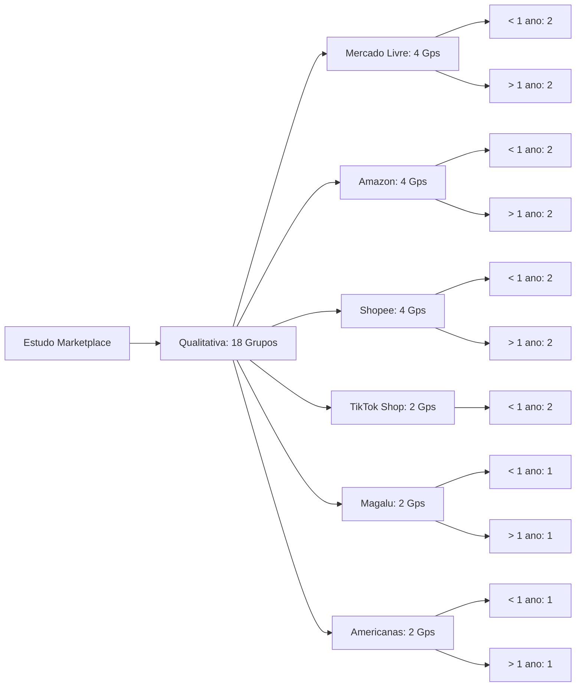
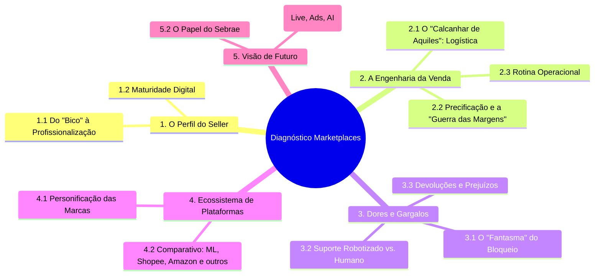
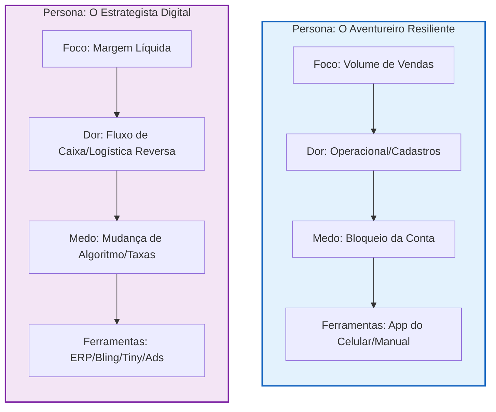
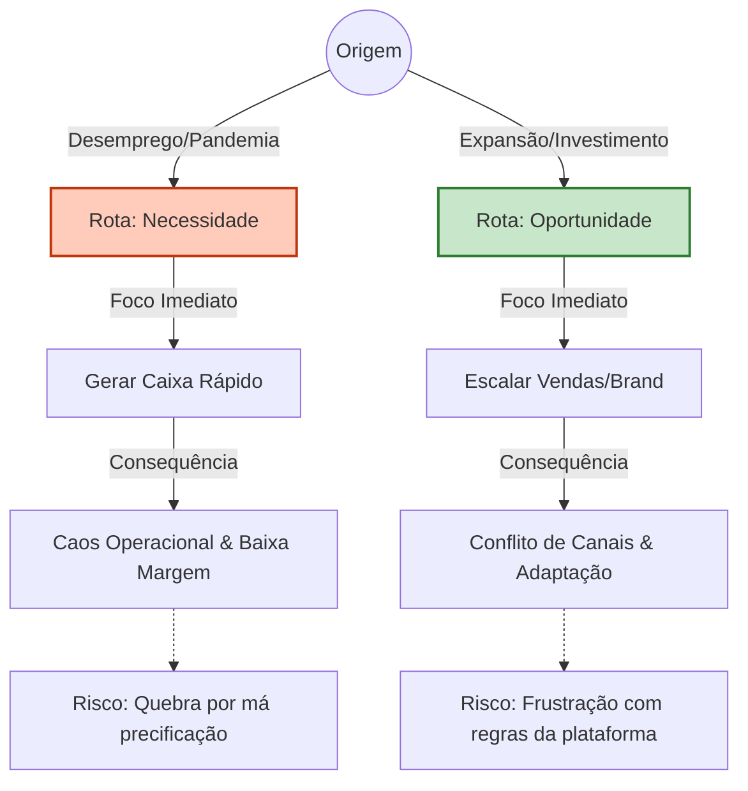
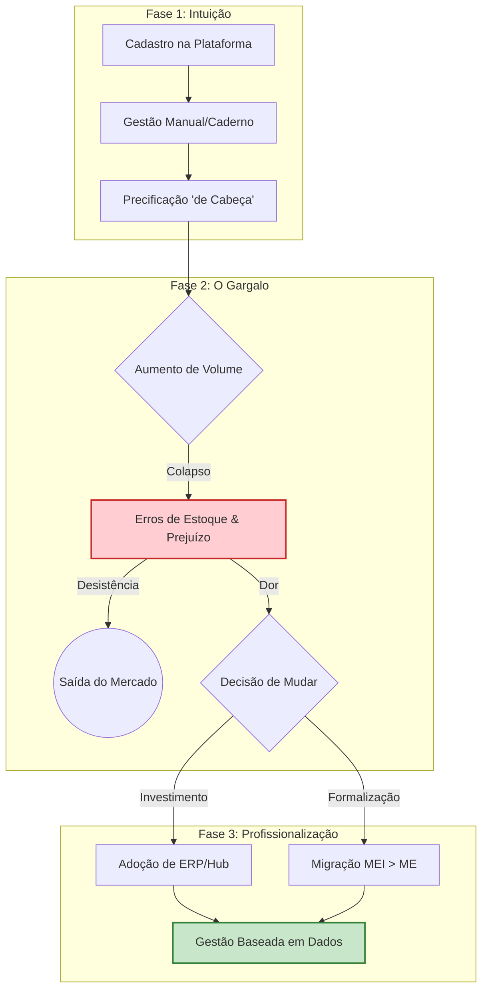
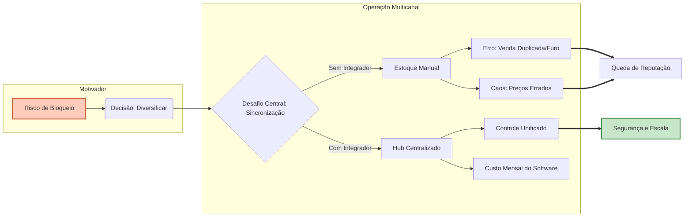

# Análise do Briefing: MARKETPLACE – DIAGNÓSTICO DAS RELAÇÕES DE VENDAS EM PLATAFORMAS DIGITAIS
## 1.0 Objetivos da Pesquisa
### 1.1 Objetivo Principal
* Levantar percepções, práticas, desafios e oportunidades de melhoria na atuação de empreendedores em marketplaces, identificando gargalos e caminhos para inovação e crescimento sustentável.

### 1.2 Objetivos Específicos
* Identificar dores e dificuldades enfrentadas pelos empreendedores.
* Mapear barreiras operacionais (logística, taxas, visibilidade, atendimento).
* Levantar práticas de sucesso e estratégias de vendedores com bom desempenho.
* Avaliar a percepção sobre a experiência de venda e confiança nas plataformas.
* Analisar o nível de satisfação e intenção de continuidade.
* Identificar oportunidades de suporte do Sebrae-SP.
* Explorar tendências futuras (IA, social commerce, live commerce).

## 2.0 Metodologia
* **Público-Alvo:** Empresários (MEI, ME e EPP) atuantes em São Paulo (Capital, RM e Interior) que utilizam Mercado Livre, Amazon, Shopee, Magalu, Americanas ou TikTok Shop.
* **Técnica:** Abordagem mista composta por **Qualitativa** (18 Grupos de Discussão Online com transmissão ao vivo) e **Quantitativa** (360 entrevistas estruturadas via WhatsApp, E-mail ou Telefone).
* **Recrutamento:** Baseado na identificação de grupos privados de WhatsApp de vendedores.
* **Período de Execução:** Início em 10/11/2025, com vigência de 2 meses.

### 2.1 Estrutura da Amostra Qualitativa
Para visualizar a distribuição dos grupos focais e facilitar o entendimento da segmentação por plataforma e tempo de atuação, apresento o seguinte diagrama:



*Justificativa do diagrama: O organograma hierárquico permite visualizar rapidamente o peso amostral de cada plataforma e a divisão entre novos entrantes e vendedores experientes.*

##3.0 Pontos de Foco para Análise* **Comparativo de Plataformas:** Diferenças cruciais entre Shopee, Mercado Livre, TikTok Shop, Amazon, Magalu e Americanas.
* **Integração de Dados:** Cruzamento entre os achados qualitativos e quantitativos.
* **Perfis:** Identificação clara de perfis de empreendedores e comparação de percepções entre vendedores e consumidores.
* **Sustentabilidade do Negócio:** Análise de gargalos que impedem o crescimento e inovação.

---

# Etapa 3: Mapeamento do Roteiro
---
Iniciando a **Etapa 3**. Anexei o roteiro da moderação. Sua tarefa é mapear a estrutura de tópicos e as perguntas-chave.

**Gere um snippet em Markdown que represente a estrutura hierárquica do roteiro:**

## Mapeamento do Roteiro de Discussão

### Bloco 1: [Nome do Bloco 1, ex: Aquecimento e Contexto]
- **Pergunta-chave:** *"[Pergunta principal do bloco 1]"*
- **Tópicos de apoio:**
    - *"[Tópico de apoio 1.1]"*
    - *"[Tópico de apoio 1.2]"*

### Bloco 2: [Nome do Bloco 2, ex: Hábitos e Atitudes]
- **Pergunta-chave:** *"[Pergunta principal do bloco 2]"*
- **Tópicos de apoio:**
    - *"[Tópico de apoio 2.1]"*
    - *"[Tópico de apoio 2.2]"*

---

### Proposta de Estrutura do Relatório
#### Mapa Mental da Estrutura
Para visualizar a interconexão dos temas, utilizarei um mapa mental que parte do diagnóstico central e se ramifica nas dimensões críticas da experiência do vendedor (Operacional, Estratégica, Emocional e Futura).



*Justificativa do diagrama: O mapa mental organiza de forma radial os pilares da pesquisa, facilitando a visualização de como as dores operacionais (ex: logística) impactam diretamente a percepção das plataformas e a necessidade de apoio futuro.*

---

### Índice Detalhado

**1.0 Perfil e Trajetória do Empreendedor Digital**
- 1.1 **Gênese do Negócio:** A entrada por necessidade vs. oportunidade planejada.
- 1.2 **Curva de Aprendizado:** A transição do amadorismo para a gestão profissional (MEI > ME/EPP).
- 1.3 **Multicanalidade:** O desafio de gerenciar múltiplas vitrines simultaneamente.

**2.0 A Engenharia da Venda: Operação e Logística**
- 2.1 **O Desafio Logístico:** A dependência do *Fulfillment* e as dores do sistema de entregas.
- 2.2 **Precificação de Sobrevivência:** O impacto das taxas, comissões e frete na margem líquida.
- 2.3 **Gestão de Reputação:** O peso da avaliação do cliente na visibilidade do anúncio.

**3.0 O "Lado Sombra": Dores e Barreiras Críticas**
- 3.1 **Insegurança Jurídica e Bloqueios:** O medo constante de perder a conta sem aviso prévio.
- 3.2 **Atendimento e Suporte:** A frustração com respostas automáticas e falta de resolução humana.
- 3.3 **Logística Reversa e Fraudes:** O prejuízo financeiro e emocional com devoluções indevidas ("Golpe da Pedra").
- 3.4 **Concorrência Predatória:** A percepção sobre vendedores internacionais e guerra de preços.

**4.0 Raio-X das Plataformas (Análise Comparativa)**
- 4.1 **Personificação das Marcas:** Se as plataformas fossem pessoas, quem seriam? (Arquétipos).
- 4.2 **Matriz de Forças e Fraquezas por Player:**
  * **Mercado Livre:** A "Locomotiva" eficiente, porém impessoal/rígida.
  * **Shopee:** A "Feira Popular" acessível, mas com logística instável.
  * **Amazon:** O "Shopping de Elite", organizado, mas complexo e burocrático.
  * **Outros (Magalu, Americanas, TikTok):** Oportunidades de nicho e desconfianças.

**5.0 Horizontes e Apoio Institucional**
- 5.1 **Tendências Percebidas:** A visão sobre Live Commerce, Inteligência Artificial e tráfego pago.
- 5.2 **O Papel do Sebrae-SP:** Lacunas de capacitação e expectativas de defesa institucional.
- 5.3 **Conclusões e Recomendações Estratégicas:** Caminhos para fortalecer o ecossistema.

---

# 1.0. Perfil e Trajetória do Empreendedor Digital

### Síntese
A entrada no ecossistema de marketplaces é predominantemente reativa, impulsionada pela **necessidade** (especialmente pós-pandemia) ou pela busca de **renda extra**. O perfil migra rapidamente de uma "aventura despretensiosa" para uma **profissionalização forçada**, onde o vendedor descobre que a barreira de entrada é baixa, mas a barreira de permanência e crescimento exige gestão complexa e resiliência emocional.

---

### Análise Detalhada
* **A "Gênese Acidental":** Uma parcela significativa dos participantes iniciou a operação como resposta ao fechamento de lojas físicas ou perda de emprego (perfil de necessidade), enquanto outros começaram vendendo itens usados ou fazendo revenda informal ("sacoleiro digital") sem plano de negócios.
* **O "Eupreendedor" Multitarefa:** O perfil predominante é o do "faz-tudo". O vendedor atua simultaneamente como comprador, estoquista, SAC e financeiro. Essa centralização gera um gargalo de crescimento, pois a operação diária consome o tempo que deveria ser dedicado à estratégia.
* **Maturidade Digital Desigual:** Nota-se um abismo entre o vendedor iniciante (focado apenas em preço e venda unitária) e o vendedor maduro (focado em margem, Ads e branding). O iniciante vê a plataforma como um "classificado"; o maduro a vê como um canal de aquisição de clientes dentro de uma estratégia maior.

> **Voz do Cliente:**
> "Eu comecei na pandemia, né? Como muita gente. A loja física fechou e eu precisei me virar. No começo achei que era só postar foto, mas aí vi que o buraco é mais embaixo. Hoje eu vivo disso, mas apanhei muito pra aprender a precificar e não pagar pra trabalhar."
> -- *Participante, Grupo 3 (Mercado Livre/Shopee)*

### Visualização dos ConceitosEste diagrama ilustra o ciclo de evolução do perfil do vendedor, destacando o ponto de inflexão onde a falta de preparo encontra a complexidade da plataforma.

```mermaid
graph TD;
    A[Gatilho: Necessidade ou Renda Extra] -->|Baixa Barreira de Entrada| B(Entrada "Aventureira");
    B -->|Primeiras Vendas| C{O Choque de Realidade};
    C -->|Positivo| D[Volume de Vendas];
    C -->|Negativo| E[Caos Operacional];
    E --> F[Gestão de Estoque/Fiscal];
    E --> G[Exigência de Rapidez/Envio];
    D & F & G ==> H[Dilema: Profissionalizar ou Desistir];
    
    style A fill:#e1f5fe,stroke:#01579b,stroke-width:2px
    style H fill:#ffccbc,stroke:#bf360c,stroke-width:2px
```

*Justificativa do diagrama: O fluxo demonstra que o sucesso inicial (vendas) traz consigo a complexidade (caos), forçando o vendedor a um ponto de decisão crítica sobre a continuidade do negócio.*

### Implicações 
**[Insight Inferido]:** O Sebrae-SP tem uma oportunidade clara de atuar não apenas na abertura da empresa (MEI), mas no **"Gap de Gestão Intermediária"**. O vendedor já sabe vender, mas não sabe escalar sem perder a margem ou a saúde mental. A capacitação deve focar em ferramentas de automação e gestão financeira específica para taxas de marketplace, transformando o "bico" em estrutura empresarial sustentável.

---

Com certeza. O aprofundamento nos perfis revela que a distinção não é apenas temporal (tempo de conta), mas de **mentalidade de gestão**.

Aqui está a **Matriz de Personas** detalhada, contrastando o vendedor em estágio inicial com o vendedor consolidado.

---

# Aprofundamento: Matriz de Personas (Iniciante vs. Experiente)

### Síntese da Análise
Identificamos dois arquétipos predominantes. O **"Aventureiro Resiliente"** (frequentemente iniciante ou estagnado) opera na *insegurança*, focado em dominar a ferramenta e "fazer a primeira venda". O **"Estrategista Digital"** (maduro) opera na *otimização*, focado em margem, escala e diversificação de canais para não depender de um único "patrão" (plataforma).

---

### Diagrama de Mentalidade Comparada
Abaixo, mapeamos como as prioridades e dores mudam drasticamente conforme a maturidade do vendedor.



*Justificativa do diagrama: A separação em subgrafos permite visualizar rapidamente que, enquanto o iniciante luta contra a ferramenta (cadastro, bloqueio), o experiente luta contra o mercado (margem, taxas, algoritmo).*

---

### Detalhamento dos Perfis
#### 1. O "Aventureiro Resiliente" (Estágio Inicial/Intermediário)* **Perfil:** Geralmente MEI ou informal. Entrou por necessidade. Vê a plataforma como "mágica": coloca o produto e espera vender.
* **Comportamento:** Sofre com a precificação, muitas vezes pagando para vender por não calcular taxas e embalagem. Tem dificuldade técnica com impressão de etiquetas e integração.
* **Relação com a Plataforma:** Medo e submissão. Sente-se um funcionário sem direitos. Qualquer notificação gera pânico.

> **Voz do Cliente (Iniciante):**
> "No começo eu ficava desesperada quando não apitava venda. Eu baixava o preço sem ver se tinha lucro, só pra ver sair. Hoje vejo que perdi dinheiro."
> -- *Participante, Grupo 2 (Shopee/ML)*

#### 2. O "Estrategista Digital" (Estágio Maduro)* **Perfil:** ME ou EPP. Já possui equipe (mesmo que pequena) e sistema de gestão (ERP). Vê a plataforma como um "mal necessário" ou parceiro de negócios.
* **Comportamento:** Investe pesado em Ads (publicidade paga dentro da plataforma). Usa Fulfillment (estoque na plataforma) e Flex. Sua dor é financeira (giro de caixa preso na plataforma) e logística (devoluções injustas).
* **Relação com a Plataforma:** Desconfiança estratégica. Diversifica em vários marketplaces para não "colocar todos os ovos na mesma cesta".

> **Voz do Cliente (Experiente):**
> "O Mercado Livre não é seu sócio, ele é o dono do cassino. Você tem que saber jogar. Eu uso o Full deles pra ranquear, mas meu lucro real vem quando puxo o cliente pro meu site depois."
> -- *Participante, Grupo 15 (Multicanal)*

---

### Tabela Comparativa de Dores e Necessidades

| Aspecto | Iniciante (Aventureiro) | Experiente (Estrategista) |
| --- | --- | --- |
| **Maior Gargalo** | Entender como funciona a plataforma e gerar tráfego orgânico. | Gerenciar fluxo de caixa e lidar com a concorrência predatória (preço). |
| **Visão sobre Taxas** | "É muito caro, a plataforma rouba meu lucro". | "É o Custo de Aquisição de Cliente (CAC), mas precisa valer a pena". |
| **Logística** | Correios/Ponto de envio (leva o pacote na agência). | Coleta, Full, Flex (estratégia de entrega rápida). |
| **Necessidade Sebrae** | Passo-a-passo básico, formalização, precificação simples. | Consultoria jurídica, tributária, gestão de estoque complexa e crédito. |

### Implicações para o Relatório
**[Insight Inferido]:** As estratégias de comunicação e suporte do Sebrae precisam ser **segmentadas**. Oferecer "curso básico de como vender na internet" afasta o vendedor experiente que busca soluções para problemas fiscais complexos ou estratégias de importação. O relatório deve sugerir trilhas de capacitação distintas.

---

# 1.1. Gênese do Negócio: 
A entrada por necessidade vs. oportunidade planejada###SínteseA entrada no marketplace é predominantemente marcada pela **reatividade**. A grande maioria dos participantes relata ter iniciado suas operações por **necessidade de sobrevivência** (desemprego, fechamento do comércio físico na pandemia) ou busca de renda complementar, e não por um planejamento estratégico de expansão de canal. Isso gera uma base de vendedores resilientes, mas carentes de fundamentos de gestão.

---

### Análise Detalhada
* **O "Boom" da Sobrevivência (Efeito Pandemia):** A narrativa mais comum é a do "empreendedor acidental". O fechamento das lojas físicas durante a pandemia ou a demissão forçaram a entrada no digital sem preparo prévio. Para este grupo, o marketplace não foi uma escolha, foi a única tábua de salvação.
* **A Ilusão da "Renda Extra":** Muitos começaram vendendo itens usados ou fazendo "bicos" de revenda para complementar o salário. Quando o volume cresceu, viram-se "obrigados" a transformar o bico em negócio principal, muitas vezes sem separar o CPF do CNPJ, levando vícios da informalidade para a operação profissional.
* **Planejamento como Exceção:** A entrada planejada (oportunidade) é rara e restrita a perfis que já possuíam estrutura de e-commerce ou indústria e decidiram usar o marketplace como canal de aquisição (vitrine), e não como destino final.

> **Voz do Cliente:**
> "Eu não planejei nada. Fui demitida na pandemia, tinha um acerto [rescisão] e comprei tudo em mercadoria pra não ficar parada. O Mercado Livre foi o jeito que deu pra escoar, porque não podia abrir porta pra rua."
> -- *Participante, Grupo 2 (Foco em Renda/Iniciante)*

### Visualização dos Conceitos
O diagrama abaixo mapeia as duas rotas de entrada identificadas e como a **origem** define a **dor inicial** do vendedor.



*Justificativa do diagrama: O fluxograma bifurcado é essencial para demonstrar que, embora ambos os perfis terminem vendendo no mesmo lugar (a plataforma), a motivação inicial cria "heranças malditas" diferentes (caos financeiro vs. frustração estratégica) que exigem soluções distintas.*

### Implicações 
**[Insight Inferido]:** Como a maioria entra por necessidade e sem capital de giro, há uma **vulnerabilidade financeira extrema** nos primeiros 12 meses. O Sebrae-SP deve abordar esse público não com "planos de negócios complexos" (que eles ignoram por urgência), mas com "kits de primeiros socorros financeiros": como precificar para não pagar para trabalhar e como separar o dinheiro de casa do dinheiro da venda.

---

#1.2. Curva de Aprendizado: A transição do amadorismo para a gestão profissional###SínteseA evolução do vendedor não é linear; ela é marcada por **ciclos de dor e adaptação forçada**. O aprendizado ocorre predominantemente de forma empírica ("na marra"), onde o erro operacional — como vender sem estoque ou precificar errado — atua como o principal professor. A transição do amadorismo para o profissionalismo acontece no momento crítico em que o controle manual (caderninho/planilha) colapsa diante do volume de vendas, exigindo a adoção de tecnologias de gestão (ERPs).

---

###Análise Detalhada* **O "Custo do Aprendizado" (Tuition of Error):** Os participantes relatam que o domínio da plataforma custou dinheiro. Erros de precificação (esquecer de incluir a taxa de comissão ou o custo da embalagem) e punições por atraso no envio são vistos como o "pedágio" pago para entender as regras do jogo, já que os tutoriais das plataformas são considerados superficiais ou desatualizados.
* **O Salto Tecnológico (Do Manual ao ERP):** Existe um divisor de águas claro: a implementação de um sistema de gestão (Hub/ERP como Bling ou Tiny). O vendedor amador tenta gerenciar múltiplos canais manualmente, o que gera erros de estoque. O vendedor que se profissionaliza entende que sem automação não há escala, embora a configuração inicial desses sistemas seja uma barreira técnica significativa.
* **O Teto do MEI como Freio Psicológico:** A transição fiscal (sair do MEI para ME) é vista com medo. Muitos "seguram" as vendas ou criam contas em nome de parentes para não estourar o limite, retardando a profissionalização por receio da burocracia e da carga tributária do Simples Nacional.

> **Voz do Cliente:**
> "No início eu achava que era só colocar o produto lá. Aí vendi 50 peças de um negócio que eu tinha 10. Foi um desespero. Tive que cancelar, minha reputação foi pro chão. Ali eu aprendi que ou você tem sistema [ERP] ou você não tem vida. Foi meu batismo de fogo."
> -- *Participante, Grupo 4 (Maturidade Intermediária)*

###Visualização dos ConceitosEste diagrama de fluxo ilustra os estágios de maturidade, destacando o "Gargalo do Caos" que força a evolução ou a desistência.



*Justificativa do diagrama: O modelo em três fases evidencia que a profissionalização não é um passo natural, mas uma resposta a uma crise (o colapso da gestão manual). Isso ajuda a identificar onde o suporte externo é mais necessário.*

### Implicações
**[Insight Inferido]:** O momento de maior risco de mortalidade do negócio não é o início (cadastro), mas o **momento da escala**, quando a gestão manual falha. O Sebrae deve focar em mentorias de "Transição Tecnológica" (como configurar o primeiro ERP) e "Educação Fiscal Descomplicada" (desmistificando a saída do MEI), atuando como uma ponte segura sobre o abismo da profissionalização.

# 1.3. Multicanalidade: O desafio de gerenciar múltiplas vitrines simultaneamente
### Síntese
A multicanalidade surge menos como uma estratégia ofensiva de conquista de mercado e mais como um **mecanismo de defesa** ("não colocar todos os ovos na mesma cesta"). O medo de bloqueios súbitos ou mudanças de algoritmo em uma plataforma dominante (geralmente Mercado Livre) empurra o vendedor para outras vitrines. No entanto, essa diversificação cria um **pesadelo operacional**: a sincronização de estoque e a gestão de precificações distintas para margens que variam drasticamente entre canais.

---

### Análise Detalhada
* **A Estratégia de Sobrevivência (Antifrágil):** A principal motivação para abrir contas na Amazon, Shopee ou Magalu é a insegurança jurídica. O vendedor sente que, se sua conta principal cair, o negócio quebra. A multicanalidade é vista como um seguro de vida empresarial, garantindo fluxo de caixa caso uma "torneira" se feche.
* **O "Cobertor Curto" do Estoque:** Sem o uso de integradores (Hubs/ERPs), a venda multicanal gera o erro fatal de "furo de estoque" (vender o mesmo item único no Mercado Livre e na Shopee simultaneamente). Isso obriga o vendedor a cancelar uma das vendas, prejudicando sua reputação. A gestão manual de múltiplos canais é apontada como insustentável.
* **Esquizofrenia de Preços:** Os participantes relatam a dificuldade de manter a coerência de preços. Cada plataforma possui uma estrutura de comissão, frete e política de parcelamento diferente. O desafio é calcular o preço ideal para cada vitrine sem canibalizar a própria venda ou perder competitividade.

> **Voz do Cliente:**
> "Eu era só Mercado Livre. Um dia minha conta foi suspensa por 3 dias para análise. Eu não vendi nada, entrei em pânico. Ali eu decidi que tinha que estar na Shopee, na Amazon, em tudo. Dá o triplo de trabalho, o sistema às vezes falha, mas eu não fico mais na mão de um dono só."
> -- *Participante, Grupo 15 (Estratégia Multicanal)*

### Visualização dos Conceitos
O diagrama abaixo representa a tensão entre a segurança da diversificação e a complexidade operacional que ela acarreta.



*Justificativa do diagrama: O fluxo lateral demonstra que a decisão de diversificar bifurca a operação. Sem a ferramenta correta (Integrador), o resultado converge para a queda de reputação, anulando o benefício da diversificação.*

### Implicações
**[Insight Inferido]:** A multicanalidade exige uma **inteligência de precificação avançada**. Não basta replicar o anúncio; é preciso adaptar a "arquitetura de preço" para cada canal (ex: preço maior na Amazon devido à taxa, preço menor na Shopee com cupom). O Sebrae pode atuar com ferramentas de **"Engenharia de Cardápio Digital"**, ensinando o vendedor a calcular a margem de contribuição real por canal, evitando que o lucro de uma plataforma financie o prejuízo de outra.

---

**Análise do tema 1.3 concluída.**

Finalizamos o bloco "1.0 Perfil e Trajetória". A estrutura prevê agora o início do bloco **"2.0 A Engenharia da Venda: Operação e Logística"**. Posso prosseguir para o tema **2.1 O Desafio Logístico**?