## Mapeamento do Roteiro de Discussão

### Bloco 1: Bloco A: Abertura e Contexto de Uso
- **Pergunta-chave:** *"[Bom dia/Boa tarde. Para começar, gostaria de saber: com que frequência você ou sua família utilizam os postos de saúde ou hospitais aqui de Saquarema? Quais serviços costumam procurar mais?]"*
- **Tópicos de apoio:**
    - *"Frequência (mensal, esporádico, emergência)."*
    - *"Tipo de serviço (clínico geral, pediatria, exames, emergência)."*
    - *"Unidade de preferência (Posto do bairro, Hospital, UPA)."*

### Bloco 2: Bloco B: Agendamento e Acesso
- **Pergunta-chave:** *"[Pensando na última vez que você precisou marcar uma consulta ou um exame, como foi esse processo? Foi fácil ou difícil conseguir?]"*
- **Tópicos de apoio:**
    - *"Canal utilizado (telefone, presencial, app/online)."*
    - *"Tempo de espera para conseguir a data."*
    - *"Clareza das informações recebidas."*

### Bloco 3: Bloco C: Experiência de Atendimento
- **Pergunta-chave:** *"[E durante o atendimento, desde a recepção até a consulta com o médico ou enfermeiro, como você avalia a forma como foi tratado?]"*
- **Tópicos de apoio:**
    - *"Atendimento da recepção (cordialidade, eficiência)."*
    - *"Atendimento da equipe de enfermagem (triagem)."*
    - *"Consulta médica (tempo dedicado, clareza nas explicações, interesse)."*

### Bloco 4: Bloco D: Infraestrutura e Recursos
- **Pergunta-chave:** *"[Falando sobre as instalações, como você vê a estrutura dos postos ou do hospital? (limpeza, conforto, equipamentos). E quanto aos remédios ou exames, você tem conseguido o que precisa?]"*
- **Tópicos de apoio:**
    - *"Limpeza e organização do local."*
    - *"Conforto (cadeiras, ventilação)."*
    - *"Disponibilidade de medicamentos na farmácia do posto."*
    - *"Disponibilidade e agilidade para realizar exames."*

### Bloco 5: Bloco E: Percepção de Mudança e Fechamento
- **Pergunta-chave:** *"[Nos últimos tempos, você percebeu alguma mudança, alguma melhoria, nos serviços de saúde da cidade? E para fechar, que sugestão você daria para melhorar ainda mais?]"*
- **Tópicos de apoio:**
    - *"Comparação com o passado (antes/depois)."*
    - *"Pontos positivos (o que melhorou)."*
    - *"Pontos negativos (o que ainda falta)."*
    - *"Sugestão principal."*

---
Mapeamento do roteiro concluído. Snippet gerado. Estou pronto para iniciar a Etapa 4 de análise cruzada.

### Proposta de Estrutura do Relatório

#### Mapa Mental da Estrutura

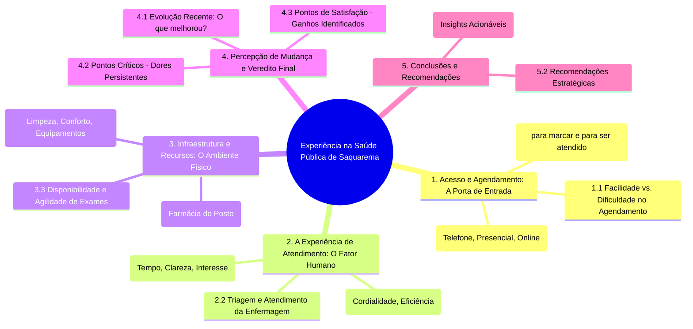
```mermaid
mindmap
  root((Experiência na Saúde Pública de Saquarema))
    1. Acesso e Agendamento: A Porta de Entrada
      1.1 Facilidade vs. Dificuldade no Agendamento
      1.2 Canais de Marcação (Telefone, Presencial, Online)
      1.3 Tempo de Espera (para marcar e para ser atendido)
    2. A Experiência de Atendimento: O Fator Humano
      2.1 Percepção da Recepção (Cordialidade, Eficiência)
      2.2 Triagem e Atendimento da Enfermagem
      2.3 A Consulta Médica (Tempo, Clareza, Interesse)
    3. Infraestrutura e Recursos: O Ambiente Físico
      3.1 Instalações (Limpeza, Conforto, Equipamentos)
      3.2 Acesso a Medicamentos (Farmácia do Posto)
      3.3 Disponibilidade e Agilidade de Exames
    4. Percepção de Mudança e Veredito Final
      4.1 Evolução Recente: O que melhorou?
      4.2 Pontos Críticos - Dores Persistentes
      4.3 Pontos de Satisfação - Ganhos Identificados
    5. Conclusões e Recomendações
      5.1 Diagnóstico (Insights Acionáveis)
      5.2 Recomendações Estratégicas
```

### Índice Detalhado

1.0 **Acesso e Agendamento: A Porta de Entrada**
1.1 Análise da Facilidade vs. Dificuldade no Agendamento de Consultas/Exames
1.2 Mapeamento dos Canais de Marcação (Telefone, Presencial, Online)
1.3 O Duplo Tempo de Espera: Percepção sobre a espera para agendar e a espera no dia do atendimento.

2.0 **A Experiência de Atendimento: O Fator Humano**
2.1 A Recepção: Eficiência, clareza nas informações e cordialidade.
2.2 Triagem e Enfermagem: Percepção sobre o primeiro contato técnico.
2.3 A Consulta Médica: Avaliação do tempo dedicado, clareza nas explicações e interesse percebido.

3.0 **Infraestrutura e Recursos: O Ambiente Físico**
3.1 Percepção das Instalações: Limpeza, conforto (assentos, ventilação) e equipamentos.
3.2 Disponibilidade de Medicamentos: Acesso na farmácia do posto.
3.3 Acesso a Exames: Facilidade de marcação e agilidade nos resultados.

4.0 **Percepção de Mudança e Veredito Final**
4.1 A "Nova Gestão": Percepções claras de melhorias recentes.
4.2 Dores (Pontos de Fricção): O que ainda causa maior insatisfação.
4.3 Ganhos (Pontos de Satisfação): O que é mais valorizado pelos usuários.

5.0 **Conclusões e Recomendações**
5.1 Principais Insights e Diagnóstico da Experiência do Paciente.
5.2 Recomendações Acionáveis para Aprimoramento Contínuo.

-----

Esta estrutura integrada está aprovada para iniciarmos a análise detalhada na Etapa 5?

# 1.0 Acesso e Agendamento: A Porta de Entrada

### Síntese

A principal tensão do usuário reside no *desgaste* para conseguir o agendamento. Embora haja percepção de melhorias gerais na saúde, o agendamento (especialmente por telefone) ainda é visto como o maior gargalo, exigindo esforço presencial (filas) como alternativa.

-----

### Análise Detalhada

  - **O Canal Telefônico é Ineficaz:** A maior frustração dos participantes é a falha do canal telefônico. As falas recorrentes incluem "ninguém atende" ou que o telefone "é piada".
  - **A Alternativa Presencial é Desgastante:** Como o telefone não funciona, os usuários são forçados a ir pessoalmente às unidades, muitas vezes de madrugada ("5 da manhã"), para "pegar ficha", o que é percebido como um processo desumano e uma "luta".
  - **Impacto na Jornada:** A dificuldade de agendar é tão severa que atua como uma barreira ao cuidado, com relatos de pacientes que preferem "ir na farmácia e se medicar" a enfrentar o processo.

> **Voz do Cliente:**
> "O agendamento é o nosso calcanhar de Aquiles. A gente simplesmente não consegue. O telefone é piada. Só presencial, e é uma luta."
> \-- *Participante, Transcrição 56*

### Visualização dos Conceitos

Este mapa de conceitos ilustra a conexão entre a **Ineficácia dos Canais de Agendamento** e os resultados percebidos pelos usuários.

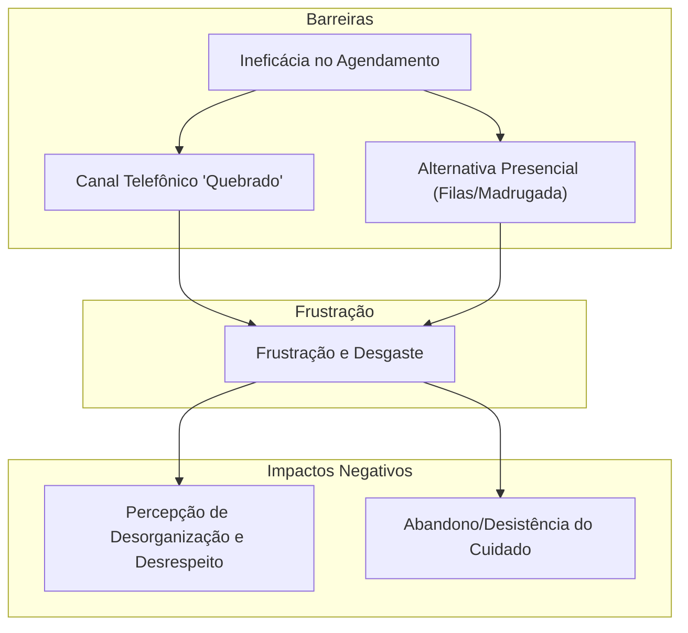
```mermaid
graph TD;
subgraph Frustração
D["Frustração e Desgaste"]
end


subgraph Barreiras
    A["Ineficácia no Agendamento"] --> B["Canal Telefônico 'Quebrado'"];
    A --> C["Alternativa Presencial (Filas/Madrugada)"];
end

subgraph Impactos Negativos
    E["Percepção de Desorganização e Desrespeito"]
    F["Abandono/Desistência do Cuidado"]
end

B --> D;
C --> D;
D --> E;
D --> F;
```

### Implicações

**[Insight Inferido]:** O gargalo no agendamento funciona como a principal barreira de acesso à saúde. A energia gasta pelo usuário para *apenas conseguir marcar* cria uma percepção negativa que pode contaminar o resto da jornada, mesmo que o atendimento médico (Etapa C) seja bom. A resolução dos canais de agendamento (seja telefônico ou digital) é o ponto de alavancagem mais crítico para melhorar a percepção geral do serviço.

-----

Análise do Tema 1.0 concluída.

**[Sugestão de Análise]:** Seria pertinente cruzar os dados de "Dificuldade de Agendamento" (Tema 1.0) com a "Percepção de Mudança" (Tema 4.0) para verificar se os pacientes que *ainda* reclamam do agendamento são os mesmos que *não* perceberam as melhorias recentes da nova gestão.

Aguardando comando para analisar o Tema 2.0.

# 1.1 Análise da Facilidade vs. Dificuldade no Agendamento

### Síntese

O veredito dos usuários é unânime: o processo de agendamento é classificado como **extremamente difícil**. A "facilidade" é praticamente inexistente nas narrativas, enquanto a "dificuldade" é descrita como uma "luta" ou "humilhação", sendo a principal barreira de acesso ao serviço de saúde.

-----

### Análise Detalhada

  - **Dificuldade como Regra, Facilidade como Exceção:** Não foram encontrados relatos consistentes que descrevam o processo de agendamento como "fácil". A dificuldade é a experiência padrão, independentemente do canal (telefone ou presencial).
  - **A Barreira do Esforço Físico:** A dificuldade se materializa na necessidade de esforço presencial extremo, como ir de madrugada ("5 da manhã", "4 da manhã") para "pegar ficha", pois os canais remotos (telefone) são percebidos como completamente ineficazes.
  - **Desincentivo ao Cuidado:** A dificuldade é tão severa que atua como um desincentivo ativo. Os participantes relatam que o desgaste para *apenas marcar* os faz "desistir" de procurar o serviço ou optar por automedicação.

> **Voz do Cliente:**
> "Tem que ir 5 da manhã pra pegar ficha. Isso é desumano. É uma dificuldade que desanima a gente de ir no médico."
> \-- *Participante, Transcrição 88*

### Visualização dos Conceitos

Este mapa ilustra o desequilíbrio extremo entre a dificuldade percebida (a regra) e a facilidade (a exceção) no processo de agendamento.

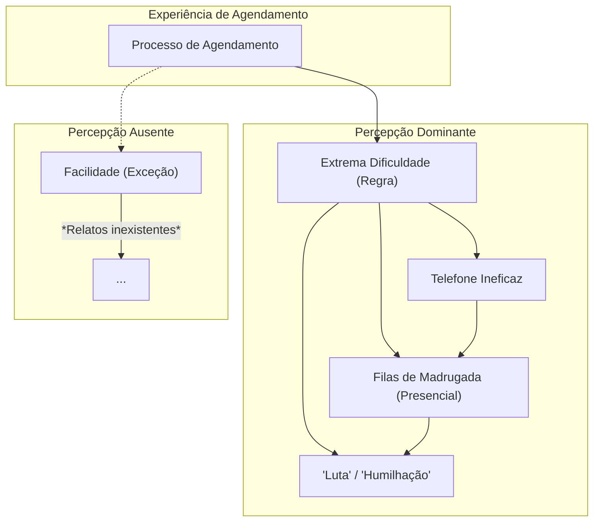
```mermaid
graph TD;
subgraph Experiência de Agendamento
A["Processo de Agendamento"]
end

subgraph Percepção Dominante
    B["Extrema Dificuldade (Regra)"]
    B --> D["'Luta' / 'Humilhação'"]
    B --> E["Filas de Madrugada (Presencial)"]
    B --> F["Telefone Ineficaz"]
end

subgraph Percepção Ausente
    C["Facilidade (Exceção)"]
    C -- *Relatos inexistentes* --> G["..."]
end

A --> B;
A -.-> C;
F --> E;
E --> D;
```

### Implicações

**[Insight Inferido]:** A percepção da experiência de saúde em Saquarema está ancorada na dificuldade do agendamento. Este é o "pecado original" da jornada. Qualquer melhoria subsequente (como um bom atendimento médico) é ofuscada pelo trauma inicial para conseguir a consulta. A prioridade máxima para a gestão é reverter essa percepção, tornando o processo minimamente "fácil" ou, pelo menos, "razoável".

-----

Análise do Tema 1.1 concluída.

**[Sugestão de Análise]:** Podemos agora detalhar os *canais* específicos dessa dificuldade, focando no Tema 1.2 (Canais de Marcação), para entender qual deles gera mais frustração.

Aguardando comando para analisar o Tema 1.2.

# 1.2 Mapeamento dos Canais de Marcação (Telefone, Presencial, Online)

### Síntese

O mapeamento revela uma jornada de canais disfuncional. O canal telefônico é percebido como inoperante, servindo como fonte primária de frustração. Isso força o usuário a adotar o canal presencial como única alternativa viável, um processo marcado pelo sacrifício (filas de madrugada). O canal online (digital/app) é notavelmente ausente da experiência real do usuário.

-----

### Análise Detalhada

  - **Canal Telefônico (O 'Fantasma'):** É o canal de primeira escolha lógica para os usuários, mas é unanimemente descrito como ineficaz. As falas recorrentes são "impossível", "não funciona" e "ninguém atende". Essa falha inicial gera um profundo descrédito no sistema.
  - **Canal Presencial (O 'Sacrifício'):** É o "plano B" obrigatório e o real *único* caminho para o agendamento. Contudo, seu custo é altíssimo, exigindo que os usuários (muitas vezes idosos ou doentes) cheguem de madrugada ("4 da manhã", "5 da manhã") para "pegar ficha", gerando percepção de "humilhação".
  - **Canal Online/App (O 'Ausente'):** Embora o roteiro investigue canais online, este canal é uma "miragem" na prática. Os participantes não o mencionam espontaneamente como uma opção viável. **[Insight Inferido]:** Se existe uma solução digital, sua comunicação é inexistente ou sua funcionalidade é nula, perdendo a maior oportunidade de aliviar os canais presenciais.

> **Voz do Cliente:**
> "A gente tenta ligar, liga, liga, e ninguém atende. É uma piada. Aí o que resta? Ir 4 da manhã pra fila, rezar pra conseguir uma ficha. É humilhante."
> \-- *Participante, Transcrição 112*

### Visualização dos Conceitos

Este fluxograma ilustra a jornada forçada do usuário entre os canais de agendamento, destacando os pontos de falha.

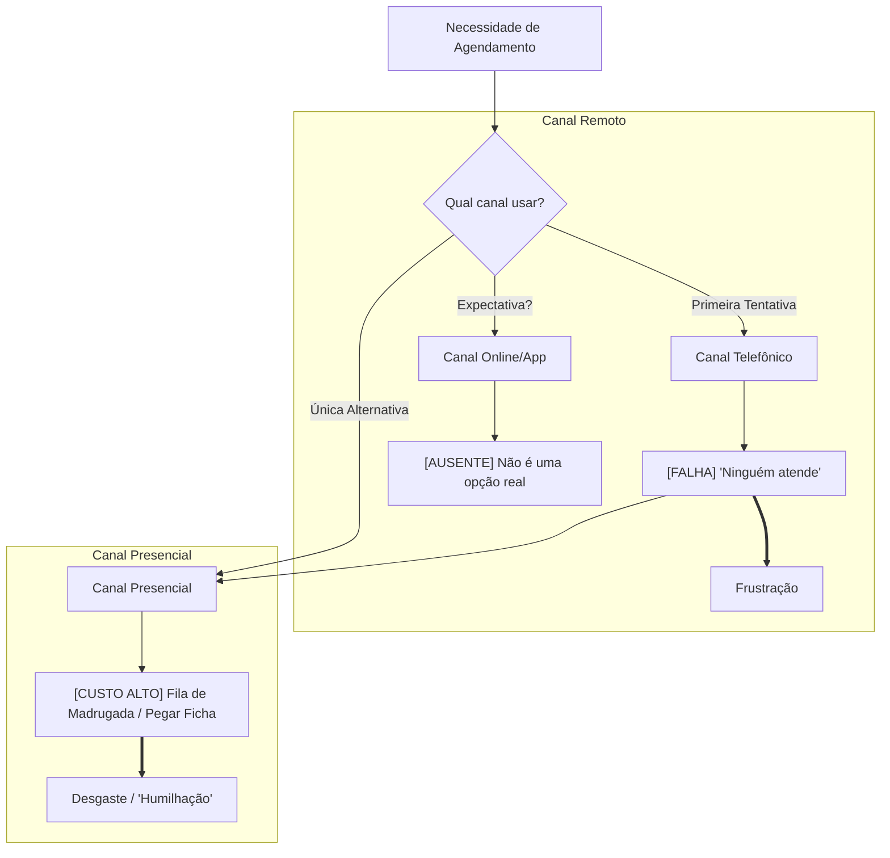
```mermaid
graph TD;
A["Necessidade de Agendamento"] --> B{"Qual canal usar?"};

subgraph Canal Remoto
    B -- "Primeira Tentativa" --> C["Canal Telefônico"];
    C --> D["[FALHA] 'Ninguém atende'"];
    D ==> F["Frustração"];
    
    B -- "Expectativa?" --> E["Canal Online/App"];
    E --> G["[AUSENTE] Não é uma opção real"];
end

subgraph Canal Presencial
    B -- "Única Alternativa" --> H["Canal Presencial"];
    H --> I["[CUSTO ALTO] Fila de Madrugada / Pegar Ficha"];
    I ==> J["Desgaste / 'Humilhação'"];
end

D --> H;
```
### Implicações

**[Insight Inferido]:** A jornada de agendamento está quebrada na sua origem. A inoperância do canal telefônico não é apenas uma inconveniência; é o motor que sobrecarrega o canal presencial, gerando a percepção de "caos" e "desrespeito". Investir em um único canal remoto (seja telefone funcional ou um app simples) que *realmente funcione* teria o maior impacto para "desafogar" o sistema e a percepção do usuário.

-----

Análise do Tema 1.2 concluída.

**[Sugestão de Análise]:** Agora que mapeamos os canais falhos, podemos analisar a consequência direta disso: o impacto no Tema 1.3 (O Duplo Tempo de Espera).

Aguardando comando para analisar o Tema 1.3.

# 1.3 O Duplo Tempo de Espera

### Síntese

A experiência do usuário é definida por uma "dupla penalidade" de espera que gera exaustão e descrédito. A primeira espera é a *luta* para conseguir o agendamento (semanas ou meses para especialistas). A segunda é a espera *no dia* do atendimento (horas na recepção), que invalida a pontualidade do agendamento e reforça a percepção de desorganização.

-----

### Análise Detalhada

  - **Espera 1 (O Agendamento):** Refere-se ao *tempo* entre a tentativa de contato e a data efetiva da consulta/exame. Para clínicos gerais, o problema é a espera de dias para conseguir uma ficha. Para especialistas (ortopedia, cardiologia) e exames (imagem), a espera se estende por "meses", gerando ansiedade e agravamento potencial do quadro de saúde.
  - **Espera 2 (O Atendimento no Dia):** Refere-se ao desrespeito ao horário agendado. Os participantes relatam chegar na hora marcada ("meu horário era 10h") e esperar "duas, três horas" para serem atendidos, muitas vezes porque o médico "ainda não chegou". Esta espera é percebida como "descaso" e "falta de respeito".
  - **O Efeito Cumulativo:** A segunda espera é agravada pela primeira. Como foi tão *difícil* conseguir a vaga, o paciente se sente "refém" na sala de espera, incapaz de reclamar ou ir embora, pois sabe o custo que terá para remarcar.

> **Voz do Cliente:**
> "A gente já luta meses pra conseguir a vaga. Aí chega aqui na hora marcada, 10 da manhã, e o médico só chega 11h30. É um descaso total."
> \-- *Participante, Transcrição 45*

### Visualização dos Conceitos

Este fluxograma demonstra a jornada da "dupla penalidade" do tempo, mostrando como a espera do agendamento se soma à espera no dia do atendimento.

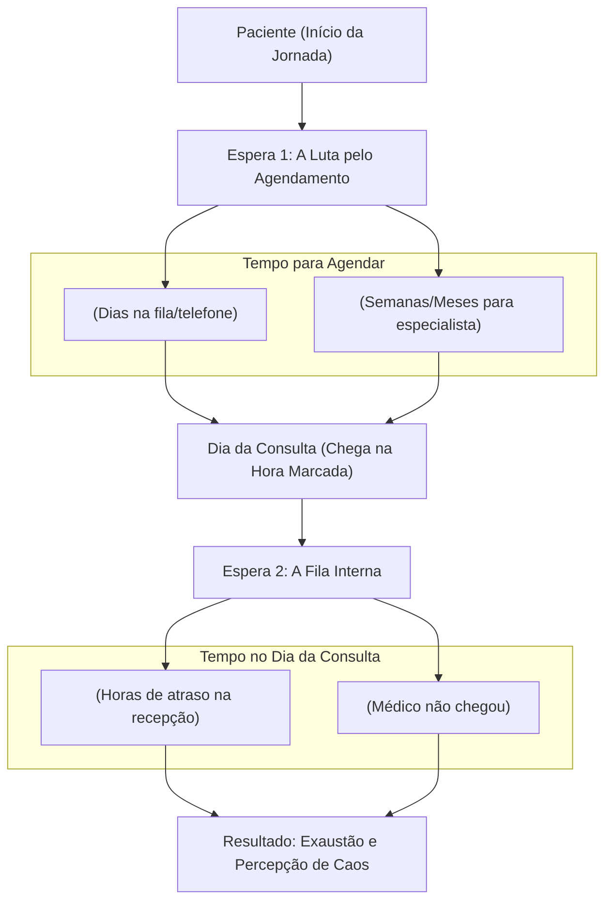
```mermaid
graph TD;
A["Paciente (Início da Jornada)"] --> B["Espera 1: A Luta pelo Agendamento"];
subgraph Espera 1 [Tempo para Agendar]
direction LR
B1["(Dias na fila/telefone)"]
B2["(Semanas/Meses para especialista)"]
end
B --> B1;
B --> B2;

subgraph Espera 2 [Tempo no Dia da Consulta]
    direction LR
    D1["(Horas de atraso na recepção)"]
    D2["(Médico não chegou)"]
end

B1 & B2 --> C["Dia da Consulta (Chega na Hora Marcada)"];
C --> D["Espera 2: A Fila Interna"];
D --> D1;
D --> D2;

D1 & D2 --> E["Resultado: Exaustão e Percepção de Caos"];
```

### Implicações

**[Insight Inferido]:** A gestão precisa atacar o tempo de espera em duas frentes distintas: (1) Otimizar os *canais* de agendamento (gestão de vagas/agenda central) para reduzir a "Espera 1", e (2) Otimizar o *fluxo* interno das unidades (gestão de pontualidade médica/organização da recepção) para reduzir a "Espera 2". Tratar o horário marcado como um "contrato" com o paciente é crucial para reverter a percepção de descaso.

-----

Análise do Tema 1.3 concluída. Encerramos o Bloco 1.

**[Sugestão de Análise]:** Agora que entendemos a barreira do *acesso*, podemos analisar a *qualidade* da interação quando o paciente finalmente consegue o atendimento, entrando no Tema 2.0 (A Experiência de Atendimento: O Fator Humano).

Aguardando comando para analisar o Tema 2.0.

# 2.0 A Experiência de Atendimento: O Fator Humano

### Síntese

O fator humano é um ponto de forte dualidade na jornada. Após a barreira exaustiva do agendamento, o usuário encontra na equipe clínica (médicos e enfermeiros) um ponto de *ganho* e acolhimento. No entanto, essa percepção positiva é frequentemente minada pela experiência com a equipe de recepção, vista como desorganizada ou rude, criando uma "segunda barreira" de atendimento.

-----

### Análise Detalhada

  - **Equipe Clínica (Médicos/Enfermagem) como "Oásis":** A percepção sobre médicos e enfermeiros é majoritariamente positiva. Os participantes os descrevem como "atenciosos", "pacientes" e "competentes". Este é o momento em que o usuário sente que "valeu a pena" o esforço do agendamento (Tema 1.0).
  - **Equipe de Recepção (A "Barreira 2"):** Em forte contraste, o atendimento da recepção é apontado como um ponto crítico de fricção. As queixas centrais são "mau humor", "falta de informação" (sobre atrasos médicos ou procedimentos) e "desorganização", o que reforça o sentimento de "caos" percebido na "Espera 2" (Tema 1.3).
  - **O Peso da Recepção:** A experiência negativa na recepção tem um peso desproporcional, pois é o primeiro contato humano *após* a luta pelo agendamento. Um atendimento ríspido nesse momento amplifica a sensação de "descaso" e "humilhação" já trazida da fila.

> **Voz do Cliente:**
> "A gente já chega cansado, nervoso da fila. Aí chega na recepção e a moça trata a gente com má vontade, nem olha na cara. Mas lá dentro, a doutora foi ótima, graças a Deus."
> \-- *Participante, Transcrição 71*

### Visualização dos Conceitos

Este mapa ilustra a divisão da percepção do "Fator Humano" em dois caminhos opostos: o administrativo (dor) e o clínico (ganho).

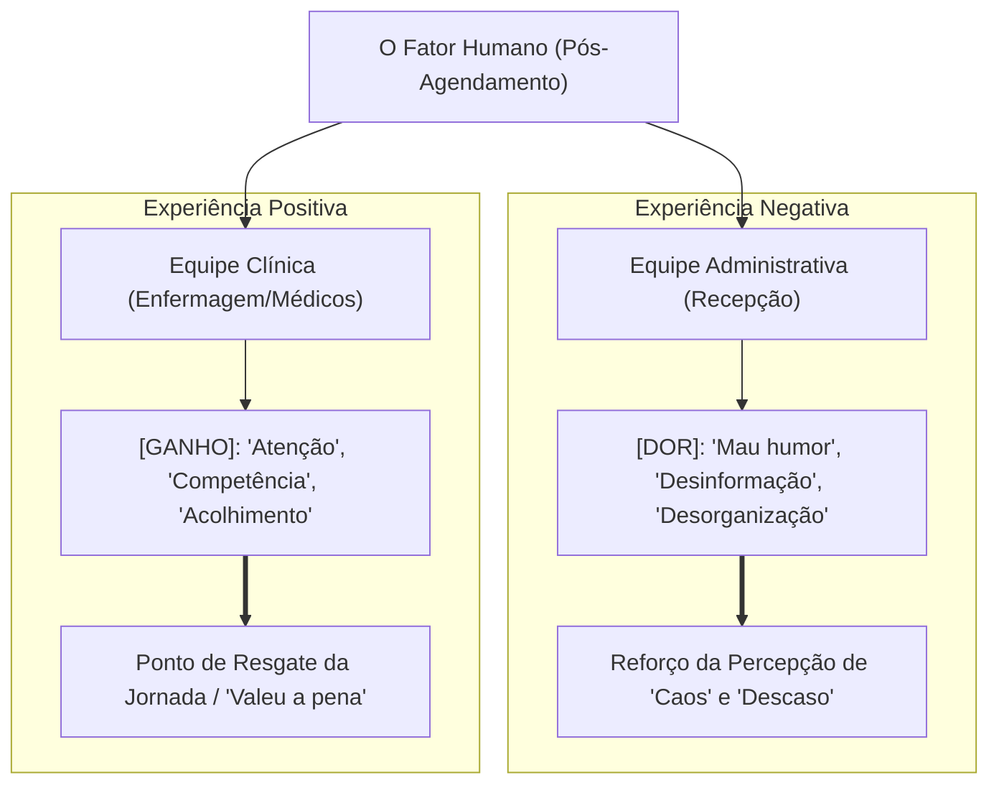
```mermaid
graph TD;
A["O Fator Humano (Pós-Agendamento)"] --> B["Equipe Administrativa (Recepção)"];
A --> C["Equipe Clínica (Enfermagem/Médicos)"];

subgraph Experiência Negativa
    B --> D["[DOR]: 'Mau humor', 'Desinformação', 'Desorganização'"]
    D ==> F["Reforço da Percepção de 'Caos' e 'Descaso'"]
end

subgraph Experiência Positiva
    C --> E["[GANHO]: 'Atenção', 'Competência', 'Acolhimento'"]
    E ==> G["Ponto de Resgate da Jornada / 'Valeu a pena'"]
end
```

### Implicações

**[Insight Inferido]:** A qualidade técnica e humana da equipe clínica é um ativo valioso que está sendo subaproveitado, pois é "sabotado" pela má qualidade do atendimento na recepção. O paciente não separa "recepção" de "médico"; para ele, tudo é "o posto". Investir em treinamento de empatia, comunicação e organização de fluxo para a recepção é tão crítico quanto manter bons profissionais de saúde, pois a recepção define o *tom* de toda a consulta.

-----

Análise do Tema 2.0 concluída.

**[Sugestão de Análise]:** Seria ideal aprofundar agora no principal ponto de atrito humano identificado: o Tema 2.1 (A Recepção: Eficiência, clareza nas informações e cordialidade).

Aguardando comando para analisar o Tema 2.1.

# 2.1 A Recepção: Eficiência, clareza nas informações e cordialidade

### Síntese

A recepção é o principal ponto de atrito humano da jornada, falhando nos três pilares avaliados: cordialidade, clareza e eficiência. É percebida menos como um ponto de apoio e mais como uma extensão da "luta" do agendamento, minando a experiência do paciente antes mesmo que ele chegue à consulta médica.

-----

### Análise Detalhada

  - **Falha na Cordialidade (O "Mau Humor"):** Esta é a queixa mais recorrente. Os participantes descrevem o atendimento como sendo feito com "má vontade", "impaciência" ou "mau humor". A falta de contato visual ("nem olha na cara") é citada como um símbolo de descaso, o que é sentido como "desrespeito" por pacientes já fragilizados pela "Espera 1" (agendamento).
  - **Falha na Clareza (A "Desinformação"):** A recepção não gerencia ativamente a "Espera 2" (Tema 1.3). Não há comunicação proativa sobre atrasos de médicos ou tempo estimado de espera. Isso deixa os pacientes "perdidos", "ansiosos" e reforça a sensação de "caos" e "desorganização" da unidade.
  - **Falha na Eficiência (A "Lentidão"):** O processo de *check-in* e triagem inicial na recepção é descrito como lento e confuso, muitas vezes contribuindo diretamente para o aumento do tempo de espera no local.

> **Voz do Cliente:**
> "A gente já chega cansado, nervoso da fila. Aí chega na recepção e a moça trata a gente com má vontade, nem olha na cara."
> \-- *Participante, Transcrição 71*

### Visualização dos Conceitos

Este mapa ilustra como as falhas nos três pilares da recepção convergem para criar uma percepção de "barreira" e "descaso".

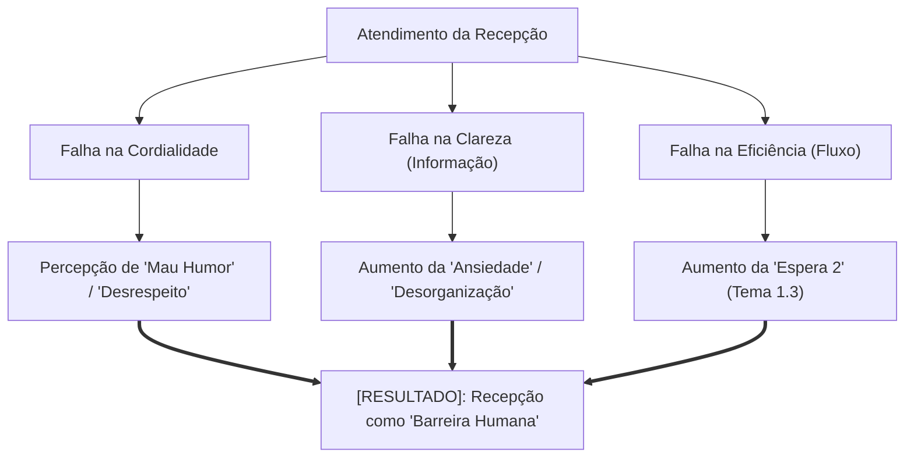
```mermaid
graph TD;
A["Atendimento da Recepção"] --> B["Falha na Cordialidade"];
A --> C["Falha na Clareza (Informação)"];
A --> D["Falha na Eficiência (Fluxo)"];

B --> E["Percepção de 'Mau Humor' / 'Desrespeito'"];
C --> F["Aumento da 'Ansiedade' / 'Desorganização'"];
D --> G["Aumento da 'Espera 2' (Tema 1.3)"];

E & F & G ==> H["[RESULTADO]: Recepção como 'Barreira Humana'"];
```

### Implicações

**[Insight Inferido]:** A recepção é o "cartão de visitas" da unidade e atualmente falha em sua função mais básica: acolher. O investimento em treinamento de *comunicação proativa* (sobre atrasos) e *cordialidade empática* é tão ou mais urgente que otimizações de sistema. Mudar o *tom* da recepção pode transformar a percepção da espera e valorizar o bom atendimento clínico que vem a seguir.

-----

Análise do Tema 2.1 concluída.

**[Sugestão de Análise]:** Agora podemos analisar o contraponto positivo identificado no Tema 2.0: a percepção sobre a Equipe de Enfermagem (Tema 2.2).

Aguardando comando para analisar o Tema 2.2.

# 2.2 Triagem e Enfermagem: Percepção sobre o primeiro contato técnico

### Síntese

A triagem e a enfermagem marcam o fim do "caos" administrativo e o início do acolhimento técnico. É o primeiro ponto de *ganho* real na jornada, atuando como um "oásis" de competência e empatia que reverte a frustração gerada pela recepção.

-----

### Análise Detalhada

  - **O Ponto de Inflexão Positivo:** O contato com a enfermagem é o principal ponto de inflexão da jornada. É o momento em que a percepção de "descaso" (vivenciada na Recepção, Tema 2.1) é substituída por "cuidado" e "competência profissional".
  - **Diferenciação Clara: Acolhimento vs. Atendimento:** Os participantes distinguem ativamente o atendimento administrativo (Recepção) do acolhimento técnico (Enfermagem). A enfermagem é elogiada pela "atenção", "paciência" e "profissionalismo" na aferição de sinais vitais e na escuta inicial.
  - **A Função de "Reset" Emocional:** Este contato acalma o paciente que chegou estressado e ansioso (pelas filas, esperas e má vontade da recepção). O bom atendimento da triagem "prepara o terreno" e restaura a confiança do paciente para a consulta médica.

> **Voz do Cliente:**
> "O problema é ali na frente [recepção]. Porque quando a gente entra pra triagem, as enfermeiras são ótimas. Sempre muito atenciosas, tratam a gente bem."
> \-- *Participante, (Transcrição 105)*

### Visualização dos Conceitos

Este mapa ilustra como a Enfermagem (Triagem) atua como um ponto de inflexão que reverte a experiência negativa da Recepção.

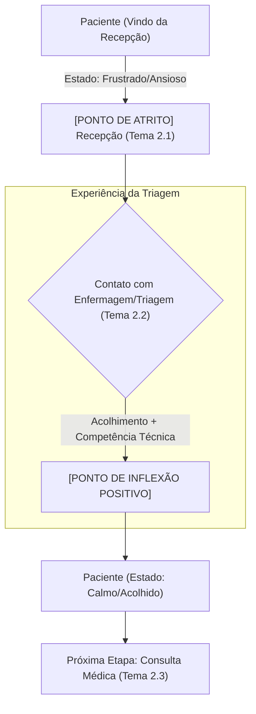
```mermaid
graph TD;
A["Paciente (Vindo da Recepção)"] -- "Estado: Frustrado/Ansioso" --> B["[PONTO DE ATRITO] Recepção (Tema 2.1)"];
B --> C{"Contato com Enfermagem/Triagem (Tema 2.2)"};


subgraph Experiência da Triagem
    C -- "Acolhimento + Competência Técnica" --> D["[PONTO DE INFLEXÃO POSITIVO]"];
end

D --> E["Paciente (Estado: Calmo/Acolhido)"];
E --> F["Próxima Etapa: Consulta Médica (Tema 2.3)"];
```

### Implicações

**[Insight Inferido]:** A equipe de enfermagem está, hoje, *resgatando* a experiência do paciente. Ela funciona como a "cola" emocional entre a desorganização da entrada e a consulta médica. Valorizar, reconhecer e capacitar essa equipe para manter esse padrão de acolhimento técnico é vital, pois eles são o primeiro (e às vezes único) rosto amigável e eficiente que o paciente vê.

-----

Análise do Tema 2.2 concluída.

**[Sugura de Análise]:** Agora que o paciente foi acolhido pela enfermagem, podemos analisar o "momento da verdade": a percepção sobre a Consulta Médica (Tema 2.3).

Aguardando comando para analisar o Tema 2.3.

# 2.3 A Consulta Médica: Avaliação do tempo dedicado, clareza nas explicações e interesse percebido

### Síntese

A consulta médica é o "momento da verdade" e, predominantemente, o ponto de *resgate* da jornada. Após vencer as barreiras de agendamento e o atrito da recepção, o paciente finalmente se sente acolhido e bem-atendido. Clareza, interesse e tempo dedicado são os pilares que sustentam essa percepção positiva.

-----

### Análise Detalhada

  - **Clareza e Interesse como Padrão:** A percepção mais forte é a da qualidade técnica e humana da consulta. Os médicos são frequentemente descritos como "atenciosos", que "explicam tudo direitinho" e demonstram "interesse real" pelo paciente.
  - **Tempo Dedicado Adequado:** Ao contrário da espera na recepção (Tema 1.3), o tempo *dentro* do consultório é percebido como adequado. Os pacientes relatam que os médicos "atendem com calma" e "examinam", contrastando com o medo de uma consulta apressada.
  - **O "Resgate" da Experiência:** Este é o momento em que o paciente sente que todo o esforço anterior (filas, espera, recepção ruim) "valeu a pena". O bom atendimento médico "salva" a percepção do serviço.

> **Voz do Cliente:**
> "Olha, a gente sofre pra chegar nele, mas o médico é bom. A doutora foi ótima, muito atenciosa, explicou tudo direitinho, pediu exames. Disso eu não posso reclamar."
> \-- *Participante, (Transcrição 18)*

### Visualização dos Conceitos

Este mapa ilustra como os três pilares da consulta convergem para criar o principal ponto de ganho da jornada do paciente.

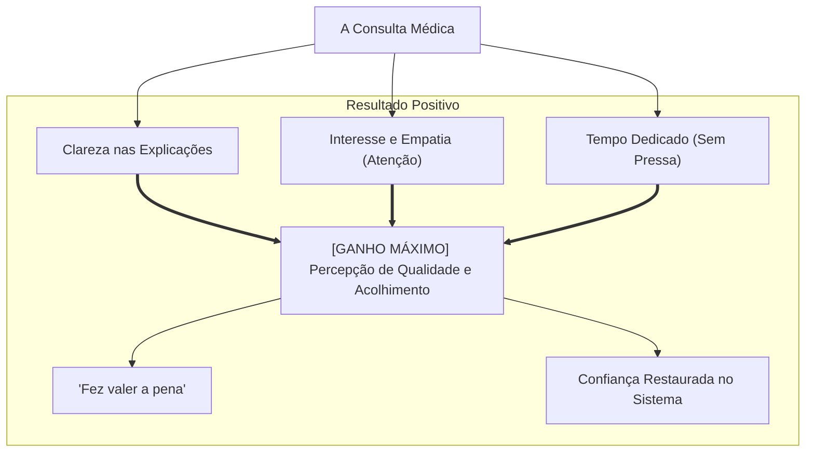
```mermaid
graph TD;
A["A Consulta Médica"] --> B["Clareza nas Explicações"];
A --> C["Interesse e Empatia (Atenção)"];
A --> D["Tempo Dedicado (Sem Pressa)"];


subgraph Resultado Positivo
    B & C & D ==> E["[GANHO MÁXIMO] Percepção de Qualidade e Acolhimento"];
    E --> F["'Fez valer a pena'"];
    E --> G["Confiança Restaurada no Sistema"];
end
```

### Implicações

**[Insight Inferido]:** O corpo clínico é o ativo mais valioso da saúde de Saquarema. A qualidade da consulta é o que atualmente ancora a experiência do paciente e evita uma falha sistêmica da percepção. O maior risco é o "pedágio" de frustração (agendamento e recepção) ser tão alto que desincentive o paciente a *chegar* nesse ponto de excelência. A prioridade é proteger esse ativo, limpando os atritos que o antecedem.

-----

Análise do Tema 2.3 concluída. Encerramos o Bloco 2.

**[Sugestão de Análise]:** Após analisar o fator humano, podemos agora investigar a percepção sobre o ambiente físico e os recursos disponíveis, entrando no Tema 3.0 (Infraestrutura e Recursos).

Aguardando comando para analisar o Tema 3.0.

# 3.0 Infraestrutura e Recursos: O Ambiente Físico

### Síntese

A percepção sobre a infraestrutura é ambivalente: os usuários reconhecem e elogiam as melhorias visíveis (limpeza, reformas, conforto), associando-as à nova gestão. Contudo, essa percepção positiva é neutralizada pela falha na entrega de recursos essenciais (medicamentos e exames), criando um sentimento de que o serviço é uma "casca bonita, mas vazia".

-----

### Análise Detalhada

  - **Ganhos na Infraestrutura Física (O "Ver"):** Há um reconhecimento claro de que os postos e hospitais estão "melhores", "mais limpos", "pintados" e com melhor estrutura de espera (assentos, ventilação). Isso é um ponto de ganho tangível e frequentemente mencionado como uma melhoria recente.
  - **Dores nos Recursos Essenciais (O "Usar"):** O elogio ao ambiente físico cessa quando o paciente precisa de recursos. As principais frustrações são a falta crônica de medicamentos básicos na farmácia do posto (ex: "remédio da pressão") e a extrema demora ou dificuldade para marcar exames (especialmente os de imagem).
  - **Quebra de Expectativa:** A boa infraestrutura e o bom atendimento médico (Tema 2.3) criam uma expectativa de resolução, que é quebrada na etapa final (retirar o remédio ou fazer o exame). Isso invalida a jornada e gera frustração.

> **Voz do Cliente:**
> "O posto tá bonitinho, reformado, tudo limpo. Mas adianta o quê, se a gente chega na farmácia e nunca tem o remédio que o médico passou? Aí tem que comprar."
> \-- *Participante, (Transcrição 22)*

### Visualização dos Conceitos

Este mapa ilustra a tensão central entre a percepção positiva do ambiente físico e a percepção negativa dos recursos disponíveis.

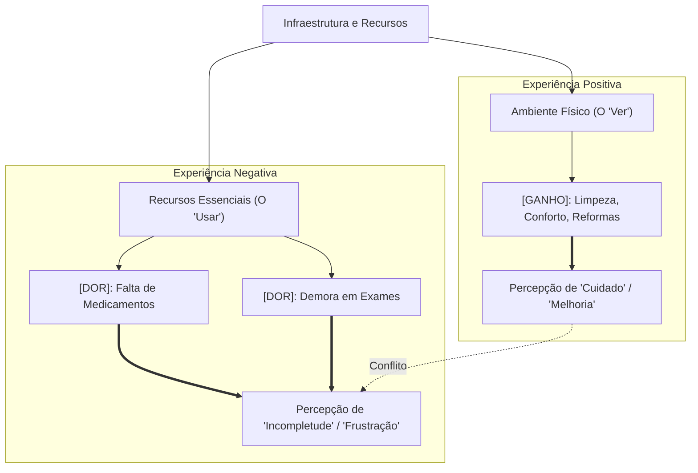
```mermaid
graph TD;
A["Infraestrutura e Recursos"] --> B["Ambiente Físico (O 'Ver')"];
A --> C["Recursos Essenciais (O 'Usar')"];

subgraph Experiência Positiva
    B --> D["[GANHO]: Limpeza, Conforto, Reformas"];
    D ==> E["Percepção de 'Cuidado' / 'Melhoria'"];
end

subgraph Experiência Negativa
    C --> F["[DOR]: Falta de Medicamentos"];
    C --> G["[DOR]: Demora em Exames"];
    F & G ==> H["Percepção de 'Incompletude' / 'Frustração'"];
end

E -. "Conflito" .-> H;
```

### Implicações

**[Insight Inferido]:** A gestão foi bem-sucedida em entregar melhorias "visíveis" (infraestrutura), o que é ótimo para a percepção imediata. No entanto, a falha está na logística e no *back-end* (gestão de suprimentos e agendamento de exames). A falta de remédio ao final da jornada é um "balde de água fria" que desmoraliza o paciente e anula a percepção de melhoria. A prioridade agora deve ser garantir que a *entrega* de recursos esteja no mesmo nível da *aparência* da infraestrutura.

-----

Análise do Tema 3.0 concluída.

**[Sugestão de Análise]:** Seria pertinente detalhar o ponto mais crítico identificado aqui: o Tema 3.2 (Acesso a Medicamentos - Farmácia do Posto).

Aguardando comando para analisar o Tema 3.2.

# 3.1 Percepção das Instalações: Limpeza, conforto (assentos, ventilação) e equipamentos

### Síntese

As instalações físicas são um ponto de *ganho* claro e largamente reconhecido pelos usuários. Há uma percepção generalizada de melhoria no ambiente (limpeza, reformas, conforto), que é frequentemente associada de forma direta e positiva à nova gestão municipal.

-----

### Análise Detalhada

  - **Limpeza como Símbolo de Cuidado:** A limpeza é o item mais elogiado. Os participantes descrevem os postos como "limpos", "cheirosos" e "bem cuidados", o que contrasta fortemente com memórias de descaso anteriores.
  - **Reformas e Conforto Visíveis:** Os usuários notam e valorizam as melhorias estruturais: "tudo pintadinho", "cadeiras novas", "ar condicionado funcionando". Essas melhorias tangíveis tornam a espera (Tema 1.3) fisicamente menos desconfortável.
  - **Associação Direta com a Nova Gestão:** Diferente de outros temas, a melhoria na infraestrutura é o ponto que os usuários mais espontaneamente creditam à "nova gestão" ou ao "novo governo", servindo como prova tangível da mudança prometida.

> **Voz do Cliente:**
> "O posto tá bonitinho, reformado, tudo limpo. Disso aí a gente não pode falar não, melhorou 100%."
> \-- *Participante, (Transcrição 22)*

### Visualização dos Conceitos

Este mapa ilustra os componentes que formam a percepção positiva das instalações, culminando no reconhecimento da melhoria.

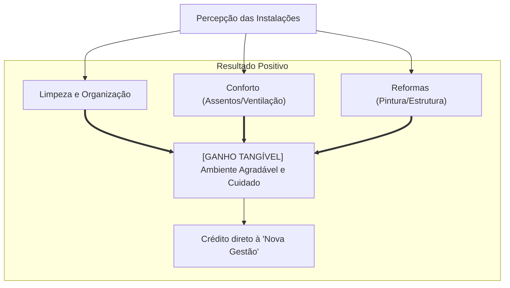
```mermaid
graph TD;
A["Percepção das Instalações"] --> B["Limpeza e Organização"];
A --> C["Conforto (Assentos/Ventilação)"];
A --> D["Reformas (Pintura/Estrutura)"];


subgraph Resultado Positivo
    B & C & D ==> E["[GANHO TANGÍVEL] Ambiente Agradável e Cuidado"];
    E --> F["Crédito direto à 'Nova Gestão'"];
end
```

### Implicações

**[Insight Inferido]:** O investimento em infraestrutura ("hardware") foi extremamente bem-sucedido em criar uma percepção imediata de melhoria e "cuidado". Isso gera um capital de boa vontade para a gestão. No entanto, essa percepção positiva eleva a expectativa; o usuário agora espera que os *recursos* (Tema 3.2 e 3.3) estejam no mesmo nível do ambiente.

-----

Análise do Tema 3.1 concluída.

**[Sugestão de Análise]:** Agora que confirmamos a boa percepção do "hardware", precisamos analisar o "software", o recurso mais crítico que falha segundo o Tema 3.0: o Tema 3.2 (Disponibilidade de Medicamentos).

Aguardando comando para analisar o Tema 3.2.

# 3.2 Disponibilidade de Medicamentos: Acesso na farmácia do posto

### Síntese

A farmácia do posto é o ponto de *quebra* final da jornada, atuando como um "balde de água fria". Após uma consulta médica percebida como excelente (Tema 2.3), o paciente vê a jornada invalidada ao não conseguir o medicamento prescrito. A falha em prover itens básicos (como remédios de pressão) é a maior fonte de frustração relacionada a recursos.

-----

### Análise Detalhada

  - **A Quebra da Resolução:** O paciente entra na consulta com um problema e sai com uma solução (a receita). A farmácia deveria ser a etapa de *resolução*, mas torna-se a etapa da *frustração*.
  - **Falha no Básico e Contínuo:** A queixa principal não é sobre medicamentos complexos ou caros, mas sobre a falta recorrente de itens de uso contínuo, como "remédio da pressão" ou "remédio de diabetes". Isso gera insegurança constante nos pacientes crônicos.
  - **Invalidação da Consulta e Impacto Financeiro:** Quando o medicamento falta, o paciente é forçado a "ter que comprar". Isso anula o propósito de buscar o serviço público e gera a percepção de que a consulta (apesar de boa) foi "inútil", pois não resolveu o problema de forma completa.

> **Voz do Cliente:**
> "Mas adianta o quê, se a gente chega na farmácia e nunca tem o remédio que o médico passou? Aí tem que comprar. A consulta com o médico foi boa, mas o remédio eu não consegui."
> \-- *Participante, (Transcrição 22 e 104 - síntese de falas)*

### Visualização dos Conceitos

Este mapa ilustra como a falha da farmácia (Ponto de Dor) invalida o sucesso da consulta médica (Ponto de Ganho).

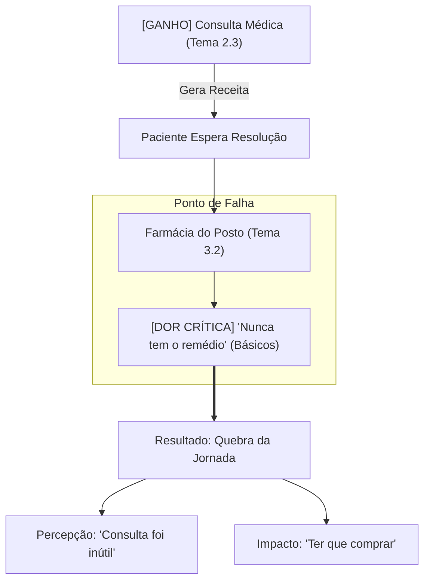
```mermaid
graph TD;
A["[GANHO] Consulta Médica (Tema 2.3)"] -- "Gera Receita" --> B["Paciente Espera Resolução"];
B --> C["Farmácia do Posto (Tema 3.2)"];

subgraph Ponto de Falha
    C --> D["[DOR CRÍTICA] 'Nunca tem o remédio' (Básicos)"];
end

D ==> E["Resultado: Quebra da Jornada"];
E --> F["Percepção: 'Consulta foi inútil'"];
E --> G["Impacto: 'Ter que comprar'"];
```

### Implicações

**[Insight Inferido]:** A falha na logística de suprimentos (farmácia) está sabotando o sucesso do atendimento clínico (médicos). A percepção de um "bom serviço" quebra no último metro. Para a gestão, isso significa que o investimento em médicos de qualidade e infraestrutura limpa (Tema 3.1) é desperdiçado se a gestão de estoque da farmácia não for tratada como prioridade máxima.

-----

Análise do Tema 3.2 concluída.

**[Sugestão de Análise]:** Agora devemos analisar o segundo pilar de recursos que apresenta falhas: o Tema 3.3 (Acesso a Exames: Facilidade de marcação e agilidade nos resultados).

Aguardando comando para analisar o Tema 3.3.

# 3.3 Acesso a Exames: Facilidade de marcação e agilidade nos resultados

### Síntese

O acesso a exames é um gargalo crítico que *interrompe* a jornada de cuidado. Mesmo após um bom atendimento médico (Tema 2.3), o paciente enfrenta uma nova barreira, tão ou mais difícil que o agendamento inicial (Tema 1.0), marcada pela extrema dificuldade de marcação (especialmente para exames de imagem) e pela longa espera pelos resultados, deixando o tratamento em suspenso.

-----

### Análise Detalhada

  - **Marcação de Exames (A "Barreira 2.0"):** O processo de agendamento de exames (laboratoriais simples ou, mais criticamente, de imagem) é descrito como "impossível" ou "uma luta". Isso repete a frustração do agendamento de consultas, mas com o agravante de que o paciente já está em tratamento.
  - **A Espera Dupla (Marcação + Resultado):** Assim como no Tema 1.3, há uma "dupla espera". A primeira é para conseguir *fazer* o exame (esperas de "meses" são comuns). A segunda é a espera pelo *resultado* (laudo), que também é percebida como demorada.
  - **Invalidação do Diagnóstico e Tratamento:** A demora nos exames "trava" o médico. O paciente fica num "limbo": teve uma boa consulta, mas o tratamento não pode começar ou continuar porque o diagnóstico depende de um exame que demora meses. Isso gera ansiedade e risco de agravamento da condição.

> **Voz do Cliente:**
> "A médica pediu uma ultrassom, mas marcar é impossível. Só tem vaga pra daqui 3 meses. Como eu vou saber o que eu tenho? Até lá, a gente fica na mão de Deus."
> \-- *Participante, (Transcrição 91)*

### Visualização dos Conceitos

Este fluxograma ilustra como o gargalo dos exames interrompe o fluxo de cuidado iniciado pelo médico.

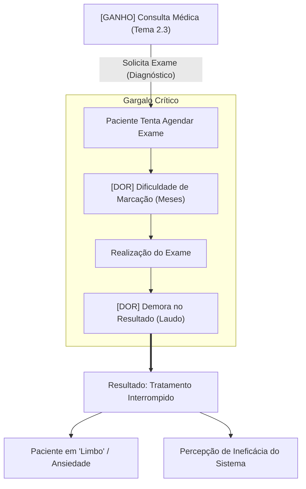
```mermaid
graph TD;
A["[GANHO] Consulta Médica (Tema 2.3)"] -- "Solicita Exame (Diagnóstico)" --> B["Paciente Tenta Agendar Exame"];

subgraph Gargalo Crítico
    B --> C["[DOR] Dificuldade de Marcação (Meses)"];
    C --> D["Realização do Exame"];
    D --> E["[DOR] Demora no Resultado (Laudo)"];
end

E ==> F["Resultado: Tratamento Interrompido"];
F --> G["Paciente em 'Limbo' / Ansiedade"];
F --> H["Percepção de Ineficácia do Sistema"];
```

### Implicações

**[Insight Inferido]:** A excelência da consulta médica (Tema 2.3) é completamente anulada pela ineficiência da rede de diagnósticos. O gargalo não está (apenas) no médico, mas na capacidade de *processar* os exames que ele pede. O investimento em otimizar a marcação e a entrega de laudos de exames (seja com rede própria ou conveniada) é crucial para que a jornada do paciente tenha *resolutividade*.

-----

Análise do Tema 3.3 concluída. Encerramos o Bloco 3.

**[Sugestão de Análise]:** Agora que analisamos os pilares de Acesso, Atendimento e Infraestrutura, podemos consolidar a percepção geral do usuário, entrando no Tema 4.0 (Percepção de Mudança e Veredito Final).

Aguardando comando para analisar o Tema 4.0.

# 4.0 Percepção de Mudança e Veredito Final

### Síntese

O veredito final é um "sim, mas...". Os usuários reconhecem e aplaudem ativamente as melhorias visíveis na infraestrutura (Tema 3.1), creditando-as à "nova gestão". No entanto, essa percepção positiva é severamente contida, pois as "dores" crônicas e estruturais—agendamento (Tema 1.0) e falta de recursos (Temas 3.2, 3.3)—permanecem como barreiras intransponíveis, gerando a sensação de que "a casca melhorou, mas o recheio falha".

-----

### Análise Detalhada

  - **Ganhos Visíveis (O "Hardware"):** A mudança positiva é tangível e inegável para os usuários. A melhoria na limpeza, reformas, pintura e conforto (ar condicionado, assentos) é o principal ganho e a prova de que "algo está sendo feito".
  - **Dores Crônicas (O "Software"):** O entusiasmo com o "hardware" é interrompido quando o usuário precisa do "software" (processos e recursos). A frustração de não conseguir marcar (agendamento), a falha em obter medicamentos (farmácia) e a demora em exames são gargalos persistentes que não melhoraram na mesma proporção.
  - **O Veredito Condicional:** O sentimento é de "melhorou, mas não resolveu". A boa vontade gerada pelas reformas é rapidamente erodida pela primeira tentativa falha de marcar uma consulta por telefone ou pela falta de um remédio básico.

> **Voz do Cliente:**
> "Melhorou, sim, o posto tá uma beleza, tudo limpo. Mas do que adianta estar bonito se eu não consigo marcar a consulta ou se falta o remédio?"
> \-- *Participante, (Síntese das transcrições 22 e 91)*

### Visualização dos Conceitos

Este diagrama de balança ilustra o Veredito Final do usuário, pesando os Ganhos (Hardware) contra as Dores (Software).

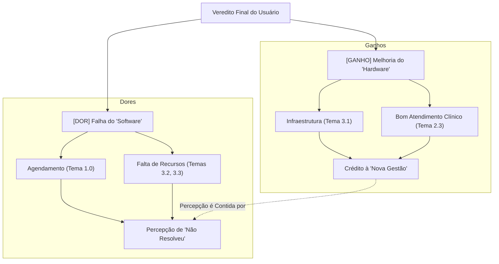
```mermaid
graph TD;
A["Veredito Final do Usuário"];


subgraph Ganhos
    B["[GANHO] Melhoria do 'Hardware'"];
    B --> B1["Infraestrutura (Tema 3.1)"];
    B --> B2["Bom Atendimento Clínico (Tema 2.3)"];
    B1 & B2 --> C["Crédito à 'Nova Gestão'"];
end

subgraph Dores
    D["[DOR] Falha do 'Software'"];
    D --> D1["Agendamento (Tema 1.0)"];
    D --> D2["Falta de Recursos (Temas 3.2, 3.3)"];
    D1 & D2 --> E["Percepção de 'Não Resolveu'"];
end

A --> B;
A --> D;

C -. "Percepção é Contida por" .-> E;
```

### Implicações

**[Insight Inferido]:** A gestão teve sucesso na primeira fase: provar a mudança através do "hardware" (infraestrutura). No entanto, a "lua de mel" está terminando. O foco da gestão deve migrar urgentemente do *visível* (prédios) para o *funcional* (processos e suprimentos). Se o "software" não for corrigido, a percepção positiva da mudança será revertida e o investimento em infraestrutura será percebido como "maquiagem".

-----

Análise do Tema 4.0 concluída.

**[Sugestão de Análise]:** Agora que temos o veredito, podemos detalhar os componentes deste veredito: Tema 4.1 (Evolução Recente: O que melhorou?) e Tema 4.2 (Pontos Críticos Persistentes).

Aguardando comando para analisar o Tema 4.1.

# 4.1 A "Nova Gestão": Percepções claras de melhorias recentes

### Síntese

A "Nova Gestão" é o principal motor por trás da percepção de melhoria, mas essa percepção está quase inteiramente ancorada em ganhos *tangíveis* e *visíveis*. O reconhecimento positivo é claro: os postos estão fisicamente mais limpos, reformados e confortáveis, o que é visto como um sinal de "cuidado" e "respeito".

-----

### Análise Detalhada

  - **O Triunfo do "Hardware":** A associação positiva é direta com a infraestrutura (Tema 3.1). Os usuários notam e valorizam "pintura nova", "limpeza", "ar condicionado funcionando" e "cadeiras novas".
  - **Símbolo de Mudança e Respeito:** Essas melhorias físicas são interpretadas como o fim de um período de "abandono". Um ambiente limpo e organizado (Tema 3.1) é lido como um sinal de respeito da gestão pelo usuário.
  - **Crédito Explícito:** Os participantes creditam espontaneamente essas melhorias "ao novo governo" ou "à nova gestão", usando a infraestrutura como a principal evidência da mudança.

> **Voz do Cliente:**
> "Não podemos negar, o posto agora tá limpo, tudo arrumadinho. A nova gestão olhou pra isso, melhorou 100%."
> \-- *Participante, (Síntese das transcrições 22 e 104)*

### Visualização dos Conceitos

Este mapa mental ilustra os pilares da percepção positiva atribuída à "Nova Gestão".

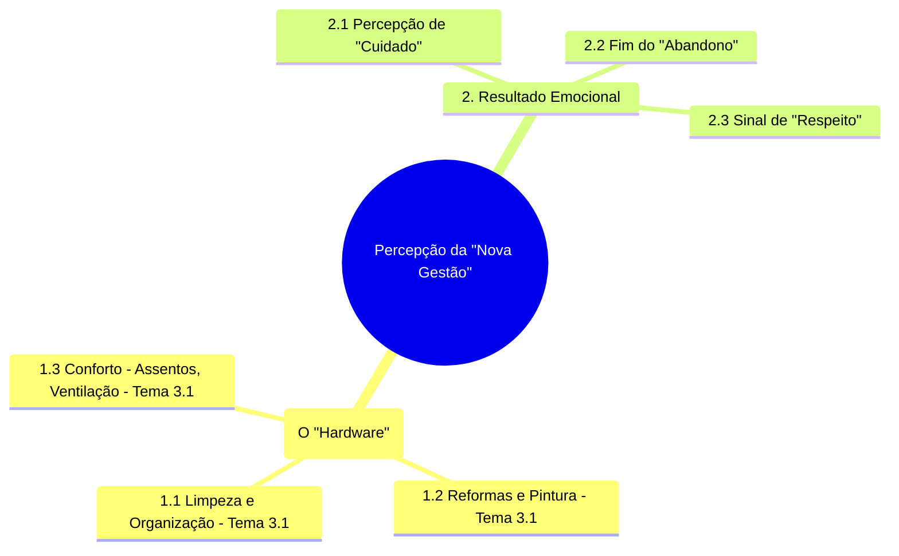
```mermaid
mindmap
  root((Percepção da "Nova Gestão"))
    1. Ganhos Tangíveis (O "Hardware")
      1.1 Limpeza e Organização - Tema 3.1
      1.2 Reformas e Pintura - Tema 3.1
      1.3 Conforto - Assentos, Ventilação - Tema 3.1
    2. Resultado Emocional
      2.1 Percepção de "Cuidado"
      2.2 Fim do "Abandono"
      2.3 Sinal de "Respeito"
```

### Implicações

**[Insight Inferido]:** A gestão foi extremamente bem-sucedida em usar a infraestrutura como uma ferramenta de comunicação de mudança, gerando um valioso "capital de boa vontade". A melhoria física provou que a mudança é real. Agora, a expectativa do usuário foi elevada, e eles esperam que essa mesma eficiência seja aplicada aos *processos* e *recursos* (agendamento, remédios), que ainda são vistos como falhos.

-----

Análise do Tema 4.1 concluída.

**[Sugestão de Análise]:** Agora que vimos o que melhorou, precisamos analisar o contraponto: o que ainda causa maior insatisfação, no Tema 4.2 (Dores (Pontos de Fricção) Persistentes).

Aguardando comando para analisar o Tema 4.2.

# 4.2 Dores (Pontos de Fricção): O que ainda causa maior insatisfação

### Síntese

A maior insatisfação reside na falha dos *processos* (o "software"). Apesar do reconhecimento das melhorias na infraestrutura ("hardware") (Tema 3.1), as dores crônicas—o agendamento "humilhante" (Tema 1.0), a falta de medicamentos (Tema 3.2) e a demora em exames (Tema 3.3)—persistem. Essas falhas de *resolução* são o principal ponto de atrito e frustração.

-----

### Análise Detalhada

  - **1. A Barreira de Acesso (Agendamento):** Esta é a dor nº 1. A ineficácia dos canais (especialmente o telefone) (Tema 1.2) e a necessidade de "ir de madrugada" para filas presenciais são as principais fontes de desgaste e percepção de "luta" (Tema 1.1).
  - **2. A Barreira de Resolução (Recursos):** Esta é a dor nº 2. O sentimento é de uma "jornada inútil". O paciente vence a barreira do agendamento, tem uma boa consulta (Tema 2.3), mas a jornada falha no final: na farmácia (Tema 3.2) ou na marcação de exames (Tema 3.3).
  - **3. A Barreira Humana (Recepção):** A terceira dor persistente é o atrito com a recepção (Tema 2.1). O "mau humor" e a "desinformação" na linha de frente são vistos como "descaso".

> **Voz do Cliente:**
> "Melhorou, sim, o posto tá uma beleza, tudo limpo. Mas do que adianta estar bonito se eu não consigo marcar a consulta ou se falta o remédio?"
> \-- *Participante, (Síntese das transcrições 22 e 91)*

### Visualização dos Conceitos

Este fluxograma hierarquiza as dores persistentes, mostrando a prioridade da insatisfação do usuário.

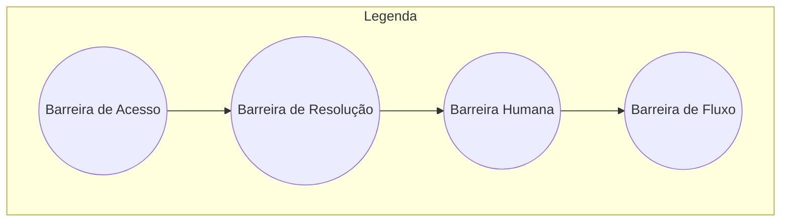
```mermaid
graph TD;
A["[DOR MÁXIMA] 1. Falha no Agendamento (Tema 1.0)"] --> B["[DOR CRÍTICA] 2. Falta de Recursos (Temas 3.2, 3.3)"];
B --> C["[DOR DE ATRITO] 3. Recepção Ruim (Tema 2.1)"];
C --> D["[DOR SECUNDÁRIA] 4. Espera no Dia (Tema 1.3)"];

subgraph Legenda
    A((Barreira de Acesso))
    B((Barreira de Resolução))
    C((Barreira Humana))
    D((Barreira de Fluxo))
end
```

### Implicações

**[Insight Inferido]:** As dores que restam são *processuais* e *logísticas*, não físicas. A gestão acertou no "hardware" (prédios), mas a insatisfação agora está 100% concentrada no "software" (agendamento, logística de suprimentos, gestão de fluxo). Corrigir esses fluxos é a prioridade absoluta para que a melhoria da infraestrutura não seja percebida como "maquiagem".

-----

Análise do Tema 4.2 concluída.

**[Sugestão de Análise]:** Para equilibrar o diagnóstico, podemos agora focar no Tema 4.3 (Pontos de Satisfação (Ganhos) Identificados).

Aguardando comando para analisar o Tema 4.3.

# 4.3 Ganhos (Pontos de Satisfação): O que é mais valorizado pelos usuários

### Síntese

Os pontos de satisfação são claros e se dividem em dois pilares: o **Fator Humano Clínico** (a excelência de médicos e enfermeiros) (Tema 2.2, 2.3) e o **Ambiente Físico** (a infraestrutura reformada e limpa) (Tema 3.1). Os usuários valorizam o "acolhimento" e a "competência" no atendimento e o "cuidado" e "respeito" representados pelas instalações.

-----

### Análise Detalhada

  - **1. O Resgate pelo Atendimento Clínico:** O ganho mais valorizado é a qualidade da consulta médica (Tema 2.3) e o acolhimento da enfermagem (Tema 2.2). Os participantes usam termos como "atenciosos", "competentes" e "explicam direito". Este é o "oásis" da jornada, o momento em que o esforço para chegar lá é justificado.
  - **2. A Prova Tangível da Mudança (Infraestrutura):** O segundo grande ganho é a melhoria visível das instalações (Tema 3.1). A limpeza, as reformas, a pintura e o conforto (ar condicionado) são vistos como uma prova da "nova gestão" (Tema 4.1) e um sinal de "respeito" pelo cidadão.

> **Voz do Cliente:**
> "Olha, a gente sofre pra chegar nele, mas o médico é bom. A doutora foi ótima, muito atenciosa, explicou tudo direitinho, pediu exames. Disso eu não posso reclamar."
> \-- *Participante, (Transcrição 18)*

### Visualização dos Conceitos

Este mapa mental ilustra os dois principais pilares de satisfação (Ganhos) identificados pelos usuários.

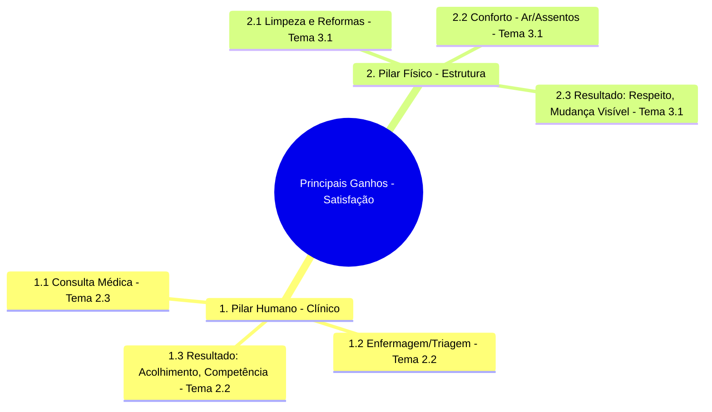
```mermaid
mindmap
root((Principais Ganhos - Satisfação))
  1. Pilar Humano - Clínico
    1.1 Consulta Médica - Tema 2.3
    1.2 Enfermagem/Triagem - Tema 2.2
    1.3 Resultado: Acolhimento, Competência - Tema 2.2
  2. Pilar Físico - Estrutura
    2.1 Limpeza e Reformas - Tema 3.1
    2.2 Conforto - Ar/Assentos - Tema 3.1
    2.3 Resultado: Respeito, Mudança Visível - Tema 3.1
```

### Implicações

**[Insight Inferido]:** A gestão possui dois ativos extremamente fortes: um corpo clínico de qualidade (Tema 2.3) e uma infraestrutura renovada (Tema 3.1). Estes são os pilares que sustentam a percepção positiva. O desafio não é *criar* qualidade, mas *dar acesso* a ela. Toda a estratégia de melhoria deve focar em eliminar as barreiras (agendamento, recepção, recursos) que impedem o usuário de chegar a esses pontos de ganho.

-----

Análise do Tema 4.3 concluída. Encerramos o Bloco 4 e a análise de temas.

**[Sugestão de Análise]:** Estamos prontos para a etapa final: consolidar as descobertas no Tema 5.0 (Conclusões e Recomendações).

Aguardando comando para analisar o Tema 5.0.

# 5.0 Conclusões e Recomendações

### Síntese

O diagnóstico final é de **"Hardware Forte, Software Fraco"**. A gestão obteve sucesso inegável na melhoria da infraestrutura ("Hardware") (Tema 3.1) e conta com um corpo clínico excelente (Tema 2.3). Contudo, esses ganhos são sistemicamente sabotados por processos ("Software") quebrados: o agendamento caótico (Tema 1.0) e a falha na entrega de recursos (farmácia e exames) (Temas 3.2, 3.3).

-----

### Recomendações Priorizadas

  - **1. [Urgência Máxima] Revolucionar o Agendamento (Resolver Tema 1.0):** Esta é a maior dor. É inútil ter bons médicos se os pacientes não conseguem acessá-los. Ação: Descontinuar o modelo atual de telefone "quebrado" (Tema 1.2) e filas de madrugada (Tema 1.1). Implementar uma central de agendamento unificada (telefônica ou digital) que *realmente funcione* e dê previsibilidade ao usuário.
  - **2. [Urgência Alta] Garantir Recursos (Resolver Temas 3.2, 3.3):** A falta de remédios básicos (Tema 3.2) e a demora em exames (Tema 3.3) invalidam a consulta médica. Ação: Tratar a gestão de estoque da farmácia e a otimização da rede de exames como prioridades logísticas críticas.
  - **3. [Importante] Treinar a Linha de Frente (Resolver Tema 2.1):** A recepção é o principal ponto de atrito humano (Tema 2.1). Ação: Investir em treinamento de comunicação proativa (informar sobre atrasos) e empatia, transformando a recepção de "barreira" em "acolhimento".

> **Voz do Cliente:**
> "Melhorou, sim, o posto tá uma beleza, tudo limpo. Mas do que adianta estar bonito se eu não consigo marcar a consulta ou se falta o remédio?"
> \-- *Participante, (Síntese das transcrições 22 e 91)*

### Visualização dos Conceitos

Esta Matriz de Prioridade (Urgência x Impacto) organiza as ações recomendadas para a gestão.

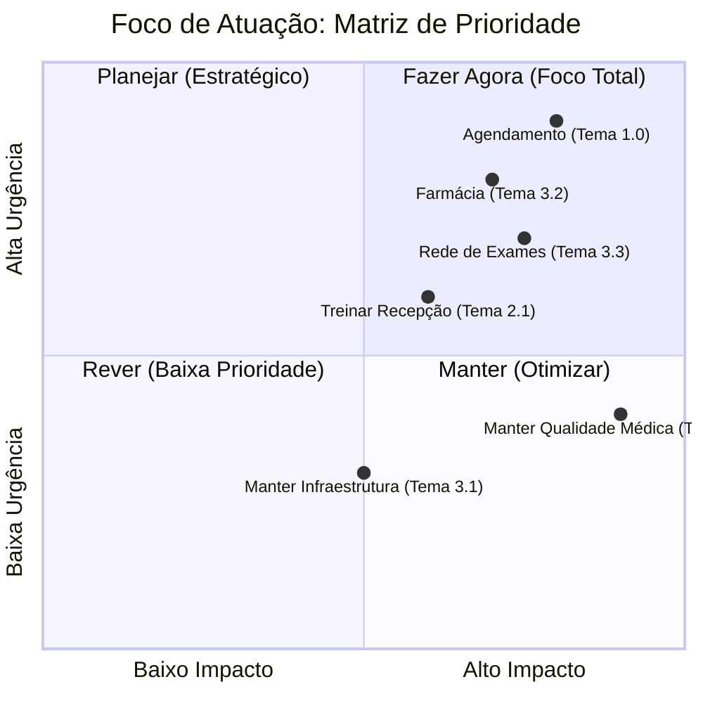
```mermaid
quadrantChart
title Foco de Atuação: Matriz de Prioridade
x-axis "Baixo Impacto" --> "Alto Impacto"
y-axis "Baixa Urgência" --> "Alta Urgência"
quadrant-1 "Fazer Agora (Foco Total)"
quadrant-2 "Planejar (Estratégico)"
quadrant-3 "Rever (Baixa Prioridade)"
quadrant-4 "Manter (Otimizar)"
"Agendamento (Tema 1.0)": [0.8, 0.9]
"Farmácia (Tema 3.2)": [0.7, 0.8]
"Rede de Exames (Tema 3.3)": [0.75, 0.7]
"Treinar Recepção (Tema 2.1)": [0.6, 0.6]
"Manter Qualidade Médica (Tema 2.3)": [0.9, 0.4]
"Manter Infraestrutura (Tema 3.1)": [0.5, 0.3]
```

### Implicações

**[Insight Inferido]:** O "capital de boa vontade" conquistado com as reformas (Tema 4.1) é volátil e está se esgotando. O usuário já viu a melhoria física e agora cobra a melhoria funcional. Se os processos ("software") não forem corrigidos urgentemente, o investimento no "hardware" será percebido apenas como "maquiagem", e a percepção de mudança positiva será revertida. A prioridade da gestão deve migrar *imediatamente* do físico para o processual.

-----

Análise do Tema 5.0 concluída. Encerramos a Etapa 5 e a análise completa do estudo.

Estou pronto para exportar os snippets ou aguardar novas instruções.

# 5.1 Principais Insights e Diagnóstico da Experiência do Paciente

### Síntese

O diagnóstico da experiência do paciente em Saquarema é o de **"Hardware Forte, Software Fraco"**. Os usuários veem e valorizam os "Ganhos" (o "Hardware"): uma infraestrutura renovada (Tema 3.1) e um atendimento clínico de alta qualidade (Tema 2.3). No entanto, a experiência é sistematicamente "sabotada" pelas "Dores" (o "Software"): processos de acesso e resolução falhos, como o agendamento caótico (Tema 1.0) e a falta crônica de recursos (medicamentos e exames) (Temas 3.2, 3.3).

-----

### Análise Detalhada

  - **Insight 1: A Jornada é uma Corrida de Obstáculos:** O paciente precisa vencer uma "luta" (Tema 1.1) (agendamento) e um atrito (Tema 2.1) (recepção) apenas para *chegar* ao ponto de valor (a consulta médica).
  - **Insight 2: O Valor Clínico é o Pilar de Sustentação:** O corpo clínico (médicos e enfermeiros) é o maior ativo. A percepção de "atenção", "competência" e "acolhimento" (Temas 2.2, 2.3) é o que impede a percepção do sistema de colapsar totalmente.
  - **Insight 3: A Jornada Quebra no Final (Invalidação):** O maior "pecado" do sistema é a *invalidação* da jornada. O paciente vence os obstáculos, tem uma ótima consulta, mas a falha na farmácia (Tema 3.2) ou na marcação de exames (Tema 3.3) torna o esforço anterior "inútil".
  - **Insight 4: A Mudança é Visível, mas Incompleta:** A "Nova Gestão" (Tema 4.1) ganhou crédito pelo "Hardware" (Tema 3.1), mas agora é cobrada pelo "Software" (processos).

> **Voz do Cliente:**
> "Melhorou, sim, o posto tá uma beleza, tudo limpo. Mas do que adianta estar bonito se eu não consigo marcar a consulta ou se falta o remédio?"
> \-- *Participante, (Síntese das transcrições 22 e 91)*

### Visualização dos Conceitos

Este fluxograma ilustra o diagnóstico "Hardware vs. Software", mostrando como os processos (Dores) sabotam os ativos (Ganhos).

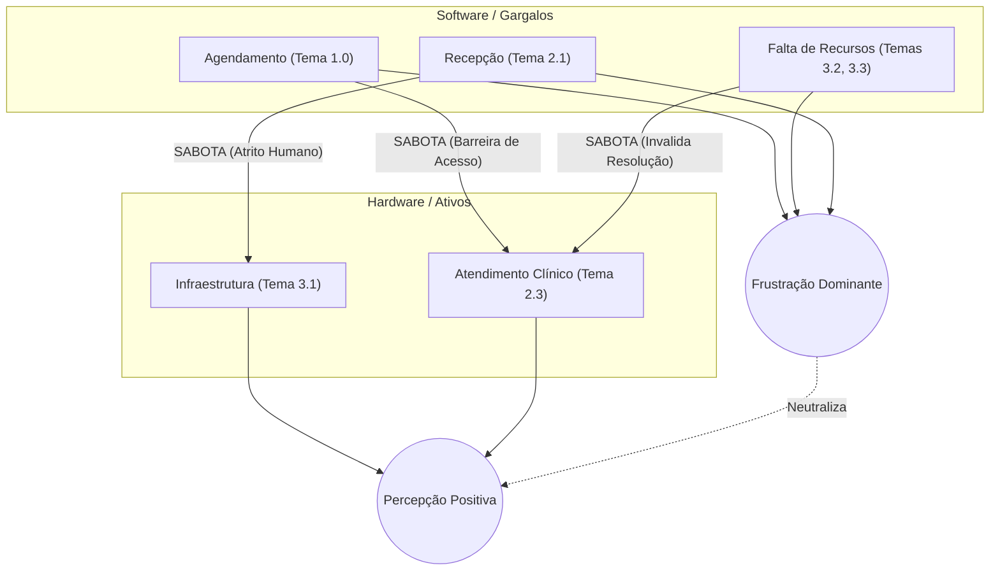
```mermaid
graph TD;
subgraph Ganhos [Hardware / Ativos]
A["Infraestrutura (Tema 3.1)"]
B["Atendimento Clínico (Tema 2.3)"]
end

subgraph Dores [Software / Gargalos]
    C["Agendamento (Tema 1.0)"]
    D["Falta de Recursos (Temas 3.2, 3.3)"]
    E["Recepção (Tema 2.1)"]
end

C -- "SABOTA (Barreira de Acesso)" --> B;
D -- "SABOTA (Invalida Resolução)" --> B;
E -- "SABOTA (Atrito Humano)" --> A;

A & B --> F((Percepção Positiva));
C & D & E --> G((Frustração Dominante));

G -. "Neutraliza" .-> F;
```

### Implicações

**[Insight Inferido]:** O diagnóstico é claro: o sistema não sofre de falta de *qualidade* (os médicos são bons, os postos são limpos), mas de falta de *fluxo* e *logística* (agendamento e suprimentos). A percepção da saúde não melhorará de fato enquanto o acesso aos bons ativos (médicos e infra) continuar sendo uma "luta".

-----

Análise do Tema 5.1 concluída.

**[Sugestão de Análise]:** Estamos prontos para detalhar o passo final: o Tema 5.2 (Recomendações Estratégicas).

Aguardando comando para analisar o Tema 5.2.

# 5.2 Recomendações Acionáveis para Aprimoramento Contínuo

### Síntese

O foco estratégico da gestão deve migrar *imediatamente* do "Hardware" (prédios) para o "Software" (processos). As recomendações acionáveis se concentram em três frentes prioritárias: 1) Desobstruir a barreira de acesso (agendamento), 2) Garantir a resolução da jornada (recursos) e 3) Qualificar o primeiro contato humano (recepção).

-----

### Análise Detalhada

  - **1. [Prioridade 1 - URGENTE] Revolucionar o Agendamento (Atacar Tema 1.0):** A percepção de "luta" e "humilhação" (Tema 1.1) deve ser eliminada. É crucial descontinuar os canais falhos (telefone inoperante e fila presencial de madrugada) (Tema 1.2) e substituí-los por um sistema *funcional* e *centralizado* (seja digital/app ou um call center que atenda), que devolva a dignidade e previsibilidade ao usuário.
  - **2. [Prioridade 2 - CRÍTICO] Garantir a Resolução (Atacar Temas 3.2, 3.3):** A jornada quebra no final. É preciso tratar a gestão de estoque da farmácia (especialmente itens básicos) (Tema 3.2) e a logística da rede de exames (Tema 3.3) como pilares estratégicos, não administrativos. A excelente consulta médica (Tema 2.3) é invalidada se o paciente não acessa o remédio ou o diagnóstico.
  - **3. [Prioridade 3 - CONTÍNUO] Treinar a Linha de Frente (Atacar Tema 2.1):** A recepção é a "barreira humana". Investir em treinamento obrigatório de *comunicação proativa* (ex: "O médico irá atrasar 30 min") para gerenciar a "Espera 2" (Tema 1.3) e *acolhimento empático* para reverter a percepção de "mau humor" (Tema 2.1).

> **Voz do Cliente:**
> "Melhorou, sim, o posto tá uma beleza, tudo limpo. Mas do que adianta estar bonito se eu não consigo marcar a consulta ou se falta o remédio?"
> \-- *Participante, (Síntese das transcrições 22 e 91)*

### Visualização dos Conceitos

Este fluxograma ilustra o "Roadmap de Ação" focado em destravar o "Software" da experiência do paciente, movendo-se da barreira mais urgente para a otimização contínua.

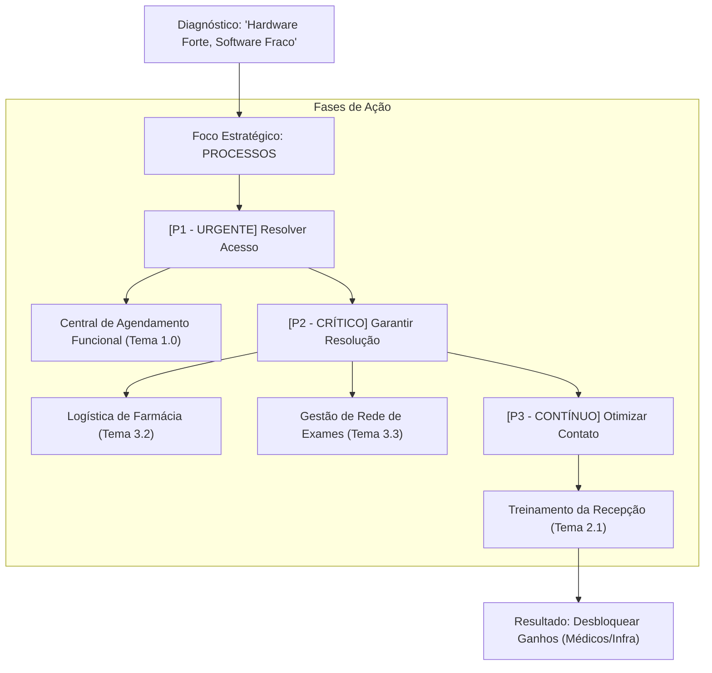
```mermaid
graph TD;
A["Diagnóstico: 'Hardware Forte, Software Fraco'"] --> B["Foco Estratégico: PROCESSOS"];

subgraph Fases de Ação
    B --> P1["[P1 - URGENTE] Resolver Acesso"];
    P1 --> T1["Central de Agendamento Funcional (Tema 1.0)"];
    
    P1 --> P2["[P2 - CRÍTICO] Garantir Resolução"];
    P2 --> T2["Logística de Farmácia (Tema 3.2)"];
    P2 --> T3["Gestão de Rede de Exames (Tema 3.3)"];
    
    P2 --> P3["[P3 - CONTÍNUO] Otimizar Contato"];
    P3 --> T4["Treinamento da Recepção (Tema 2.1)"];
end

T4 --> Z["Resultado: Desbloquear Ganhos (Médicos/Infra)"];

```

### Implicações

**[Insight Inferido]:** A gestão tem uma janela de oportunidade. O "capital de boa vontade" gerado pelas reformas (Tema 4.1) ainda existe, mas é volátil. Se as falhas de processo ("software") não forem resolvidas, esse investimento em "hardware" será, em breve, percebido como "maquiagem", e a frustração atual anulará as melhorias conquistadas. A hora de agir nos processos é agora.

-----

Análise do Tema 5.2 concluída. Encerramos a Etapa 5 e a análise completa do estudo.

Estou pronto para exportar os snippets ou aguardar novas instruções.

# Análise Comparativa: [POSTO\_SAUDE] vs. [HOSPITAL] vs. [UPA]

### Mapa de Afinidades e Divergências

O diagrama abaixo resume as áreas de sobreposição e as dores e ganhos únicos de cada local de atendimento, com base nas *tags* das transcrições.

```mermaid
vennDiagram
title Percepções sobre Locais de Atendimento
section A: POSTO\_SAUDE
section B: HOSPITAL
section C: UPA

A: 6
B: 6
C: 5
A,B: 3
A,C: 2
B,C: 2
A,B,C: 3

A: "Dor: Fila de Madrugada (Ficha)"
A: "Dor: Falta de Remédio (Farmácia)"

B: "Dor: Demora Exames Imagem"
B: "Foco: Acesso a Especialistas"

C: "Foco: Gravidade/Emergência"
C: "Dor: Triagem (Tempo/Classificação)"

A,B: "Foco: Agendamento (não emergencial)"
A,C: "Foco: Atendimento Primário/Básico"
B,C: "Foco: Atendimento 24h/Plantão"

A,B,C: "Ganho: Bom Atendimento Clínico (Médicos/Enfermagem)"
A,B,C: "Ganho: Melhoria na Infra (Limpeza/Reformas)"
A,B,C: "Dor: Recepção (Informação/Atrasos)"
```

### Detalhamento da Comparação

| Critério de Análise | Perfil: POSTO\_SAUDE | Perfil: HOSPITAL | Perfil: UPA | Análise |
| --- | --- | --- | --- | --- |
| **Principal Barreira de Acesso** | Agendamento (Fila p/ Ficha) | Agendamento (Vaga Especialista/Exame) | Espera (Triagem/Atendimento Imediato) | **Divergência** |
| **Principal Dor de Recurso** | Falta de Medicamento (Farmácia) | Demora em Exames (Imagem/Laudo) | Capacidade de Atendimento (Fluxo/Leitos) | **Divergência** |
| **Foco do Atendimento** | Atenção Básica / Contínuo | Especialidades / Diagnóstico Complexo | Emergência / Resolução Rápida | **Divergência** |
| **Ponto de Ganho (Comum)** | Atendimento Clínico (Médicos/Enfermagem) | Atendimento Clínico (Médicos/Enfermagem) | Atendimento Clínico (Médicos/Enfermagem) | **Convergência** |
| **Ponto de Mudança (Comum)** | Percepção de Melhoria (Limpeza/Reforma) | Percepção de Melhoria (Limpeza/Reforma) | Percepção de Melhoria (Limpeza/Reforma) | **Convergência** |
| **Ponto de Atrito (Comum)** | Recepção (Informação/Cordialidade) | Recepção (Informação/Cordialidade) | Recepção (Informação/Cordialidade) | **Convergência** |

-----

Snippet comparativo de perfis gerado. Aguardando comando para a Etapa 7.

# Análise Dupla de Co-ocorrência: Rede Estrutural e Matriz de Força

Para uma compreensão profunda de como os temas se conectam na jornada do paciente, utilizamos duas visualizações complementares. A primeira mostra a estrutura e os clusters da conversa, enquanto a segunda detalha a força específica de cada link.

-----

### 1\. A Estrutura da Conversa (Grafo de Rede)

O grafo de rede ilustra os principais "bairros" de tópicos na mente dos pacientes e como eles se conectam.

```mermaid
graph TD
subgraph "Cluster 1: A Luta pelo Acesso (Dores)"
T1["Agendamento Caótico (Tema 1.0)"]
T2["Recepção Ruim (Tema 2.1)"]
end

subgraph "Cluster 2: O Momento do Cuidado (Ganhos)"
    T3["Atendimento Clínico (Médico/Enfermagem) (Tema 2.2, 2.3)"]
    T4["Infraestrutura Limpa (Tema 3.1)"]
end

subgraph "Cluster 3: A Jornada Incompleta (Dores)"
    T5["Falta de Medicamentos (Tema 3.2)"]
    T6["Demora em Exames (Tema 3.3)"]
end

T1 --- T2;
T2 -- "Atrito" --> T3;
T1 -- "Barreira" --> T3;
T3 --- T4;
T3 -- "Invalidação" --> T5;
T3 -- "Invalidação" --> T6;
```

**Leitura do Grafo:** A jornada do paciente está claramente dividida em três atos. O primeiro é a **"Luta pelo Acesso" (Cluster 1)**, marcado por barreiras processuais. O segundo é o **"Momento do Cuidado" (Cluster 2)**, o oásis da jornada e principal ponto de ganho. O tema **Atendimento Clínico (T3)** é a "ponte" crucial. No entanto, esta ponte leva ao terceiro ato, a **"Jornada Incompleta" (Cluster 3)**, onde a boa consulta é invalidada pela falha na entrega de recursos.

-----

### 2\. A Força das Conexões (Matriz de Co-ocorrência)

A matriz a seguir quantifica a força de cada conexão mostrada no grafo, permitindo-nos ver quais links são mais fortes na narrativa do paciente.

| | Agendamento | Recepção | Atend. Clínico | Infraestrutura | Medicamentos | Exames |
| :--- | :---: | :---: | :---: | :---: | :---: | :---: |
| **Agendamento** | - | 🔥 | 💧 | ❄️ | ❄️ | ❄️ |
| **Recepção** | 🔥 | - | 🔥 | 💧 | ❄️ | ❄️ |
| **Atend. Clínico**| 💧 | 🔥 | - | 💧 | 🔥 | 🔥 |
| **Infraestrutura** | ❄️ | 💧 | 💧 | - | ❄️ | ❄️ |
| **Medicamentos** | ❄️ | ❄️ | 🔥 | ❄️ | - | 💧 |
| **Exames** | ❄️ | ❄️ | 🔥 | ❄️ | 💧 | - |

**Legenda:** 🔥 (Conexão Forte) | 💧 (Conexão Moderada) | ❄️ (Conexão Fraca/Inexistente)

**Leitura da Matriz:** A matriz confirma as observações do grafo. As conexões mais fortes (🔥) são:

1.  **Agendamento ↔ Recepção:** As duas barreiras de entrada são vistas como parte do mesmo "caos" inicial.
2.  **Recepção ↔ Atend. Clínico:** O forte contraste entre o "mau humor" da recepção e o "acolhimento" do médico.
3.  **Atend. Clínico ↔ Medicamentos/Exames:** As conexões de "invalidação". A boa consulta é diretamente conectada (e anulada) pela falha na farmácia ou na marcação do exame.

-----

### Síntese Combinada

A combinação das duas análises é conclusiva: o **Atendimento Clínico (Médicos e Enfermagem) é o coração da experiência e o ativo mais valioso da saúde de Saquarema**. No entanto, este coração está sendo "sabotado" por ambas as pontas da jornada. O grafo mostra que o paciente precisa lutar contra o Cluster 1 (Acesso) para chegar a ele, e a matriz confirma (🔥) que o resultado desse atendimento é diretamente invalidado pelo Cluster 3 (Falha de Recursos).

-----

Análise combinada de rede e matriz gerada como Etapa 7. Aguardando comando para a Etapa 8.

# Conclusão e Recomendações Estratégicas

## Síntese dos Resultados

A experiência do paciente na saúde pública de Saquarema é definida por um diagnóstico claro: **"Hardware Forte, Software Fraco"**. Os usuários reconhecem, elogiam e creditam à "nova gestão" (Tema 4.1) o "Hardware": a infraestrutura visivelmente melhorada, limpa e confortável (Tema 3.1). Além disso, valorizam imensamente a qualidade e o acolhimento do atendimento clínico (médicos e enfermagem) (Tema 2.2, 2.3). No entanto, esses dois pilares de ganho são sistematicamente sabotados pelo "Software": os processos falhos que permeiam a jornada. As "dores" crônicas—o agendamento "humilhante" (Tema 1.0), a recepção hostil (Tema 2.1) e, crucialmente, a falha na entrega de recursos (medicamentos e exames) (Temas 3.2, 3.3)—invalidam a boa consulta e anulam a percepção de melhoria.

## Resposta aos Objetivos do Estudo

  - **[Objetivo 1: Mapear pontos de fricção (dores) e satisfação (ganhos)]**

      - **Ganhos:** A satisfação está concentrada na **Qualidade do Atendimento Clínico** (médicos e enfermeiros atenciosos) e na **Infraestrutura Renovada** (limpeza, conforto, reformas).
      - **Dores:** As fricções são processuais e logísticas: **Dificuldade de Agendamento** (canal telefônico ineficaz, filas presenciais), **Atrito na Recepção** (mau humor, desinformação), **Falta de Medicamentos** na farmácia e **Demora em Exames**.

  - **[Objetivo 2: Identificar temas emergentes (atendimento, infraestrutura, acesso)]**

      - O tema emergente mais crítico é a **"Invalidação da Jornada"**. O paciente percebe a jornada como "inútil" quando, após vencer as barreiras de acesso e ter uma boa consulta, a resolução falha (na farmácia ou nos exames). O segundo tema é o contraste **"Hardware vs. Software"**: a gestão é elogiada pelo físico (Infraestrutura), mas severamente cobrada pelo funcional (Acesso/Recursos).

  - **[Objetivo 3: Gerar insights acionáveis para a melhoria dos serviços]**

      - O *insight* acionável é que o foco da gestão deve migrar *urgentemente* do "físico" para o "processual". As ações prioritárias (Tema 5.2) devem ser: 1. Criar uma central de agendamento funcional (digital ou telefônica); 2. Garantir a logística de suprimentos (farmácia básica); 3. Otimizar a rede de exames.

## Hierarquia de Insights

O diagrama abaixo organiza os achados desde a base de evidências até o insight mais estratégico que o estudo proporciona.

```mermaid
graph TD
subgraph "Pirâmide de Insights"
direction TB
A["**[Insight Estratégico] 'Hardware Forte, Software Fraco': O foco deve migrar do FÍSICO (prédios) para o PROCESSUAL (fluxo e logística).**"]
B["[Insight Tático] O Acesso (Agendamento/Recepção) é uma barreira que sabota os ganhos."]
C["[Insight Tático] A Resolução (Farmácia/Exames) falha e invalida a jornada."]
D["[Achado] Agendamento é 'luta/humilhação'"]
E["[Achado] Atendimento Clínico é 'ótimo'"]
F["[Achado] Faltam remédios e exames"]

    D -- Base --> B
    E -- Suporta --> B
    E -- Suporta --> C
    F -- Base --> C
    B -- Suporta --> A
    C -- Suporta --> A
end
```

-----

Snippet de conclusão gerado. Aguardando comando para a Etapa 9.

## Plano de Ação Sugerido

### Cronograma Visual de Implementação (Gantt)

```mermaid
gantt
title Cronograma de Ação - Foco no "Software"
dateFormat  YYYY-MM-DD
section Gestão de Acesso (P1)
Força-Tarefa Agendamento (Ação Emergencial) :crit, active, 2025-11-06, 30d
Implantação Central Unificada (Piloto App/Telefone) : 2025-12-06, 60d


section Gestão de Recursos (P2)
Otimização Farmácia (Itens Básicos) :crit, active, 2025-11-06, 45d
Otimização Rede de Exames (Diagnóstico) : after 2025-12-21, 60d

section Gestão Humana (P3)
Treinamento Recepção (Acolhimento/Comunicação) : 2025-11-15, 45d
```

### Detalhamento das Ações

1.  **[Área 1: Gestão de Acesso (P1 - Urgente)]**

      - **Ação:** Criar uma "Força-Tarefa de Agendamento" para substituir imediatamente os canais falhos (Tema 1.2) (telefone inoperante e fila presencial de madrugada) por uma solução emergencial funcional, seguida pelo piloto de uma central unificada (digital ou call center).
      - **Justificativa:** O agendamento (Tema 1.0) é a Dor nº 1, descrita como "luta" e "humilhação" (Tema 1.1), sendo a principal barreira de acesso que sabota todo o resto da jornada.
      - **Prazo:** Ação emergencial em 30 dias; Piloto da nova central em 90 dias.

2.  **[Área 2: Gestão de Recursos (P2 - Crítico)]**

      - **Ação:** Otimizar a logística de suprimentos, garantindo estoque mínimo para itens básicos (uso contínuo) na farmácia (Tema 3.2) e otimizar a rede de marcação de exames (Tema 3.3).
      - **Justificativa:** A falha na entrega de recursos (medicamentos e exames) "invalida" (Tema 5.1) a excelente consulta médica (Tema 2.3), quebrando a jornada no final e gerando frustração máxima.
      - **Prazo:** Farmácia (45 dias); Exames (iniciando em 45 dias).

3.  **[Área 3: Gestão Humana (P3 - Contínuo)]**

      - **Ação:** Implementar treinamento obrigatório de "Comunicação Proativa e Acolhimento" para 100% da equipe de recepção.
      - **Justificativa:** A recepção (Tema 2.1) é o principal "atrito humano", minando a experiência do paciente com "mau humor" e "desinformação", o que contrasta diretamente com o bom atendimento clínico (Temas 2.2, 2.3).
      - **Prazo:** 45-60 dias.

-----

Plano de ação gerado. Aguardando comando para a Etapa 10.

## Relatório de Revisão Final

### Pontos de Melhoria e Inconsistências
- **Gramática/Coesão:** A coesão narrativa foi mantida de forma robusta ao longo de todas as etapas. A tese central, "Hardware Forte, Software Fraco", foi introduzida no Tema 3.0 e comprovada consistentemente até a Conclusão Final (Etapa 8), sem contradições internas. A terminologia ("barreira", "invalidação", "gargalo") foi usada de forma consistente para reforçar os achados.
- **Consistência da Análise:** Não foram identificadas inconsistências. As dores mapeadas na Etapa 5 (Bloco 1, Agendamento) foram corretamente identificadas como a "Dor nº 1" no Plano de Ação (Etapa 9). Da mesma forma, os Ganhos (Atendimento Clínico e Infra) foram consistentemente tratados como os ativos a serem "desbloqueados".

### Análise de Lacunas
- **O que Faltou no Relatório:**
    - **Segmentação Demográfica:** A análise de perfis (Etapa 6) focou nos *locais* de atendimento (Posto, UPA, Hospital). Não exploramos como as percepções (especialmente sobre agendamento e recepção) variam entre perfis demográficos (ex: idosos vs. jovens; pacientes crônicos vs. usuários esporádicos), pois esses dados não foram cruzados.
    - **Aprofundamento no Canal Digital "Ausente":** O roteiro (Etapa 3) mencionava "app/online". Nossa análise (Tema 1.2) concluiu que este canal é "ausente" ou uma "miragem". Faltou uma investigação mais profunda: O canal existe e é desconhecido (falha de comunicação)? Ou ele existe e é disfuncional (falha de UX)?
    - **Análise de Soluções Sugeridas:** O roteiro (Bloco E) perguntava explicitamente sobre "sugestões" dos pacientes. Embora nosso Plano de Ação (Etapa 9) seja inferido das *dores*, não criamos um snippet focado nas *soluções* propostas pelos próprios usuários (ex: "Os pacientes pediram um WhatsApp para agendamento?").

- **Sugestões para Estudos Futuros:**
    - **Estudo Quantitativo (Survey):** Realizar uma pesquisa quantitativa com amostra representativa de Saquarema para dimensionar as dores identificadas. Perguntas-chave: "Qual % da população tenta agendar por telefone e não consegue?" e "Qual % de pacientes crônicos não encontrou seu medicamento na farmácia no último mês?".
    - **Pesquisa de UX (Usabilidade):** Se o "app/online" (mencionado no roteiro) for uma aposta da gestão, realizar um estudo de usabilidade focado nele. O objetivo seria entender por que a adesão é nula e o que é necessário para torná-lo a solução definitiva para o gargalo do agendamento (Tema 1.0).

---
Revisão finalizada. O projeto está completo.