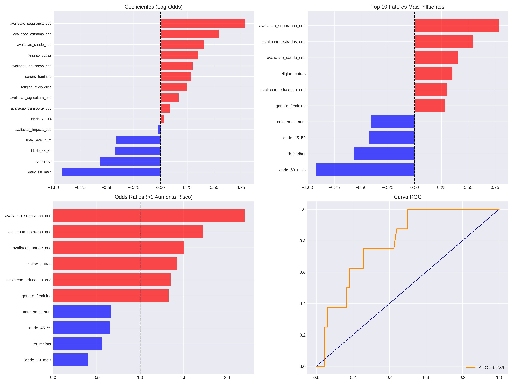
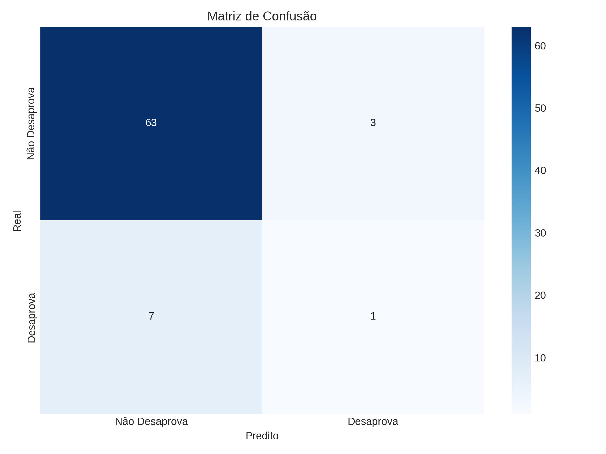

# Relatório de Análise de Desaprovação do Governo

## 📊 Performance do Modelo

O modelo de regressão logística obteve os seguintes resultados:

- **Acurácia (Teste):** 86.49%
- **AUC-ROC:** 0.789
- **Acurácia (Treino):** 91.13%

## 🎯 Tabela Completa de Fatores de Influência

A tabela abaixo apresenta todos os fatores analisados, ordenados pelo impacto (absoluto) na probabilidade de desaprovação.

| Fator                     | Coeficiente | Odds Ratio | Impacto Estimado | Direção                 |
| ------------------------- | ----------- | ---------- | ---------------- | ----------------------- |
| idade_60_mais             | -0.9175     | 0.40       | -60.0%           | Diminui Desaprovação 🔵 |
| avaliacao_seguranca_cod   | 0.7891      | 2.20       | +120.1%          | Aumenta Desaprovação 🔴 |
| rb_melhor                 | -0.5692     | 0.57       | -43.4%           | Diminui Desaprovação 🔵 |
| avaliacao_estradas_cod    | 0.5447      | 1.72       | +72.4%           | Aumenta Desaprovação 🔴 |
| idade_45_59               | -0.4234     | 0.65       | -34.5%           | Diminui Desaprovação 🔵 |
| nota_natal_num            | -0.4107     | 0.66       | -33.7%           | Diminui Desaprovação 🔵 |
| avaliacao_saude_cod       | 0.4061      | 1.50       | +50.1%           | Aumenta Desaprovação 🔴 |
| religiao_outras           | 0.3529      | 1.42       | +42.3%           | Aumenta Desaprovação 🔴 |
| avaliacao_educacao_cod    | 0.3002      | 1.35       | +35.0%           | Aumenta Desaprovação 🔴 |
| genero_feminino           | 0.2836      | 1.33       | +32.8%           | Aumenta Desaprovação 🔴 |
| religiao_evangelico       | 0.2482      | 1.28       | +28.2%           | Aumenta Desaprovação 🔴 |
| avaliacao_agricultura_cod | 0.1689      | 1.18       | +18.4%           | Aumenta Desaprovação 🔴 |
| avaliacao_transporte_cod  | 0.0892      | 1.09       | +9.3%            | Aumenta Desaprovação 🔴 |
| idade_29_44               | 0.0350      | 1.04       | +3.6%            | Aumenta Desaprovação 🔴 |
| avaliacao_limpeza_cod     | -0.0220     | 0.98       | -2.2%            | Diminui Desaprovação 🔵 |

## 📈 Visualizações

### Coeficientes e Importância

### Matriz de Confusão

## 💡 Interpretação

1. **Coeficientes Positivos:** Indicam características ou avaliações que aumentam a probabilidade de desaprovar o governo.
2. **Coeficientes Negativos:** Indicam fatores que reduzem essa probabilidade.
3. **Odds Ratio:** Quantifica quantas vezes a chance de desaprovação aumenta ou diminui.

---

_Relatório gerado automaticamente._
