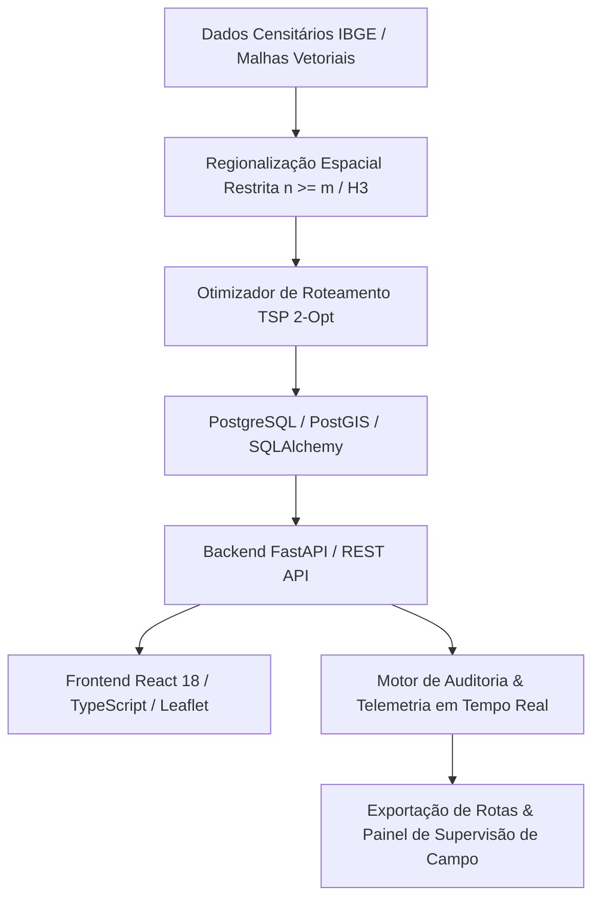

> [!NOTE]
> **Sanitized Technical Specification (`proprietary_sanitized`)**: This technical sheet is an authorized public specification adhering to strict intellectual property compliance and Brazilian LGPD (Lei Geral de Proteção de Dados) compliance. Proprietary source code, production database instances, raw databases, confidential credentials, and client Personally Identifiable Information (PII) remain strictly protected and are not exposed.
>
> *Especificação Técnica Sanitizada (`proprietary_sanitized`): Ficha técnica pública autorizada em estrita conformidade com a Lei Geral de Proteção de Dados (LGPD) e diretrizes de propriedade intelectual. Código-fonte, instâncias de produção, credenciais confidenciais e dados pessoais identificáveis (PII) protegidos.*
>
> *Ficha técnica pública autorizada sob diretriz proprietary_sanitized. Código-fonte, bancos de dados transacionais e telemetria de campo protegidos sob estrito sigilo institucional.*


**Contexto / Organização**: Instituto de Pesquisa de Opinião e Inteligência de Mercado  
**Período**: 2025 - 2026  
**Categoria de Atuação**: Data Science  
**Tecnologias**: `FastAPI`, `Python`, `React 18`, `TypeScript`, `Leaflet`, `GeoParquet`, `Uber H3`, `PostgreSQL`, `Docker`, `OR-Tools`  

---

## Visão Geral Executiva

Motor logístico e plataforma analítica espacial desenvolvida para automação do planejamento amostral, roteamento de equipes e controle de cotas de pesquisas de campo. Integra partição territorial restrita (Spatially Constrained Regionalization n >= m), roteamento geodésico TSP 2-Opt, ingestão de setores censitários via GeoParquet/H3 e auditoria de produtividade em tempo real.


**Organization / Context**: Instituto de Pesquisa de Opinião e Inteligência de Mercado  
**Timeline**: 2025 - 2026  
**Domain Category**: Data Science  
**Technologies**: `FastAPI`, `Python`, `React 18`, `TypeScript`, `Leaflet`, `GeoParquet`, `Uber H3`, `PostgreSQL`, `Docker`, `OR-Tools`  

---

## Executive Overview

Field logistics engine and spatial analytics platform engineered to automate sampling planning, team routing, and quota compliance for public opinion and market surveys. Integrates spatially constrained regionalization (n >= m), geodesic TSP 2-Opt routing, GeoParquet/H3 census tract ingestion, and real-time field productivity auditing.




## Arquitetura & Fluxo de Dados

O diagrama abaixo ilustra a topologia e esteira de processamento dos componentes técnicos sanitizados:

## Architecture & Data Flow

The diagram below illustrates the sanitized high-level component topology and data processing pipeline:



## Destaques de Engenharia

- **Regionalização Espacial Restrita: Agrupamento territorial de setores censitários com piso amostral mínimo (n >= m) e células hexagonais H3 (resolução 8), eliminando paradas operacionais inviáveis.**
- **Roteamento Geodésico Otimizado: Heurística TSP 2-Opt com matrizes de distâncias geodésicas e restrições de jornada operacional (8h/dia, tempos de aproximação e deslocamento entre pontos).**
- **Mitigação de Moral Hazard: Arquitetura desacoplada de auditoria combinando telemetria em tempo real, validação de velocidade média e controle de desvio de cotas.**


## Key Engineering Highlights

- **Spatially Constrained Regionalization: Territorial clustering of census tracts with minimum quota thresholds (n >= m) and Uber H3 hexagonal cells (res 8), eliminating unfeasible micro-stops.**
- **Optimized Geodesic Routing: TSP 2-Opt heuristic incorporating geodesic distance matrices and operational shift constraints (8h/day, buffer approach times, transit velocities).**
- **Moral Hazard Mitigation: Decoupled auditing architecture combining real-time telemetry, speeder detection, and quota drift control.**


