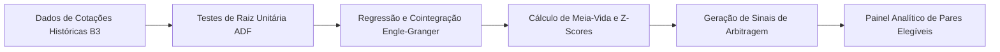


**Contexto / Organização**: Meta & Actio Investimentos  
**Período**: 2017 - 2020  
**Categoria de Atuação**: Quantitative Finance  
**Tecnologias**: `R`, `Tseries`, `Urca`, `Dplyr`, `Ggplot2`, `B3 Market Data`  

---

## Visão Geral Executiva

Algoritmo desenvolvido em linguagem R para varredura sistemática diária de testes de raiz unitária (ADF) e cointegração de Engle-Granger sobre todo o universo de ações da B3. Monitorava mais de 100 oportunidades mensais de arbitragem estatística com cálculo automatizado de meias-vidas (half-life) e z-scores.


**Organization / Context**: Meta & Actio Investimentos  
**Timeline**: 2017 - 2020  
**Domain Category**: Quantitative Finance  
**Technologies**: `R`, `Tseries`, `Urca`, `Dplyr`, `Ggplot2`, `B3 Market Data`  

---

## Executive Overview

Systematic quantitative algorithm coded in R for daily universe-wide Engle-Granger cointegration and Augmented Dickey-Fuller (ADF) screening on B3 equities. Scanned 100+ statistical arbitrage candidates monthly with automated half-life and z-score calculations.




## Arquitetura & Fluxo de Dados

O diagrama abaixo ilustra a topologia e esteira de processamento dos componentes técnicos sanitizados:

## Architecture & Data Flow

The diagram below illustrates the sanitized high-level component topology and data processing pipeline:



## Destaques de Engenharia

- **Varredura Sistemática B3: Testes diários automatizados de estacionariedade (ADF) e cointegração de Engle-Granger em todos os pares de ações líquidos.**
- **Geração de Sinais Quantitativos: Modelagem de resíduos com cálculo de meia-vida de reversão à média e normalização por Z-score.**
- **Análise de Risco de Execução: Dimensionamento de bandas de entrada e saída considerando custos operacionais e limites estatísticos.**


## Key Engineering Highlights

- **Systematic B3 Screening: Automated daily Augmented Dickey-Fuller (ADF) and Engle-Granger cointegration testing across liquid equity pairs.**
- **Quantitative Signal Generation: Residual spread modeling featuring mean-reversion half-life calculation and Z-score standardization.**
- **Execution Risk Framework: Optimal entry/exit band sizing accounting for market friction and statistical confidence intervals.**




## Referências e Comprovações

- [Código-Fonte / Repositório Oficial no GitHub](https://github.com/pablodiegoo/LongandShortR)


## References & Verification

- [Source Code / Official GitHub Repository](https://github.com/pablodiegoo/LongandShortR)


