# Análise do Briefing: MARKETPLACE – DIAGNÓSTICO DAS RELAÇÕES DE VENDAS EM PLATAFORMAS DIGITAIS
## 1.0 Objetivos da Pesquisa
### 1.1 Objetivo Principal
* Levantar percepções, práticas, desafios e oportunidades de melhoria na atuação de empreendedores em marketplaces, identificando gargalos e caminhos para inovação e crescimento sustentável.

### 1.2 Objetivos Específicos
* Identificar dores e dificuldades enfrentadas pelos empreendedores.
* Mapear barreiras operacionais (logística, taxas, visibilidade, atendimento).
* Levantar práticas de sucesso e estratégias de vendedores com bom desempenho.
* Avaliar a percepção sobre a experiência de venda e confiança nas plataformas.
* Analisar o nível de satisfação e intenção de continuidade.
* Identificar oportunidades de suporte do Sebrae-SP.
* Explorar tendências futuras (IA, social commerce, live commerce).

## 2.0 Metodologia
* **Público-Alvo:** Empresários (MEI, ME e EPP) atuantes em São Paulo (Capital, RM e Interior) que utilizam Mercado Livre, Amazon, Shopee, Magalu, Americanas ou TikTok Shop.
* **Técnica:** Abordagem mista composta por **Qualitativa** (18 Grupos de Discussão Online com transmissão ao vivo) e **Quantitativa** (360 entrevistas estruturadas via WhatsApp, E-mail ou Telefone).
* **Recrutamento:** Baseado na identificação de grupos privados de WhatsApp de vendedores.
* **Período de Execução:** Início em 10/11/2025, com vigência de 2 meses.

### 2.1 Estrutura da Amostra Qualitativa
Para visualizar a distribuição dos grupos focais e facilitar o entendimento da segmentação por plataforma e tempo de atuação, apresento o seguinte diagrama:

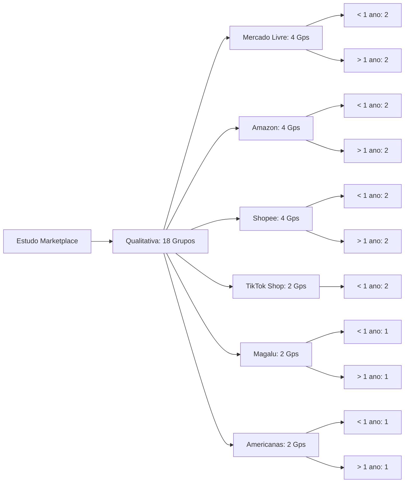
```mermaid
graph LR;
    Study[Estudo Marketplace] --> Quali[Qualitativa: 18 Grupos];
    Quali --> ML[Mercado Livre: 4 Gps];
    Quali --> AMZ[Amazon: 4 Gps];
    Quali --> SHP[Shopee: 4 Gps];
    Quali --> TIK[TikTok Shop: 2 Gps];
    Quali --> MGL[Magalu: 2 Gps];
    Quali --> AME[Americanas: 2 Gps];
    
    ML --> ML1[< 1 ano: 2];
    ML --> ML2[> 1 ano: 2];
    
    AMZ --> AMZ1[< 1 ano: 2];
    AMZ --> AMZ2[> 1 ano: 2];
    
    SHP --> SHP1[< 1 ano: 2];
    SHP --> SHP2[> 1 ano: 2];
    
    TIK --> TIK1[< 1 ano: 2];
    
    MGL --> MGL1[< 1 ano: 1];
    MGL --> MGL2[> 1 ano: 1];
    
    AME --> AME1[< 1 ano: 1];
    AME --> AME2[> 1 ano: 1];

```

*Justificativa do diagrama: O organograma hierárquico permite visualizar rapidamente o peso amostral de cada plataforma e a divisão entre novos entrantes e vendedores experientes.*

##3.0 Pontos de Foco para Análise* **Comparativo de Plataformas:** Diferenças cruciais entre Shopee, Mercado Livre, TikTok Shop, Amazon, Magalu e Americanas.
* **Integração de Dados:** Cruzamento entre os achados qualitativos e quantitativos.
* **Perfis:** Identificação clara de perfis de empreendedores e comparação de percepções entre vendedores e consumidores.
* **Sustentabilidade do Negócio:** Análise de gargalos que impedem o crescimento e inovação.

---

### Proposta de Estrutura do Relatório
#### Mapa Mental da Estrutura
Para visualizar a interconexão dos temas, utilizarei um mapa mental que parte do diagnóstico central e se ramifica nas dimensões críticas da experiência do vendedor (Operacional, Estratégica, Emocional e Futura).

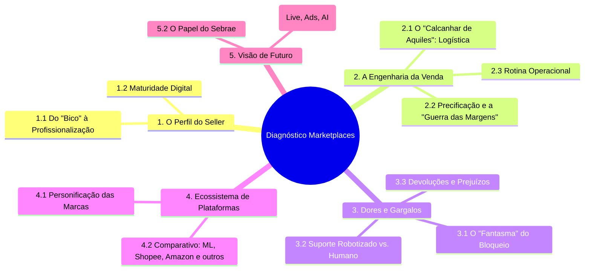
```mermaid
mindmap
  root((Diagnóstico Marketplaces))
    1. O Perfil do Seller
      1.1 Do "Bico" à Profissionalização
      1.2 Maturidade Digital
    2. A Engenharia da Venda
      2.1 O "Calcanhar de Aquiles": Logística
      2.2 Precificação e a "Guerra das Margens"
      2.3 Rotina Operacional
    3. Dores e Gargalos
      3.1 O "Fantasma" do Bloqueio
      3.2 Suporte Robotizado vs. Humano
      3.3 Devoluções e Prejuízos
    4. Ecossistema de Plataformas
      4.1 Personificação das Marcas
      4.2 Comparativo: ML, Shopee, Amazon e outros
    5. Visão de Futuro
      5.1 Tendências (Live, Ads, AI)
      5.2 O Papel do Sebrae

```

*Justificativa do diagrama: O mapa mental organiza de forma radial os pilares da pesquisa, facilitando a visualização de como as dores operacionais (ex: logística) impactam diretamente a percepção das plataformas e a necessidade de apoio futuro.*

---

### Índice Detalhado

**1.0 Perfil e Trajetória do Empreendedor Digital**
- 1.1 **Gênese do Negócio:** A entrada por necessidade vs. oportunidade planejada.
- 1.2 **Curva de Aprendizado:** A transição do amadorismo para a gestão profissional (MEI > ME/EPP).
- 1.3 **Multicanalidade:** O desafio de gerenciar múltiplas vitrines simultaneamente.

**2.0 A Engenharia da Venda: Operação e Logística**
- 2.1 **O Desafio Logístico:** A dependência do *Fulfillment* e as dores do sistema de entregas.
- 2.2 **Precificação de Sobrevivência:** O impacto das taxas, comissões e frete na margem líquida.
- 2.3 **Gestão de Reputação:** O peso da avaliação do cliente na visibilidade do anúncio.

**3.0 O "Lado Sombra": Dores e Barreiras Críticas**
- 3.1 **Insegurança Jurídica e Bloqueios:** O medo constante de perder a conta sem aviso prévio.
- 3.2 **Atendimento e Suporte:** A frustração com respostas automáticas e falta de resolução humana.
- 3.3 **Logística Reversa e Fraudes:** O prejuízo financeiro e emocional com devoluções indevidas ("Golpe da Pedra").
- 3.4 **Concorrência Predatória:** A percepção sobre vendedores internacionais e guerra de preços.

**4.0 Raio-X das Plataformas (Análise Comparativa)**
- 4.1 **Personificação das Marcas:** Se as plataformas fossem pessoas, quem seriam? (Arquétipos).
- 4.2 **Matriz de Forças e Fraquezas por Player:**
  * **Mercado Livre:** A "Locomotiva" eficiente, porém impessoal/rígida.
  * **Shopee:** A "Feira Popular" acessível, mas com logística instável.
  * **Amazon:** O "Shopping de Elite", organizado, mas complexo e burocrático.
  * **Outros (Magalu, Americanas, TikTok):** Oportunidades de nicho e desconfianças.

**5.0 Horizontes e Apoio Institucional**
- 5.1 **Tendências Percebidas:** A visão sobre Live Commerce, Inteligência Artificial e tráfego pago.
- 5.2 **O Papel do Sebrae-SP:** Lacunas de capacitação e expectativas de defesa institucional.
- 5.3 **Conclusões e Recomendações Estratégicas:** Caminhos para fortalecer o ecossistema.

---

# 1.0. Perfil e Trajetória do Empreendedor Digital

### Síntese
A entrada no ecossistema de marketplaces é predominantemente reativa, impulsionada pela **necessidade** (especialmente pós-pandemia) ou pela busca de **renda extra**. O perfil migra rapidamente de uma "aventura despretensiosa" para uma **profissionalização forçada**, onde o vendedor descobre que a barreira de entrada é baixa, mas a barreira de permanência e crescimento exige gestão complexa e resiliência emocional.

---

### Análise Detalhada
* **A "Gênese Acidental":** Uma parcela significativa dos participantes iniciou a operação como resposta ao fechamento de lojas físicas ou perda de emprego (perfil de necessidade), enquanto outros começaram vendendo itens usados ou fazendo revenda informal ("sacoleiro digital") sem plano de negócios.
* **O "Eupreendedor" Multitarefa:** O perfil predominante é o do "faz-tudo". O vendedor atua simultaneamente como comprador, estoquista, SAC e financeiro. Essa centralização gera um gargalo de crescimento, pois a operação diária consome o tempo que deveria ser dedicado à estratégia.
* **Maturidade Digital Desigual:** Nota-se um abismo entre o vendedor iniciante (focado apenas em preço e venda unitária) e o vendedor maduro (focado em margem, Ads e branding). O iniciante vê a plataforma como um "classificado"; o maduro a vê como um canal de aquisição de clientes dentro de uma estratégia maior.

> **Voz do Cliente:**
> "Eu comecei na pandemia, né? Como muita gente. A loja física fechou e eu precisei me virar. No começo achei que era só postar foto, mas aí vi que o buraco é mais embaixo. Hoje eu vivo disso, mas apanhei muito pra aprender a precificar e não pagar pra trabalhar."
> -- *Participante, Grupo 3 (Mercado Livre/Shopee)*

### Visualização dos ConceitosEste diagrama ilustra o ciclo de evolução do perfil do vendedor, destacando o ponto de inflexão onde a falta de preparo encontra a complexidade da plataforma.

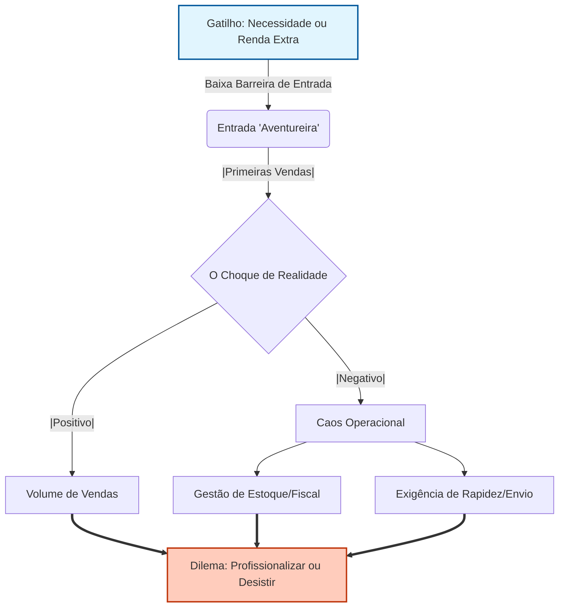
```mermaid
graph TD;
    A[Gatilho: Necessidade ou Renda Extra] -->|Baixa Barreira de Entrada| B(Entrada 'Aventureira');
    B --|Primeiras Vendas|--> C{O Choque de Realidade};
    C --|Positivo|--> D[Volume de Vendas];
    C --|Negativo|--> E[Caos Operacional];
    E --> F[Gestão de Estoque/Fiscal];
    E --> G[Exigência de Rapidez/Envio];
    D & F & G ==> H[Dilema: Profissionalizar ou Desistir];
    
    style A fill:#e1f5fe,stroke:#01579b,stroke-width:2px
    style H fill:#ffccbc,stroke:#bf360c,stroke-width:2px
```

*Justificativa do diagrama: O fluxo demonstra que o sucesso inicial (vendas) traz consigo a complexidade (caos), forçando o vendedor a um ponto de decisão crítica sobre a continuidade do negócio.*

### Implicações 
**[Insight Inferido]:** O Sebrae-SP tem uma oportunidade clara de atuar não apenas na abertura da empresa (MEI), mas no **"Gap de Gestão Intermediária"**. O vendedor já sabe vender, mas não sabe escalar sem perder a margem ou a saúde mental. A capacitação deve focar em ferramentas de automação e gestão financeira específica para taxas de marketplace, transformando o "bico" em estrutura empresarial sustentável.

---

Com certeza. O aprofundamento nos perfis revela que a distinção não é apenas temporal (tempo de conta), mas de **mentalidade de gestão**.

Aqui está a **Matriz de Personas** detalhada, contrastando o vendedor em estágio inicial com o vendedor consolidado.

---

# Aprofundamento: Matriz de Personas (Iniciante vs. Experiente)

### Síntese da Análise
Identificamos dois arquétipos predominantes. O **"Aventureiro Resiliente"** (frequentemente iniciante ou estagnado) opera na *insegurança*, focado em dominar a ferramenta e "fazer a primeira venda". O **"Estrategista Digital"** (maduro) opera na *otimização*, focado em margem, escala e diversificação de canais para não depender de um único "patrão" (plataforma).

---

### Diagrama de Mentalidade Comparada
Abaixo, mapeamos como as prioridades e dores mudam drasticamente conforme a maturidade do vendedor.

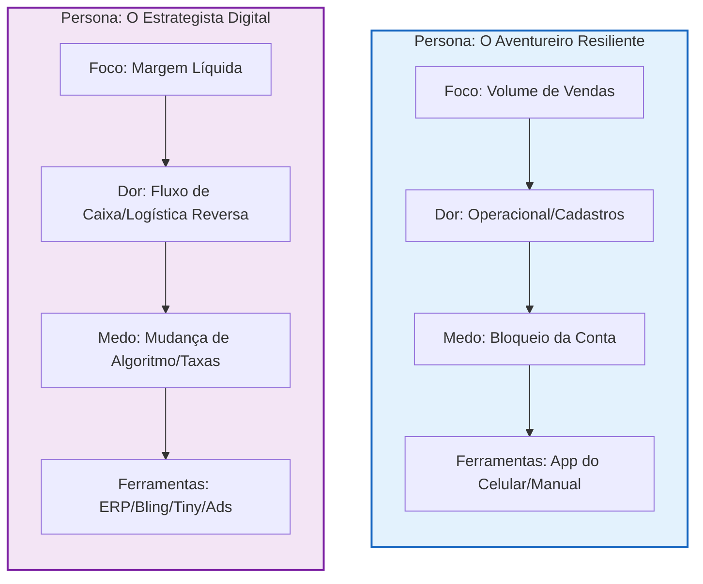
```mermaid
graph TB
    subgraph INICIANTE ["Persona: O Aventureiro Resiliente"]
        direction TB
        I1[Foco: Volume de Vendas]
        I2[Dor: Operacional/Cadastros]
        I3[Medo: Bloqueio da Conta]
        I4[Ferramentas: App do Celular/Manual]
        I1 --> I2 --> I3 --> I4
    end

    subgraph EXPERIENTE ["Persona: O Estrategista Digital"]
        direction TB
        E1[Foco: Margem Líquida]
        E2[Dor: Fluxo de Caixa/Logística Reversa]
        E3[Medo: Mudança de Algoritmo/Taxas]
        E4[Ferramentas: ERP/Bling/Tiny/Ads]
        E1 --> E2 --> E3 --> E4
    end
    
    style INICIANTE fill:#e3f2fd,stroke:#1565c0,stroke-width:2px
    style EXPERIENTE fill:#f3e5f5,stroke:#7b1fa2,stroke-width:2px

```

*Justificativa do diagrama: A separação em subgrafos permite visualizar rapidamente que, enquanto o iniciante luta contra a ferramenta (cadastro, bloqueio), o experiente luta contra o mercado (margem, taxas, algoritmo).*

---

### Detalhamento dos Perfis
#### 1. O "Aventureiro Resiliente" (Estágio Inicial/Intermediário)* **Perfil:** Geralmente MEI ou informal. Entrou por necessidade. Vê a plataforma como "mágica": coloca o produto e espera vender.
* **Comportamento:** Sofre com a precificação, muitas vezes pagando para vender por não calcular taxas e embalagem. Tem dificuldade técnica com impressão de etiquetas e integração.
* **Relação com a Plataforma:** Medo e submissão. Sente-se um funcionário sem direitos. Qualquer notificação gera pânico.

> **Voz do Cliente (Iniciante):**
> "No começo eu ficava desesperada quando não apitava venda. Eu baixava o preço sem ver se tinha lucro, só pra ver sair. Hoje vejo que perdi dinheiro."
> -- *Participante, Grupo 2 (Shopee/ML)*

#### 2. O "Estrategista Digital" (Estágio Maduro)* **Perfil:** ME ou EPP. Já possui equipe (mesmo que pequena) e sistema de gestão (ERP). Vê a plataforma como um "mal necessário" ou parceiro de negócios.
* **Comportamento:** Investe pesado em Ads (publicidade paga dentro da plataforma). Usa Fulfillment (estoque na plataforma) e Flex. Sua dor é financeira (giro de caixa preso na plataforma) e logística (devoluções injustas).
* **Relação com a Plataforma:** Desconfiança estratégica. Diversifica em vários marketplaces para não "colocar todos os ovos na mesma cesta".

> **Voz do Cliente (Experiente):**
> "O Mercado Livre não é seu sócio, ele é o dono do cassino. Você tem que saber jogar. Eu uso o Full deles pra ranquear, mas meu lucro real vem quando puxo o cliente pro meu site depois."
> -- *Participante, Grupo 15 (Multicanal)*

---

### Tabela Comparativa de Dores e Necessidades

| Aspecto | Iniciante (Aventureiro) | Experiente (Estrategista) |
| --- | --- | --- |
| **Maior Gargalo** | Entender como funciona a plataforma e gerar tráfego orgânico. | Gerenciar fluxo de caixa e lidar com a concorrência predatória (preço). |
| **Visão sobre Taxas** | "É muito caro, a plataforma rouba meu lucro". | "É o Custo de Aquisição de Cliente (CAC), mas precisa valer a pena". |
| **Logística** | Correios/Ponto de envio (leva o pacote na agência). | Coleta, Full, Flex (estratégia de entrega rápida). |
| **Necessidade Sebrae** | Passo-a-passo básico, formalização, precificação simples. | Consultoria jurídica, tributária, gestão de estoque complexa e crédito. |

### Implicações para o Relatório
**[Insight Inferido]:** As estratégias de comunicação e suporte do Sebrae precisam ser **segmentadas**. Oferecer "curso básico de como vender na internet" afasta o vendedor experiente que busca soluções para problemas fiscais complexos ou estratégias de importação. O relatório deve sugerir trilhas de capacitação distintas.

---

# 1.1. Gênese do Negócio: 
A entrada por necessidade vs. oportunidade planejada###SínteseA entrada no marketplace é predominantemente marcada pela **reatividade**. A grande maioria dos participantes relata ter iniciado suas operações por **necessidade de sobrevivência** (desemprego, fechamento do comércio físico na pandemia) ou busca de renda complementar, e não por um planejamento estratégico de expansão de canal. Isso gera uma base de vendedores resilientes, mas carentes de fundamentos de gestão.

---

### Análise Detalhada
* **O "Boom" da Sobrevivência (Efeito Pandemia):** A narrativa mais comum é a do "empreendedor acidental". O fechamento das lojas físicas durante a pandemia ou a demissão forçaram a entrada no digital sem preparo prévio. Para este grupo, o marketplace não foi uma escolha, foi a única tábua de salvação.
* **A Ilusão da "Renda Extra":** Muitos começaram vendendo itens usados ou fazendo "bicos" de revenda para complementar o salário. Quando o volume cresceu, viram-se "obrigados" a transformar o bico em negócio principal, muitas vezes sem separar o CPF do CNPJ, levando vícios da informalidade para a operação profissional.
* **Planejamento como Exceção:** A entrada planejada (oportunidade) é rara e restrita a perfis que já possuíam estrutura de e-commerce ou indústria e decidiram usar o marketplace como canal de aquisição (vitrine), e não como destino final.

> **Voz do Cliente:**
> "Eu não planejei nada. Fui demitida na pandemia, tinha um acerto [rescisão] e comprei tudo em mercadoria pra não ficar parada. O Mercado Livre foi o jeito que deu pra escoar, porque não podia abrir porta pra rua."
> -- *Participante, Grupo 2 (Foco em Renda/Iniciante)*

### Visualização dos Conceitos
O diagrama abaixo mapeia as duas rotas de entrada identificadas e como a **origem** define a **dor inicial** do vendedor.

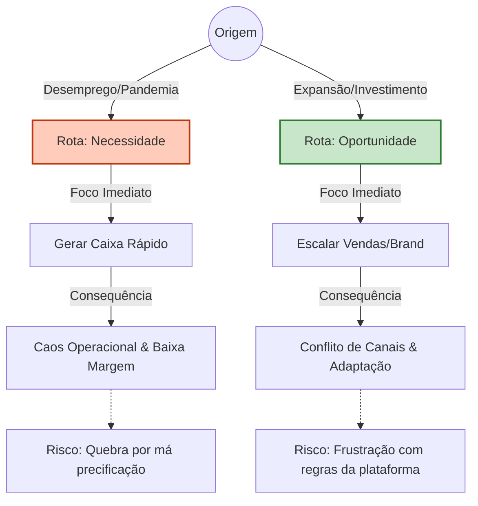
```mermaid
graph TD;
    Start((Origem));
    
    %% Caminho da Necessidade
    Start -->|Desemprego/Pandemia| Necessity[Rota: Necessidade];
    Necessity -->|Foco Imediato| Cash[Gerar Caixa Rápido];
    Cash -->|Consequência| Chaos[Caos Operacional & Baixa Margem];
    
    %% Caminho da Oportunidade
    Start -->|Expansão/Investimento| Opportunity[Rota: Oportunidade];
    Opportunity -->|Foco Imediato| Scale[Escalar Vendas/Brand];
    Scale -->|Consequência| Conflict[Conflito de Canais & Adaptação];

    Chaos -.-> Risk[Risco: Quebra por má precificação];
    Conflict -.-> Risk2[Risco: Frustração com regras da plataforma];

    style Necessity fill:#ffccbc,stroke:#bf360c,stroke-width:2px
    style Opportunity fill:#c8e6c9,stroke:#2e7d32,stroke-width:2px

```

*Justificativa do diagrama: O fluxograma bifurcado é essencial para demonstrar que, embora ambos os perfis terminem vendendo no mesmo lugar (a plataforma), a motivação inicial cria "heranças malditas" diferentes (caos financeiro vs. frustração estratégica) que exigem soluções distintas.*

### Implicações 
**[Insight Inferido]:** Como a maioria entra por necessidade e sem capital de giro, há uma **vulnerabilidade financeira extrema** nos primeiros 12 meses. O Sebrae-SP deve abordar esse público não com "planos de negócios complexos" (que eles ignoram por urgência), mas com "kits de primeiros socorros financeiros": como precificar para não pagar para trabalhar e como separar o dinheiro de casa do dinheiro da venda.

---

#1.2. Curva de Aprendizado: A transição do amadorismo para a gestão profissional###SínteseA evolução do vendedor não é linear; ela é marcada por **ciclos de dor e adaptação forçada**. O aprendizado ocorre predominantemente de forma empírica ("na marra"), onde o erro operacional — como vender sem estoque ou precificar errado — atua como o principal professor. A transição do amadorismo para o profissionalismo acontece no momento crítico em que o controle manual (caderninho/planilha) colapsa diante do volume de vendas, exigindo a adoção de tecnologias de gestão (ERPs).

---

###Análise Detalhada* **O "Custo do Aprendizado" (Tuition of Error):** Os participantes relatam que o domínio da plataforma custou dinheiro. Erros de precificação (esquecer de incluir a taxa de comissão ou o custo da embalagem) e punições por atraso no envio são vistos como o "pedágio" pago para entender as regras do jogo, já que os tutoriais das plataformas são considerados superficiais ou desatualizados.
* **O Salto Tecnológico (Do Manual ao ERP):** Existe um divisor de águas claro: a implementação de um sistema de gestão (Hub/ERP como Bling ou Tiny). O vendedor amador tenta gerenciar múltiplos canais manualmente, o que gera erros de estoque. O vendedor que se profissionaliza entende que sem automação não há escala, embora a configuração inicial desses sistemas seja uma barreira técnica significativa.
* **O Teto do MEI como Freio Psicológico:** A transição fiscal (sair do MEI para ME) é vista com medo. Muitos "seguram" as vendas ou criam contas em nome de parentes para não estourar o limite, retardando a profissionalização por receio da burocracia e da carga tributária do Simples Nacional.

> **Voz do Cliente:**
> "No início eu achava que era só colocar o produto lá. Aí vendi 50 peças de um negócio que eu tinha 10. Foi um desespero. Tive que cancelar, minha reputação foi pro chão. Ali eu aprendi que ou você tem sistema [ERP] ou você não tem vida. Foi meu batismo de fogo."
> -- *Participante, Grupo 4 (Maturidade Intermediária)*

###Visualização dos ConceitosEste diagrama de fluxo ilustra os estágios de maturidade, destacando o "Gargalo do Caos" que força a evolução ou a desistência.

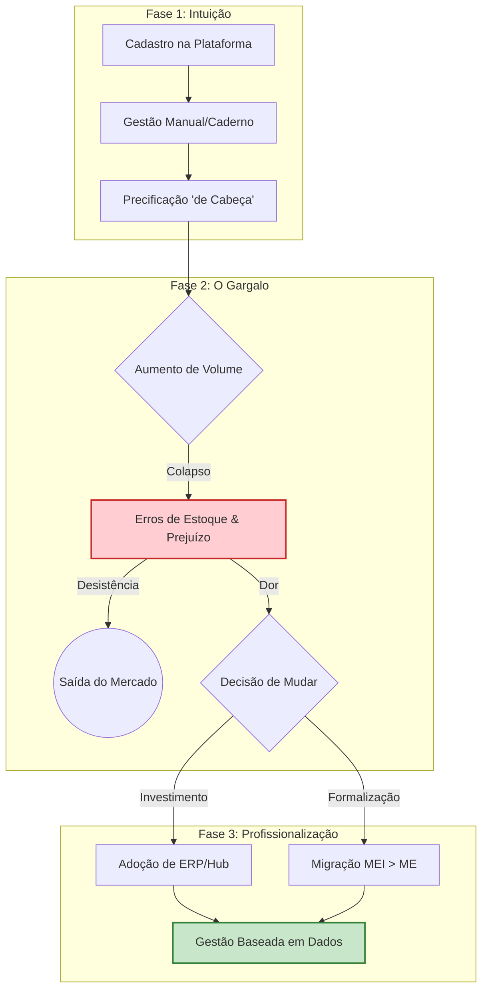
```mermaid
graph TD;
    subgraph Fase 1: Intuição
    A[Cadastro na Plataforma] --> B[Gestão Manual/Caderno];
    B --> C[Precificação 'de Cabeça'];
    end

    subgraph Fase 2: O Gargalo
    C --> D{Aumento de Volume};
    D -->|Colapso| E[Erros de Estoque & Prejuízo];
    E -->|Desistência| F((Saída do Mercado));
    E -->|Dor| G{Decisão de Mudar};
    end

    subgraph Fase 3: Profissionalização
    G -->|Investimento| H[Adoção de ERP/Hub];
    G -->|Formalização| I[Migração MEI > ME];
    H & I --> J[Gestão Baseada em Dados];
    end

    style E fill:#ffcdd2,stroke:#c62828,stroke-width:2px
    style J fill:#c8e6c9,stroke:#2e7d32,stroke-width:2px

```

*Justificativa do diagrama: O modelo em três fases evidencia que a profissionalização não é um passo natural, mas uma resposta a uma crise (o colapso da gestão manual). Isso ajuda a identificar onde o suporte externo é mais necessário.*

### Implicações
**[Insight Inferido]:** O momento de maior risco de mortalidade do negócio não é o início (cadastro), mas o **momento da escala**, quando a gestão manual falha. O Sebrae deve focar em mentorias de "Transição Tecnológica" (como configurar o primeiro ERP) e "Educação Fiscal Descomplicada" (desmistificando a saída do MEI), atuando como uma ponte segura sobre o abismo da profissionalização.

# 1.3. Multicanalidade: O desafio de gerenciar múltiplas vitrines simultaneamente
### Síntese
A multicanalidade surge menos como uma estratégia ofensiva de conquista de mercado e mais como um **mecanismo de defesa** ("não colocar todos os ovos na mesma cesta"). O medo de bloqueios súbitos ou mudanças de algoritmo em uma plataforma dominante (geralmente Mercado Livre) empurra o vendedor para outras vitrines. No entanto, essa diversificação cria um **pesadelo operacional**: a sincronização de estoque e a gestão de precificações distintas para margens que variam drasticamente entre canais.

---

### Análise Detalhada
* **A Estratégia de Sobrevivência (Antifrágil):** A principal motivação para abrir contas na Amazon, Shopee ou Magalu é a insegurança jurídica. O vendedor sente que, se sua conta principal cair, o negócio quebra. A multicanalidade é vista como um seguro de vida empresarial, garantindo fluxo de caixa caso uma "torneira" se feche.
* **O "Cobertor Curto" do Estoque:** Sem o uso de integradores (Hubs/ERPs), a venda multicanal gera o erro fatal de "furo de estoque" (vender o mesmo item único no Mercado Livre e na Shopee simultaneamente). Isso obriga o vendedor a cancelar uma das vendas, prejudicando sua reputação. A gestão manual de múltiplos canais é apontada como insustentável.
* **Esquizofrenia de Preços:** Os participantes relatam a dificuldade de manter a coerência de preços. Cada plataforma possui uma estrutura de comissão, frete e política de parcelamento diferente. O desafio é calcular o preço ideal para cada vitrine sem canibalizar a própria venda ou perder competitividade.

> **Voz do Cliente:**
> "Eu era só Mercado Livre. Um dia minha conta foi suspensa por 3 dias para análise. Eu não vendi nada, entrei em pânico. Ali eu decidi que tinha que estar na Shopee, na Amazon, em tudo. Dá o triplo de trabalho, o sistema às vezes falha, mas eu não fico mais na mão de um dono só."
> -- *Participante, Grupo 15 (Estratégia Multicanal)*

### Visualização dos Conceitos
O diagrama abaixo representa a tensão entre a segurança da diversificação e a complexidade operacional que ela acarreta.

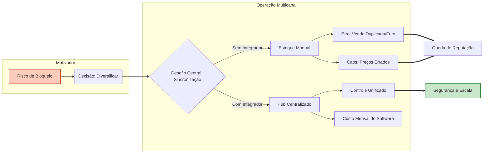
```mermaid
graph LR;
    subgraph Motivador
    A[Risco de Bloqueio] --> B(Decisão: Diversificar);
    end

    subgraph Operação Multicanal
    B --> C{Desafio Central: Sincronização};
    C -->|Sem Integrador| D[Estoque Manual];
    C -->|Com Integrador| E[Hub Centralizado];
    
    D --> F[Erro: Venda Duplicada/Furo];
    D --> G[Caos: Preços Errados];
    
    E --> H[Controle Unificado];
    E --> I[Custo Mensal do Software];
    end
    
    F & G ==> J[Queda de Reputação];
    H ==> K[Segurança e Escala];

    style A fill:#ffccbc,stroke:#bf360c,stroke-width:2px
    style K fill:#c8e6c9,stroke:#2e7d32,stroke-width:2px

```

*Justificativa do diagrama: O fluxo lateral demonstra que a decisão de diversificar bifurca a operação. Sem a ferramenta correta (Integrador), o resultado converge para a queda de reputação, anulando o benefício da diversificação.*

### Implicações
**[Insight Inferido]:** A multicanalidade exige uma **inteligência de precificação avançada**. Não basta replicar o anúncio; é preciso adaptar a "arquitetura de preço" para cada canal (ex: preço maior na Amazon devido à taxa, preço menor na Shopee com cupom). O Sebrae pode atuar com ferramentas de **"Engenharia de Cardápio Digital"**, ensinando o vendedor a calcular a margem de contribuição real por canal, evitando que o lucro de uma plataforma financie o prejuízo de outra.

---

# 2.0. A Engenharia da Venda: Operação e Logística
### Síntese
A operação de vendas nos marketplaces deixou de ser uma atividade de "postar e enviar" para se tornar uma **engenharia de alta precisão**. Identificamos que a logística não é apenas um braço operacional, mas o **principal motor de vendas** (visibilidade/ranking) e, simultaneamente, o maior **drenador de margem**. O vendedor vive o dilema diário entre aderir aos programas logísticos das plataformas (Full/Flex) para ganhar destaque ou manter a logística própria para preservar o controle e o lucro.

---

### Análise Detalhada
* **A "Tirania" da Logística como Marketing:** Os participantes percebem claramente que o algoritmo prioriza quem entrega mais rápido. A adesão ao *Fulfillment* (estoque no galpão da plataforma) ou *Flex* (entrega no mesmo dia) tornou-se mandatória para quem quer aparecer na primeira página. Quem opera via Correios/PAC sente-se "invisível".
* **Precificação às Cegas:** Um achado crítico é a dificuldade de calcular a margem real. Entre comissões variáveis, taxas de frete (que mudam por região/peso), impostos e custos de embalagem, muitos vendedores operam no "zero a zero" ou no prejuízo sem perceber. A complexidade tributária e as taxas dinâmicas das plataformas obscurecem o lucro líquido real.
* **O Trabalho Braçal Invisível:** Por trás da tela, existe uma rotina exaustiva de "chão de fábrica": etiquetagem, montagem de caixas, corridas contra o relógio para despachar antes do horário de corte (*cutoff*) e gestão de insumos. Essa carga operacional limita o tempo disponível para pensar estrategicamente o negócio.

> **Voz do Cliente:**
> "Hoje a logística manda em tudo. Se você não tá no Full, você não existe. Mas pro Full você tem que mandar caminhão, pagar armazenagem, pagar retirada se não vender... É um casamento caro. Você vende muito, vê muito dinheiro girando, mas no fim do mês sobra pouco."
> -- *Participante, Grupo 4 (Vendedor Experiente)*

### Visualização dos Conceitos
Este diagrama demonstra o **"Ciclo da Margem Pressionada"**, ilustrando como a exigência por velocidade logística impacta a estrutura de custos e força o vendedor a um trade-off constante.

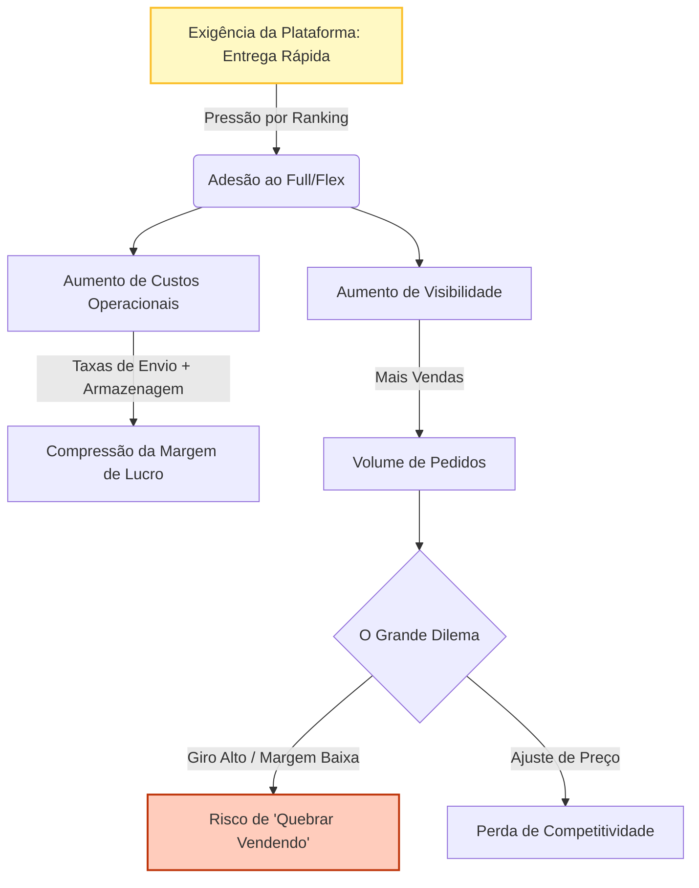
```mermaid
graph TD;
    A[Exigência da Plataforma: Entrega Rápida] -->|Pressão por Ranking| B(Adesão ao Full/Flex);
    
    B --> C[Aumento de Custos Operacionais];
    C -->|Taxas de Envio + Armazenagem| D[Compressão da Margem de Lucro];
    
    B --> E[Aumento de Visibilidade];
    E -->|Mais Vendas| F[Volume de Pedidos];
    
    F --> G{O Grande Dilema};
    G -->|Giro Alto / Margem Baixa| H[Risco de 'Quebrar Vendendo'];
    G -->|Ajuste de Preço| I[Perda de Competitividade];

    style A fill:#fff9c4,stroke:#fbc02d,stroke-width:2px
    style H fill:#ffccbc,stroke:#bf360c,stroke-width:2px

```

*Justificativa do diagrama: O fluxo circular evidencia a armadilha do crescimento: para vender mais (visibilidade), o vendedor aumenta seu custo (logística), o que comprime a margem, criando o risco paradoxal de falir mesmo tendo alto volume de vendas ("Quebrar Vendendo").*

### Implicações
**[Insight Inferido]:** A logística tornou-se uma **barreira de entrada financeira**. O pequeno vendedor (MEI) que não tem capital para suportar os custos antecipados do Full ou estrutura para o Flex está sendo empurrado para as margens do sistema. O Sebrae precisa intervir com capacitação em **"Custeio Logístico Avançado"**, ensinando o vendedor a calcular se o aumento de vendas prometido pelo Full compensa a erosão da margem unitária.

---

# 2.1. O Desafio Logístico: Full, Flex e Correios
### Síntese
A logística deixou de ser apenas um meio de transporte para se tornar o **principal algoritmo de ranqueamento**. Para os participantes, existem duas eras: a era dos "Correios" (controle na mão do vendedor, mas baixa visibilidade) e a era da "Logística da Plataforma" (Full e Flex). A transição para o modelo da plataforma é vista como um **"pacto faustiano"**: entrega-se o controle do estoque e da operação em troca de visibilidade e volume de vendas, muitas vezes sacrificando a margem e a paz de espírito.

---

### Análise Detalhada
* **O "Full" como Pedágio de Visibilidade:** O *Fulfillment* (estoque no armazém da plataforma, principalmente Mercado Livre e Amazon) é unanimemente reconhecido como a única forma de escalar. Vendedores relatam que, ao entrarem no Full, as vendas triplicam, mas os custos de armazenagem (especialmente para produtos de baixo giro) e a burocracia para retirar mercadorias encalhadas geram um risco financeiro constante. É descrito como "o céu (vendas) e o inferno (custos) ao mesmo tempo".
* **A "Insanidade" do Flex:** O modelo de entrega no mesmo dia (*Flex*) é apontado como a modalidade mais estressante. O vendedor fica refém da disponibilidade de motoboys e transportadoras terceirizadas. Se o motorista falha, a punição na reputação recai sobre o vendedor, gerando um sentimento de injustiça aguda. É uma operação de "guerra diária" com horários de corte rigorosos.
* **O Ocaso dos Correios:** O envio tradicional via agência dos Correios ou Ponto de Coleta simples é associado ao "vendedor amador" ou iniciante. Embora ofereça mais controle sobre o pacote e menos pressão de horário, os participantes sentem que o algoritmo "esconde" anúncios que não usam a logística expressa da plataforma, forçando a migração.

> **Voz do Cliente:**
> "No Flex a gente fica doido. Tem dia que o motoboy não aparece, chove, e o cliente tá lá esperando. O Mercado Livre não quer saber, ele derruba sua reputação. A gente vira escravo do relógio. Mas se tirar o Flex, a venda cai 50% no dia seguinte. É uma prisão sem grades."
> -- *Participante, Grupo 16 (Operação Crítica em SP)*

###Visualização dos ConceitosO diagrama abaixo, uma **Matriz de Decisão Logística**, mapeia como os vendedores percebem os *trade-offs* (trocas) entre cada modalidade.

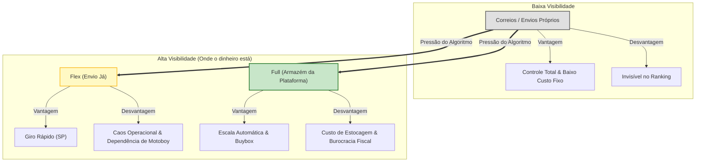
```mermaid
graph TD;
    subgraph "Baixa Visibilidade"
    Correios["Correios / Envios Próprios"]
    Correios -->|Vantagem| Controle["Controle Total & Baixo Custo Fixo"];
    Correios -->|Desvantagem| Invisivel["Invisível no Ranking"];
    end

    subgraph "Alta Visibilidade (Onde o dinheiro está)"
    Flex["Flex (Envio Já)"]
    Full["Full (Armazém da Plataforma)"]
    
    Flex -->|Vantagem| CashFlow["Giro Rápido (SP)"];
    Flex -->|Desvantagem| Stress["Caos Operacional & Dependência de Motoboy"];
    
    Full -->|Vantagem| Scale["Escala Automática & Buybox"];
    Full -->|Desvantagem| Margin["Custo de Estocagem & Burocracia Fiscal"];
    end
    
    Correios ==>|Pressão do Algoritmo| Flex;
    Correios ==>|Pressão do Algoritmo| Full;

    style Full fill:#c8e6c9,stroke:#2e7d32,stroke-width:2px
    style Flex fill:#fff9c4,stroke:#fbc02d,stroke-width:2px
    style Correios fill:#e0e0e0,stroke:#616161,stroke-width:2px

```

*Justificativa do diagrama: A separação visual entre "Baixa Visibilidade" e "Alta Visibilidade" demonstra que a migração não é uma escolha livre, mas uma imposição do algoritmo. O vendedor é empurrado para o quadrante de maior estresse (Flex) ou maior custo (Full) para sobreviver.*

### Implicações
**[Insight Inferido]:** Existe uma lacuna de conhecimento sobre **Gestão de Estoque Híbrido**. Muitos vendedores enviam *todo* o estoque para o Full e sofrem com taxas de longa permanência, ou tentam fazer Flex sem estrutura. O Sebrae deve orientar sobre a "Curva ABC Logística": quais produtos merecem ir para o Full (giro alto), quais ficam no Flex (giro médio/local) e quais ficam na operação própria (cauda longa).

---

# 2.2. Precificação de Sobrevivência: O impacto das taxas, comissões e frete na margem líquida
### Síntese
A precificação é descrita não como uma estratégia de valor, mas como uma **"guerra de centavos"**. Existe uma dissonância cognitiva grave: o vendedor vê o *faturamento* (bruto) entrar, mas não percebe a erosão causada pela soma de **comissões, taxas fixas, coparticipação no frete e impostos**. Muitos operam em uma "zona cega", descobrindo apenas no final do mês — ou quando o caixa seca — que a margem líquida real é ínfima ou negativa, caracterizando o fenômeno de "pagar para trabalhar".

---

### Análise Detalhada
* **A Erosão Silenciosa da Margem:** Os participantes relatam dificuldade em acompanhar a complexidade das taxas. Não é apenas a comissão (12-20%); há a "taxa fixa" por venda (para tickets baixos), o custo do *Ads* (publicidade) e a coparticipação no frete. Essa estrutura dinâmica faz com que o lucro projetado na planilha muitas vezes não se realize na conta bancária.
* **A Concorrência Predatória e o "Preço de Mercado":** O vendedor sente-se impossibilitado de precificar corretamente (Mark-up) porque o "preço de mercado" é ditado por concorrentes que, na visão deles, sonegam impostos, vendem produtos falsificados ou não sabem fazer conta. Para se manterem competitivos e visíveis na *Buybox*, eles sacrificam a margem deliberadamente, entrando em uma espiral deflacionária.
* **O "Sócio Majoritário":** Há um sentimento recorrente de que a plataforma é o verdadeiro dono do negócio, ficando com a maior fatia do valor gerado sem assumir os riscos do estoque. A relação custo-benefício é questionada, especialmente quando taxas aumentam sem aviso prévio, mas o preço final ao consumidor não pode subir devido à concorrência.

> **Voz do Cliente:**
> "Você vende um produto de 50 reais. O marketplace tira 18%, mais 5 reais de taxa fixa, mais metade do frete. Aí você paga o imposto, a embalagem... Sobrou o quê? Cinco reais? Se tiver uma devolução, você perdeu o lucro de dez vendas. A conta não fecha, mas se aumentar o preço, não vende."
> -- *Participante, Grupo 8 (Dores Financeiras)*

### Visualização dos Conceitos
O diagrama abaixo ilustra a **"Anatomia da Venda"** na percepção dos participantes, demonstrando como o valor bruto é fatiado até restar a margem líquida.

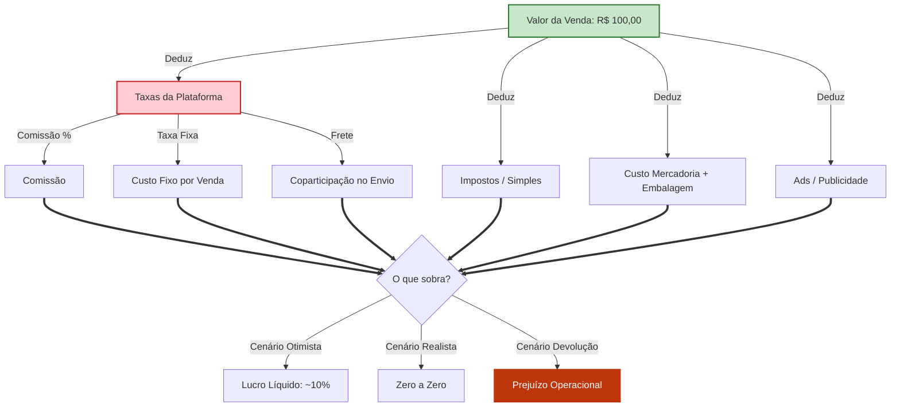
```mermaid
graph TD;
    Venda[Valor da Venda: R$ 100,00] -->|Deduz| Plataforma[Taxas da Plataforma];
    Plataforma -->|Comissão %| P1[Comissão];
    Plataforma -->|Taxa Fixa| P2[Custo Fixo por Venda];
    Plataforma -->|Frete| P3[Coparticipação no Envio];
    
    Venda -->|Deduz| Governo[Impostos / Simples];
    Venda -->|Deduz| Operacao[Custo Mercadoria + Embalagem];
    Venda -->|Deduz| Mkt[Ads / Publicidade];

    P1 & P2 & P3 & Governo & Operacao & Mkt ==> Resultado;
    
    Resultado{O que sobra?};
    Resultado -->|Cenário Otimista| Lucro[Lucro Líquido: ~10%];
    Resultado -->|Cenário Realista| Empate[Zero a Zero];
    Resultado -->|Cenário Devolução| Preju[Prejuízo Operacional];

    style Venda fill:#c8e6c9,stroke:#2e7d32,stroke-width:2px
    style Plataforma fill:#ffcdd2,stroke:#c62828,stroke-width:2px
    style Preju fill:#bf360c,stroke:#bf360c,stroke-width:2px,color:#fff

```

*Justificativa do diagrama: A estrutura de fluxo descendente visualiza a drenagem de recursos. O destaque para o cenário de "Devolução" levando ao "Prejuízo" é crucial, pois é um ponto de dor recorrente onde o custo logístico reverso anula o lucro de múltiplas vendas.*

### Implicações
**[Insight Inferido]:** A maior carência não é de técnicas de vendas, mas de **Engenharia Financeira de Marketplace**. O vendedor precisa de ferramentas (simuladores) que mostrem o "Ponto de Ruptura": até onde ele pode baixar o preço ou investir em Ads antes de entrar no prejuízo. O Sebrae deve promover a mentalidade de "Margem de Contribuição" em vez de "Volume Bruto".

---

# 2.3. Gestão de Reputação: O peso da avaliação do cliente na visibilidade do anúncio
### Síntese
A reputação não é vista apenas como um indicador de qualidade, mas como a **"chave de liga/desliga"** do negócio. Os vendedores vivem sob um regime de **terror psicológico** em relação ao "termômetro" (sistema de cores do Mercado Livre ou estrelas da Shopee/Amazon). A percepção é de extrema fragilidade: anos de construção de marca podem ser destruídos por poucas avaliações negativas, muitas vezes injustas ou baseadas em erros logísticos da própria plataforma, gerando uma postura defensiva de "aceitar qualquer prejuízo" para não manchar a cor da conta.

---

### Análise Detalhada
* **A Ditadura do Termômetro:** O sistema de cores (Verde, Amarelo, Vermelho) é o principal KPI (indicador) monitorado. Cair do "Verde" para o "Amarelo" significa perder imediatamente a exposição nos anúncios (sair da primeira página) e perder o acesso a benefícios como descontos no frete. O vendedor sente que o algoritmo pune desproporcionalmente o erro em comparação ao acerto.
* **A Vulnerabilidade à Avaliação Injusta:** Há uma revolta latente quanto aos critérios de avaliação. Participantes relatam que compradores avaliam negativamente o vendedor por atrasos na entrega (culpa da transportadora/plataforma) ou por insatisfação com a qualidade intrínseca do produto (culpa do fabricante), e a plataforma raramente aceita a contestação para remover essa mancha da reputação.
* **A "Compra" da Paz (Extorsão Velada):** Para proteger a reputação, o vendedor adota uma política de submissão total. Muitos preferem devolver o dinheiro imediatamente ou enviar um novo produto — mesmo sabendo que o cliente está agindo de má fé ou que o defeito é inexistente — do que arriscar uma mediação que possa resultar em uma avaliação negativa. O medo da reclamação é maior que o desejo de justiça ou lucro na transação.

> **Voz do Cliente:**
> "O cliente é Deus e o vendedor é o lixo. Se ele falar que a caixa chegou amassada, mesmo que tenha sido o correio, a culpa é sua. Eu já devolvi dinheiro de produto que o cliente usou e quebrou, só pra ele não abrir reclamação e derrubar meu termômetro. A gente vive refém."
> -- *Participante, Grupo 16 (Vendedor refém da reputação)*

### Visualização dos Conceitos
Este diagrama ilustra a **"Cascata de Impacto da Reputação"**, demonstrando como um evento pontual (reclamação) desencadeia uma reação em cadeia que pode inviabilizar o negócio.

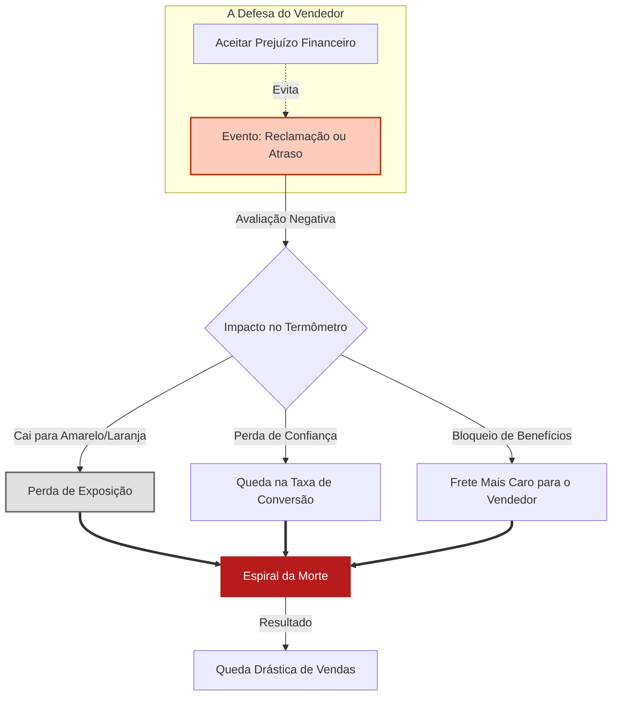
```mermaid
graph TD;
    Event[Evento: Reclamação ou Atraso] -->|Avaliação Negativa| Reputation{Impacto no Termômetro};
    
    Reputation -->|Cai para Amarelo/Laranja| Visibilidade[Perda de Exposição];
    Reputation -->|Perda de Confiança| Conversion[Queda na Taxa de Conversão];
    Reputation -->|Bloqueio de Benefícios| Cost[Frete Mais Caro para o Vendedor];

    Visibilidade & Conversion & Cost ==> Death_Spiral[Espiral da Morte];
    Death_Spiral -->|Resultado| Falencia[Queda Drástica de Vendas];

    subgraph "A Defesa do Vendedor"
    Defesa[Aceitar Prejuízo Financeiro] -.->|Evita| Event;
    end

    style Event fill:#ffccbc,stroke:#bf360c,stroke-width:2px
    style Visibilidade fill:#e0e0e0,stroke:#616161,stroke-width:2px
    style Death_Spiral fill:#b71c1c,stroke:#b71c1c,stroke-width:2px,color:#fff

```

*Justificativa do diagrama: O fluxo vertical mostra a severidade da punição algorítmica. O elemento "A Defesa do Vendedor" (tracejado) mostra que a única forma de interromper esse ciclo destrutivo é absorver o prejuízo financeiro antes que ele vire um dado de reputação.*

### Implicações
**[Insight Inferido]:** A gestão de reputação é o **calcanhar de Aquiles emocional** do empreendedor. O Sebrae-SP pode atuar em duas frentes: 
1) **Capacitação Técnica:** Ensinar como contestar avaliações de forma profissional (uso de provas, vídeos de embalagem) e como gerenciar o SAC para reverter insatisfação em 5 estrelas; 
2) **Atuação Institucional:** Levar às plataformas a demanda por critérios mais claros de separação entre "erro logístico da plataforma" e "erro operacional do vendedor", protegendo o microempresário de punições indevidas.

---

# 3.0. O "Lado Sombra": Dores e Barreiras Críticas
### Síntese
Este bloco revela a face mais cruel da atuação em marketplaces: a **vulnerabilidade sistêmica**. Os vendedores descrevem uma existência marcada por **ansiedade constante** e **insegurança jurídica**, onde a sensação de "construir um castelo em terreno alugado" é onipresente. O sucesso de vendas convive com o medo paralisante de bloqueios arbitrários, suporte ineficiente e prejuízos absorvidos compulsoriamente em nome da "experiência do cliente".

---

### Análise Detalhada
* **O "Fantasma" do Bloqueio (Insegurança Jurídica):** A maior dor relatada é o medo de acordar e encontrar a conta suspensa ou banida sem explicação clara ("violação de políticas"). Para quem tem o marketplace como fonte principal de renda, isso equivale a uma "demissão sumária" sem direito a defesa, gerando instabilidade financeira e emocional profunda.
* **A Muralha do Suporte Robotizado:** Quando o problema acontece (seja bloqueio ou erro logístico), o vendedor encontra um "muro de respostas automáticas". A falta de atendimento humano e a incapacidade dos atendentes de nível 1 em resolver problemas complexos geram um sentimento de **impotência e abandono**. O vendedor sente-se um "número" descartável para a plataforma.
* **O Peso das Devoluções e Fraudes:** A política de "Devolução Grátis" e "Compra Garantida" é percebida como um incentivo à má-fé de alguns compradores (troca de produto velho por novo, "golpe da pedra"). O vendedor arca com o frete de ida, de volta e muitas vezes com a perda do produto, sentindo que a plataforma é "sócia no lucro, mas isenta no prejuízo".

> **Voz do Cliente:**
> "Você trabalha direito, paga imposto, envia no prazo. Aí um robô analisa sua conta errada e te bloqueia. Você tenta falar no chat e o robô responde texto pronto. É desesperador. A gente se sente um lixo, descartável. Se eu depender só disso, eu enfarto."
> -- *Participante, Grupo 3 (Medo de Bloqueio)*

###Visualização dos ConceitosO mapa mental abaixo estrutura as quatro dimensões principais que compõem o "Lado Sombra", ilustrando a pressão psicológica e financeira sobre o vendedor.

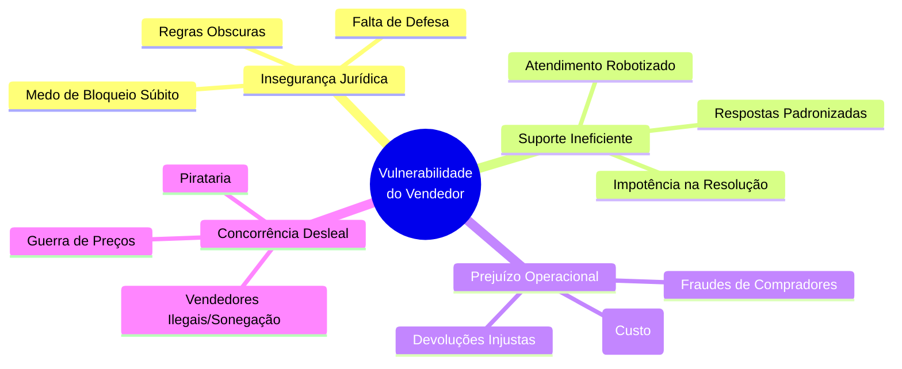
```mermaid
mindmap
  root((Vulnerabilidade
  do Vendedor))
    Insegurança Jurídica
      ::icon(fa fa-gavel)
      Medo de Bloqueio Súbito
      Regras Obscuras
      Falta de Defesa
    Suporte Ineficiente
      ::icon(fa fa-robot)
      Atendimento Robotizado
      Respostas Padronizadas
      Impotência na Resolução
    Prejuízo Operacional
      ::icon(fa fa-money-bill-wave)
      Devoluções Injustas
      Logística Reversa (Custo)
      Fraudes de Compradores
    Concorrência Desleal
      ::icon(fa fa-balance-scale)
      Guerra de Preços
      Vendedores Ilegais/Sonegação
      Pirataria

```

*Justificativa do diagrama: O mapa mental radial permite visualizar que a "Vulnerabilidade" não é causada por um único fator, mas pelo cerco simultâneo de problemas jurídicos, operacionais e de suporte, criando um ambiente de alta pressão.*

### Implicações
**[Insight Inferido]:** Há uma demanda urgente por **Defesa Institucional**. O vendedor individual não tem força para negociar com gigantes como Mercado Livre ou Amazon. O Sebrae-SP é visto como a única entidade capaz de intermediar um diálogo mais equilibrado, pleiteando canais de atendimento exclusivos para empresas formalizadas (ME/EPP) e maior transparência nos processos de bloqueio. Além disso, é crucial oferecer **Apoio Psicológico/Mentoria de Crise** para lidar com a ansiedade do ambiente digital.

---

# 3.1. Insegurança Jurídica e Bloqueios: O medo constante de perder a conta sem aviso prévio
### Síntese
A relação jurídica entre vendedor e plataforma é descrita como **assimétrica e ditatorial**. Os participantes vivem sob a "Síndrome da Espada de Dâmocles": a sensação permanente de que o negócio pode ser aniquilado a qualquer momento por uma decisão algorítmica opaca. A falta de **processo legal devido** (aviso prévio, contraditório e ampla defesa) antes de uma suspensão transforma o empreendedorismo digital em uma atividade de alto risco emocional e financeiro.

---

### Análise Detalhada
* **O "Tribunal do Robô":** As suspensões e bloqueios são, na vasta maioria dos casos, automáticos, gatilhados por bots que identificam supostas infrações (ex: "comportamento incomum", "venda de produto proibido" erroneamente flagrado). O vendedor é punido primeiro e tem o direito (difícil) de se explicar depois. Não há presunção de inocência.
* **Congelamento de Ativos (O "Lockdown" Financeiro):** A dor transcende a perda de vendas; ela atinge o caixa. Quando uma conta é bloqueada, o saldo disponível no sistema financeiro da plataforma (ex: Mercado Pago) é retido por 30, 60 ou até 90 dias. Para empresas com capital de giro curto, isso significa insolvência imediata, incapacidade de pagar fornecedores e funcionários.
* **Regras Obscuras e Mudantes:** Os Termos de Uso são percebidos como vagos e alterados unilateralmente. O que era permitido ontem torna-se motivo de banimento hoje. O vendedor sente que pisa em ovos, evitando inovações ou expansões agressivas por medo de "alertar o algoritmo".

> **Voz do Cliente:**
> "Você acorda de manhã, vai olhar o aplicativo e tá lá: 'Sua conta foi suspensa permanentemente'. O motivo? 'Violação de termos'. Que termo? Ninguém fala. O dinheiro preso, o estoque parado no Full... É como se o dono do imóvel trocasse a fechadura com tudo seu lá dentro e não te atendesse mais."
> -- *Participante, Grupo 11 (Bloqueio Cautelar)*

### Visualização dos Conceitos
O diagrama abaixo ilustra o **"Ciclo de Vulnerabilidade Jurídica"**, demonstrando a fragilidade do fluxo de negócios diante da automação punitiva.

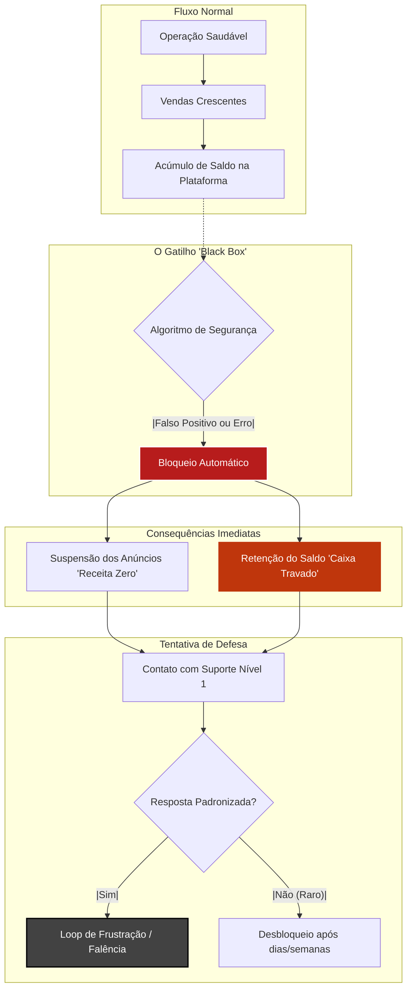
```mermaid
graph TD;
    subgraph Fluxo Normal
    A[Operação Saudável] --> B[Vendas Crescentes];
    B --> C[Acúmulo de Saldo na Plataforma];
    end

    subgraph O Gatilho 'Black Box'
    D{Algoritmo de Segurança} --|Falso Positivo ou Erro|--> E[Bloqueio Automático];
    end
    
    subgraph Consequências Imediatas
    E --> F[Suspensão dos Anúncios 'Receita Zero'];
    E --> G[Retenção do Saldo 'Caixa Travado'];
    end
    
    subgraph Tentativa de Defesa
    F & G --> H[Contato com Suporte Nível 1];
    H --> I{Resposta Padronizada?};
    I --|Sim|--> J[Loop de Frustração / Falência];
    I --|Não (Raro)|--> K[Desbloqueio após dias/semanas];
    end

    C -.-> D;
    
    style E fill:#b71c1c,stroke:#fff,stroke-width:2px,color:#fff
    style G fill:#bf360c,stroke:#bf360c,stroke-width:2px,color:#fff
    style J fill:#424242,stroke:#000,stroke-width:2px,color:#fff

```

*Justificativa do diagrama: O fluxo destaca o "Loop de Frustração" onde o vendedor fica preso em respostas automáticas enquanto seu dinheiro permanece retido, evidenciando que o bloqueio não é apenas uma pausa, mas uma ameaça existencial.*

### Implicações
**[Insight Inferido]:** Esta é a área onde a atuação do Sebrae é mais clamada. Há uma oportunidade para criar uma **Câmara de Mediação Digital** ou um "Selo de Vendedor Verificado Sebrae" que garanta um canal de atendimento humano diferenciado em casos de bloqueio. Além disso, reforça a necessidade de capacitação jurídica preventiva (análise de contratos de adesão) e gestão de risco (nunca deixar todo o caixa na conta da plataforma).

---

# 3.2. Suporte Robotizado vs. Humano: A frustração com respostas automáticas
### Síntese
A interação com o suporte das plataformas é descrita como uma experiência **kafkiana** e desumanizante. O vendedor, ao buscar ajuda para problemas complexos (fiscais, logísticos), colide com uma barreira de **automação ineficiente** (chatbots) ou atendentes humanos de Nível 1 limitados a scripts rígidos ("copia e cola"). Isso gera um sentimento de **impotência** e desvalorização profissional, onde o parceiro de negócios (vendedor) sente que não tem voz ativa para resolver questões vitais para sua operação.

---

### Análise Detalhada
* **O "Muro" do Chatbot:** O primeiro nível de contato é desenhado para desencorajar a abertura de chamados. Os participantes relatam gastar tempo precioso tentando "driblar o robô" para conseguir falar com um humano, muitas vezes sem sucesso. A automação falha em entender nuances, oferecendo soluções genéricas para problemas específicos.
* **A Falácia do Atendimento Humano (Scriptizado):** Mesmo quando o contato humano é estabelecido, a qualidade é criticada. Os atendentes são percebidos como mal treinados ou reféns de manuais, repetindo as mesmas frases dos Termos de Uso sem investigar a causa raiz do problema. A sensação é de que "ninguém lê o que escrevemos".
* **Assimetria de Tratamento (Vendedor x Comprador):** Há um ressentimento claro quanto à velocidade de atendimento. Enquanto o comprador (consumidor final) tem seus problemas resolvidos instantaneamente (reembolso, troca), o vendedor enfrenta filas de espera de dias ou semanas, reforçando a percepção de ser o "lado fraco" da relação.

> **Voz do Cliente:**
> "Você manda o print, manda a nota fiscal, prova que o erro foi deles. E o que você recebe? Uma mensagem automática dizendo 'sinto muito pelo transtorno, estamos trabalhando para melhorar'. Não resolve meu dinheiro preso, não tira a negativação da minha conta. É falar com a parede."
> -- *Participante, Grupo 5 (Problemas de Suporte)*

### Visualização dos Conceitos
O fluxograma abaixo representa o **"Labirinto do Suporte"**, ilustrando a dificuldade de escalonar um problema até uma resolução efetiva.

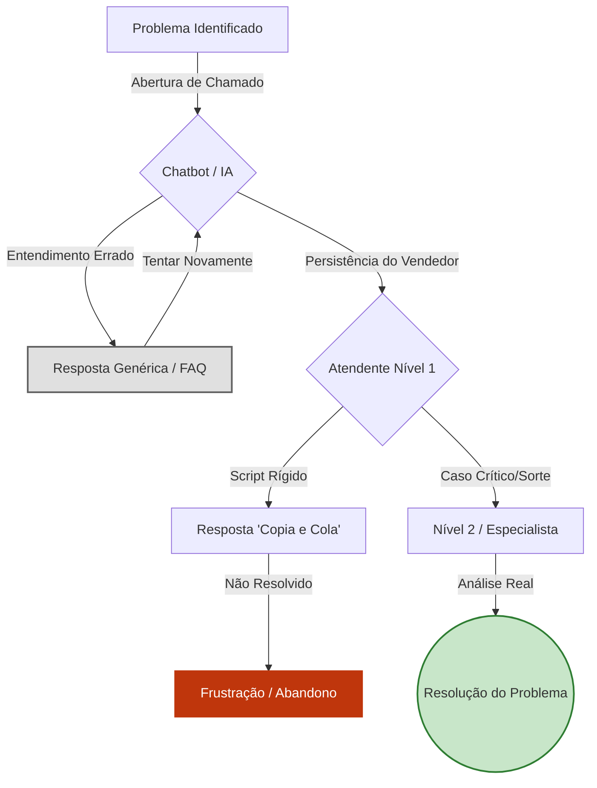
```mermaid
graph TD;
    Start[Problema Identificado] -->|Abertura de Chamado| Bot{Chatbot / IA};
    
    Bot -->|Entendimento Errado| Loop[Resposta Genérica / FAQ];
    Loop -->|Tentar Novamente| Bot;
    
    Bot -->|Persistência do Vendedor| Humano{Atendente Nível 1};
    
    Humano -->|Script Rígido| Script["Resposta 'Copia e Cola'"];
    Script -->|Não Resolvido| Frustracao[Frustração / Abandono];
    
    Humano -->|Caso Crítico/Sorte| Escalacao[Nível 2 / Especialista];
    Escalacao -->|Análise Real| Solucao((Resolução do Problema));

    style Solucao fill:#c8e6c9,stroke:#2e7d32,stroke-width:2px
    style Frustracao fill:#bf360c,stroke:#bf360c,stroke-width:2px,color:#fff
    style Loop fill:#e0e0e0,stroke:#616161,stroke-width:2px

```

*Justificativa do diagrama: O fluxo demonstra que a "Resolução" é um caminho de exceção (Sorte/Escalação), enquanto o caminho padrão leva ao loop de respostas automáticas ou frustração, evidenciando a ineficiência do sistema atual.*

### Implicações
**[Insight Inferido]:** A ineficiência do suporte não é apenas um incômodo, é um **custo oculto** (Custo de Transação). O tempo que o empreendedor gasta gerenciando tickets de suporte é tempo subtraído da estratégia de vendas. O Sebrae pode advogar pela criação de canais de **"Ouvidoria Qualificada"** nas plataformas para vendedores com bom histórico (Selo de Excelência), garantindo que problemas operacionais não paralisem empresas saudáveis.

---

# 3.3. Logística Reversa e Fraudes: O prejuízo financeiro e emocional com devoluções indevidas ("Golpe da Pedra")
### Síntese
A política de "Compra Garantida" e devolução facilitada, embora essencial para o consumidor, criou um **flanco aberto para a má-fé**. Os vendedores descrevem um cenário de vulnerabilidade extrema onde são vítimas frequentes de fraudes explícitas (receber pedras/lixo no lugar do produto) ou do "aluguel gratuito" (uso do produto para um evento e devolução posterior). O sentimento predominante é de **injustiça institucionalizada**, pois a plataforma reembolsa o comprador automaticamente, deixando o ônus da prova de fraude inteiramente nas costas do vendedor.

---

### Análise Detalhada
* **A "Indústria da Devolução" (O Aluguel Não Oficial):** Uma prática recorrente relatada é a compra de itens sazonais ou de ocasião (roupas de festa, ferramentas, equipamentos de viagem) que são utilizados intensamente e devolvidos dentro do prazo de 7 dias ou 30 dias sob a alegação de "arrependimento". O vendedor recebe o produto usado, sujo ou avariado, impossibilitado de revenda como novo, amargando prejuízo total.
* **O "Golpe da Pedra/Troca":** O medo mais agudo é o da fraude criminosa. O comprador inicia a devolução, a plataforma libera o reembolso assim que o código de rastreio é ativado, mas a caixa que retorna contém um tijolo, uma garrafa de água ou a peça antiga/quebrada do cliente. O sistema de mediação da plataforma muitas vezes encerra o caso a favor do comprador antes mesmo de o vendedor conseguir reportar o problema.
* **A Via Crucis Probatória:** Para se defender, o vendedor precisa adotar protocolos de "CSI": filmar o empacotamento de todos os pedidos e, principalmente, filmar a abertura de todas as devoluções (*unboxing* reverso). Mesmo com provas de vídeo, o suporte frequentemente nega o ressarcimento alegando "insuficiência de provas" ou falhas no processo, gerando uma sensação de desamparo total.

> **Voz do Cliente:**
> "Eu já recebi um tijolo. Literalmente um tijolo. O cliente alegou arrependimento, o Mercado Livre devolveu o dinheiro dele na hora que ele postou nos Correios. Quando chegou pra mim e eu abri a caixa, era tarde demais. O dinheiro já tinha ido e eu fiquei com o prejuízo e a cara de palhaço."
> -- *Participante, Grupo 5 (Vítima de Fraude)*

### Visualização dos Conceitos
O diagrama abaixo ilustra o **"Fluxo da Fraude e a Barreira do Reembolso"**, destacando onde o sistema falha em proteger o vendedor.

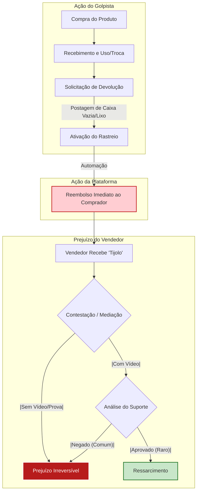
```mermaid
graph TD;
    subgraph Ação do Golpista
    A[Compra do Produto] --> B[Recebimento e Uso/Troca];
    B --> C[Solicitação de Devolução];
    C -->|Postagem de Caixa Vazia/Lixo| D[Ativação do Rastreio];
    end

    subgraph Ação da Plataforma
    D -->|Automação| E[Reembolso Imediato ao Comprador];
    end

    subgraph Prejuízo do Vendedor
    E --> F[Vendedor Recebe 'Tijolo'];
    F --> G{Contestação / Mediação};
    
    G --|Sem Vídeo/Prova|--> H[Prejuízo Irreversível];
    G --|Com Vídeo| --> I{Análise do Suporte};
    I --|Negado (Comum)| --> H;
    I --|Aprovado (Raro)| --> J[Ressarcimento];
    end

    style E fill:#ffcdd2,stroke:#c62828,stroke-width:2px
    style H fill:#b71c1c,stroke:#fff,stroke-width:2px,color:#fff
    style J fill:#c8e6c9,stroke:#2e7d32,stroke-width:2px

```

*Justificativa do diagrama: O fluxo sequencial evidencia o "gap temporal": o dinheiro sai da mão do vendedor (Reembolso Imediato) **antes** da verificação física da devolução, consolidando o golpe antes que qualquer defesa possa ser feita.*

### Implicações
**[Insight Inferido]:** A fraude na logística reversa não é apenas um custo variável, é um desestímulo à venda de produtos de alto valor (eletrônicos, joias). O Sebrae deve pressionar por **mecanismos de proteção mais robustos**, como a retenção do reembolso até a conferência do vendedor (Escrow) ou seguros antifraude subsidiados. Além disso, orientar juridicamente sobre como transformar essas fraudes em Boletins de Ocorrência eletrônicos e processos de pequenas causas.

---

# 3.4. Concorrência Predatória: A percepção sobre vendedores internacionais e guerra de preços
### Síntese
A arena competitiva é descrita pelos participantes como um **"terreno sem lei"** e profundamente desigual. A percepção de injustiça se divide em duas frentes: a **assimetria fiscal** em relação aos vendedores internacionais (*cross-border*, especialmente asiáticos) e a **auto-canibalização** interna, provocada por vendedores amadores ou desesperados que destroem as margens de lucro da categoria em uma corrida suicida pelo menor preço.

---

### Análise Detalhada
* **O "Dragão" do Cross-Border:** Existe uma revolta latente quanto à competitividade dos produtos importados (Shopee/AliExpress/Shein). O vendedor local sente-se penalizado por uma carga tributária pesada e custos logísticos domésticos altos, enquanto percebe que o competidor internacional opera com subsídios de frete e isenções fiscais, tornando impossível competir no preço final do produto de entrada.
* **A Guerra dos Centavos (Race to the Bottom):** O algoritmo da *Buybox* (caixa de compra em destaque) é apontado como o culpado por incitar uma guerra de preços nociva. Para ganhar a posição de destaque, vendedores baixam seus preços em centavos, muitas vezes ignorando seus custos reais. Isso cria um "efeito manada" onde o preço de mercado de um item desaba até se tornar inviável para quem trabalha com margem saudável e produto original.

> **Voz do Cliente:**
> "Como eu vou competir com o cara da China que vende o fone de ouvido a 15 reais com frete grátis? Só o meu frete dentro de São Paulo é 18 reais. E ainda tem o vendedor aqui do lado que não emite nota e vende a preço de custo só pra girar a conta. A gente tá sendo espremido."
> -- *Participante, Grupo 11 (Desigualdade Competitiva)*

### Visualização dos Conceitos
O diagrama de balança abaixo ilustra o **"Desequilíbrio Competitivo"** percebido pelos vendedores locais.

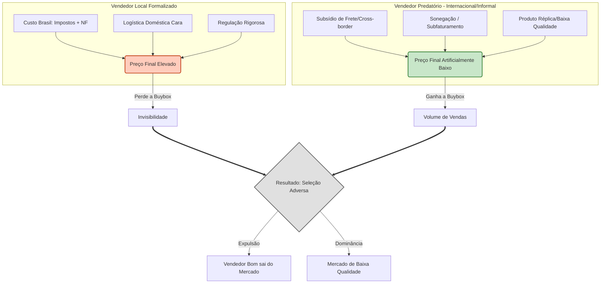
```mermaid
graph TD;
    subgraph Vendedor Local Formalizado
    A[Custo Brasil: Impostos + NF];
    B[Logística Doméstica Cara];
    C[Regulação Rigorosa];
    A & B & C --> D(Preço Final Elevado);
    end

    subgraph Vendedor Predatório - Internacional/Informal
    E[Subsídio de Frete/Cross-border];
    F[Sonegação / Subfaturamento];
    G[Produto Réplica/Baixa Qualidade];
    E & F & G --> H(Preço Final Artificialmente Baixo);
    end

    D -->|Perde a Buybox| I[Invisibilidade];
    H -->|Ganha a Buybox| J[Volume de Vendas];

    I & J ==> K{Resultado: Seleção Adversa};
    K -->|Expulsão| L[Vendedor Bom sai do Mercado];
    K -->|Dominância| M[Mercado de Baixa Qualidade];

    style D fill:#ffccbc,stroke:#bf360c,stroke-width:2px
    style H fill:#c8e6c9,stroke:#2e7d32,stroke-width:2px
    style K fill:#e0e0e0,stroke:#616161,stroke-width:2px

```

*Justificativa do diagrama: A comparação visual destaca que o "Sucesso" (Ganhar a Buybox) está atrelado a práticas que o vendedor formalizado não consegue ou não pode replicar (subsídios ou informalidade), gerando uma seleção adversa onde "quem faz o certo, perde".*

### Implicações
**[Insight Inferido]:** A guerra de preços é um jogo que o pequeno empresário formalizado não pode vencer. A implicação estratégica é a necessidade urgente de **Diferenciação via Branding e Curadoria**. O Sebrae deve orientar o vendedor a sair da venda de *commodities* (onde o preço reina) e focar em nichos, kits exclusivos ou produtos com valor agregado (serviço/garantia), onde a comparação com o produto importado genérico seja menos direta.

---

# 4.0. Raio-X das Plataformas (Análise Comparativa)
### Síntese
O ecossistema de marketplaces não é monolítico; cada plataforma possui uma **"personalidade"** distinta e cumpre uma função estratégica diferente no portfólio do vendedor. Identificamos uma clara segmentação na percepção: o **Mercado Livre** é a "Locomotiva" indispensável (volume e estresse), a **Shopee** é a "Feira Popular" (giro rápido e ticket baixo), a **Amazon** é o "Shopping de Elite" (confiança e burocracia) e as demais (Magalu, Americanas, TikTok) atuam como canais de aposta ou redundância.

---

### Análise Detalhada
* **Mercado Livre (O Hegemônico "Carrasco"):** É unanimidade: "não dá para viver sem". Representa de 70% a 90% do faturamento da maioria. É admirado pela logística (Full) imbatível e fluxo de clientes, mas temido pelo rigor das regras e punições. É visto como um sócio exigente e frio.
* **Shopee (A "Varzea" Viciante):** Associada à diversão, gamificação e público jovem/popular. É a porta de entrada para iniciantes devido à facilidade de cadastro, mas criticada pela logística instável e margens espremidas por cupons. O vendedor aceita a "bagunça" pelo volume massivo de vendas de itens baratos.
* **Amazon (A Fortaleza Burocrática):** Percebida como a plataforma do futuro, focada no longo prazo. O cadastro é um pesadelo (exigência de GTIN/EAN, bloqueios de contas novas), mas o cliente é qualificado, paga mais caro e reclama menos. É o refúgio para quem busca fugir da guerra de preços do ML/Shopee.

> **Voz do Cliente:**
> "Se fossem lugares físicos? O Mercado Livre é a Avenida Paulista na hora do rush: muita gente, muito dinheiro, mas você é atropelado se piscar. A Shopee é a 25 de Março: gritaria, bagunça, vende de tudo barato. A Amazon é um Shopping de luxo fechado: difícil de entrar, ar condicionado, cliente chique, mas vazio de vez em quando."
> -- *Participante, Grupo 16 (Metáfora dos Canais)*

### Visualização dos Conceitos
O mapa abaixo posiciona as plataformas em dois eixos críticos: **Maturidade Operacional** (Organização/Logística) vs. **Barreira de Entrada/Permanência** (Dificuldade/Rigor).

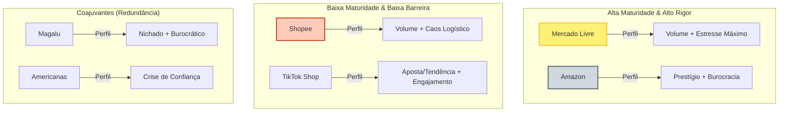
```mermaid
graph TD;
    subgraph "Alta Maturidade & Alto Rigor"
    ML[Mercado Livre]
    AMZ[Amazon]
    ML -->|Perfil| P1[Volume + Estresse Máximo];
    AMZ -->|Perfil| P2[Prestígio + Burocracia];
    end

    subgraph "Baixa Maturidade & Baixa Barreira"
    SHP[Shopee]
    TIK[TikTok Shop]
    SHP -->|Perfil| P3[Volume + Caos Logístico];
    TIK -->|Perfil| P4[Aposta/Tendência + Engajamento];
    end

    subgraph "Coajuvantes (Redundância)"
    MGL[Magalu]
    AME[Americanas]
    MGL -->|Perfil| P5[Nichado + Burocrático];
    AME -->|Perfil| P6[Crise de Confiança];
    end

    style ML fill:#fff176,stroke:#fbc02d,stroke-width:2px
    style AMZ fill:#cfd8dc,stroke:#455a64,stroke-width:2px
    style SHP fill:#ffccbc,stroke:#bf360c,stroke-width:2px

```

*Justificativa do diagrama: O agrupamento visual permite identificar rapidamente onde o vendedor deve alocar seus recursos. O ML e Amazon exigem profissionalismo (processos), enquanto Shopee e TikTok exigem agilidade e preço (oportunidade).*

### Implicações
**[Insight Inferido]:** Não existe estratégia única de "Ctrl+C / Ctrl+V" para todos os canais. O Sebrae deve ensinar **Gestão de Portfólio**: usar a Shopee para girar estoque parado e gerar caixa rápido (mesmo com margem baixa), usar o Mercado Livre para escala e volume principal, e usar a Amazon para construção de margem e produtos premium. Tratar todas as plataformas igual é a receita para falhar na precificação.

---

# 4.1. Personificação das Marcas: Se as plataformas fossem pessoas, quem seriam? (Arquétipos)
### Síntese
Quando convidados a projetar personalidades nas plataformas, os vendedores revelam a natureza emocional de suas relações comerciais. O **Mercado Livre** é visto como o "Pai Severo" ou o "Chefe Exigente" (autoritário, mas provedor); a **Shopee** é a "Jovem Descolada" ou a "Feira Popular" (acessível, bagunçada e vibrante); e a **Amazon** é o "Executivo Gringo" ou "Shopping de Elite" (distante, burocrático, mas confiável e justo).

---

### Análise Detalhada
* **Mercado Livre (O Governante/O General):** É descrito como uma figura masculina, de terno, rígida e implacável. Ele "põe a comida na mesa", garantindo o sustento (alto volume), mas exige obediência cega às regras. Não tolera erros e pune com severidade (bloqueios). A relação é de **amor e ódio** ("Síndrome de Estocolmo"), onde o vendedor se sente dependente de sua força, mas oprimido por seu controle.
* **Shopee (O Bobo da Corte/O Explorador):** Vista como uma figura jovem, feminina ou um "camelô" carismático. É associada à facilidade, música, barulho e caos. É a plataforma que "abraça todo mundo" (baixa barreira de entrada), permitindo que o iniciante venda sem grandes formalidades. Porém, é vista como imatura logisticamente e instável.
* **Amazon (O Sábio/O Burocrata):** Personificada como um estrangeiro sério e metódico. É "chata" para entrar (exige documentos, notas, GTIN), mas uma vez dentro, trata o vendedor com profissionalismo e paga corretamente. Não tem o calor nem a agilidade do Mercado Livre, mas oferece estabilidade e um público mais educado.

> **Voz do Cliente:**
> "Se fossem lugares? O Mercado Livre é a Avenida Paulista no horário de pico: dinheiro rolando, gente correndo, estresse puro. A Shopee é a 25 de Março: gritaria, muamba, gente se esbarrando, mas você vende até pedra. A Amazon é aquele Shopping Iguatemi: ar condicionado, vazio, entra gente chique, compra e não te enche o saco."
> -- *Participante, Grupo 16 (Metáforas Espaciais)*

### Visualização dos Conceitos
O diagrama abaixo mapeia os **Arquétipos Emocionais**, conectando a "Personalidade Percebida" ao "Sentimento do Vendedor".

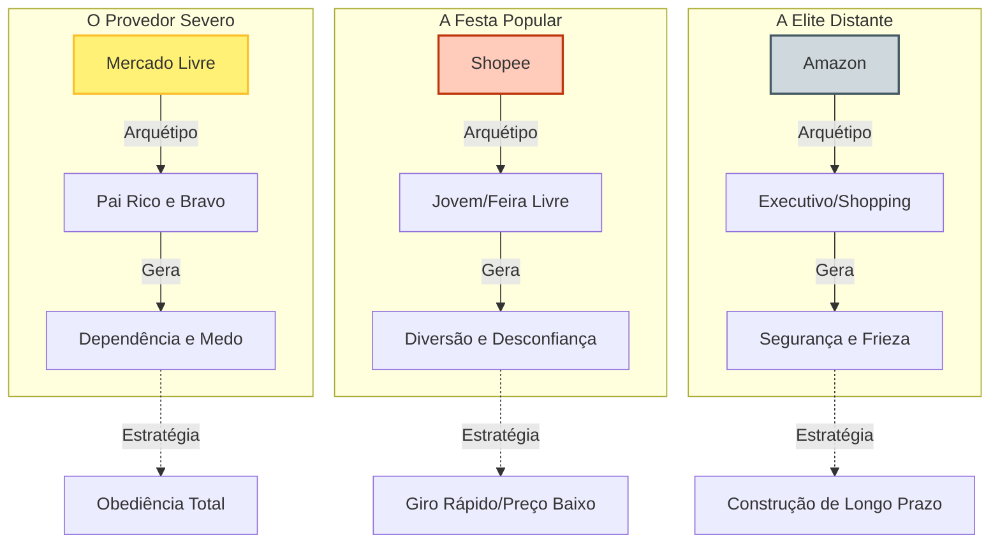
```mermaid
graph TD;
    subgraph "O Provedor Severo"
    ML[Mercado Livre] -->|Arquétipo| Pai[Pai Rico e Bravo];
    Pai -->|Gera| Sentimento1[Dependência e Medo];
    end

    subgraph "A Festa Popular"
    Shopee[Shopee] -->|Arquétipo| Jovem[Jovem/Feira Livre];
    Jovem -->|Gera| Sentimento2[Diversão e Desconfiança];
    end

    subgraph "A Elite Distante"
    Amazon[Amazon] -->|Arquétipo| Executivo[Executivo/Shopping];
    Executivo -->|Gera| Sentimento3[Segurança e Frieza];
    end

    Sentimento1 -.->|Estratégia| Acao1[Obediência Total];
    Sentimento2 -.->|Estratégia| Acao2[Giro Rápido/Preço Baixo];
    Sentimento3 -.->|Estratégia| Acao3[Construção de Longo Prazo];

    style ML fill:#fff176,stroke:#fbc02d,stroke-width:2px
    style Shopee fill:#ffccbc,stroke:#bf360c,stroke-width:2px
    style Amazon fill:#cfd8dc,stroke:#455a64,stroke-width:2px

```

*Justificativa do diagrama: A estrutura visual reforça que a "personalidade" da plataforma dita a estratégia do vendedor. No ML a estratégia é "Obediência" para evitar punição; na Shopee é "Giro" para aproveitar o fluxo; na Amazon é "Paciência" para colher frutos a longo prazo.*

### Implicações
**[Insight Inferido]:** A comunicação do Sebrae e das próprias marcas deve respeitar esses arquétipos. O vendedor espera **agilidade e resolução** do Mercado Livre (não "tapinha nas costas"). Da Amazon, espera **clareza técnica**. Da Shopee, espera **organização**. Para o Sebrae, o insight é preparar o emocional do empreendedor: como lidar com a "tensão" do ML sem adoecer e como profissionalizar a "bagunça" da Shopee sem perder a agilidade.

---

# 4.2. Matriz de Forças e Fraquezas por Player
### Síntese
A análise comparativa revela que não existe uma "plataforma perfeita". O vendedor opera em um sistema de compensações (*trade-offs*): o **Mercado Livre** oferece volume imbatível ao custo de alta pressão punitiva; a **Shopee** oferece barreira de entrada quase nula, mas degrada a margem e a operação logística; a **Amazon** promete prestígio e público qualificado, mas impõe barreiras burocráticas severas na entrada. Os demais players (**Magalu, Americanas**) são vistos como canais secundários de redundância, enquanto o **TikTok** desponta como uma aposta de futuro baseada em conteúdo, não apenas em catálogo.

---

### Análise Detalhada
* **Mercado Livre (A "Locomotiva" Impiedosa):**
  * **Forças:** Tráfego orgânico massivo (onde o cliente brasileiro busca primeiro), logística *Full* extremamente eficiente que converte vendas, e ecossistema financeiro integrado (Mercado Pago).
  * **Fraquezas:** Atendimento ao vendedor inexistente (robôs), bloqueios arbitrários de conta e dinheiro, taxas altas que comem a margem se não houver gestão fina.

* **Shopee (A "Feira" de Giro Rápido):**
  * **Forças:** Facilidade extrema de cadastro (CPF aceito facilmente), ferramentas de marketing gamificadas (cupons, moedas), forte apelo popular para itens de ticket baixo.
  * **Fraquezas:** Logística instável (atrasos na coleta), guerra de preços predatória (taxas + frete corroem o lucro de itens baratos), percepção de qualidade inferior pelo consumidor.

* **Amazon (O "Shopping" Burocrático):**
  * **Forças:** Cliente mais fiel e disposto a pagar mais (ticket médio alto), regras claras e estáveis (menos bloqueios surpresa), pagamento pontual e correto.
  * **Fraquezas:** Interface do vendedor (Seller Central) considerada confusa e antiquada, exigência rigorosa de documentação (GTIN/EAN) que barra produtos artesanais ou importados sem marca.

> **Voz do Cliente:**
> "No Mercado Livre eu vendo 100 peças pra ganhar 5 reais em cada uma e morro de medo de ser bloqueado. Na Amazon eu vendo 10 peças, ganho 50 reais em cada uma e durmo tranquilo. A Shopee é pra girar aquele estoque que tá parado, mesmo que empate o dinheiro."
> -- *Participante, Grupo 13 (Comparativo de Margem)*

### Visualização dos Conceitos
Este diagrama categoriza os players em quatro quadrantes estratégicos baseados na percepção dos vendedores: **Volume de Vendas** (Eixo Y) vs. **Qualidade da Gestão/Margem** (Eixo X).

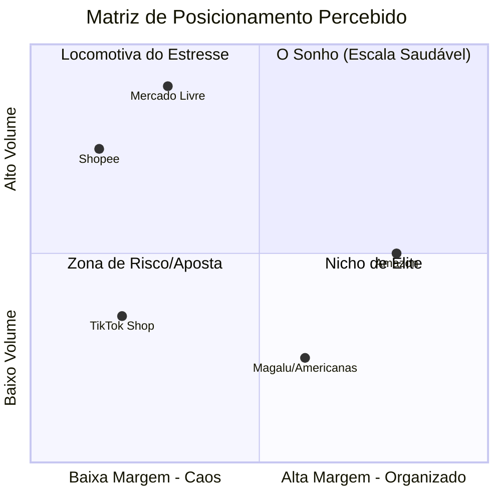
```mermaid
quadrantChart
    title Matriz de Posicionamento Percebido
    x-axis Baixa Margem - Caos --> Alta Margem - Organizado 
    y-axis Baixo Volume --> Alto Volume
    quadrant-1 "O Sonho (Escala Saudável)"
    quadrant-2 "Locomotiva do Estresse"
    quadrant-3 "Zona de Risco/Aposta"
    quadrant-4 "Nicho de Elite"
    
    "Mercado Livre": [0.3, 0.9]
    "Shopee": [0.15, 0.75]
    "Amazon": [0.8, 0.5]
    "Magalu/Americanas": [0.6, 0.25]
    "TikTok Shop": [0.2, 0.35]

```

*Justificativa do diagrama: O gráfico de quadrantes posiciona o **Mercado Livre** no topo esquerdo (Alto Volume, mas gestão estressante/margem pressionada), a **Amazon** à direita (Organizada, mas volume menor que o ML), e a **Shopee** próxima ao caos de baixa margem. Isso ajuda a visualizar que nenhum player ocupa o quadrante "ideal" (Canto Superior Direito) plenamente, exigindo multicanalidade.*

### Implicações
**[Insight Inferido]:** A estratégia de "tamanho único" falha. O Sebrae deve orientar o vendedor a usar cada canal para um fim específico: **Shopee para fluxo de caixa** (girar estoque), **Mercado Livre para escala** (construir relevância) e **Amazon para construção de marca/margem**. A capacitação deve ser modular: "Como fazer SEO na Amazon" é radicalmente diferente de "Como participar de Campanhas na Shopee".

---

# 5.0. Horizontes e Apoio Institucional
### Síntese
A visão de futuro dos participantes aponta para o **fim da era do amadorismo** no e-commerce. O horizonte é percebido como um ambiente de **alta barreira técnica e financeira**, onde apenas quem dominar tráfego pago (Ads), automação (IA) e gestão tributária sobreviverá. Nesse contexto, a expectativa em relação ao Sebrae sofre uma mutação radical: deixa de ser apenas a "escola de empreendedorismo" para ser cobrado como **"Escudo Institucional"**, uma entidade política capaz de defender os pequenos vendedores contra a hegemonia das plataformas.

---

### Análise Detalhada
* **O "Pay to Play" (O Fim do Orgânico):** Há um consenso de que vender sem investir em publicidade (*Ads*) tornou-se impossível. O futuro é visto como um jogo de quem tem mais caixa para comprar visibilidade. O vendedor sente-se pressionado a se tornar um gestor de tráfego, uma competência que a maioria não possui, gerando ansiedade sobre a sustentabilidade do negócio a longo prazo.
* **A Resistência à "Espetacularização" (Live Commerce):** Embora reconheçam o crescimento do *TikTok Shop* e das *Lives*, muitos vendedores (especialmente os mais velhos ou técnicos) demonstram resistência em "ter que virar blogueiro". A exigência de aparecer, criar conteúdo e fazer dancinhas é vista como uma carga de trabalho exaustiva e incompatível com a rotina operacional de embalar e enviar.
* **A Demanda por Advocacia (Sebrae Político):** A maior lacuna identificada não é educacional, mas **representativa**. Os vendedores clamam por um Sebrae que use seu peso institucional para negociar taxas melhores, canais de atendimento humanos exclusivos e regras mais justas junto ao Mercado Livre, Shopee e Governo (Reforma Tributária). Eles querem um "sindicato de peso".

> **Voz do Cliente:**
> "A gente não precisa de mais curso de como tirar foto ou como abrir MEI. A gente precisa que o Sebrae chegue lá no Mercado Livre e fale: 'Vocês não podem bloquear o dinheiro desse pai de família sem explicar'. A gente precisa de defesa. Sozinho a gente é formiga, o Sebrae é gigante."
> -- *Participante, Grupo 4 (Expectativa Institucional)*

### Visualização dos Conceitos
O diagrama abaixo mapeia a **"Escada de Expectativas"** em relação ao apoio institucional, mostrando a evolução da necessidade do vendedor conforme ele amadurece.

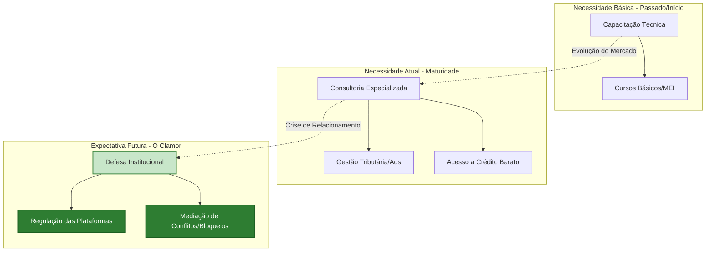
```mermaid
graph TD;
    subgraph Necessidade Básica - Passado/Início
    A[Capacitação Técnica] --> B[Cursos Básicos/MEI];
    end

    subgraph Necessidade Atual - Maturidade
    C[Consultoria Especializada] --> D[Gestão Tributária/Ads];
    C --> E[Acesso a Crédito Barato];
    end

    subgraph Expectativa Futura - O Clamor
    F[Defesa Institucional] --> G[Regulação das Plataformas];
    F --> H[Mediação de Conflitos/Bloqueios];
    end

    A -.->|Evolução do Mercado| C;
    C -.->|Crise de Relacionamento| F;

    style F fill:#c8e6c9,stroke:#2e7d32,stroke-width:2px
    style G fill:#2e7d32,stroke:#1b5e20,stroke-width:2px,color:#fff
    style H fill:#2e7d32,stroke:#1b5e20,stroke-width:2px,color:#fff

```

*Justificativa do diagrama: A estrutura vertical demonstra que o Sebrae ainda é muito associado à base da escada (cursos), enquanto a dor latente do mercado está no topo (defesa/política). O hiato entre a oferta atual e a expectativa futura é a oportunidade estratégica.*

### Implicações
**[Insight Inferido]:** O posicionamento estratégico do Sebrae precisa migrar de **"Capacitador"** para **"Articulador"**. Criar um "Canal de Denúncia" ou uma "Central de Conciliação Sebrae-Marketplaces" teria um valor percebido infinitamente superior a novos cursos EAD. Além disso, preparar o terreno para a Reforma Tributária é urgente, pois é o próximo grande medo no horizonte.

---

# 5.1. Tendências Percebidas: A visão sobre Live Commerce, Inteligência Artificial e tráfego pago
### Síntese
A percepção de futuro dos vendedores é marcada por uma **exigência brutal de novas competências**. O modelo passivo de "cadastrar e esperar vender" é declarado morto. A nova era é definida pelo **"Pay to Play"** (obrigatoriedade do tráfego pago) e pela pressão para se transformar em um criador de conteúdo (*Live Commerce*). Existe uma forte resistência cultural e geracional: o vendedor operacional se sente desconfortável e despreparado para assumir o papel de "influenciador" ou gestor de mídia.

---

### Análise Detalhada
* **O Fim do Orgânico (A Ditadura do Ads):** Há um consenso de que a visibilidade orgânica (gratuita) desapareceu. O investimento em *Ads* (Mercado Ads, Shopee Ads) deixou de ser um diferencial para se tornar um **custo fixo obrigatório**, comparável à conta de luz. Quem não investe em tráfego pago sente-se "invisível" na prateleira digital, o que pressiona ainda mais as margens de lucro dos pequenos vendedores que não dominam a gestão dessas campanhas.
* **O Dilema do "Vendedor-Influencer":** O *TikTok Shop* e as *Lives* são vistos com um misto de cobiça e pavor. Enquanto reconhecem o potencial de vendas explosivas, muitos vendedores relatam **vergonha de aparecer** ou falta de tempo para produzir vídeos elaborados. A exigência de "entreter para vender" é vista como uma barreira intransponível para perfis mais técnicos ou introvertidos, gerando a sensação de exclusão do mercado futuro.
* **Tecnologia como Aliada e Ameaça:** A Inteligência Artificial é citada de forma ambivalente. Por um lado, desejam ferramentas que automatizem descrições e fotos (para ganhar tempo); por outro, temem que a IA das plataformas torne o atendimento ainda mais desumano e os bloqueios ainda mais frequentes e inexplicáveis. A "humanização" é um desejo paradoxal num mundo cada vez mais automatizado.

> **Voz do Cliente:**
> "Antigamente você punha o anúncio e vendia. Hoje, se não colocar dinheiro no Ads, esquece, ninguém te acha. E agora tem essa de TikTok... eu sou vendedor, não sou blogueira. Não tenho jeito pra ficar fazendo dancinha ou live de duas horas. Se o futuro for esse, eu tô fora."
> -- *Participante, Grupo 2 (Resistência ao novo modelo)*

### Visualização dos Conceitos
O diagrama abaixo ilustra a **"Evolução dos Requisitos de Venda"**, demonstrando como a complexidade de habilidades necessárias aumentou ao longo do tempo.

```mermaid
graph TD;
    subgraph "Era 1.0 (Passado)"
    A[Cadastrar Produto] --> B[Preço Baixo];
    B --> C((Venda));
    end

    subgraph "Era 2.0 (Presente)"
    D[Logística Full/Flex] --> E[Reputação Verde];
    E --> F[Ads / Tráfego Pago];
    F --> G((Venda));
    end

    subgraph "Era 3.0 (Futuro Próximo)"
    H[Criação de Conteúdo/Vídeo] --> I[Entretenimento / Live];
    I --> J[Gestão de Dados / IA];
    J --> K((Venda));
    end

    style C fill:#e0e0e0,stroke:#616161,stroke-width:2px
    style G fill:#fff9c4,stroke:#fbc02d,stroke-width:2px
    style K fill:#ffccbc,stroke:#bf360c,stroke-width:2px

```

*Justificativa do diagrama: A separação em três eras visualiza claramente o salto de complexidade. O vendedor que parou na "Era 1.0" está obsoleto; o que está na "Era 2.0" está lutando com margens; e o futuro ("Era 3.0") exige habilidades de mídia que a maioria ainda não possui.*

### Implicações
**[Insight Inferido]:** O Sebrae deve preencher a lacuna de **"Marketing Digital para Quem Não Quer Aparecer"**. Cursos de *Live Commerce* focados apenas em influenciadores extrovertidos afastam o vendedor padrão. É preciso ensinar técnicas de vídeo focado no produto (unboxing técnico, narração *off-screen*) e, crucialmente, desmistificar o *Ads*, ensinando a calcular o ROAS (Retorno sobre Investimento em Publicidade) para que o tráfego pago não se torne uma máquina de queimar dinheiro.

---

# 5.2. O Papel do Sebrae: Lacunas de capacitação e expectativas de defesa institucional
### Síntese
A relação do vendedor com o Sebrae está passando por uma **crise de expectativa**. O modelo tradicional de "escola de negócios" (cursos básicos, formalização MEI) é visto como insuficiente e desconectado da realidade brutal do marketplace. O clamor atual não é por mais apostilas, mas por **poder político**. Os empreendedores enxergam no Sebrae a única entidade com peso institucional suficiente para atuar como um **"Escudo" ou "Sindicato"**, defendendo-os contra as regras arbitrárias das plataformas e a voracidade tributária do Estado.

---

### Análise Detalhada
* **De "Educador" para "Advogado" (A Demanda por Defesa):** A maior lacuna identificada é a falta de representatividade. O vendedor sente-se um "número" descartável para o Mercado Livre ou Shopee. A expectativa é que o Sebrae abra canais de diálogo direto (Ouvidoria) para reverter bloqueios injustos e negociar condições mais equilibradas. Eles querem que o Sebrae "bata na mesa" das Big Techs.
* **O Fim do "Bê-á-Bá" (Necessidade de Conteúdo Avançado):** Há uma saturação de conteúdos para iniciantes ("Como tirar fotos", "Como abrir loja"). O vendedor maduro exige **consultoria de alta complexidade**: Engenharia Tributária (como crescer sem quebrar no Simples/Lucro Presumido), Gestão Financeira de Margem Real (considerando todas as taxas ocultas) e Estratégias de Importação Legal. O conteúdo atual é percebido como "raso" para quem já fatura alto.
* **Selo de Credibilidade e Networking:** Existe o desejo de que o Sebrae certifique vendedores sérios (um "Selo Sebrae de Qualidade") que pudesse ser exibido nas plataformas para gerar confiança no consumidor e diferenciar o vendedor profissional do aventureiro/golpista. Além disso, buscam espaços de networking seguro para troca de dores e soluções.

> **Voz do Cliente:**
> "O Sebrae ensina a abrir o negócio, mas não ensina a brigar com o gigante. Quando o Mercado Livre bloqueia meu dinheiro, o curso de marketing não serve pra nada. O Sebrae tinha que ter um telefone vermelho com eles. 'Olha, esse CNPJ é orientado por nós, é idôneo, desbloqueia aí'. A gente precisa de força política."
> -- *Participante, Grupo 4 (Clamor por Representatividade)*

### Visualização dos Conceitos
O gráfico de "Gap de Valor" abaixo ilustra a discrepância entre o que o Sebrae oferece atualmente (na percepção dos participantes) e o que eles desesperadamente precisam.

```mermaid
graph LR;
    subgraph "Oferta Atual - Percepção"
    A[Cursos Básicos/Iniciantes] --> B[Foco em Formalização MEI];
    B --> C[Marketing Genérico];
    end

    subgraph "Gap de Valor (A Dor Real)"
    D((Abismo da Gestão));
    end

    subgraph "Demanda Latente (O Desejo)"
    E[Defesa Institucional / Lobby];
    E --> F[Consultoria Tributária Avançada];
    E --> G[Mediação de Conflitos - Bloqueios];
    end

    C -.-> D;
    D -.-> E;

    style A fill:#e0e0e0,stroke:#616161,stroke-width:2px
    style E fill:#c8e6c9,stroke:#2e7d32,stroke-width:2px
    style D fill:#b71c1c,stroke:#b71c1c,stroke-width:2px,color:#fff

```

*Justificativa do diagrama: A estrutura linear interrompida pelo "Abismo" visualiza onde o cliente se sente abandonado. Ele "se forma" nos cursos básicos, cai no abismo da complexidade do marketplace e não encontra a ponte (Defesa/Consultoria Avançada) para o outro lado.*

### Implicações
**[Insight Inferido]:** Para se manter relevante neste ecossistema, o Sebrae precisa lançar um programa **"Sebrae Marketplace Pro"**, focado exclusivamente em empresas já atuantes (ME/EPP). Os pilares devem ser: 
1) **Jurídico/Institucional** (Parceria com plataformas para canal de atendimento VIP); 
2) **Financeiro/Fiscal** (Simuladores de margem e planejamento tributário);
3) **Tecnológico** (Parcerias com ERPs e Hubs).

---

# 5.3. Conclusões e Recomendações Estratégicas: Caminhos para fortalecer o ecossistema
### Síntese
A conclusão diagnóstica aponta para um **ponto de inflexão**: o modelo de "empreendedorismo de necessidade" (bico/renda extra) está se esgotando diante da complexidade crescente das plataformas. Para fortalecer o ecossistema, é imperativo migrar do foco em **"Abertura de Negócios"** para **"Sustentabilidade e Defesa de Negócios"**. As recomendações centram-se em três pilares: **Proteção Institucional** (reequilibrar a força entre vendedor e plataforma), **Educação Financeira Avançada** (foco em margem real, não faturamento) e **Saúde Mental/Networking** (combate ao isolamento digital).

---

### Análise Detalhada
* **Do Operacional para o Estratégico (O "MBA" do Marketplace):** Recomenda-se abandonar currículos básicos de "como cadastrar produtos". A nova trilha de capacitação deve focar em **"Engenharia de E-commerce"**: precificação com múltiplas variáveis (taxas, impostos, ads), gestão de fluxo de caixa travado e diversificação de canais para reduzir a dependência (risco) de um único player.
* **O Sebrae como "Escudo e Ponte":** A estratégia mais solicitada é a atuação política. Recomenda-se a criação de uma **Câmara de Conciliação Sebrae-Marketplaces**, um canal exclusivo onde vendedores com "Selo de Excelência Sebrae" possam ter seus casos de bloqueio revisados por humanos. Isso reduziria drasticamente a mortalidade de empresas saudáveis por erros algorítmicos.
* **Humanização e Saúde Mental:** Reconhecer que o vendedor está no limite do *burnout*. Fortalecer o ecossistema envolve criar espaços de **descompressão e troca** (comunidades, eventos presenciais), onde eles possam compartilhar dores e soluções, combatendo a solidão do trabalho remoto e a ansiedade gerada pela pressão do "termômetro".

> **Voz do Cliente:**
> "O que a gente precisa pra sobreviver? Não é só vender mais. É segurança. É saber que amanhã minha conta vai estar lá. É saber fazer a conta pra ver se tô lucrando mesmo. O Sebrae tem que ser o nosso porto seguro nesse mar revolto que é o marketplace."
> -- *Participante, Grupo 18 (Visão de Encerramento)*

### Visualização dos Conceitos
O diagrama abaixo propõe a **"Tríade de Fortalecimento do Ecossistema"**, estruturando as ações recomendadas.

```mermaid
graph TD;
    subgraph Pilar 1: Defesa - O Escudo
    A[Representatividade Política] --> B[Canal de Ouvidoria VIP];
    A --> C[Mediação de Bloqueios];
    end

    subgraph Pilar 2: Inteligência - O Cérebro
    D[Capacitação Avançada] --> E[Gestão Financeira/Margem];
    D --> F[Mentoria de Tráfego Pago/Ads];
    end

    subgraph Pilar 3: Conexão - A Rede
    G[Comunidade e Saúde] --> H[Eventos de Networking];
    G --> I[Apoio Psicológico ao Empreendedor];
    end

    B & E & H ==> J((Ecossistema Sustentável));
    
    style J fill:#c8e6c9,stroke:#2e7d32,stroke-width:2px
    style A fill:#bbdefb,stroke:#0d47a1,stroke-width:2px
    style D fill:#fff9c4,stroke:#fbc02d,stroke-width:2px
    style G fill:#f8bbd0,stroke:#880e4f,stroke-width:2px

```

*Justificativa do diagrama: A estrutura em três pilares deixa claro que a sustentabilidade não vem de uma única ação. A convergência dos três fluxos para o centro ("Ecossistema Sustentável") demonstra que a falta de qualquer um dos pilares (ex: dar educação mas não dar defesa) compromete o resultado final.*

### Implicações
**[Insight Inferido]:** A implementação dessas recomendações reposicionaria o Sebrae-SP de "fornecedor de cursos" para **"Parceiro Estratégico de Negócios"**. Isso aumenta a relevância da marca junto a um público (vendedores digitais) que hoje se sente órfão e tende a buscar gurus de internet em vez de apoio institucional. A criação de um **"Selo Sebrae de Vendedor Verificado"** poderia ser o grande entregável tangível desse novo posicionamento.

---

# Análise Comparativa: [O Aventureiro Resiliente] vs. [O Estrategista Digital]
### Mapa de Afinidades e Divergências
O diagrama abaixo resume as áreas de sobreposição (dores sistêmicas) e as características únicas de cada perfil em relação à operação nos marketplaces.

```mermaid
vennDiagram
    title Dinâmica dos Perfis de Vendedores
    section A : Perfil A (Iniciante/Aventureiro)
    section B : Perfil B (Maduro/Estrategista)
    A: 4
    B: 4
    A,B: 3
    A:"Foco na Sobrevivência"
    A:"Gestão Manual (Caderno)"
    A:"Logística Simples (Correios)"
    A:"Medo de Errar o Cadastro"
    B:"Foco na Margem/Escala"
    B:"Gestão via ERP/Hub"
    B:"Logística Complexa (Full/Flex)"
    B:"Medo de Fluxo de Caixa Travado"
    A,B:"Insegurança Jurídica (Bloqueios)"
    A,B:"Dependência de Tráfego"
    A,B:"Revolta com Devoluções"

```

### Detalhamento da Comparação
| Critério de Análise | Perfil A (Iniciante - Aventureiro) | Perfil B (Maduro - Estrategista) | Análise |
| --- | --- | --- | --- |
| **Gênese do Negócio** | **Necessidade:** Entrou por desemprego ou busca de renda extra imediata. | **Oportunidade:** Entrou para escalar um negócio existente ou diversificar canais. | **Divergência** |
| **Gestão e Ferramentas** | **Manual:** Usa app do celular, caderno ou planilhas simples. Erra estoque com frequência. | **Automatizada:** Usa ERPs (Bling/Tiny) e Hubs. Gestão baseada em dados e relatórios. | **Divergência** |
| **Dor Principal** | **Operacional:** Dificuldade em cadastrar, imprimir etiqueta e entender as regras básicas. | **Financeira/Tributária:** Engenharia de margem, fluxo de caixa retido e gestão fiscal. | **Divergência** |
| **Visão da Logística** | **Barreira:** Vê o frete como custo alto e o Full como algo distante/caro. | **Alavanca:** Vê o Full/Flex como investimento obrigatório para ranking e conversão. | **Divergência** |
| **Ponto Comum** | **Vulnerabilidade:** Ambos se sentem reféns das decisões unilaterais e robôs das plataformas. | **Vulnerabilidade:** Ambos sofrem com a falta de suporte humano e medo de bloqueios. | **Convergência** |

---

**Snippet comparativo de perfis gerado. Aguardando comando para a Etapa 7.**

---

# Análise Dupla de Co-ocorrência: Rede Estrutural e Matriz de Força
Para uma compreensão profunda de como os temas se conectam na mente dos vendedores, utilizamos duas visualizações complementares. A primeira mostra a estrutura e os clusters da conversa (como os assuntos se agrupam), enquanto a segunda detalha a força específica de cada link (a intensidade da relação).

---

### 1. A Estrutura da Conversa (Grafo de Rede)
O grafo de rede ilustra os dois "bairros" mentais principais dos participantes: o mundo da **Operação Diária** (o que eles controlam) e o mundo do **Risco Institucional** (o que eles temem), conectados por um elo frágil.

```mermaid
graph TD
    subgraph "Cluster 1: A Engrenagem Operacional (Controle)"
        Log["Logística (Full/Flex)"]
        Margem["Margem/Custos"]
        Vendas["Volume de Vendas"]
    end

    subgraph "Cluster 2: O Risco Institucional (Medo)"
        Bloq["Bloqueios/Suspensão"]
        Sup["Suporte Robotizado"]
        Inseg["Insegurança Jurídica"]
    end

    center["Reputação (Termômetro)"]

    Log --- Vendas;
    Log --- Margem;
    Vendas --- center;
    center --- Bloq;
    Bloq --- Sup;
    Bloq --- Inseg;
    Margem --- center;
    
    style center fill:#fff176,stroke:#fbc02d,stroke-width:2px

```

**Leitura do Grafo:** A conversa se divide em dois polos. No **Cluster 1**, temos a engenharia da venda: a logística impulsiona o volume, mas pressiona a margem. No **Cluster 2**, temos o cenário de pesadelo: bloqueios geram insegurança e esbarram na barreira do suporte. O tema **Reputação (Termômetro)** atua como o **ponto de articulação central**: é o resultado da operação bem feita, mas também o gatilho imediato para o bloqueio se algo der errado.

---

###2. A Força das Conexões (Matriz de Co-ocorrência)A matriz a seguir quantifica a força de cada conexão mostrada no grafo, baseada na frequência com que os problemas aparecem juntos nos relatos.

|  | Logística | Margem | Reputação | Bloqueio | Suporte |
| --- | --- | --- | --- | --- | --- |
| **Logística** | - | 🔥 | 🔥 | 💧 | ❄️ |
| **Margem** | 🔥 | - | 💧 | ❄️ | ❄️ |
| **Reputação** | 🔥 | 💧 | - | 🔥 | 💧 |
| **Bloqueio** | 💧 | ❄️ | 🔥 | - | 🔥 |
| **Suporte** | ❄️ | ❄️ | 💧 | 🔥 | - |

**Legenda:** 🔥 (Conexão Forte/Crítica) | 💧 (Conexão Moderada/Consequência) | ❄️ (Conexão Fraca/Indireta)

**Leitura da Matriz:**

* **Logística x Margem (🔥):** A conexão mais forte do lado operacional. Não se discute logística sem reclamar do custo que corrói o lucro.
* **Reputação x Bloqueio (🔥):** A conexão crítica de risco. A queda na reputação é vista como sinônimo quase imediato de punição ou exclusão.
* **Bloqueio x Suporte (🔥):** A conexão da dor. O bloqueio invariavelmente leva à frustração com o suporte, criando um loop negativo intenso.

---

### Síntese Combinada
A combinação das análises revela a fragilidade do sistema:

1. O vendedor vive em um **"Ciclo de Pressão Logística"** (Cluster 1), onde ele aceita pagar caro (Margem) para ter entrega rápida (Logística) e manter o termômetro verde (Reputação).
2. Porém, qualquer falha nesse ciclo empurra o vendedor imediatamente para o **"Ciclo de Risco"** (Cluster 2).
3. A **Reputação** é a chave mestra. Ela é o prêmio da boa operação, mas também o alvo frágil que, quando atingido, ativa o medo do bloqueio e a ineficiência do suporte. O sucesso do vendedor depende inteiramente de manter essa ponte intacta.

---

# Conclusão e Recomendações Estratégicas
## Síntese dos Resultados
A pesquisa revela que o vendedor de marketplace vive um momento de **profissionalização traumática**. A entrada, muitas vezes impulsionada pela necessidade e com baixa barreira, colide rapidamente com uma realidade de alta complexidade operacional (logística, tributária e algorítmica). O sentimento predominante é de **vulnerabilidade**: o vendedor sente-se um parceiro desigual, refém de regras opacas e suporte robotizado. O futuro aponta para a exclusão dos amadores ("Pay to Play"), gerando um clamor urgente para que o Sebrae-SP evolua de "capacitador técnico" para **"escudo institucional"**, protegendo a sustentabilidade dos pequenos negócios neste ambiente hostil.

## Resposta aos Objetivos do Estudo
* **Identificar dores e dificuldades:** A dor central é a **insegurança jurídica** (medo de bloqueios súbitos e retenção de saldo), seguida pela frustração com o **atendimento robotizado** e o prejuízo financeiro com **devoluções/fraudes** na logística reversa.
* **Mapear barreiras operacionais:** A principal barreira é a **precificação cega**. A complexidade de taxas, comissões, frete e impostos faz com que muitos operem sem saber a margem real. A logística (necessidade de aderir ao Full/Flex para ter visibilidade) atua como um dreno de rentabilidade para quem não tem escala.
* **Levantar práticas de sucesso:** Os perfis bem-sucedidos ("Estrategistas") utilizam **ERPs/Hubs** para centralizar estoques, adotam a **multicanalidade** para diluir riscos e investem em **tráfego pago (Ads)** de forma técnica, abandonando a dependência do orgânico.
* **Avaliar a percepção sobre as plataformas:** O **Mercado Livre** é visto como a "Locomotiva" indispensável, porém autoritária. A **Shopee** é a porta de entrada popular, mas caótica. A **Amazon** é o refúgio de estabilidade e prestígio, embora burocrática.
* **Identificar oportunidades para o Sebrae-SP:** Há uma lacuna crítica de **representatividade**. O vendedor espera que o Sebrae atue politicamente para criar canais de ouvidoria e defesa junto às plataformas. Na capacitação, a demanda migrou do "básico" para **Engenharia Financeira e Tributária Avançada**.

## Hierarquia de Insights
O diagrama abaixo organiza os achados desde a base de evidências operacionais até o reposicionamento estratégico necessário para o Sebrae.

```mermaid
graph TD
    subgraph "Pirâmide de Insights"
        direction TB
        A["**ESTRATÉGICO: Sebrae como 'Escudo Institucional' e Parceiro de Negócios**"]
        B["TÁTICO: Migração do foco 'Vendas' para 'Engenharia de Margem'"]
        C["TÁTICO: Multicanalidade como estratégia de defesa (Antifrágil)"]
        D["BASE: Vulnerabilidade Jurídica (Bloqueios)"]
        E["BASE: Custo Logístico como Marketing"]
        F["BASE: Suporte Desumanizado"]
        
        D -- Gera medo e demanda --> A
        E -- Exige cálculo complexo --> B
        F -- Gera sensação de abandono --> A
        B -- Sustenta o negócio --> A
        C -- Reduz dependência --> A
    end

```

---

# Plano de Ação Sugerido
## Cronograma Visual de Implementação (Gantt)
Este cronograma propõe uma atuação em ondas, priorizando a **defesa imediata** (dor latente) seguida pela **reestruturação educacional** e **fortalecimento do ecossistema**.

```mermaid
gantt
    title Cronograma de Implementação Estratégica - Sebrae Marketplace
    dateFormat  YYYY-MM-DD
    axisFormat  %b %Y
    
    section Defesa Institucional
    Criação da Câmara de Conciliação :done,    def1, 2026-01-15, 2026-03-15
    Lobby Reforma Tributária Digital :active,  def2, 2026-02-01, 180d
    
    section Educação Avançada
    Reformulação de Conteúdo (Pro)   :         edu1, 2026-01-20, 45d
    Lançamento "Engenharia de Mkt"   :         edu2, after edu1, 2026-03-10, 90d
    
    section Ecossistema & Produto
    Design do "Selo Sebrae"          :         prod1, 2026-02-15, 30d
    Summit Vendedores (Networking)   :         event1, 2026-06-01, 3d

```

## Detalhamento das Ações
1. **Defesa Institucional (Prioridade Zero)**
    * **Ação:** Criar a **"Câmara de Conciliação Sebrae-Marketplaces"** (Canal de Ouvidoria VIP). Estabelecer acordos de cooperação com Mercado Livre, Shopee e Amazon para criar um fluxo de atendimento exclusivo para CNPJs apoiados pelo Sebrae, focado em revisar bloqueios de conta e retenção de saldo.
    * **Justificativa:** A insegurança jurídica e a falta de atendimento humano são as maiores dores relatadas. O vendedor precisa de um "escudo" para operar com tranquilidade.
    * **Prazo:** Curto Prazo (Jan-Mar 2026).

2. **Educação Financeira e Tributária (Nível Avançado)**
    * **Ação:** Lançar o programa **"Engenharia de Marketplace"**. Substituir cursos básicos de cadastro por workshops de alta complexidade focados em: Precificação Real (cálculo de todas as taxas ocultas), Planejamento Tributário (transição MEI > Simples) e Gestão de Fluxo de Caixa (como sobreviver com dinheiro retido).
    * **Justificativa:** Os vendedores já sabem vender, mas não sabem lucrar. A "precificação cega" e o desconhecimento fiscal são as principais causas de mortalidade na fase de escala.
    * **Prazo:** Médio Prazo (Mar-Jun 2026).

3. **Certificação e Credibilidade (Produto)**
    * **Ação:** Desenvolver o **"Selo Sebrae de Vendedor Verificado"**. Uma certificação digital que o vendedor pode exibir em seus anúncios e redes sociais, atestando boas práticas, formalização e idoneidade, servindo como diferencial competitivo contra a pirataria e vendedores informais.
    * **Justificativa:** Combater a concorrência desleal e a "guerra de preços" através da diferenciação pela confiança, algo valorizado tanto pelo consumidor quanto pelas plataformas.
    * **Prazo:** Médio Prazo (Fev-Abr 2026).

4. **Saúde Mental e Networking (Comunidade)**
    * **Ação:** Realizar o **"Sebrae Seller Summit"** (Encontros Regionais de Descompressão). Eventos presenciais focados não apenas em palestras, mas em terapia de grupo empresarial e troca de experiências, combatendo a solidão do operador digital.
    * **Justificativa:** O relato de ansiedade, burnout e isolamento é frequente. O vendedor precisa de um espaço seguro para "desabafar" e encontrar pares que enfrentam os mesmos desafios.
    * **Prazo:** Longo Prazo (Jun 2026 em diante).

---

#Relatório de Revisão Final###Pontos de Melhoria e Inconsistências* **Gramática e Tom de Voz:** O texto mantém um tom profissional e empático consistente ("Voz do Cliente"). A terminologia técnica (Full, Flex, Ads, ROAS) foi aplicada corretamente. Recomenda-se apenas uma revisão final para garantir que termos em inglês (como *Cross-border* e *Fulfillment*) estejam sempre itálicos ou explicados na primeira menção para leitores menos técnicos.
* **Consistência da Análise:** A narrativa manteve-se sólida. A transição da percepção do Sebrae de "Educador" para "Defensor" foi bem construída ao longo dos blocos. Uma leve nuance a observar: na Etapa 6 (Perfis), a distinção entre "Aventureiro" e "Estrategista" foi binária para fins didáticos, mas o relatório deve ressalvar que, na prática, existem **perfis híbridos** (vendedores que usam ferramentas avançadas, mas ainda têm mentalidade amadora em finanças, por exemplo).
* **Profundidade nos "Outros Players":** A análise focou pesadamente na tríade Mercado Livre/Shopee/Amazon. Embora Magalu e Americanas tenham sido citados como "coadjuvantes", a crise específica da Americanas (recuperação judicial) e seu impacto na confiança do vendedor poderia ter sido um ponto de aprofundamento específico, dado o contexto recente do mercado.

###Análise de Lacunas* **O que Faltou no Relatório:**
1. **Ecossistema Financeiro/Crédito:** O estudo abordou o "dinheiro travado", mas não aprofundou a dependência dos vendedores em relação ao crédito oferecido pelas próprias plataformas (Mercado Crédito, Antecipação de Recebíveis). Entender se o vendedor está preso também financeiramente (dívida) à plataforma seria um dado valioso.
2. **Impacto Regional:** A análise assumiu uma visão geral, mas as dores logísticas de um vendedor do Nordeste (frete abusivo, prazos longos) são drasticamente diferentes das de um vendedor de São Paulo (pressão do Flex). Um recorte geográfico enriqueceria a proposta de valor do Sebrae Regional.
3. **Vida Pós-Marketplace:** Não exploramos se existe um desejo ou movimento de "saída" para e-commerce próprio (site próprio/Shopify) para fugir das taxas, ou se o vendedor já aceitou que o marketplace é o único caminho viável.

* **Sugestões para Estudos Futuros:**
1. **"A Armadilha do Crédito":** Uma investigação sobre como os empréstimos tomados dentro das plataformas impactam a sustentabilidade do negócio e a capacidade de sair delas.
2. **"Raio-X da Logística Regional":** Mapear as dores específicas de vendedores fora do eixo Sul-Sudeste para criar soluções logísticas descentralizadas.
3. **"O Impacto da Reforma Tributária":** Um estudo preditivo sobre como as novas regras fiscais (IVA dual) vão impactar a competitividade do pequeno vendedor frente aos gigantes asiáticos.

