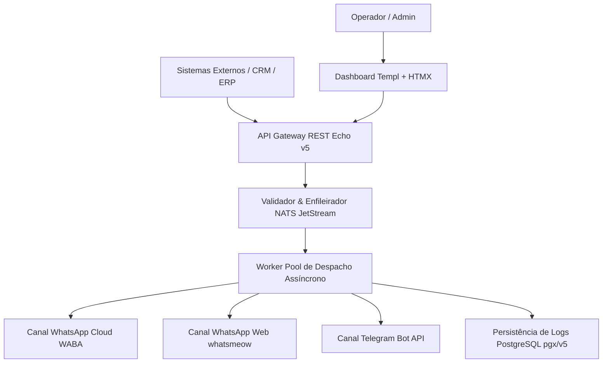


**Contexto / Organização**: Projeto Autônomo / Open Source  
**Período**: 2025 - Presente  
**Categoria de Atuação**: Data Engineering  
**Tecnologias**: `Go`, `Echo v5`, `NATS JetStream`, `PostgreSQL`, `pgx/v5`, `a-h/templ`, `HTMX`, `Tailwind CSS`, `Docker`, `whatsmeow`  

---

## Visão Geral Executiva

Plataforma autohospedada de comunicação omnichannel (CPaaS) desenvolvida em Go 1.25+ e Echo v5. Unifica o envio de mensagens através de múltiplos provedores (WhatsApp Cloud WABA, WhatsApp Web via whatsmeow e Telegram) sob um payload REST padronizado, gerenciando filas resilientes com NATS JetStream, backpressure automático e dashboard reativo com a-h/templ e HTMX.


**Organization / Context**: Projeto Autônomo / Open Source  
**Timeline**: 2025 - Present  
**Domain Category**: Data Engineering  
**Technologies**: `Go`, `Echo v5`, `NATS JetStream`, `PostgreSQL`, `pgx/v5`, `a-h/templ`, `HTMX`, `Tailwind CSS`, `Docker`, `whatsmeow`  

---

## Executive Overview

Self-hosted, open-source Omnichannel Communications Platform as a Service (CPaaS) engineered in Go 1.25+ and Echo v5. Unifies message delivery across multiple providers (WhatsApp Cloud WABA, WhatsApp Web via whatsmeow, and Telegram) under a single REST payload, powered by NATS JetStream durable queuing, automatic backpressure, and a reactive dashboard with a-h/templ and HTMX.




## Arquitetura & Fluxo de Dados

O diagrama abaixo ilustra a topologia e esteira de processamento dos componentes técnicos sanitizados:

## Architecture & Data Flow

The diagram below illustrates the sanitized high-level component topology and data processing pipeline:



## Destaques de Engenharia

- **Payload REST Unificado: Endpoint único (POST /api/v1/messages) abstraindo a complexidade de roteamento e fallback automático entre WABA, WhatsApp Web e Telegram.**
- **Mensageria Resiliente com JetStream: Fila persistente e desacoplada em NATS JetStream com controle de backpressure (limite de 1.000 mensagens por sessão).**
- **Interface Reativa SSR: Painel administrativo de alta performance compilado em tempo de compilação com a-h/templ e interações dinâmicas via HTMX sem overhead de SPA.**


## Key Engineering Highlights

- **Unified REST Payload: Single endpoint (POST /api/v1/messages) abstracting multi-channel routing and automated fallback across WABA, WhatsApp Web, and Telegram.**
- **Resilient Messaging with JetStream: Durable, decoupled message broker on NATS JetStream enforcing queue backpressure limits (1,000 messages/session).**
- **Reactive SSR Dashboard: High-performance admin console compiled at build time with a-h/templ and dynamic server-driven HTMX interactions without SPA overhead.**




## Referências e Comprovações

- [Código-Fonte / Repositório Oficial no GitHub](https://github.com/pablodiegoo/OmniGo)


## References & Verification

- [Source Code / Official GitHub Repository](https://github.com/pablodiegoo/OmniGo)


