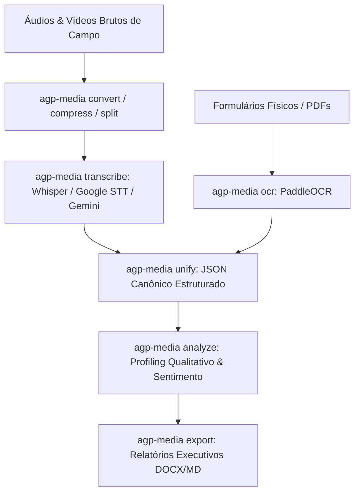

> [!NOTE]
> **Sanitized Technical Specification (`proprietary_sanitized`)**: This technical sheet is an authorized public specification adhering to strict intellectual property compliance and Brazilian LGPD (Lei Geral de Proteção de Dados) compliance. Proprietary source code, production database instances, raw databases, confidential credentials, and client Personally Identifiable Information (PII) remain strictly protected and are not exposed.
>
> *Especificação Técnica Sanitizada (`proprietary_sanitized`): Ficha técnica pública autorizada em estrita conformidade com a Lei Geral de Proteção de Dados (LGPD) e diretrizes de propriedade intelectual. Código-fonte, instâncias de produção, credenciais confidenciais e dados pessoais identificáveis (PII) protegidos.*
>
> *Ficha técnica pública autorizada sob diretriz proprietary_sanitized. Arquivos de áudio originais de entrevistas e documentos confidenciais de pesquisa permanecem confidenciais.*


**Contexto / Organização**: Ágora Pesquisa / AGP  
**Período**: 2025 - 2026  
**Categoria de Atuação**: Data Engineering  
**Tecnologias**: `Python`, `OpenAI Whisper`, `Google STT`, `Gemini API`, `PaddleOCR`, `Mistral`, `Pydantic`, `FFmpeg`, `CLI`  

---

## Visão Geral Executiva

Toolkit modular em linha de comando (CLI) desenvolvido para otimizar o ciclo de pesquisas qualitativas e quantitativas de campo. Executa conversão e compressão de mídia, transcrição de áudio com diarização de interlocutores (Whisper, Gemini, Google STT), OCR de formulários e análise semântica estruturada.


**Organization / Context**: Ágora Pesquisa / AGP  
**Timeline**: 2025 - 2026  
**Domain Category**: Data Engineering  
**Technologies**: `Python`, `OpenAI Whisper`, `Google STT`, `Gemini API`, `PaddleOCR`, `Mistral`, `Pydantic`, `FFmpeg`, `CLI`  

---

## Executive Overview

Modular command-line toolkit (CLI) engineered to streamline field research workflows. Handles media conversion, audio transcription with multi-speaker diarization (Whisper, Gemini, Google STT), document OCR, and qualitative AI sentiment profiling.




## Arquitetura & Fluxo de Dados

O diagrama abaixo ilustra a topologia e esteira de processamento dos componentes técnicos sanitizados:

## Architecture & Data Flow

The diagram below illustrates the sanitized high-level component topology and data processing pipeline:



## Destaques de Engenharia

- **Pipeline Multimodelo: Suporte configurável a múltiplos provedores de speech-to-text e LLMs para diarização e análise de sentimento.**
- **Engenharia Multimodal: OCR avançado de formulários físicos e unificação estruturada de transcrições em JSON canônico.**
- **Alta Produtividade de Campo: Empacotamento via pipx com execução simplificada por comando único para analistas.**


## Key Engineering Highlights

- **Multi-Engine Pipeline: Pluggable speech-to-text and LLM support for diarization, transcription, and sentiment analysis.**
- **Multimodal Engineering: High-accuracy OCR for physical field survey sheets and unified structured JSON exports.**
- **Field Productivity: Packaged via pipx providing single-command execution for non-technical research analysts.**


