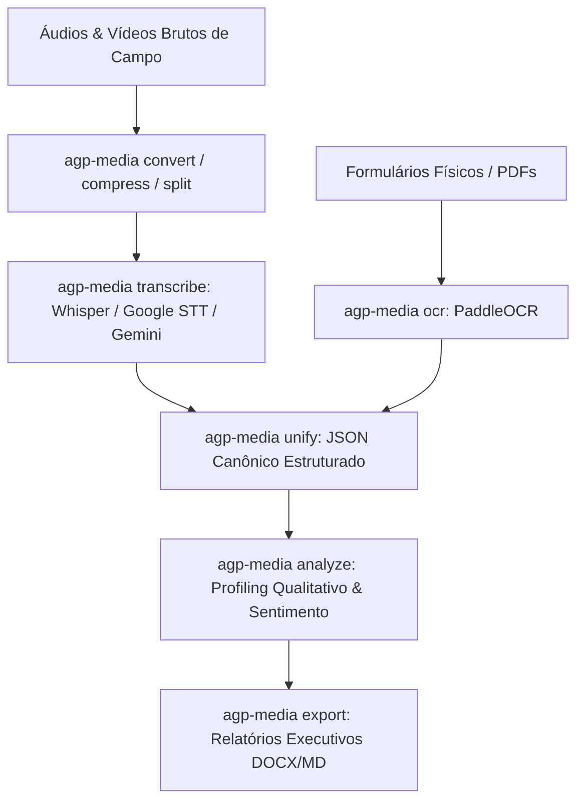

> [!NOTE]
> **Sanitized Technical Specification (`proprietary_sanitized`)**: This technical sheet is an authorized public specification adhering to the repository's data governance standards. Source code, production database instances, and API credentials remain strictly confidential and proprietary to the sponsoring organization.

**Organization / Context**: Ágora Pesquisa / AGP  
**Timeline**: 2025 - 2026  
**Domain Category**: Data Engineering  
**Technologies**: `Python`, `OpenAI Whisper`, `Google STT`, `Gemini API`, `PaddleOCR`, `Mistral`, `Pydantic`, `FFmpeg`, `CLI`  

---

## Executive Overview

Modular command-line toolkit (CLI) engineered to streamline field research workflows. Handles media conversion, audio transcription with multi-speaker diarization (Whisper, Gemini, Google STT), document OCR, and qualitative AI sentiment profiling.

*Toolkit modular em linha de comando (CLI) desenvolvido para otimizar o ciclo de pesquisas qualitativas e quantitativas de campo. Executa conversão e compressão de mídia, transcrição de áudio com diarização de interlocutores (Whisper, Gemini, Google STT), OCR de formulários e análise semântica estruturada.*

## Architecture & Data Flow

The diagram below illustrates the sanitized high-level component topology and data processing pipeline:

## Key Engineering Highlights

- **Multi-Engine Pipeline: Pluggable speech-to-text and LLM support for diarization, transcription, and sentiment analysis.**
- **Multimodal Engineering: High-accuracy OCR for physical field survey sheets and unified structured JSON exports.**
- **Field Productivity: Packaged via pipx providing single-command execution for non-technical research analysts.**
