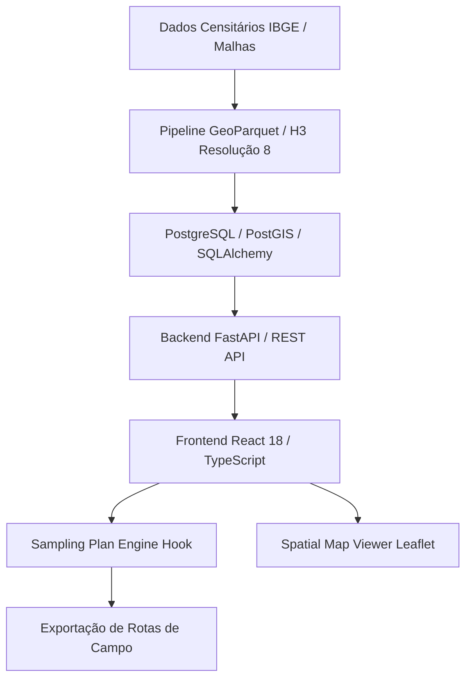

> [!NOTE]
> **Sanitized Technical Specification (`proprietary_sanitized`)**: This technical sheet is an authorized public specification adhering to strict intellectual property compliance and Brazilian LGPD (Lei Geral de Proteção de Dados) compliance. Proprietary source code, production database instances, raw databases, confidential credentials, and client Personally Identifiable Information (PII) remain strictly protected and are not exposed.
>
> *Especificação Técnica Sanitizada (`proprietary_sanitized`): Ficha técnica pública autorizada em estrita conformidade com a Lei Geral de Proteção de Dados (LGPD) e diretrizes de propriedade intelectual. Código-fonte, instâncias de produção, credenciais confidenciais e dados pessoais identificáveis (PII) protegidos.*
>
> *Ficha técnica pública autorizada. O código-fonte, bancos de dados transacionais e credenciais de infraestrutura permanecem de propriedade exclusiva da NKIN Consultoria / Ágora Pesquisa.*


**Contexto / Organização**: Ágora Pesquisa / NKIN Consultoria  
**Período**: 2025 - 2026  
**Categoria de Atuação**: Data Science  
**Tecnologias**: `FastAPI`, `Python`, `React 18`, `TypeScript`, `Leaflet`, `GeoParquet`, `Uber H3`, `SQLAlchemy`, `PostgreSQL`, `Docker`  

---

## Visão Geral Executiva

Plataforma analítica e arquitetura de dados desenvolvida para automatizar o planejamento amostral e a ingestão de questionários de opinião pública e pesquisas de mercado. Transforma setores censitários em células espaciais H3 e gera painéis analíticos dinâmicos de suporte à decisão executiva.


**Organization / Context**: Ágora Pesquisa / NKIN Consultoria  
**Timeline**: 2025 - 2026  
**Domain Category**: Data Science  
**Technologies**: `FastAPI`, `Python`, `React 18`, `TypeScript`, `Leaflet`, `GeoParquet`, `Uber H3`, `SQLAlchemy`, `PostgreSQL`, `Docker`  

---

## Executive Overview

Spatial analytics and sampling intelligence platform engineered to automate probabilistic survey sampling and opinion poll data processing. Converts census tracts into Uber H3 spatial cells and delivers dynamic decision-support dashboards.




## Arquitetura & Fluxo de Dados

O diagrama abaixo ilustra a topologia e esteira de processamento dos componentes técnicos sanitizados:

## Architecture & Data Flow

The diagram below illustrates the sanitized high-level component topology and data processing pipeline:



## Destaques de Engenharia

- **Conservação Amostral: Garantia algorítmica de 100% de conservação da população censitária em células hexagonais H3 (resolução 8) sem descarte de polígonos marginais de fronteira.**
- **Arquitetura Desacoplada: Separação estrita entre o motor de cálculo amostral (useSamplingPlanEngine) e a renderização do mapa geográfico interativo no frontend.**
- **Otimização Espacial: Ingestão de setores censitários e perfis espaciais de alta performance utilizando GeoParquet com carregamento preguiçoso de rotas.**


## Key Engineering Highlights

- **Sampling Conservation: Algorithmic guarantee of 100% census tract population conservation across Uber H3 hexagonal cells (resolution 8) without discarding marginal boundary polygons.**
- **Decoupled Architecture: Strict separation between the spatial sampling calculation engine (useSamplingPlanEngine) and interactive Leaflet map rendering in the React frontend.**
- **Spatial Performance: High-performance ingestion of census tracts and geographic profiles using GeoParquet with lazy route calculation.**


