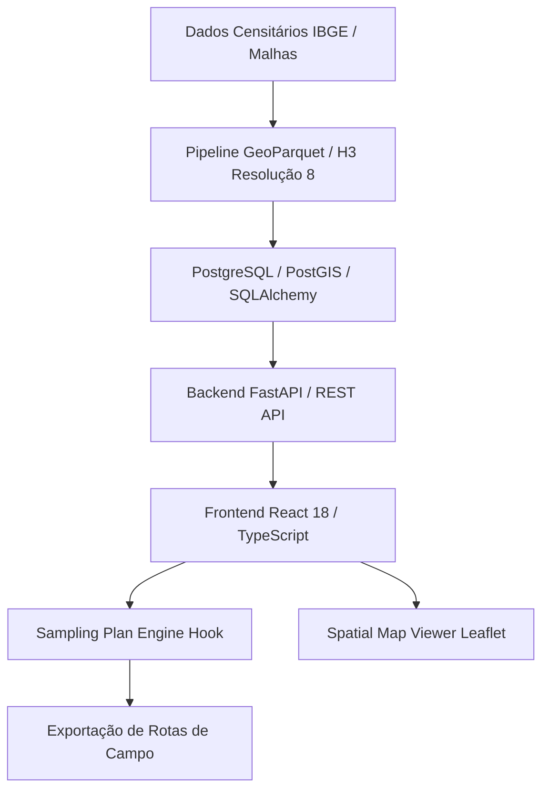

> [!NOTE]
> **Sanitized Technical Specification (`proprietary_sanitized`)**: This technical sheet is an authorized public specification adhering to the repository's data governance standards. Source code, production database instances, and API credentials remain strictly confidential and proprietary to the sponsoring organization.

**Organization / Context**: Ágora Pesquisa / NKIN Consultoria  
**Timeline**: 2025 - 2026  
**Domain Category**: Data Science  
**Technologies**: `FastAPI`, `Python`, `React 18`, `TypeScript`, `Leaflet`, `GeoParquet`, `Uber H3`, `SQLAlchemy`, `PostgreSQL`, `Docker`  

---

## Executive Overview

Spatial analytics and sampling intelligence platform engineered to automate probabilistic survey sampling and opinion poll data processing. Converts census tracts into Uber H3 spatial cells and delivers dynamic decision-support dashboards.

*Plataforma analítica e arquitetura de dados desenvolvida para automatizar o planejamento amostral e a ingestão de questionários de opinião pública e pesquisas de mercado. Transforma setores censitários em células espaciais H3 e gera painéis analíticos dinâmicos de suporte à decisão executiva.*

## Architecture & Data Flow

The diagram below illustrates the sanitized high-level component topology and data processing pipeline:

## Key Engineering Highlights

- **Sampling Conservation: Algorithmic guarantee of 100% census tract population conservation across Uber H3 hexagonal cells (resolution 8) without discarding marginal boundary polygons.**
- **Decoupled Architecture: Strict separation between the spatial sampling calculation engine (useSamplingPlanEngine) and interactive Leaflet map rendering in the React frontend.**
- **Spatial Performance: High-performance ingestion of census tracts and geographic profiles using GeoParquet with lazy route calculation.**
