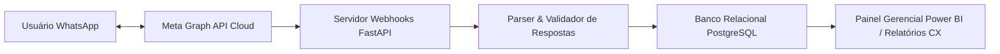

> [!NOTE]
> **Sanitized Technical Specification (`proprietary_sanitized`)**: This technical sheet is an authorized public specification adhering to strict intellectual property compliance and Brazilian LGPD (Lei Geral de Proteção de Dados) compliance. Proprietary source code, production database instances, raw databases, confidential credentials, and client Personally Identifiable Information (PII) remain strictly protected and are not exposed.
>
> *Ficha técnica pública autorizada sob diretriz proprietary_sanitized. Tokens da Meta API, dados de contato e mensagens privadas permanecem protegidos sob estrita confidencialidade.*

**Organization / Context**: Ágora Pesquisa  
**Timeline**: 2025 - 2026  
**Domain Category**: Data Engineering  
**Technologies**: `Python`, `Meta Graph API`, `Webhooks`, `FastAPI`, `SQL`, `PostgreSQL`, `Power BI`  

---

## Executive Overview

Automated data engineering pipeline ingesting and validating conversational survey responses via Meta WhatsApp Business API for real-time NPS and CSAT calculation, achieving a 90% reduction in manual data processing overhead.

*Pipeline automatizado de coleta, validação e tabulação de dados conversacionais via WhatsApp Business API para apuração contínua e em tempo real de métricas de Customer Experience (NPS/CSAT), reduzindo em 90% a necessidade de intervenção humana.*

## Architecture & Data Flow

The diagram below illustrates the sanitized high-level component topology and data processing pipeline:

## Key Engineering Highlights

- **Operational Efficiency: 90% reduction in manual data processing and survey tabulation overhead.**
- **Real-Time Event Architecture: Event-driven webhooks tracking delivery, read receipts, and user responses asynchronously.**
- **Data Integrity: Strict response parsing and schema validation prior to database persistence.**
