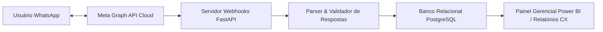

> [!NOTE]
> **Sanitized Technical Specification (`proprietary_sanitized`)**: This technical sheet is an authorized public specification adhering to strict intellectual property compliance and Brazilian LGPD (Lei Geral de Proteção de Dados) compliance. Proprietary source code, production database instances, raw databases, confidential credentials, and client Personally Identifiable Information (PII) remain strictly protected and are not exposed.
>
> *Especificação Técnica Sanitizada (`proprietary_sanitized`): Ficha técnica pública autorizada em estrita conformidade com a Lei Geral de Proteção de Dados (LGPD) e diretrizes de propriedade intelectual. Código-fonte, instâncias de produção, credenciais confidenciais e dados pessoais identificáveis (PII) protegidos.*
>
> *Ficha técnica pública autorizada sob diretriz proprietary_sanitized. Tokens da Meta API, dados de contato e mensagens privadas permanecem protegidos sob estrita confidencialidade.*


**Contexto / Organização**: Ágora Pesquisa  
**Período**: 2025 - 2026  
**Categoria de Atuação**: Data Engineering  
**Tecnologias**: `Python`, `Meta Graph API`, `Webhooks`, `FastAPI`, `SQL`, `PostgreSQL`, `Power BI`  

---

## Visão Geral Executiva

Pipeline automatizado de coleta, validação e tabulação de dados conversacionais via WhatsApp Business API para apuração contínua e em tempo real de métricas de Customer Experience (NPS/CSAT), reduzindo em 90% a necessidade de intervenção humana.


**Organization / Context**: Ágora Pesquisa  
**Timeline**: 2025 - 2026  
**Domain Category**: Data Engineering  
**Technologies**: `Python`, `Meta Graph API`, `Webhooks`, `FastAPI`, `SQL`, `PostgreSQL`, `Power BI`  

---

## Executive Overview

Automated data engineering pipeline ingesting and validating conversational survey responses via Meta WhatsApp Business API for real-time NPS and CSAT calculation, achieving a 90% reduction in manual data processing overhead.




## Arquitetura & Fluxo de Dados

O diagrama abaixo ilustra a topologia e esteira de processamento dos componentes técnicos sanitizados:

## Architecture & Data Flow

The diagram below illustrates the sanitized high-level component topology and data processing pipeline:



## Destaques de Engenharia

- **Automação Extrema: 90% de redução na intervenção manual de processamento e tabulação de dados de pesquisa.**
- **Tratamento de Eventos em Tempo Real: Arquitetura orientada a eventos com webhooks para confirmação de entrega, leitura e resposta.**
- **Governança e Integridade: Validação estrita de respostas com parser de integridade antes da persistência no banco de dados.**


## Key Engineering Highlights

- **Operational Efficiency: 90% reduction in manual data processing and survey tabulation overhead.**
- **Real-Time Event Architecture: Event-driven webhooks tracking delivery, read receipts, and user responses asynchronously.**
- **Data Integrity: Strict response parsing and schema validation prior to database persistence.**


