```mermaid
flowchart TD
  A[Respondente / Pesquisador] --> B[Interface Web & Agente Interativo]
  B --> C[Backend Go / Ent ORM Privacy Layer]
  C --> D[Banco Relacional PostgreSQL + Row-Level Security]
  C --> E[Módulo de Embeddings & Busca Vetorial pgvector]
  C --> F[Conectores LLM / Provedores BYOK]
  F --> G[Agrupamento Temático & Síntese Qualitativa]
  G --> H[Relatórios Analíticos & Transcrições Indexadas]
```

**Contexto / Organização**: Projeto Autônomo / Open Source  
**Período**: 2025 - Presente  
**Categoria de Atuação**: Data Science  
**Tecnologias**: `Go`, `Ent ORM`, `PostgreSQL`, `pgvector`, `Docker`, `TypeScript`, `React`, `Tailwind CSS`, `OpenAI API`, `Gemini API`  

---

## Visão Geral Executiva

Plataforma de inteligência qualitativa e condução automatizada de entrevistas de pesquisa de mercado desenvolvida em Go. Emprega Ent ORM com isolamento multi-tenant rigoroso, busca vetorial semântica via PostgreSQL pgvector, suporte a múltiplos provedores LLM (BYOK) e esteira assíncrona de transcrição e mineração temática de depoimentos.


**Organization / Context**: Projeto Autônomo / Open Source  
**Timeline**: 2025 - Present  
**Domain Category**: Data Science  
**Technologies**: `Go`, `Ent ORM`, `PostgreSQL`, `pgvector`, `Docker`, `TypeScript`, `React`, `Tailwind CSS`, `OpenAI API`, `Gemini API`  

---

## Executive Overview

AI-powered qualitative research platform engineered in Go for conducting automated user interviews and thematic transcript analysis. Features multi-tenant isolation via Ent ORM and PostgreSQL RLS, semantic vector search using pgvector, flexible LLM provider management (BYOK), and asynchronous session transcription pipelines.




## Arquitetura & Fluxo de Dados

O diagrama abaixo ilustra a topologia e esteira de processamento dos componentes técnicos sanitizados:

## Architecture & Data Flow

The diagram below illustrates the sanitized high-level component topology and data processing pipeline:



## Destaques de Engenharia

- **Isolamento Multi-Tenant Rigoroso: Arquitetura em três camadas (Middleware HTTP, Ent Privacy e Row-Level Security no PostgreSQL) garantindo segregação total de workspaces entre agências.**
- **Busca Semântica com pgvector: Indexação de embeddings vetoriais de trechos de entrevistas para recuperação semântica imediata e agrupamento temático de respostas.**
- **Padrão BYOK e Presets de Provedores: Gerenciamento desacoplado de chaves de API com fallbacks e suporte configurável a múltiplos modelos de linguagem.**


## Key Engineering Highlights

- **Three-Layer Tenant Isolation: Strict multi-tenancy enforced across HTTP middleware, Ent Privacy policies, and PostgreSQL Row-Level Security.**
- **Semantic Search with pgvector: Vector embeddings indexing interview excerpt transcripts for instantaneous semantic retrieval and thematic clustering.**
- **BYOK Architecture: Secure agency-level API key management with automated fallback and pluggable LLM provider presets.**




## Referências e Comprovações

- [Código-Fonte / Repositório Oficial no GitHub](https://github.com/pablodiegoo/ecoar-ai)


## References & Verification

- [Source Code / Official GitHub Repository](https://github.com/pablodiegoo/ecoar-ai)


