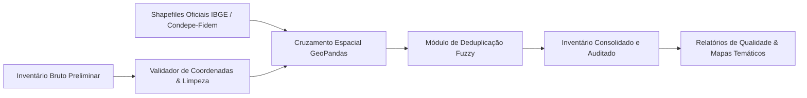

> [!NOTE]
> **Sanitized Technical Specification (`proprietary_sanitized`)**: This technical sheet is an authorized public specification adhering to strict intellectual property compliance and Brazilian LGPD (Lei Geral de Proteção de Dados) compliance. Proprietary source code, production database instances, raw databases, confidential credentials, and client Personally Identifiable Information (PII) remain strictly protected and are not exposed.
>
> *Especificação Técnica Sanitizada (`proprietary_sanitized`): Ficha técnica pública autorizada em estrita conformidade com a Lei Geral de Proteção de Dados (LGPD) e diretrizes de propriedade intelectual. Código-fonte, instâncias de produção, credenciais confidenciais e dados pessoais identificáveis (PII) protegidos.*
>
> *Ficha técnica pública autorizada sob diretriz proprietary_sanitized. Dados cadastrais sensíveis e contatos comerciais privados do inventário permanecem protegidos.*


**Contexto / Organização**: Ágora Pesquisa / EMPETUR  
**Período**: 2025  
**Categoria de Atuação**: Data Analytics  
**Tecnologias**: `Python`, `GeoPandas`, `Shapely`, `Pandas`, `Matplotlib`, `Shapefiles IBGE`, `OpenStreetMap`  

---

## Visão Geral Executiva

Pipeline automatizado de engenharia de dados e auditoria geoespacial para validação e enriquecimento do inventário turístico do estado de Pernambuco. Executa reconciliação de coordenadas contra shapefiles oficiais do IBGE, deduplicação fuzzy e geração automatizada de relatórios analíticos de qualidade de dados.


**Organization / Context**: Ágora Pesquisa / EMPETUR  
**Timeline**: 2025  
**Domain Category**: Data Analytics  
**Technologies**: `Python`, `GeoPandas`, `Shapely`, `Pandas`, `Matplotlib`, `Shapefiles IBGE`, `OpenStreetMap`  

---

## Executive Overview

Automated data engineering and geospatial audit pipeline built to validate and reconcile the official tourism inventory of Pernambuco. Performs coordinate boundary validation against IBGE shapefiles, fuzzy deduplication, and automated data quality reporting.




## Arquitetura & Fluxo de Dados

O diagrama abaixo ilustra a topologia e esteira de processamento dos componentes técnicos sanitizados:

## Architecture & Data Flow

The diagram below illustrates the sanitized high-level component topology and data processing pipeline:



## Destaques de Engenharia

- **Auditoria Geoespacial: Validação algorítmica de milhares de pontos turísticos contra as fronteiras poligonais oficiais dos 184 municípios de Pernambuco.**
- **Deduplicação Inteligente: Algoritmo de correspondência fuzzy para identificar e corrigir cadastros duplicados e inconsistências cadastrais.**
- **Automação de Relatórios: Geração automática de relatórios executivos de cobertura territorial e indicadores de qualidade da base.**


## Key Engineering Highlights

- **Geospatial Boundary Audit: Algorithmic validation of thousands of tourism points of interest against official IBGE municipal shapefile boundaries.**
- **Fuzzy Deduplication: Fuzzy string matching and spatial proximity logic to flag duplicate records and cadastral discrepancies.**
- **Automated Reporting: Automated generation of comprehensive data quality reports and geographic coverage heatmaps.**


