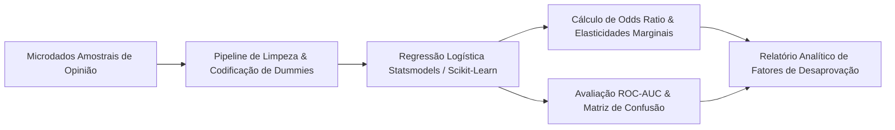

> [!NOTE]
> **Sanitized Technical Specification (`proprietary_sanitized`)**: This technical sheet is an authorized public specification adhering to strict intellectual property compliance and Brazilian LGPD (Lei Geral de Proteção de Dados) compliance. Proprietary source code, production database instances, raw databases, confidential credentials, and client Personally Identifiable Information (PII) remain strictly protected and are not exposed.
>
> *Especificação Técnica Sanitizada (`proprietary_sanitized`): Ficha técnica pública autorizada em estrita conformidade com a Lei Geral de Proteção de Dados (LGPD) e diretrizes de propriedade intelectual. Código-fonte, instâncias de produção, credenciais confidenciais e dados pessoais identificáveis (PII) protegidos.*
>
> *Ficha técnica pública autorizada sob diretriz proprietary_sanitized. Microdados brutos nominais e identificadores individuais de respondentes permanecem estritamente anonimizados e protegidos.*


**Contexto / Organização**: Ágora Pesquisa  
**Período**: 2025  
**Categoria de Atuação**: Data Analytics  
**Tecnologias**: `Python`, `Statsmodels`, `Scikit-Learn`, `Pandas`, `NumPy`, `Matplotlib`, `Logistic Regression`, `ROC-AUC`  

---

## Visão Geral Executiva

Modelagem econométrica e regressão logística avaliando os principais determinantes da probabilidade de desaprovação governamental a partir de microdados amostrais de opinião pública.


**Organization / Context**: Ágora Pesquisa  
**Timeline**: 2025  
**Domain Category**: Data Analytics  
**Technologies**: `Python`, `Statsmodels`, `Scikit-Learn`, `Pandas`, `NumPy`, `Matplotlib`, `Logistic Regression`, `ROC-AUC`  

---

## Executive Overview

Econometric logistic regression model identifying the key statistical determinants and odds ratios driving government disapproval from public opinion survey microdata.




## Arquitetura & Fluxo de Dados

O diagrama abaixo ilustra a topologia e esteira de processamento dos componentes técnicos sanitizados:

## Architecture & Data Flow

The diagram below illustrates the sanitized high-level component topology and data processing pipeline:



## Destaques de Engenharia

- **Discriminação Robusta: Acurácia de teste de 86,49% e AUC-ROC de 0,789 para previsão de risco político.**
- **Mensuração de Impacto Marginal: Identificação de elasticidades e Odds Ratios por faixa etária, gênero e avaliação de serviços.**
- **Diagnóstico Executivo: Tabela de fatores de influência e matriz de confusão para suporte à tomada de decisão governamental.**


## Key Engineering Highlights

- **Robust Discrimination: 86.49% test accuracy and 0.789 AUC-ROC predicting political sentiment and disapproval.**
- **Marginal Impact Estimation: Precise odds ratio quantification across demographics, income, and public service ratings.**
- **Executive Diagnostic: Full coefficient significance table and confusion matrix tailored for executive governance.**



---



# Relatório de Análise de Desaprovação do Governo

## Performance do Modelo

O modelo de regressão logística obteve os seguintes resultados:

- **Acurácia (Teste):** 86.49%
- **AUC-ROC:** 0.789
- **Acurácia (Treino):** 91.13%

## Tabela Completa de Fatores de Influência

A tabela abaixo apresenta todos os fatores analisados, ordenados pelo impacto (absoluto) na probabilidade de desaprovação.

| Fator                     | Coeficiente | Odds Ratio | Impacto Estimado | Direção                 |
| ------------------------- | ----------- | ---------- | ---------------- | ----------------------- |
| idade_60_mais             | -0.9175     | 0.40       | -60.0%           | Diminui Desaprovação    |
| avaliacao_seguranca_cod   | 0.7891      | 2.20       | +120.1%          | Aumenta Desaprovação    |
| rb_melhor                 | -0.5692     | 0.57       | -43.4%           | Diminui Desaprovação    |
| avaliacao_estradas_cod    | 0.5447      | 1.72       | +72.4%           | Aumenta Desaprovação    |
| idade_45_59               | -0.4234     | 0.65       | -34.5%           | Diminui Desaprovação    |
| nota_natal_num            | -0.4107     | 0.66       | -33.7%           | Diminui Desaprovação    |
| avaliacao_saude_cod       | 0.4061      | 1.50       | +50.1%           | Aumenta Desaprovação    |
| religiao_outras           | 0.3529      | 1.42       | +42.3%           | Aumenta Desaprovação    |
| avaliacao_educacao_cod    | 0.3002      | 1.35       | +35.0%           | Aumenta Desaprovação    |
| genero_feminino           | 0.2836      | 1.33       | +32.8%           | Aumenta Desaprovação    |
| religiao_evangelico       | 0.2482      | 1.28       | +28.2%           | Aumenta Desaprovação    |
| avaliacao_agricultura_cod | 0.1689      | 1.18       | +18.4%           | Aumenta Desaprovação    |
| avaliacao_transporte_cod  | 0.0892      | 1.09       | +9.3%            | Aumenta Desaprovação    |
| idade_29_44               | 0.0350      | 1.04       | +3.6%            | Aumenta Desaprovação    |
| avaliacao_limpeza_cod     | -0.0220     | 0.98       | -2.2%            | Diminui Desaprovação    |

## Visualizações

### Coeficientes e Importância

### Matriz de Confusão

## Interpretação

1. **Coeficientes Positivos:** Indicam características ou avaliações que aumentam a probabilidade de desaprovar o governo.
2. **Coeficientes Negativos:** Indicam fatores que reduzem essa probabilidade.
3. **Odds Ratio:** Quantifica quantas vezes a chance de desaprovação aumenta ou diminui.

---

_Relatório gerado automaticamente._



> [!NOTE]
> **Technical Report Language Notice**: The comprehensive technical report and diagnostic study below were originally conducted and documented in Brazilian Portuguese for Ágora Pesquisa. The technical figures, data tables, and analytical frameworks are preserved in their original analytical format.

# Relatório de Análise de Desaprovação do Governo

## Performance do Modelo

O modelo de regressão logística obteve os seguintes resultados:

- **Acurácia (Teste):** 86.49%
- **AUC-ROC:** 0.789
- **Acurácia (Treino):** 91.13%

## Tabela Completa de Fatores de Influência

A tabela abaixo apresenta todos os fatores analisados, ordenados pelo impacto (absoluto) na probabilidade de desaprovação.

| Fator                     | Coeficiente | Odds Ratio | Impacto Estimado | Direção                 |
| ------------------------- | ----------- | ---------- | ---------------- | ----------------------- |
| idade_60_mais             | -0.9175     | 0.40       | -60.0%           | Diminui Desaprovação    |
| avaliacao_seguranca_cod   | 0.7891      | 2.20       | +120.1%          | Aumenta Desaprovação    |
| rb_melhor                 | -0.5692     | 0.57       | -43.4%           | Diminui Desaprovação    |
| avaliacao_estradas_cod    | 0.5447      | 1.72       | +72.4%           | Aumenta Desaprovação    |
| idade_45_59               | -0.4234     | 0.65       | -34.5%           | Diminui Desaprovação    |
| nota_natal_num            | -0.4107     | 0.66       | -33.7%           | Diminui Desaprovação    |
| avaliacao_saude_cod       | 0.4061      | 1.50       | +50.1%           | Aumenta Desaprovação    |
| religiao_outras           | 0.3529      | 1.42       | +42.3%           | Aumenta Desaprovação    |
| avaliacao_educacao_cod    | 0.3002      | 1.35       | +35.0%           | Aumenta Desaprovação    |
| genero_feminino           | 0.2836      | 1.33       | +32.8%           | Aumenta Desaprovação    |
| religiao_evangelico       | 0.2482      | 1.28       | +28.2%           | Aumenta Desaprovação    |
| avaliacao_agricultura_cod | 0.1689      | 1.18       | +18.4%           | Aumenta Desaprovação    |
| avaliacao_transporte_cod  | 0.0892      | 1.09       | +9.3%            | Aumenta Desaprovação    |
| idade_29_44               | 0.0350      | 1.04       | +3.6%            | Aumenta Desaprovação    |
| avaliacao_limpeza_cod     | -0.0220     | 0.98       | -2.2%            | Diminui Desaprovação    |

## Visualizações

### Coeficientes e Importância

### Matriz de Confusão

## Interpretação

1. **Coeficientes Positivos:** Indicam características ou avaliações que aumentam a probabilidade de desaprovar o governo.
2. **Coeficientes Negativos:** Indicam fatores que reduzem essa probabilidade.
3. **Odds Ratio:** Quantifica quantas vezes a chance de desaprovação aumenta ou diminui.

---

_Relatório gerado automaticamente._


