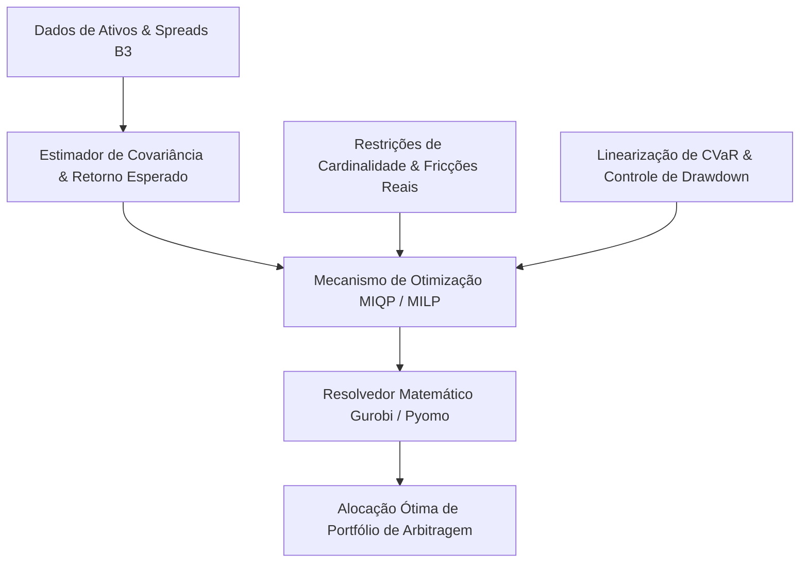


**Contexto / Organização**: UFF / MESC  
**Período**: 2026 - Presente  
**Categoria de Atuação**: Quantitative Finance  
**Tecnologias**: `Python`, `Gurobi`, `Pyomo`, `SciPy`, `R`, `LaTeX`  

---

## Visão Geral Executiva

Pesquisa de mestrado profissional stricto sensu formulando modelos exatos de Programação Quadrática Inteira Mista (MIQP) e Programação Linear Inteira Mista (MILP) com minimização de Conditional Value-at-Risk (CVaR) linearizado. O modelo busca a alocação dinâmica de portfólios ótimos de arbitragem estatística na B3, incorporando custos de transação, slippage, taxas de aluguel e restrições de cardinalidade.


**Organization / Context**: UFF / MESC  
**Timeline**: 2026 - Present  
**Domain Category**: Quantitative Finance  
**Technologies**: `Python`, `Gurobi`, `Pyomo`, `SciPy`, `R`, `LaTeX`  

---

## Executive Overview

Professional master's thesis developing exact Mixed-Integer Quadratic Programming (MIQP) and Mixed-Integer Linear Programming (MILP) formulations incorporating linearized Conditional Value-at-Risk (CVaR). Models dynamic allocation of statistical arbitrage equity portfolios on B3 while factoring in transaction costs, borrowing fees, and cardinality constraints.




## Arquitetura & Fluxo de Dados

O diagrama abaixo ilustra a topologia e esteira de processamento dos componentes técnicos sanitizados:

## Architecture & Data Flow

The diagram below illustrates the sanitized high-level component topology and data processing pipeline:



## Destaques de Engenharia

- **Pesquisa Operacional Aplicada: Formulações exatas de MIQP e MILP aplicadas a finanças quantitativas de alta complexidade.**
- **Gestão Coerente de Risco: Minimização de CVaR linearizado em substituição à variância clássica markowitziana.**
- **Fricções de Mercado Real: Incorporação explícita de custos de corretagem, impostos, slippage e aluguel de ações (BTC).**


## Key Engineering Highlights

- **Applied Operations Research: Exact MIQP and MILP formulations tailored to high-dimensional quantitative asset allocation.**
- **Coherent Risk Management: Linearized Conditional Value-at-Risk (CVaR) minimization outperforming classical Markowitz variance.**
- **Real-World Market Frictions: Direct integration of brokerage fees, tax drag, slippage, and short-selling borrowing costs.**


