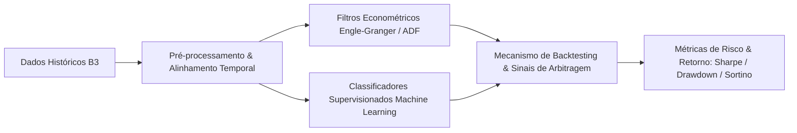

**Organization / Context**: USP / ESALQ  
**Timeline**: 2024 - 2026  
**Domain Category**: Quantitative Finance  
**Technologies**: `Python`, `Statsmodels`, `Scikit-Learn`, `Pandas`, `NumPy`, `Matplotlib`  

---

## Executive Overview

MBA thesis in Data Science and Analytics evaluated with maximum honors (Grade 10/10). Implemented a rigorous empirical benchmark comparing classical Engle-Granger econometric cointegration models against supervised Machine Learning classifiers for statistical arbitrage pairs trading on B3 equities.

*Monografia de conclusão do MBA em Data Science e Analytics avaliada com nota máxima (10/10). Desenvolveu um estudo comparativo exaustivo entre o arcabouço clássico econométrico de cointegração de Engle-Granger e algoritmos supervisionados de Machine Learning aplicados à geração de sinais de arbitragem estatística em ações da B3.*

## Architecture & Data Flow

The diagram below illustrates the sanitized high-level component topology and data processing pipeline:

## Key Engineering Highlights

- **Rigorous Empirical Benchmark: Comparative analysis between classical econometric cointegration models and supervised machine learning classifiers.**
- **Portfolio Backtesting: Realistic backtesting on B3 historical equities accounting for transaction costs and market friction.**
- **Academic Honors: Defended with maximum grade (10/10) before the USP/ESALQ examination board.**

## References & Verification

- [Academic Defense Certificate / Credential Proof](/Certificados/2026/27-02-2026-USP-MBADataScience.pdf)
