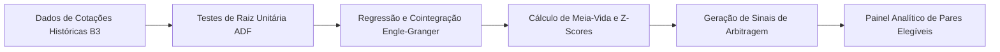

> [!NOTE]
> **Sanitized Technical Specification (`proprietary_sanitized`)**: This technical sheet is an authorized public specification adhering to strict intellectual property compliance and Brazilian LGPD (Lei Geral de Proteção de Dados) compliance. Proprietary source code, production database instances, raw databases, confidential credentials, and client Personally Identifiable Information (PII) remain strictly protected and are not exposed.
>
> *Ficha técnica pública autorizada. Os códigos de execução em corretora e parâmetros de limites de risco permanecem de propriedade da Meta & Actio.*

**Organization / Context**: Meta & Actio Investimentos  
**Timeline**: 2017 - 2020  
**Domain Category**: Quantitative Finance  
**Technologies**: `R`, `Tseries`, `Urca`, `Dplyr`, `Ggplot2`  

---

## Executive Overview

Systematic algorithm coded in R for daily universe-wide Engle-Granger cointegration and Augmented Dickey-Fuller (ADF) screening on B3 equities. Scanned 100+ statistical arbitrage candidates monthly with automated half-life and z-score calculations.

*Algoritmo desenvolvido em linguagem R para varredura sistemática diária de testes de raiz unitária (ADF) e cointegração de Engle-Granger sobre todo o universo de ações da B3. Monitorava mais de 100 oportunidades mensais de arbitragem estatística com cálculo automatizado de meias-vidas (half-life) e z-scores.*

## Architecture & Data Flow

The diagram below illustrates the sanitized high-level component topology and data processing pipeline:

