# Mermaid Examples Reference - Extended

## Basic Diagrams

### State Diagram

Useful for finite state machines.

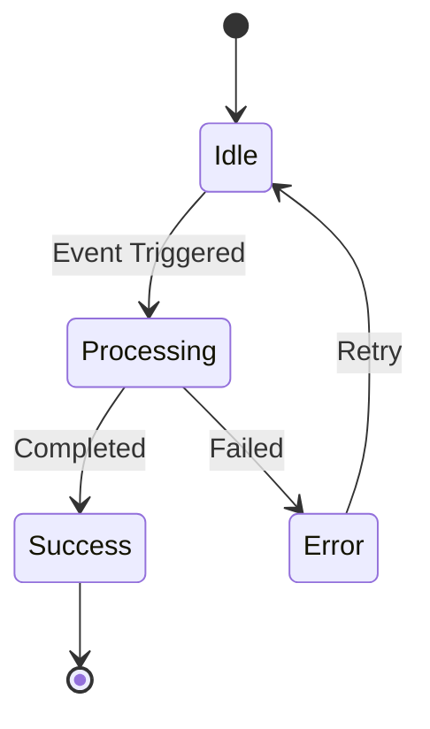
```mermaid
stateDiagram-v2
    [*] --> Idle
    Idle --> Processing: Event Triggered
    Processing --> Success: Completed
    Processing --> Error: Failed
    Success --> [*]
    Error --> Idle: Retry
```

### Gantt Chart

Useful for project timelines.

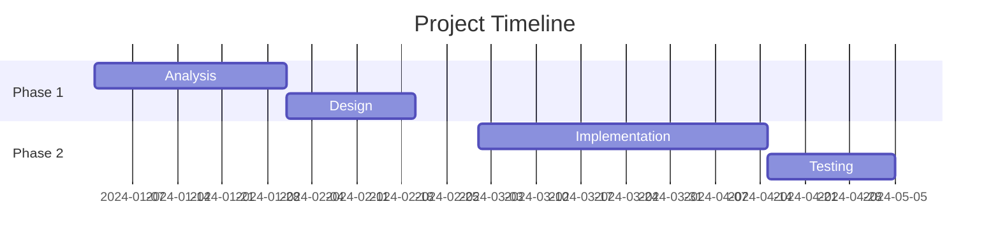
```mermaid
gantt
    title Project Timeline
    dateFormat  YYYY-MM-DD
    section Phase 1
    Analysis      :a1, 2024-01-01, 30d
    Design        :after a1, 20d
    section Phase 2
    Implementation :2024-03-01, 45d
    Testing       : 20d
```

### Entity Relationship Diagram (ERD)

Useful for database schemas.

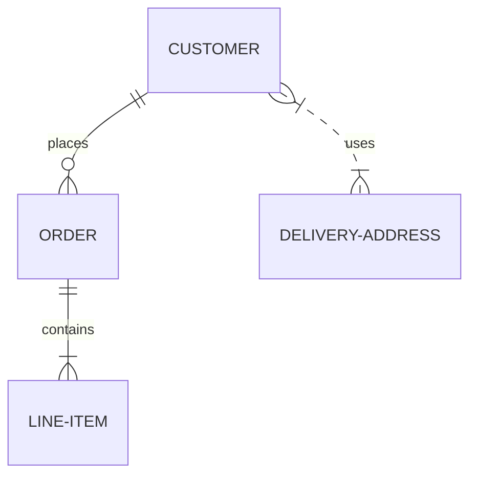
```mermaid
erDiagram
    CUSTOMER ||--o{ ORDER : places
    ORDER ||--|{ LINE-ITEM : contains
    CUSTOMER }|..|{ DELIVERY-ADDRESS : uses
```

### User Journey

Useful for product design and UX mapping.

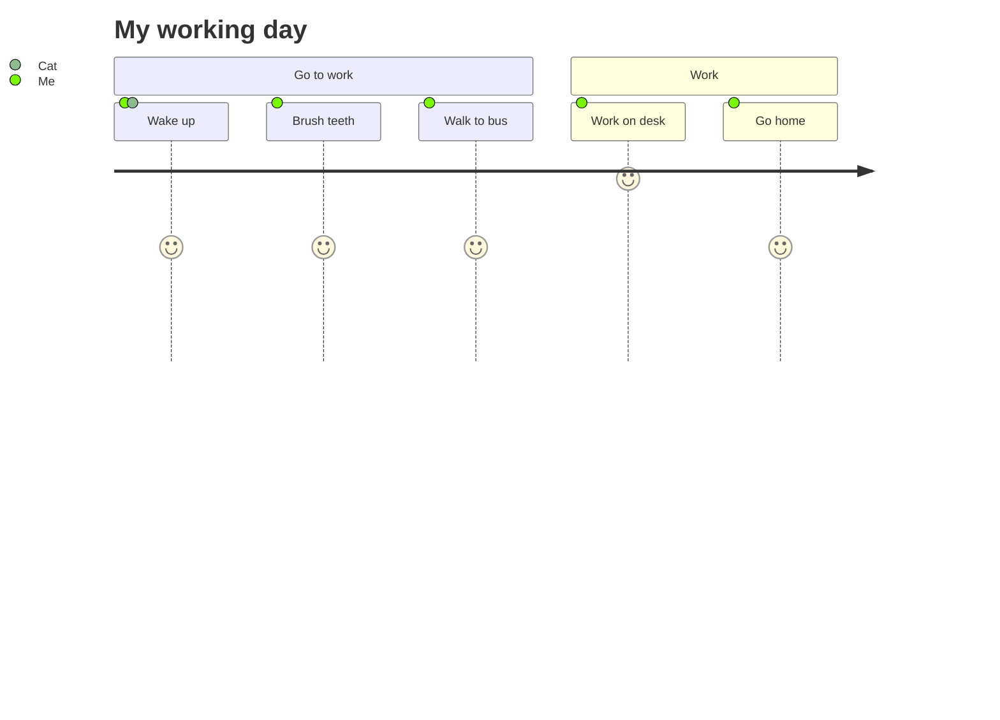
```mermaid
journey
    title My working day
    section Go to work
      Wake up: 5: Me, Cat
      Brush teeth: 5: Me
      Walk to bus: 5: Me
    section Work
      Work on desk: 8: Me
      Go home: 5: Me
```

---

## Advanced Diagrams (v10+)

### Pie Chart

Useful for showing proportions and distributions.

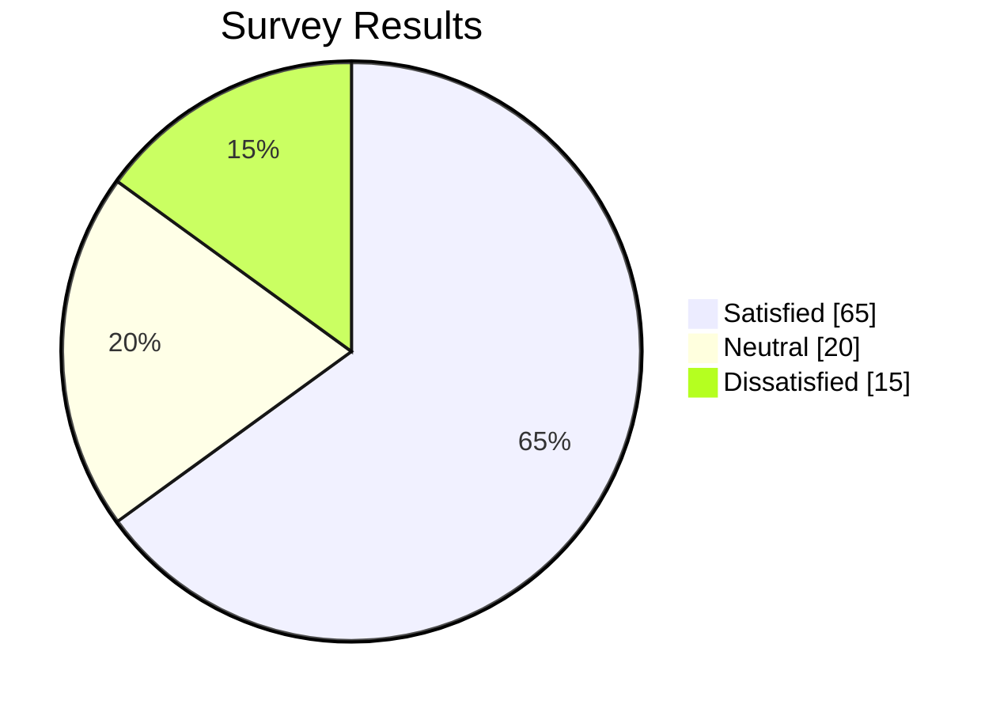
```mermaid
pie showData
    title Survey Results
    "Satisfied" : 65
    "Neutral" : 20
    "Dissatisfied" : 15
```

### Mindmap

Useful for brainstorming and hierarchical concepts.

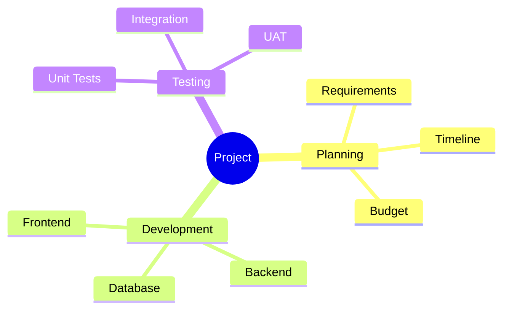
```mermaid
mindmap
  root((Project))
    Planning
      Requirements
      Timeline
      Budget
    Development
      Frontend
      Backend
      Database
    Testing
      Unit Tests
      Integration
      UAT
```

### Timeline

Useful for historical events and milestones.

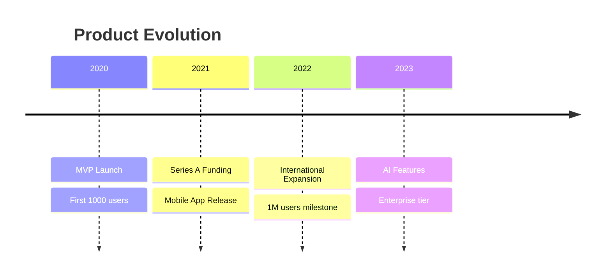
```mermaid
timeline
    title Product Evolution
    2020 : MVP Launch
         : First 1000 users
    2021 : Series A Funding
         : Mobile App Release
    2022 : International Expansion
         : 1M users milestone
    2023 : AI Features
         : Enterprise tier
```

### Quadrant Chart

Useful for strategic analysis (like BCG matrix, priority matrix).

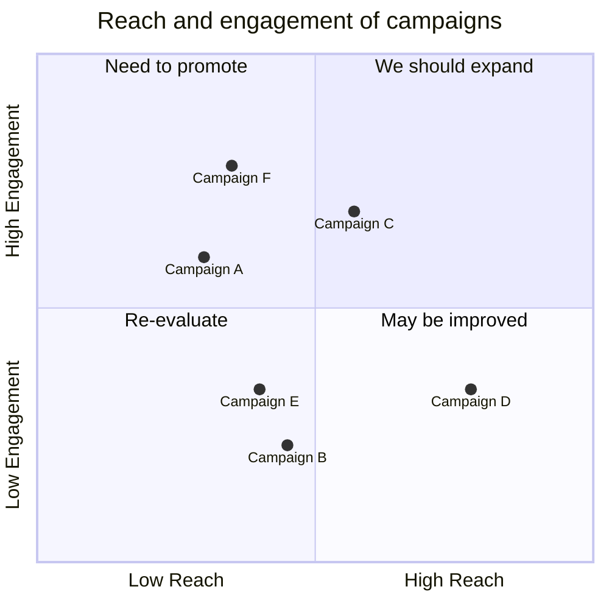
```mermaid
quadrantChart
    title Reach and engagement of campaigns
    x-axis Low Reach --> High Reach
    y-axis Low Engagement --> High Engagement
    quadrant-1 We should expand
    quadrant-2 Need to promote
    quadrant-3 Re-evaluate
    quadrant-4 May be improved
    Campaign A: [0.3, 0.6]
    Campaign B: [0.45, 0.23]
    Campaign C: [0.57, 0.69]
    Campaign D: [0.78, 0.34]
    Campaign E: [0.40, 0.34]
    Campaign F: [0.35, 0.78]
```

### Sankey Diagram (Beta)

Useful for flow visualization and energy/resource distribution.

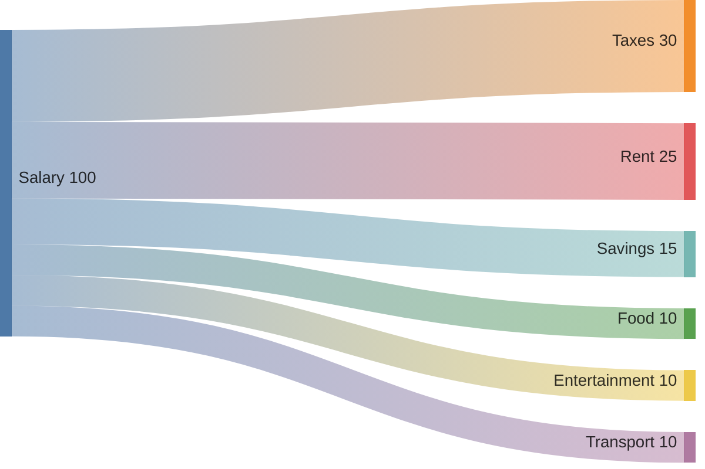
```mermaid
sankey-beta

%% source,target,value
Salary,Taxes,30
Salary,Rent,25
Salary,Savings,15
Salary,Food,10
Salary,Entertainment,10
Salary,Transport,10
```

### XY Chart

Useful for bar charts and line charts with data.

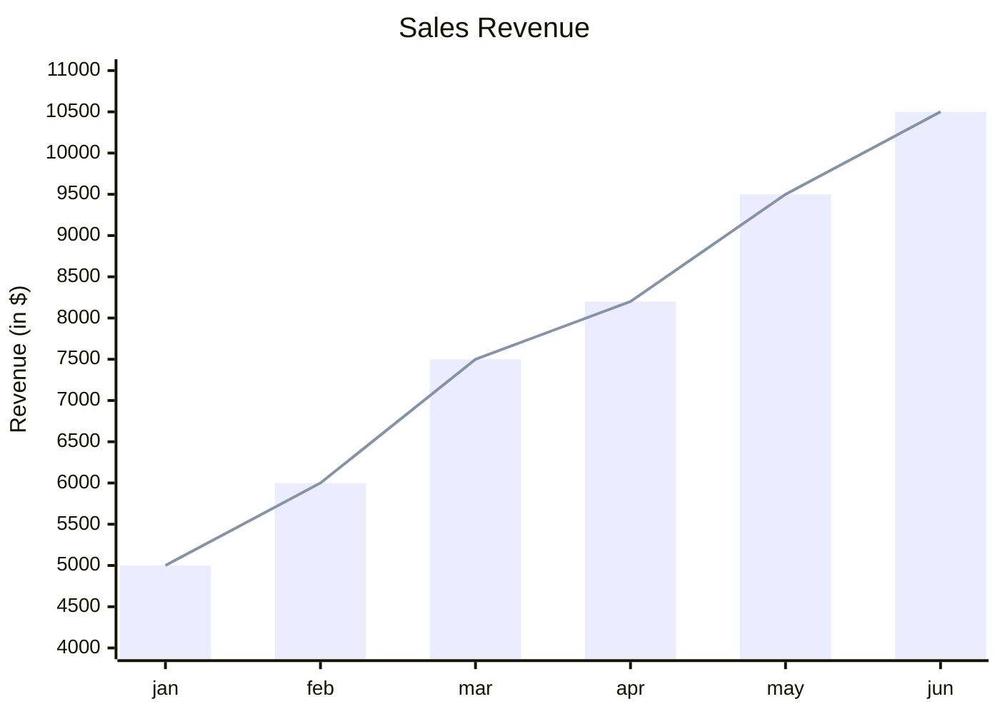
```mermaid
xychart-beta
    title "Sales Revenue"
    x-axis [jan, feb, mar, apr, may, jun]
    y-axis "Revenue (in $)" 4000 --> 11000
    bar [5000, 6000, 7500, 8200, 9500, 10500]
    line [5000, 6000, 7500, 8200, 9500, 10500]
```

### Gitgraph

Useful for visualizing git branching and merging.

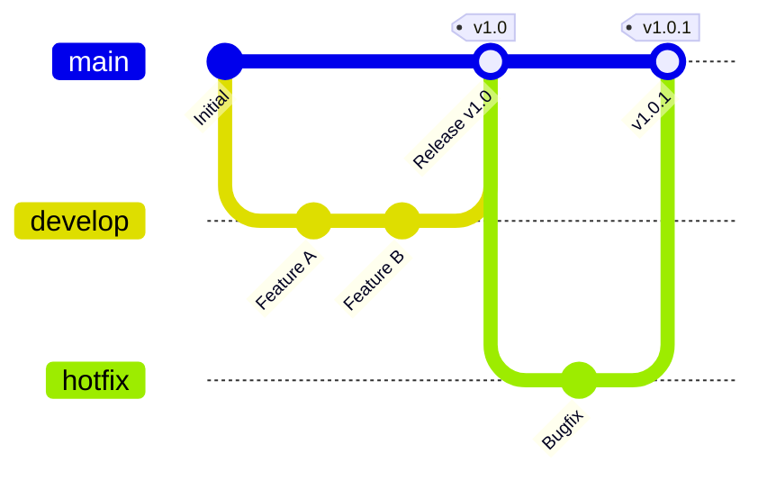
```mermaid
gitGraph
    commit id: "Initial"
    branch develop
    checkout develop
    commit id: "Feature A"
    commit id: "Feature B"
    checkout main
    merge develop id: "Release v1.0" tag: "v1.0"
    branch hotfix
    commit id: "Bugfix"
    checkout main
    merge hotfix id: "v1.0.1" tag: "v1.0.1"
```

---

## Diagrams v11+

### Block Diagram

Useful for system architecture and component layouts.

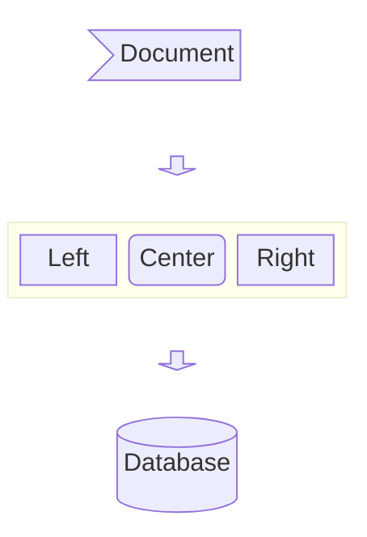
```mermaid
block-beta
    columns 3

    doc>"Document"]:3
    space down1<["   "]>(down) space

    block:e:3
        l["Left"]
        m("Center")
        r["Right"]
    end

    space down2<["   "]>(down) space
    db[("Database")]:3
```

### Architecture Diagram (v11.1.0+)

Useful for cloud and system architecture.

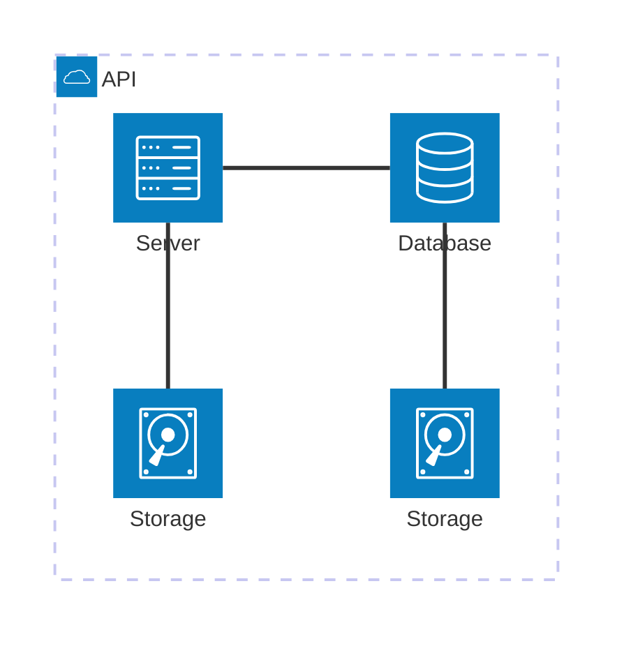
```mermaid
architecture-beta
    group api(cloud)[API]

    service db(database)[Database] in api
    service disk1(disk)[Storage] in api
    service disk2(disk)[Storage] in api
    service server(server)[Server] in api

    db:L -- R:server
    disk1:T -- B:server
    disk2:T -- B:db
```

### Packet Diagram (v11+)

Useful for network protocols and data structures.

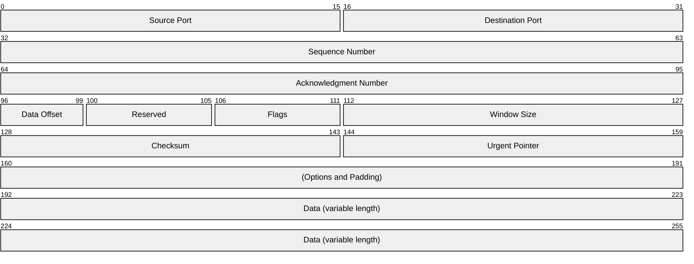
```mermaid
packet-beta
    0-15: "Source Port"
    16-31: "Destination Port"
    32-63: "Sequence Number"
    64-95: "Acknowledgment Number"
    96-99: "Data Offset"
    100-105: "Reserved"
    106-111: "Flags"
    112-127: "Window Size"
    128-143: "Checksum"
    144-159: "Urgent Pointer"
    160-191: "(Options and Padding)"
    192-255: "Data (variable length)"
```

### Kanban Board (v11.4+)

Useful for agile project management.

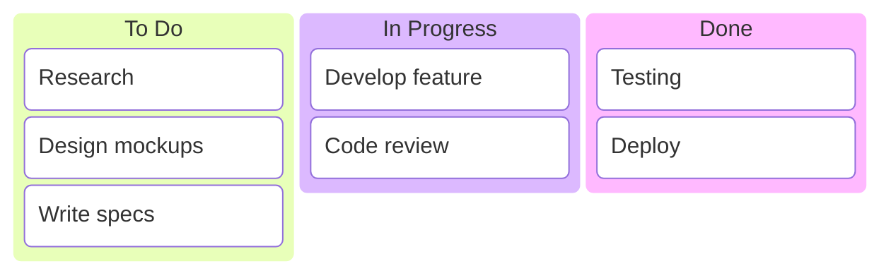
```mermaid
kanban
    column1[To Do]
        task1[Research]
        task2[Design mockups]
        task3[Write specs]

    column2[In Progress]
        task4[Develop feature]
        task5[Code review]

    column3[Done]
        task6[Testing]
        task7[Deploy]
```

### Requirement Diagram

Useful for systems engineering and requirements traceability.

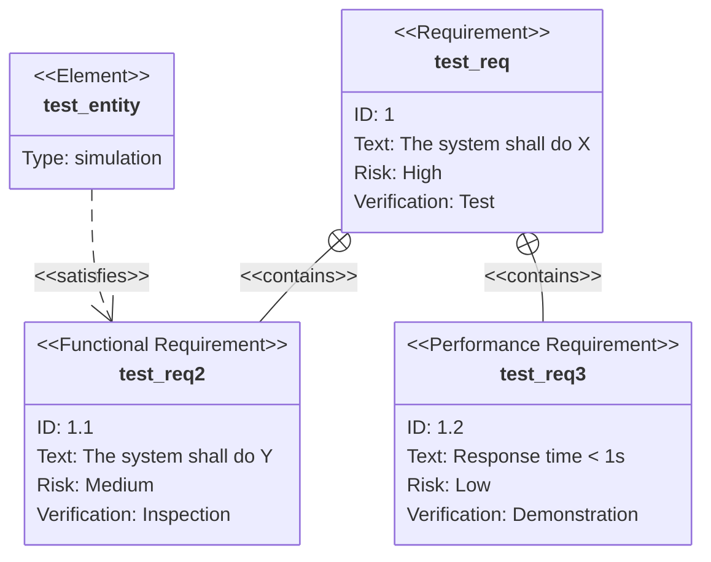
```mermaid
requirementDiagram

    requirement test_req {
        id: 1
        text: The system shall do X
        risk: high
        verifymethod: test
    }

    functionalRequirement test_req2 {
        id: 1.1
        text: The system shall do Y
        risk: medium
        verifymethod: inspection
    }

    performanceRequirement test_req3 {
        id: 1.2
        text: "Response time < 1s"
        risk: low
        verifymethod: demonstration
    }

    element test_entity {
        type: simulation
    }

    test_entity - satisfies -> test_req2
    test_req - contains -> test_req2
    test_req - contains -> test_req3
```

### C4 Context Diagram

Useful for software architecture documentation (C4 model).

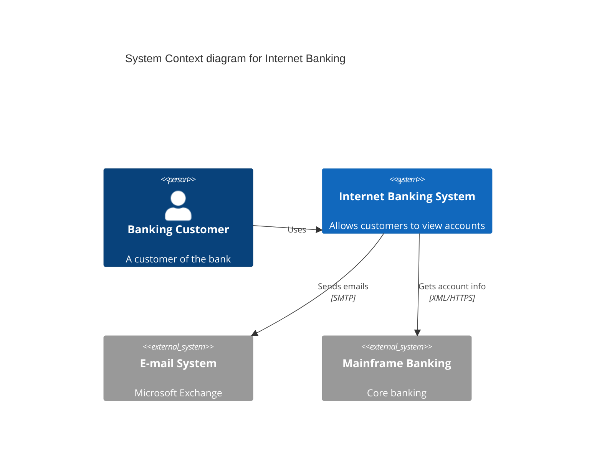
```mermaid
C4Context
    title System Context diagram for Internet Banking

    Person(customer, "Banking Customer", "A customer of the bank")
    System(banking, "Internet Banking System", "Allows customers to view accounts")
    System_Ext(email, "E-mail System", "Microsoft Exchange")
    System_Ext(mainframe, "Mainframe Banking", "Core banking")

    Rel(customer, banking, "Uses")
    Rel(banking, email, "Sends emails", "SMTP")
    Rel(banking, mainframe, "Gets account info", "XML/HTTPS")
```

---

## ZenUML Sequence Diagram

Alternative syntax for sequence diagrams (more readable).

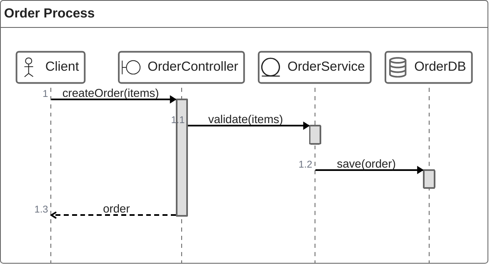
```mermaid
zenuml
    title Order Process

    @Actor Client
    @Boundary OrderController
    @Entity OrderService
    @Database OrderDB

    Client->OrderController.createOrder(items) {
        OrderController->OrderService.validate(items)
        OrderService->OrderDB.save(order)
        return order
    }
```
