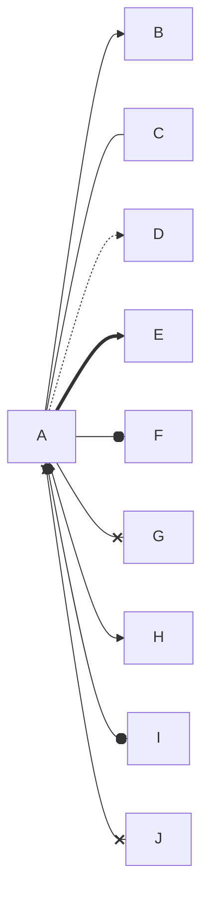
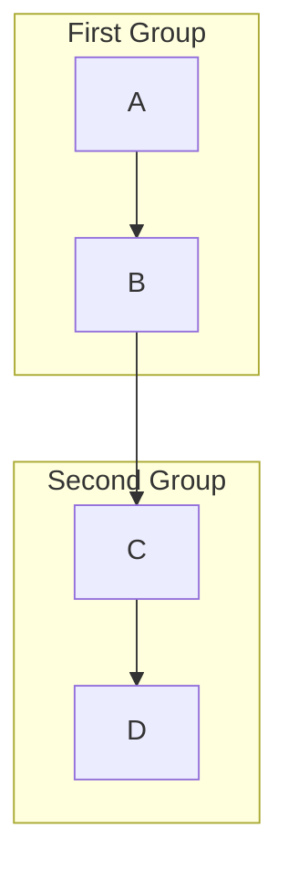
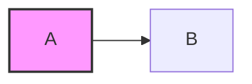

# Mermaid Syntax Quick Reference

## Diagram Type Keywords

| Diagram      | Keyword                      | Direction      |
| ------------ | ---------------------------- | -------------- |
| Flowchart    | `graph TD` or `flowchart LR` | TD, LR, BT, RL |
| Sequence     | `sequenceDiagram`            | -              |
| Class        | `classDiagram`               | -              |
| State        | `stateDiagram-v2`            | -              |
| ERD          | `erDiagram`                  | -              |
| Gantt        | `gantt`                      | -              |
| Pie          | `pie`                        | -              |
| Mindmap      | `mindmap`                    | -              |
| Timeline     | `timeline`                   | -              |
| Quadrant     | `quadrantChart`              | -              |
| XY Chart     | `xychart-beta`               | -              |
| Sankey       | `sankey-beta`                | -              |
| Gitgraph     | `gitGraph`                   | TB, LR, BT     |
| User Journey | `journey`                    | -              |
| Block        | `block-beta`                 | -              |
| Architecture | `architecture-beta`          | -              |
| Packet       | `packet-beta`                | -              |
| Kanban       | `kanban`                     | -              |
| Requirement  | `requirementDiagram`         | -              |
| C4 Context   | `C4Context`                  | -              |
| ZenUML       | `zenuml`                     | -              |

## Node Shapes (Flowchart)

```
id[Rectangle]
id(Rounded)
id([Stadium])
id[[Subroutine]]
id[(Database)]
id((Circle))
id>Asymmetric]
id{Rhombus}
id{{Hexagon}}
id[/Parallelogram/]
id[\Parallelogram Alt\]
id[/Trapezoid\]
id[\Trapezoid Alt/]
id(((Double Circle)))
```

## Arrow Types



| Syntax        | Description      |
| ------------- | ---------------- |
| `-->`         | Arrow            |
| `---`         | Line             |
| `-.->`        | Dotted arrow     |
| `==>`         | Thick arrow      |
| `--o`         | Circle end       |
| `--x`         | Cross end        |
| `<-->`        | Bidirectional    |
| `-- text -->` | Arrow with label |

## Subgraphs



## Styling

### Inline Style



### Theme Directive

```
%%{init: {'theme': 'forest'}}%%
```

Available themes: `default`, `forest`, `dark`, `neutral`, `base`

## Common Syntax Patterns

### Sequence Diagram

```
participant A as Alias
A->>B: Solid arrow
A-->>B: Dashed arrow
A-xB: Cross arrow
A-)B: Async arrow
activate A / deactivate A
Note right of A: Note text
loop Loop text ... end
alt Condition ... else ... end
opt Optional ... end
par Parallel ... and ... end
```

### Class Diagram

```
class ClassName {
    +publicMethod()
    -privateMethod()
    #protectedMethod()
    ~packageMethod()
    +String attribute
}
ClassA <|-- ClassB : inheritance
ClassA *-- ClassB : composition
ClassA o-- ClassB : aggregation
ClassA --> ClassB : association
ClassA ..> ClassB : dependency
ClassA ..|> ClassB : realization
```

### State Diagram

```
[*] --> State1 : start
State1 --> State2 : trigger
State2 --> [*] : end
state State1 {
    [*] --> Nested1
    Nested1 --> Nested2
}
```

### ERD Relationships

```
ENTITY1 ||--o{ ENTITY2 : one-to-many
ENTITY1 ||--|{ ENTITY2 : one-to-many (required)
ENTITY1 }o--o{ ENTITY2 : many-to-many
ENTITY1 ||--|| ENTITY2 : one-to-one
```

## Escape Rules

| Problem             | Solution                            |
| ------------------- | ----------------------------------- |
| Parentheses in text | Wrap in quotes: `id["Text (note)"]` |
| Brackets in text    | Wrap in quotes: `id["Array [0]"]`   |
| Special chars       | Use HTML entities: `&#35;` for #    |
| Newlines            | Use `<br>` or `<br/>`               |
| Long text           | Use `<br>` for breaks               |

## Configuration Directives

```
%%{init: {
  'theme': 'base',
  'themeVariables': {
    'primaryColor': '#5D8AA8',
    'primaryTextColor': '#fff',
    'primaryBorderColor': '#3B5998',
    'lineColor': '#3B5998',
    'secondaryColor': '#006400',
    'tertiaryColor': '#fff'
  }
}}%%
```
