# Mermaid Troubleshooting Guide

## Common Errors and Solutions

### 1. Syntax Error: Special Characters

**Problem**: Diagram fails to render with syntax error.

```mermaid
graph TD
    A[Process (Draft)] --> B  ❌ ERROR
```

**Solution**: Wrap text with special characters in quotes.

```mermaid
graph TD
    A["Process (Draft)"] --> B  ✅ WORKS
```

**Characters that need escaping**: `( ) [ ] { } < > # @ &`

---

### 2. Syntax Error: Unicode/Emoji

**Problem**: Unicode characters break rendering.

```mermaid
graph TD
    A[🚀 Start] --> B  ❌ May fail
```

**Solution**: Use HTML entities or avoid emojis in node IDs.

```mermaid
graph TD
    A["🚀 Start"] --> B  ✅ Quoted works
```

---

### 3. Subgraph Closing Error

**Problem**: Subgraph not properly closed.

```mermaid
graph TD
    subgraph Group
        A --> B
    C --> D  ❌ Outside subgraph but looks inside
```

**Solution**: Always close subgraphs with `end`.

```mermaid
graph TD
    subgraph Group
        A --> B
    end
    C --> D  ✅ Properly closed
```

---

### 4. Arrow Direction Confusion

**Problem**: Arrows point wrong direction.

**Solution**: Remember arrow rules:
- `A --> B` = A points TO B
- `A <-- B` = A receives FROM B
- Graph direction affects layout, not arrow meaning

```mermaid
graph LR
    A --> B  %% A to B, laid out left-to-right
graph RL
    A --> B  %% A to B, laid out right-to-left
```

---

### 5. Duplicate Node IDs

**Problem**: Same ID used for different nodes.

```mermaid
graph TD
    A[Start] --> B[Process]
    A[End] --> C  ❌ 'A' redefined
```

**Solution**: Use unique IDs.

```mermaid
graph TD
    Start[Start] --> Process[Process]
    End[End] --> Other  ✅ Unique IDs
```

---

### 6. Sequence Diagram Actor Names

**Problem**: Spaces in actor names.

```mermaid
sequenceDiagram
    My Service ->> Other Service: request  ❌ ERROR
```



**Solution**: Use aliases.

```mermaid
sequenceDiagram
    participant MS as My Service
    participant OS as Other Service
    MS ->> OS: request  ✅ WORKS
```



---

### 7. Gantt Date Format

**Problem**: Dates not parsing correctly.

**Solution**: Always specify `dateFormat` explicitly.


Common formats:
- `YYYY-MM-DD` (recommended)
- `DD-MM-YYYY`
- `MM-DD-YYYY`

---

### 8. ERD Relationship Syntax

**Problem**: Invalid relationship characters.

**Solution**: Use correct cardinality notation.

| Notation | Meaning |
|----------|---------|
| `\|\|` | Exactly one |
| `o\|` | Zero or one |
| `\|{` | One or more |
| `o{` | Zero or more |

---

### 9. Pie Chart Labels

**Problem**: Pie slices too small to display labels.

**Solution**: Use `showData` to show values.


---

### 10. XY Chart Data Mismatch

**Problem**: Bar/line data doesn't match x-axis.

```mermaid
xychart-beta
    x-axis [a, b, c]     %% 3 values
    bar [1, 2, 3, 4, 5]  ❌ 5 values - mismatch
```

**Solution**: Match array lengths.

```mermaid
xychart-beta
    x-axis [a, b, c]
    bar [1, 2, 3]  ✅ Same length
```

---

## Debugging Tips

1. **Use Live Editor**: Test at [mermaid.live](https://mermaid.live)
2. **Start Simple**: Build diagram incrementally
3. **Check Version**: Some features require v10+ or v11+
4. **Read Error**: Browser console shows detailed errors
5. **Quote Everything**: When in doubt, wrap text in quotes

## Version-Specific Issues

| Feature | Issue | Solution |
|---------|-------|----------|
| `sankey-beta` | Not rendering | Needs v10.0+ |
| `architecture-beta` | Unknown diagram | Needs v11.1+ |
| `kanban` | Not recognized | Needs v11.4+ |
| Mindmap icons | Not showing | Limited icon support |
| Themes | Not applying | Check `%%{init}%%` syntax |
